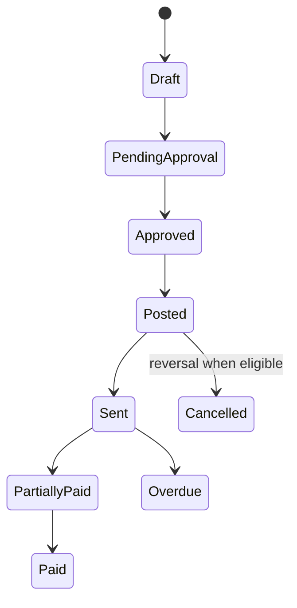
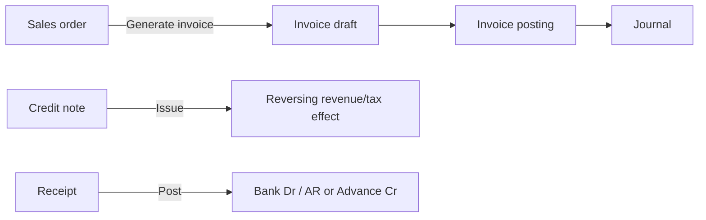
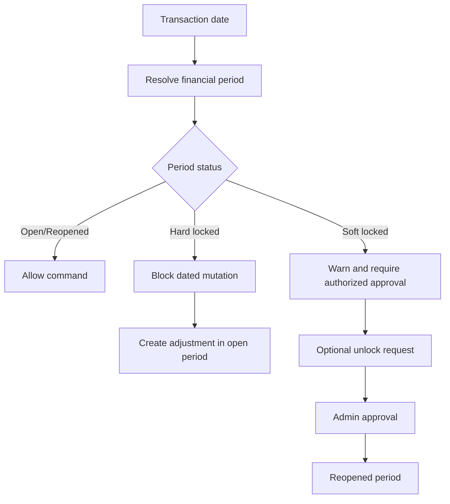

# Accounting Domain

**Last verified:** 2026-09-14  
**Primary sources:** `invoice-engine.js`, `invoice-tax.js`, `credit-note-service.js`, `receipt-engine.js`, `account-master.js`, `daybook-service.js`, `period-locking.js`.

## Enterprise account-master controls

Account creation records a type-dependent nature and reporting category, organisation or applicable-branch scope, optional compatible parent, posting permissions, module-use mappings, tax treatment, currency, normal opening-balance side, and audit metadata. Parent accounts must match the child account's type, nature, and scope. Branch-scoped accounts retain the legacy primary `branchId` while `applicableBranches` authorizes one or more branches. Posted journal lines continue to reference the stable account code.

## Enterprise Chart of Accounts contract

- The account master is organisation-owned. `organizationId` identifies the owner; ordinary accounts default to `Organisation Account` and can be used by every branch.
- `Branch Specific Account` requires an owning branch and rejects posting from a different or missing branch. It is intended for branch cash and bank ledgers, not separate branch charts.
- Every account has a primary type, reporting nature, normal debit/credit balance, system/custom category, and additive posting controls.
- Existing account codes remain the immutable journal reference keys. Normalization adds metadata without rewriting posted journals.
- System, used, mapped, control, and parent accounts retain structural protections. Manual journals cannot use accounts whose manual-posting control is disabled.
- Existing invoice, purchase, GST, banking, ledger, and report mappings continue through the established configuration and account-code contracts.

## Purchase posting

A Purchase Order is a commercial commitment only and must not create a journal, Accounts Payable balance, or General Ledger entry. Conversion creates a Purchase Bill draft and copies the vendor and commercial lines.

Goods Receipts are non-posting quantity documents. They validate cumulative received quantity against ordered quantity and preserve PO/line traceability. Bill conversion includes only received quantities not already referenced by another non-cancelled bill, allowing multiple receipts and bills per PO.

Posting a Purchase Bill validates the accounting period and generates an idempotent balanced journal: debit mapped purchase/expense accounts, debit separate Input CGST and Input SGST for intrastate supply or Input IGST for interstate supply, debit Input Cess where applicable, and credit Accounts Payable. Place of supply defaults from the Vendor Master. Posted bills are immutable. Cancellation requires a reason, blocks bills with posted payments, validates the reversal period, and creates an equal/opposite journal. Vendor payments are idempotent, validate date/period and debit Accounts Payable while crediting Bank. Source: `src/purchase-service.js`.

Sales Credit Note posting uses central mappings rather than document-level account choices. It debits the configured Sales Adjustment account for taxable value, debits the configured GST Adjustment account (or compatible existing component mappings) for output-tax reversal, and credits the configured Accounts Receivable control account. Missing required mappings block posting before any journal mutation. Sources: `src/credit-note-service.js`, `src/CreditNotes.jsx`.

A Purchase Debit Note represents a vendor credit arising from a purchase return, pricing correction or other adjustment. It may optionally reference a posted, active Purchase Bill; when linked, its vendor and amount are constrained by that bill. Draft, Pending Approval and Approved states have no journal. Posting validates the period and debits Accounts Payable while crediting purchase/expense and applicable Input CGST/SGST/IGST/Cess; reserved input-tax ledgers are additively repaired when legacy browser data is incomplete. Applying a linked note is a separate subledger allocation that moves it to Adjusted without posting a second journal. Vendor outstanding includes posted credits whether or not allocated. Posted notes are immutable; reversal requires an open date and creates an equal/opposite journal. Sources: `src/DebitNotes.jsx`, `src/purchase-service.js`.

Sales credit application never creates another journal. The Apply Credit workspace only offers posted invoices for the same customer and Accounts Receivable account, prefills a safe allocation up to both available credit and invoice outstanding, and requires confirmation before persisting the allocation. Sources: `src/CreditNotes.jsx`, `src/credit-note-service.js`.

Sales Return and Price Adjustment credit lines always inherit the original invoice line's CGST, SGST, IGST and Cess rates. This prevents stale or edited UI values from over-reversing an individual tax component. Only the explicit Tax Adjustment reason may supply adjusted component rates, and its remaining-tax validation still applies.

## Core invariants

- Journal debit total must equal credit total before persistence.
- Journal lines use active posting accounts; group accounts are invalid.
- Control accounts reject direct manual journal posting.
- Required branch/cost-centre dimensions are copied to journal lines or cause posting failure.
- Stored financial amounts are non-negative integer paise; debit and credit are separate fields.
- Idempotency tokens prevent duplicate posting for supported commands.
- Posted documents are reversed rather than deleted or edited.
- Reports include posted journals only unless explicitly labelled unposted review data.

## Chart of Accounts

Five primary types are Assets, Liabilities, Equity, Income, and Expenses. Assets and Expenses normally carry debit balances; Liabilities, Equity, and Income normally carry credit balances. Accounts support hierarchy, active state, system protection, posting/group behavior, branch/cost-centre requirements, tax validation, and optional control-account designation. Account codes are unique. Accounts referenced by posted activity cannot be deleted; deactivate them instead. The Chart of Accounts list grid labels its third column Account Group and renders the resolved account group: a saved non-type group wins, while legacy/seed groups equal to Account Type resolve through account nature into operational groups such as Cash and Bank, Current Assets, Current Liabilities, Operating Income and Operating Expenses. Account Type remains available through filters, type group headings, and account details. The group value uses normal table-cell weight, not bold presentation; no journal or posting contract changes. Sources: `src/AccountWorkspace.jsx`, `src/account-master.js`, `tests/account-ui.test.mjs`.

## Invoice posting

Illustrative invoice for taxable service ₹100,000 plus GST ₹18,000:

| Account | Debit | Credit |
|---|---:|---:|
| Accounts Receivable | ₹118,000 | — |
| Service Revenue | — | ₹100,000 |
| Output GST Payable | — | ₹18,000 |

This example is illustrative. Current code produces separate tax lines from calculated CGST, SGST, IGST, and Cess and may post round-off to its configured account.

## Indian GST

- Compare company state with place of supply.
- Intra-state supplies use CGST and SGST.
- Inter-state supplies use IGST.
- Cess is additional where configured.
- Tax selection and account tax policy are validated.
- Item master tax defaults populate sales document lines. A line can override the GST/Cess components and whether its entered rate is tax-exclusive or tax-inclusive; inclusive rates are converted to taxable value before tax posting to avoid double charging.
- Tax accounts must be active Liability accounts.
- Tax reports must derive from posted invoice/credit-note documents and their reversals.

## Document lifecycles

In prose: current invoice commands save drafts, submit, post/approve, send, accept payment, and cancel with restrictions. Display payment status is derived from allocations, payments, due date, and cancellation. The broader status vocabulary is a product model; code should be inspected before assuming every transition is persisted literally.

In prose: sales orders remain non-accounting documents and only create linked invoice drafts. Issued credit notes reduce receivables and reverse mapped revenue/tax effects. Receipts debit cash/bank and credit receivables or customer advances. Allocating a normal receipt changes settlement state without duplicating cash accounting; allocating an advance can create the required advance-to-receivable journal.

## Credit notes and receipts

- Credit notes cannot exceed the original invoice or remaining item/tax capacity.
- Credit application is allocation, not a second accounting posting.
- Posted credit-note cancellation creates a reversed journal and voids applications.
- Receipts support Normal and Advance types, approval thresholds, invoice allocations, bank matching, reconciliation, cancellation before posting, and reversal after posting.
- Overpayment must be represented as customer advance, not forced into invoice allocation.

## Ledger and reporting

Reserved defaults are additively provisioned or repaired when legacy browser data lacks current posting metadata: `5000 · Purchase`, `2000 · Accounts Payable`, `1010 · Bank`, `1100 · Accounts Receivable`, `4000 · Sales`, `4100 · Service Income`, `2100 · GST Payable`, and `5900 · Rounding Adjustment`. Each is restored to its expected account type, normal balance, active posting state, and control-account role where applicable. These compatibility repairs apply only to system defaults; custom mappings continue to fail validation rather than being silently rewritten.

The General Ledger is the ordered projection of posted journal lines per account. Running balance is debit minus credit internally; UI displays absolute balance plus Dr/Cr. Trial Balance totals account debit and credit balances and must remain balanced. P&L derives Income and Expenses. Balance Sheet derives Assets, Liabilities, and Equity. Day Book retains complete balanced vouchers even when filtering by line dimensions.

## Period locking

In prose: every dated financial command must resolve a company financial period. Open/reopened periods allow activity. Soft locks permit only authorized exception workflows. Hard locks block edits, deletions, posting, regeneration, and backdated correction. Existing posted journals stay unchanged; correction occurs in a current open period or through an audited unlock approval.

The prototype now implements fail-closed date resolution across Day, Week, and Month locks, with the most specific matching lock taking precedence. It also provides soft/hard locking, duplicate-safe unlock requests, administrator decisions, persisted settings, and audit events in `period-locking.js`. The interface intentionally shows one focused lock register plus Lock period and Period settings actions; workflow details are progressively disclosed in dialogs and the settings drawer. These browser-local role checks demonstrate the contract only; production commands must call the policy at an authenticated server boundary.

An unlock request must stay inside the lock it targets: a selected date range has to be completely contained in the locked period, and an approved date-range window releases only the dates it names, so other dates in the same period stay blocked and overlapping locks remain independently enforceable. Approval, rejection, cancellation and expiry each write their own audit event; expiry re-locks automatically, is attributed to the explicit `System` actor and preserves the request history. Policy changes apply from the next unclosed period and never reopen, rewrite or remove an existing lock, and every locking audit record carries actor, timestamp, action, organisation, branch, before value, after value, reason and the related lock or request id. Enforcement fails closed: when the lock state cannot be resolved the dated write is rejected rather than allowed.
