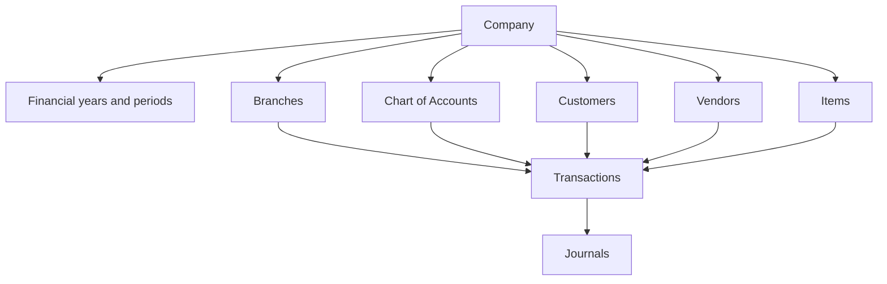

# Module Catalogue

**Last verified:** 2026-09-15  
**Primary sources:** `src/App.jsx`, `src/Navigation.jsx`, feature components and service modules.

## Account details right-side popup checkpoint

On the user instruction of 2026-09-15, clicking an account on the Chart of Accounts page opens its details as a right-side popup instead of the inline detail column that used to sit beside the grid, which supersedes the "detail pane unchanged" clause in the sticky-grid checkpoint below. `src/AccountWorkspace.jsx` renders `div.am-create-drawer-layer.am-detail-layer` holding a `button.am-create-drawer-backdrop` and a full-height `aside.am-create-drawer.am-detail-drawer` (`role="dialog"`, `aria-modal="true"`, `aria-label="Account details"`) whose own header states `Account details` and `{account.name} · {account.code}`; the header close button, the backdrop and `Escape` all clear `selected`, and the row click, the register 3-dot entry and the `wayvida-open-account` handoff from Balance Sheet, Day Book and the ledger all still open the same detail. The summary with its dated Current Balance, the Transactions and Audit Trail tabs, the ledger and the audit list, and the Edit Account, View Ledger and Mark Inactive / Mark Active actions are unchanged inside the new shell. `am-layout` lost the `has-detail` modifier, and `src/account-workspace.css` dropped the two-column `.am-layout.has-detail` grid rules, the `.am-detail{position:sticky;top:82px}` container and the matching media-query overrides, so the grid keeps the full page width; `.am-detail-top` stays because the Day Book transaction detail header still uses it. A new commented block sets the panel to `min(560px,100vw)`, makes `am-detail-body` the only scroll container and pins `am-detail-footer`, and declares no font size, so the 12px floor and the existing drawer shell are preserved. No storage, validation, posting or account-record change was involved.
## Chart of Accounts sticky grid head checkpoint

The Chart of Accounts page keeps its filter row and table head visible while the account list scrolls, on the user instruction of 2026-09-15. The change is styling only, appended to `src/account-workspace.css`: the filter toolbar pins to the top of the shell scroll port (`.am-coa-page>.am-filter-toolbar{position:sticky;top:0;z-index:9}`), and the account-grid wrapper, already a scroll port because the table has a 1120px minimum width, is bounded (`max-height:max(360px,calc(100vh - 280px))`, a `dvh` line beside it, `overscroll-behavior:contain`) so it becomes the grid's own scroller. The column header row (`thead th`, `sticky;top:0;z-index:6`) and the account-group accordion row (`.am-group-row th`, `sticky;top:calc(var(--am-coa-head-h) - 1px)`, `z-index:5`) then stick inside it, each keeping an opaque fill and taking an inset shadow instead of the collapsed-table border that sticky cells lose. Filters, grouping, the account tree, `colSpan` arithmetic, the scope columns, the empty state, the detail pane and the Create/Edit Account drawer are unchanged, and no posting, storage or validation rule is involved.

## Chart of Accounts enterprise checkpoint

The account list exposes Type, Account Nature, Scope, opening/current balances, status, transactions, and actions. The filter toolbar provides quick Type and Status dropdown filters directly alongside an Advanced Filters popover (Created by, Account group, Branch requirement, and Balance range) while removing the obsolete Tax mapping filter. Create/Edit supports organisation versus branch scope, reporting classification, parent validation, account category visibility, normal opening balance guidance, manual/direct posting, tax applicability, and reconciliation controls. New accounts persist every organisation selected in the working context while retaining the first `organizationId` for compatibility. Account Details resolves those actual organisation names instead of generic placeholders. Organisation-wide accounts show `All branches (X)` with an expandable organisation-grouped list; branch-specific accounts show only their saved selected branches, grouped by organisation. Legacy records carrying the placeholder `default` organisation display the active header context without mutating stored data. This does not alter account posting eligibility or accounting rules. Create and Edit now open in a right-side drawer (`src/EnterpriseAccountForm.jsx` with `src/account-create-drawer.css`) that carries its own header and close button instead of a centred card, and the terminology switch lives in the header account menu rather than the header action row.

## Organisation and branch scope (shared)

`src/organisation-scope.js` is the single implementation of the organisation/branch scope rule for the accounting module, consumed by the Chart of Accounts, Journal Entries and Period Closing rows below. `getScopeVisibility({organisations,organisationIds|companyIds,branchIds,label})` returns the resolved rows, the read-only `strip` context line and the flags `showOrganisation` (`orgCount > 1`) and `showBranch` (`orgCount > 1 || anySelectedOrgHasMultipleBranches`); `getBranchesForOrganisation(reference,organisations)` is the only branch lookup; `organisationBranches` annotates each branch with its owning organisation; `selectedOrganisations`, `normaliseScope` (auto-fill a one-option branch, drop a foreign one), `validateScope` (`OK` / `NO_SCOPE` / `UNKNOWN_ORGANISATION` / `BRANCH_NOT_IN_ORGANISATION` / `BRANCH_REQUIRED`), `assertValidScope` and `scopeLabel` complete the surface. `NO_BRANCH` is the em dash printed for an organisation with no branches; `ALL_BRANCHES` is `All branches`. `src/period-locking.js` re-exports these helpers instead of keeping a second copy.

The interactive half is `src/OrganisationBranchScope.jsx` (`OrganisationBranchScope`), which renders the selectors from the pure `scopePickerState({organisations,companyIds,branchIds,label})` helper in the same module - one implementation of the control, not one per page. Period Closing's Create Lock / Close drawer renders it with selectors over the available working context (`src/organisation-context.js`), and the request unlock drawer renders it with `showFields={false}` to state the locked scope. The working context itself (`readOrgSetting`, `readOrgList`, `getAccessibleOrganizations`, `getCurrentOrganizationContext`) lives in `src/organisation-context.js`, imported by both `src/JournalEntriesPro.jsx` and `src/PeriodClosing.jsx`, so the available organisation list is resolved once.

Consumers: Chart of Accounts create/edit (`src/EnterpriseAccountForm.jsx`, where the Organisation multi-select stays visible as the customisation control and only the Branch picker auto-resolves), Chart of Accounts listing and account details (`src/AccountWorkspace.jsx`, whose grid adds Organisation and Branch columns only when the shared flags say so), Create Journal Entry -> Journal Lines (`src/JournalEntriesPro.jsx`, names rather than ids), Period Locking settings (`src/PeriodLockSettings.jsx`) and Create Lock (`src/PeriodClosing.jsx`, which validates through `validateScope` and prints a `Locking for:` chip in the drawer). Chart of Accounts, Journal Entries and Period Closing therefore cannot disagree about when an organisation or branch selector is needed, and no screen may reintroduce its own copy of the rule.

## Navigation organization

The sidebar exposes each destination once and groups it by primary business purpose. Accounting contains ledger setup and controls and holds Chart of Accounts, Journal Entries, Budgets and Period Closing, with Budgets placed between Journal Entries and Period Closing as one flat destination (there is no Budget group and no separate Budget Reports or Budget Settings page, and no budget screen renders a section tab row of its own); Inventory, Sales, Purchases, Banking, Expenses, Assets, and Tax & Compliance contain operational work; Reports contains read-only financial and management outputs; Settings contains organization and application configuration. General Ledger, Trial Balance, Day Book and Purchase Reports therefore live only under Reports, Period Closing lives only under Accounting, and the single budget destination lives only under Accounting. This avoids duplicated navigation labels without changing route names or module behavior.

## Demo dataset

`src/demo-data.js` performs a versioned, non-destructive first-run bootstrap. It supplies linked customers, items, vendors, sales orders, posted and unpaid invoices, a partially allocated receipt, purchase order, goods receipt, posted/part-paid purchase bill, draft debit note, bank accounts/statements/reconciliations, expenses, assets, GST, TDS and budgets. Accounting examples use balanced journals and shared document identifiers so the General Ledger, Trial Balance, Day Book and reports show the same activity. Existing non-empty module storage is preserved, and the version marker prevents repeat loading.

| Module | Status | Current behavior | Important dependencies / gaps |
|---|---|---|---|
| Dashboard | Prototype only | KPI cards, trends, ageing, alerts, bank/task/transaction panels. | Values are not uniformly generated from stored journals. |
| Company Setup | Prototype only | Guided company onboarding and organization screens. | No tenant backend, server validation, or provisioning jobs. |
| Branches | Prototype only | Branch list/forms and accounting-dimension concept. | Header selectors and records are not production tenant context. |
| Chart of Accounts | Implemented prototype | Search, toolbar type/status filters, advanced filter popover, hierarchy, creation/edit/deactivation with a searchable account-group combobox, details opened as a right-side popup from any row, transaction view, opening journal. Row actions sit behind the canonical horizontal three-dot menu shared with Period Closing (32px trigger, 196px menu), which closes on selection or an outside pointer. | Local persistence; permissions simulated. |
| Journal Entries | Prototype only | Manual journal register with business/accountant terminology and controlled approval, posting and reversal. The create page is a compact task-oriented workflow: one mandatory metadata row (date, journal type, optional reference, plain single-line reason), organisation and branch edited per line between the account and debit columns but only while the working context needs them (a single accessible organisation hides the Organisation column, and a single branch under it hides Branch as well, so the grid renders seven, six or five columns and the implicit organisation/branch is stamped on every line), mutually exclusive debit/credit inputs, one compact footer row under the lines grid whose left edge carries the Attach files button with its file-type hint and its chips, followed by the optional Remove empty lines action, and whose right end closes with the Total Debit and Total Credit totals with the balance status (`Debit equals credit` / `Difference: <amount>`) stacked on its own line directly beneath them as the only posting indicator, with the Add Journal Line button pairing with Use Template in the lines title row, collapsed Additional details holding read-only approval comments only, and a footer kept to Save draft (or Save changes) plus the primary Post journal button, with no Cancel button and no three-dot More actions menu in that footer. Register row actions do use the canonical three-dot menu shared with Period Closing, now with a horizontal icon, `type="button"` entries and a page-level pointer/Escape dismissal. | Posting is gated by balanced totals inside an open period - not by a prior approval - with the four conditions still returned by `postingChecks()`; a Draft journal is submitted for approval from the journal detail screen. Templates and account preferences stay outside the journal and ledger stores. Approval roles, period locks and permission enforcement are browser-local simulations. |
| Transaction Register | Implemented prototype | One read-only cross-module register under Reports combines sales invoices, purchase bills, receipts, vendor payments, credit notes, debit notes, expenses, adjustments, bank-related journals and manual journals. It separates business status from Not Posted/Posted/Reversed accounting status, supports search and advanced filters, and opens a detail drawer with accounting impact and source/journal/ledger navigation. | Derived from browser-local stores at view time. Server pagination, durable cross-entity identifiers, generated PDF exports and complete related-document graphs remain planned. |
| General Ledger | Implemented prototype | Accountant summary, persistent account selector, filter drawer, and a simplified register with Date, Voucher, Debit, Credit, Balance, Status, and View details. Description is shown as a Date/Voucher hover tooltip and inside the details drawer with reference, dimensions, reconciliation, and journal/source actions. Saved views are intentionally not exposed. | Uses posted journal lines from `wayvida-accounting-v1` when available; seeded rows remain as an empty-state demonstration. Export/email and authorization are simulations. |
| Trial Balance | Prototype only | Accounting report view generated through invoice workspace. | Needs production period/company dimensions and drill-down parity. |
| Day Book | Implemented prototype | Read-only posted journal projection, separate unposted view, filters, CSV/Excel/print. | Missing source metadata is labelled rather than invented. |
| Period Closing | Implemented prototype | Lean single-purpose close-books screen whose body is the locked-periods register; there is no tab row, no composite title line, no status line, no page subtitle and no Transactions, Audit log or Close with review link row. The heading pairs the page title - read from the shared terminology map, so it reads Period Closing for accountants and Financial Lock for the business owner - with a journal style subheading beneath it and no inline read-only policy chip (the locking policy is read in Period Closing Settings), and the page actions are one right-aligned group - the Before you close attention pill, one More actions menu holding Current accounting period and Period closing settings, and a separate Create Lock / Close button. Before you close is a compact, never-dismissible attention pill in the heading action group (amber warning icon plus the count as text, neutral grey for one or two soft checks, amber for three or more and red when a check blocks the close, never the primary blue and never a badge) whose popover states the check count with the entries-affected total, lists only the failing checks and ends with Review all, which opens the right-side pre-close review drawer with its entries-affected count and wrapped category chips. The register toggle leads the panel header on the left (the panel prints no Locked periods / Every lock for the organisation sentence, and no caller passes that title block any more) and switches between Locked Periods and Requests, the requests half only while unlock approval is on, each half carrying its own count. What the lock list may show follows the locking mode through `lockRegisterRows`: automatic locking keeps only locks whose period has already ended, manual locking keeps only the locks created here, and locking off hides nothing. The filtered register is the only lock list: the wide lock history drawer and its More actions entry were removed. Its toolbar is one compact row: the Locked Periods / Requests toggle on the left and, on the right, a search box and one Filters disclosure, with Period (listing the periods the register can show) and Status inside that Filters disclosure ahead of Financial Year, Organisation, Branch, Closed By and Closed Type, so the visible row stays short and the Filters badge counts every filter that is set. The current accounting period is no longer a page card: it opens from the first More actions entry as a 520px right-side popup that renders the period, the date range, the organisation and branch scope, a Status badge and lock-aware inline actions (Lock this period, Request Unlock, Admin override, an Unlocked until note, View details), with a No current period empty state when nothing is configured. The register toolbar is a div rather than a header, and every drawer and modal close button carries an explicit display, because the legacy global app-bar rules in src/styles.css restyle any label or input inside a header and hide any direct child header button below 1050px. The register lists Period, Organisation, Branch, Status, Closed Date, Closed By and Actions; the kebab menu offers View Requests, View Audit Log, View Details, Request Unlock and Close Period. Missing periods are no longer offered anywhere on the page. The Create Lock / Close drawer is mode aware: manual locking collects a period, a date and an optional reason and locks every module, while automatic locking resolves the next free period from the saved schedule and collects Frequency, Effective from, Lock after period end, Lock at and Notify before locking with a Next lock preview. Period Closing Settings leads with one sentence and holds one headingless settings card with two toggle switches - Enable automatic locking, which only moves between Automatic and Manual, and Require approval to unlock below a divider - around the closing schedule fields and their read-only preview; the former Period locking card, the separate Unlock approval card and the More policy settings block are gone, so the unlock defaults and every other policy value keep their engine defaults, and the same stored `lockingMode` drives Settings -> Accounting -> Period control, whose Period locking switch maps Off to Manual and Automatic period closing maps Automatic to Manual. Closing verifies posted invoices, approved bills, draft journals, bank reconciliation and tax adjustments before an OPEN to CLOSED transition that records the closing user, date and audit event. Unlock requests are raised separately and reopen a closed period as Reopened; every Request Unlock action, the View Requests entry and the Requests half of the register toggle are removed when unlock approval is off, temporarily unlocked periods show an Unlocked until label, and an administrator override drawer records a written reason. Unlock requests carry a whole-period or contained date-range scope; their rows carry one combined Organisation & Branch column plus a Status column (`Requested` while pending, then `Approved`, `Cancelled` or `Rejected`) and one View button beside one 3-dot menu offering Approve, Cancel, View Details and Delete - a request the acting role raised itself is decided as the next authorised approver from unlockApproverFor(requestedBy, settings), which the action cell does not restate because the View button and the menu are the whole cell, Delete removes the record through deleteUnlockRequest (releasing a pending period first), every filtered request renders in one pass with no pager, and the period details drawer no longer prints a lock type, so Hard Lock and Soft Lock stay engine-internal - and requests can be cancelled by their requester or an approver, expiry re-locks automatically and writes both the `Unlock expired` and `Period reclosed` events, and every locking audit entry records actor, timestamp, action, organisation, branch, before/after values, reason and the related request id. The unlock `Requests` half is one seven-column, pageless table - Period, one combined Organisation & Branch cell, Reason, Requested, Requested By, Status and Actions, in the shared `pc-table-fit` register shell, with every filtered request rendered in one pass - whose Status cell holds the page `pc-badge` (`Requested`, `Approved`, `Cancelled` or `Rejected`) and whose Actions cell holds one read-only `View` button and one 3-dot menu (`Approve`, `Cancel`, `View Details`, `Delete`), where both View entries open a single-request details popup. | Browser-local controls and simulated roles; production transaction commands still require server-side enforcement. |
| Items | Prototype only | Item grid/form, image input, goods/service type, units, sales/purchase switches, account mappings, and default GST/Cess plus inclusive/exclusive price treatment. Vendor is not collected on the item. | No inventory ledger or secure upload storage. |
| Customers | Prototype only | Search/grid and customer master form including receivable account. | No backend credit-control enforcement. |
| Sales Orders | Implemented prototype | Shared invoice-like form, validation, statuses, invoice-draft conversion, and editable item-derived tax/price treatment. The register uses a standard page hierarchy, semantic status badges, a dedicated icon-led Preview action, compact Edit action, and a vertical overflow menu. | Browser-local orders; share/print are prototype behaviors. |
| Invoices | Implemented prototype | Header/items/GST/totals, approval/posting/payment/cancel flow, automatic journals, and a responsive professional document-detail workspace with breadcrumb, lifecycle badge, prioritized actions, summary metrics, tab counts, structured overview, payment state and accounting/audit drill-down. | Customer master linkage is partly UI-driven; full workflow permissions pending. |
| Credit Notes | Implemented prototype | Invoice-linked creation, approval, issue, application, cancellation/reversal, GST reports. Apply Credit enforces posted/open, same-customer, same-company, same-currency and same-AR eligibility; shows customer outstanding, eligible and excluded invoices with reasons; supports partial amounts and a confirmation preview; and records allocation events in the Customer Statement without posting another journal. If no compatible unpaid invoice exists, the credit remains available with Customer and Invoice navigation actions. | UI permissions currently inherit the prototype Admin session; production authorization and inventory return posting require backend controls. |
| Receipts | Implemented prototype | Independent receipts, approvals, allocations, advances, bank matching/reconciliation, reversal, and a fully visible vertical row-action menu. Receipt matching now consumes eligible unmatched incoming statement transactions from the Banking module by linked bank ledger code; an empty state directs users to import a statement instead of presenting a blank selector. | Role controls are simulation; posting still requires Approved status and Finance Manager/Admin permission; bank import is local. |
| Document previews | Implemented prototype | Isolated embedded preview for invoices, receipts, credit notes and sales orders; compact toolbar, document identity, Wayvida logo, print/share/customize, and saved layouts. | Sharing sends a text summary; uploads/preferences are browser-local. |
| Vendors | Implemented prototype | Vendor balances now derive from posted bills and payments, with a live Accounts Payable sub-ledger and running balance. Master data, GST/TDS and payment preferences remain available. | Records and permissions remain browser-local. Opening migration journals and production authorization remain required. |
| Purchase Orders | Implemented prototype | Non-posting orders support vendor/item defaults, lifecycle controls, received quantities, partial receipt traceability, and repeated conversion of only received/unbilled quantities. | Approval permissions remain simulated. |
| Goods Receipts | Implemented prototype | Dedicated grid and receipt form reference open POs, validate partial quantities, track ordered/previous/pending quantities, and update PO status without accounting entries. | Inventory valuation and warehouse dimensions are not implemented. |
| Purchase Bills | Implemented prototype | Independent or PO-derived bills support partial billing ceilings, duplicate vendor invoices, CGST/SGST/IGST/Cess calculation, preview/print/share, period-validated posting, immutable posted state, payment-refund plus bill-reversal cancellation, multiple payments, and applied Debit Notes. | Production database transactions remain planned. |
| Debit Notes | Implemented prototype | Direct creation supports either a standalone vendor adjustment or an optional posted Purchase Bill link, with vendor, date, reference, reason, dimensions and item/account lines. The controlled lifecycle is Draft → Pending Approval → Approved → Posted → Adjusted; only posting creates the balanced AP/purchase/input-tax reversal journal. Linked notes may then be allocated to their bill. Missing reserved GST posting accounts are additively repaired before posting. | Browser-local role simulation and storage only; authenticated approval, vendor cash refunds, stock-return valuation, TDS adjustments and GST portal integration remain planned. |
| Shared Date Picker | Implemented prototype | A central Wayvida calendar intercepts date-input selection across the app, with consistent month navigation, selected date and Cancel/OK confirmation while retaining each field's ISO value and min/max validation. | Keyboard focus may still invoke the browser-native picker; time/month inputs retain their native controls. |
| Global Quick Create | Implemented prototype | The header `+ New` opens a searchable, responsive action menu. `Ctrl+K` opens it, current-module actions sort first, and Admin, Accountant and Sales Executive action sets are filtered by the action registry. Debit Note quick create opens the existing controlled form and does not bypass approval or posting. | The current app header supplies the simulated Admin role; production authentication, server permissions and several destination forms remain planned. |
| Invoice Details | Implemented prototype | The document header, four summary metrics and five tabs are retained. Overview now embeds Invoice Information, Amount Summary, Accounting Summary, Payment Summary and Related Documents in a centered responsive card grid; there is no permanent side panel. Journal and Ledger shortcuts use existing navigation and Activity has its own tab. | Related links appear only when source records contain their identifiers; production attachment storage remains planned. |
| Sales Credit Note Mapping | Implemented prototype | Sales Adjustment, GST Adjustment and Accounts Receivable mappings are configured centrally and applied automatically. Posting is blocked atomically with a clear Account Mapping shortcut when required configuration is incomplete. | Mapping persistence remains browser-local and authorization is simulated. |
| Vendor Payments | Implemented prototype | Bill-level full/partial/multiple payments create idempotent Accounts Payable/Bank journals and appear in a dedicated payment grid. | Unallocated advances and refunds remain planned. |
| Purchase Reports | Implemented prototype | Financial-year date filters, vendor/status/search filtering, purchase/input-tax/payment/outstanding totals, vendor summary, bill detail, and CSV export derived from saved Purchase Bills. | Browser-local reporting only; production reporting API, pagination and server-generated exports remain required. |
| Purchases | Implemented prototype | Vendor → PO → Goods Receipt → Purchase Bill → Journal → Ledger/Reports, Bill → Payment, and Posted Bill → Debit Note → AP/Input Tax/Purchase reversal flows are connected through browser-local state. | Production backend, authenticated approvals, TDS posting, inventory valuation and atomic server transactions remain required. |
| Banking | Implemented prototype | Dashboard-integrated Bank Accounts, Transactions, Reconciliation and six-section Banking Settings. Priority-ordered matching rules support account scope, Auto/Suggest modes, date tolerance, reference requirements and confidence. Categorization rules suggest income/expense accounts by bank, flow and description without posting. Saved CSV column mappings, duplicate policy, reconciliation thresholds, automation toggles, scalable permission controls and a future integration placeholder are persisted and audited. Matching never reposts existing journals; categorized statement lines create accounting only through the existing confirmed workflow. | Browser-local permission simulation and storage; Excel is configurable but native workbook parsing remains planned. Actual bank APIs, server permission enforcement, automatic categorization execution, partial/split matching and durable import jobs remain planned. |
| Expenses, Assets, Tax, Budgeting and Reports | Implemented prototype | Design-system-aligned Expenses, Expense Categories, Asset Register, Depreciation, Asset Transactions, GST, TDS, Budgets, Budget vs Actual, and centralized Reports screens. Includes local demo registers, search/filter controls, responsive tables, detail drawers, sectioned create forms, expense journal posting, fixed-asset acquisition posting against Bank or Accounts Payable, depreciation journal posting, asset value updates, tax summaries, budget utilization, report navigation, validation, empty/error states, and progressive accounting disclosure. | Browser-local persistence and fixed prototype tax/budget datasets; approvals, statutory filing, production depreciation schedules, live report queries, attachments, pagination, full disposal/cancel/audit workflows, and server authorization remain planned. |
| Expenses | Planned/placeholder | Navigation categories exist. | Expense claims/categories and posting engine required. |
| Assets | Planned/placeholder | Navigation categories exist. | Asset register, depreciation schedules and disposal postings required. |
| Tax & Compliance | Partial/planned | GST calculations and GST reporting hooks exist. | Filing workflows, TDS engine, returns, reconciliations and statutory exports required. |
| Budgeting | Implemented prototype | Budgets is one flat destination inside the Accounting section, between Journal Entries and Period Closing; the separate Budget Reports and Budget Settings pages are deleted. Budgets support P&L, Balance Sheet, Cash Flow, Complete Business, Department and Project types; monthly, quarterly, half-yearly and yearly periods; organisation, branch, department, cost centre, project and custom scopes; six-step status workflow; account-level allocation; previous-year and average/growth allocation shortcuts; revisions and audit history; CSV import/export; budget vs actual analysis on the plan detail screen. The standalone Budget Reports and Budget Settings screens were deleted, so the register, the create wizard and the plan detail tabs are the whole module and the alert thresholds keep their engine defaults. Budgets only reference Chart of Accounts accounts and read posted journals; they never create accounts or post journals. The Budgets register is a four-column table - Budget Name, Financial Year, Budget Period and Actions - whose register card opens with the shared search box, financial year select and one Filters disclosure holding the other filters above the grid, and whose rows offer a right-aligned read-only View Details button beside a 3-dot Edit / Duplicate / Delete menu. The page renders no status card row, so its heading leads straight into that register card. Create Budget is a three-step page - Budget Details (name, financial year, period, the shared multi-select organisation and branch scope beside the name on the first line of one three-column field grid, then the financial year, the period and a budget duration derived from those two on the second (the read-only duration is one plain field of that grid and carries editable dates only when the period is Custom, and the grid folds to two columns below 1100px and one below 700px), and a template switch - there is no budget-type field, because `form.type` keeps its default), Account Selection (one `budgetAccountGrid` table listing every active posting account in the Chart of Accounts under its accounting type in the shared `ACCOUNT_TYPE_ORDER` order from `src/terminology.jsx`, each section row a `th scope="colgroup" colSpan={2}` holding a `button.budgetGroupCell` that folds that type's accounts away and carries its count (`n of m selected`, or `m accounts`) and each row a labelled checkbox whose `label` prints the account name with its code - and its account group when it has one - beneath it, with `th scope="col"` headers and an `aria-label` on the table, every cell kept a real table cell rather than a flex box, and no account-type tabs; a `budgetSelectionTools` row above it - a search box, one `select.budgetTypeFilter` account-type filter, `Select all` and `Clear all` - narrows both the grid and what those two buttons act on, and a `span.budgetSelectedCount` in the head counts the picks) and Budget Allocation (the allocation grid, whose accounts sit under `BUDGET_ALLOCATION_BANDS` - Profit & Loss (Income, Expenses) and Balance Sheet (Assets, Liabilities, Equity) - with one sticky `td.budgetStickyCol` account column and foldable type rows, and whose shortcut row adds a `label.budgetGrowthField` Growth % number input before `Apply Growth %`, a `label.budgetImportButton` that hides an `input type=file` CSV import behind the same button, and a `button.budgetClearAll`; then a `section.budgetTotals` statement-totals block in the same period columns plus a row total - Total Revenue, Total Expenses, Net Profit / Loss, Profit Margin, Total Assets, Total Liabilities, Total Equity and Total Liabilities & Equity, every line computed from the allocation cells by the shared storage-free `src/budget-statements.js` layer (`budgetTotalRows(...)`) and none of it stored), then a `section.budgetBalanceCheck` that reads Total Assets against Total Liabilities + Equity and prints the Balance Difference from `budgetBalanceCheck(...)` with one sentence - `Budget is balanced`, or by how much the two sides differ - and never stores or posts that figure) - reached through a numbered progress stepper whose `Step n of 3` chip sits in the stepper card itself, under a full-bleed arrow-led page head that spans the content area exactly like the Create Journal Entry header, flush beneath the working-context organisation bar, where a finished step shows a tick in place of its number and no step name is cut by the connector line, whose connectors report their own progress (blue behind a finished step, half-filled behind the current one, neutral grey ahead), whose footer `footer.budgetWizardActions` is one static right-aligned row grouping `Cancel` / `Back` immediately left of the one primary action (never a `margin-right:auto` split), and saved with a single Create Budget action; the approval lifecycle is advanced from the budget detail screen. The details step is one three-column field grid whose first row puts the budget name beside the organisation and branch scope and whose second row holds the financial year, the budget period and the read-only budget duration, so the name never stretches the full page and no Description field is asked for, prints a `span.budgetScopeSummary` chip (`n Organisations · n Branches`) in its head as the step's only statement of the plan width (the second `p.budgetScopeHint` `Planning for ...` line is gone), and its organisation and branch scope is chosen from the whole accessible universe (`getScopeOrganisations()` in `src/organisation-context.js`), not only the narrowed working context: the control opens on the header's current organisation and branch, seeded through `wizardScopeSeed(initial)`, keeps its chosen `companyIds` / `branchIds` on the stored scope so editing reopens the same scope, and re-reads the universe whenever the working context changes, so it can never be left with nothing to choose. | Browser-local persistence and role simulation; server approval, email/dashboard notification delivery, Excel/PDF export, production forecast jobs and immutable audit storage remain planned. | Its budget detail screen is a statement view built on the storage-free `src/budget-statements.js` layer: the tab row is one flat single-row `BUDGET_DETAIL_TABS` list - Overview, Profit & Loss, Balance Sheet, Cash Flow, Budget vs Actual, Accounts, Activity History and Revisions - and `BUDGET_DETAIL_DEFAULT='Overview'` opens the detail screen on the KPI cards, the budget health bars and the alert list, while the register's read-only `View Details` button still lands on Budget vs Actual. The detail page head is the Create Budget arrow-led back head at full width (`div.budgetV3Head.budgetDetailHead` with `button.budgetHeadBack`, the `Budget Details` title and a `Back to budgets` hint), sitting beneath the organisation and branch bar, and `div.budgetDetailIdentityRow` under it pairs the budget name with its lifecycle status badge in `div.budgetDetailName` above the metadata line while right-aligning one primary status action beside a `details.budgetDetailMore` More actions menu holding Edit, Duplicate, Export, Archive and Delete; the detail screen takes a `remove` prop, so deleting there archives the plan and returns to the register. `budgetStatementRows` groups the planned accounts under their chart of accounts group inside each accounting type and closes every group, type and statement with a total row - the profit and loss closes on Net Profit / Loss, the balance sheet on Total Liabilities & Equity and then a `kind:'check'` Balance Difference row that is reported and never stored or posted, and the cash flow on Net Cash Flow with an expense or an asset purchase signed negative. The flat `AllocationTable` and its `Budget Details` tab were removed because the statements render the same accounts, amounts and totals grouped. The register kebab is `View budget` first, then Edit, Duplicate and the destructive Delete. Budget vs Actual and the Accounts tab both read `computeVarianceRows` - Account, Budget, Actual, Variance (actual less planned) and Variance % - with a separate Achievement % column and a favourable/unfavourable/neutral tone from `varianceDirection(type,variance)` that inverts for an expense account; the Accounts tab adds Organisation, Branch, Account Type, Account and Period filters; Activity History lists the logged budget events (created, edited, accounts, allocation, status, export, archive) with their actor and time; and Revisions lists the stored versions with their date, author and total budget. |
| Reports | Partial | Ledger, Day Book, Trial Balance and some financial/GST views. | Production report catalogue, snapshots, periods, exports and access policies required. |

## Master hierarchy

In prose: company owns configuration and all masters. Branch is a reporting/posting dimension. Operational transactions reference masters and produce company-scoped journals. Production database foreign keys and authorization must enforce this ownership.

## Cross-module rule

Never add manual debit/credit fields to normal sales, purchase, receipt, payment, item, or customer workflows. Account selection should normally be derived from customer, vendor, item, tax, company, and branch configuration. Manual journal entry is the controlled exception.

## Settings Center — Prototype only

`src/SettingsWorkspace.jsx` and `src/settings-store.js` provide the grouped Settings landing page, responsive internal navigation, search, company/regional preferences, accounting and transaction controls, functional dependency validation, document numbering previews, local save/cancel behavior, and clear unsupported-capability states. Settings persist under `wayvida-settings-v1`.

This checkpoint establishes the shared configuration contract but does not claim complete command-layer enforcement. Existing company/branch management, period closing, document preview, Chart of Accounts, and operational modules remain their own source-of-truth stores and are linked from Settings rather than duplicated. Secure users/roles, immutable audit, API keys, delivery channels, integrations, backup/restore, server-enforced limits, and atomic numbering require backend infrastructure.

## Help Center — Prototype only

`src/HelpCenter.jsx` renders an in-dashboard knowledge workspace backed by `src/help-content.js` and the centralized `src/page-knowledge.js` page/status registry. Search covers the verified current module directory. Reusable `PageGuide`, right-side `HelpDrawer`, `WorkflowStepper`, `StatusExplanation`, `AccountingImpactCard`, and `DisabledActionReason` components are available from `src/ContextualHelp.jsx`; Bank Reconciliation is the first operational page connected to them.

Help content is currently bundled read-only data. Admin authoring, media upload, role-targeted recommendations, analytics, remote delivery and AI retrieval require authenticated backend services. Additional transaction pages can adopt the reusable guide components incrementally without duplicating content.

## Audit Log — Implemented prototype

`src/audit-log.js` installs one persistence-boundary observer before the React application renders. It records create, edit/update, status-change, remove, and configuration-change events for the shared accounting store and the current account, sales, purchase, banking, operations, period-control, settings, company, customer, vendor, and item stores. Existing module-specific audit arrays remain available for deeper workflow evidence.

`src/AuditLog.jsx` provides a single Reports → Audit Log register with search, module and action filters, local date/time, actor, company/branch context, changed-field summary, and CSV export. The browser prototype keeps the latest 5,000 events under `wayvida-global-audit-v1`; it begins capturing after this feature is loaded and does not reconstruct older history. Production requires authenticated actor IDs and an immutable server-side append-only store.

