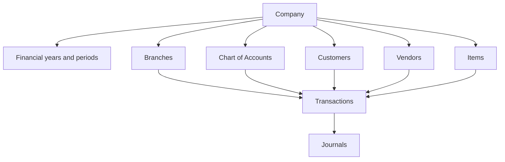

## Journal detail: one section with the audit log beside it — 2026-09-25

The journal detail no longer has tabs. Overview, Accounting Impact, Supporting Documents and Audit Trail were four tabs over one record; they are now one section, `div.je-detail-single`, whose first column holds the record and whose second column holds the audit log on a 7fr/3fr grid — measured at 1440 as 788.2px and 337.8px, the 70/30 the user asked for — stacking to one column at 1050px and below. The left column is `div.je-detail-main` holding three blocks: `section.je-detail-facts` with the heading **Journal details** over the field list, `details.je-impact` — the accordion, closed by default, whose summary reads **View Accounting Impact** (the business view says Transaction Impact) and whose body holds the debit and credit table with its totals — and `section.je-detail-docs` with the heading **Supporting Documents** (the business view says Documents) over the source-transaction row and the attachment list. The right column is `div.je-detail-audit`, heading **Audit Trail**, sticky at 12px so it follows a long record. The `detailTab`/`setDetailTab` state and the `tab`/`setTab` props were removed with the tabs.

**The audit column is a `div`, not an `aside`, and that is deliberate.** `src/styles.css` carries a global shell rule `aside{position:fixed;z-index:20;inset:0 auto 0 0;width:206px;background:white;border-right:...}` for the navigation drawer, so an `aside` here was torn out of the grid and pinned to the left edge of the viewport, overlapping the record. Use a `div` (or neutralise every one of those properties) for any new column inside a page.

The two actions the user asked for are primary: a Draft journal shows **Submit for approval** as `je-primary-action`, and a Pending Approval journal shows **Publish journal** as `je-primary-action` beside the danger **Reject**. The approval action key is still `Approve` and the status it reaches is still `Approved`; only the label is the user word, set once in `ACTION_LABELS` so the register row menu and the detail header agree, and the create page approver shortcut reads **Publish now**. The success notice now reads "Journal published and posted to the ledger.". Sources: `src/JournalEntriesPro.jsx`, `src/journal-detail-actions.css`, `src/SimpleTransactionForm.jsx`.

**Last verified:** 2026-09-26

## Journal detail: four fields to a line, icons, and documents inside the card — 2026-09-25

The field list in the Journal details card now runs **four fields to a line** with an icon on every label: IconCircleCheck for Status, IconArrowsExchange for Transaction Type, IconFileText for Transaction Name, IconCalendar for Date, IconBuildingBank for Pay From, IconTag for Category, IconCurrencyRupee for Amount, IconBuilding for Organisation and IconSitemap for Branch. The advanced-journal rows carry IconCircleCheck, IconBook, IconCalendar and IconTemplate. Each row renders `<dt>{Icon&&<Icon size={15} stroke={1.8} aria-hidden="true"/>}{label}</dt>` over its value, and the grid folds to three at 1280px, two at 1050px and one at 700px, so nothing is squeezed on a phone. Measured live at 1440: `grid-template-columns` of four columns of 171.65px, nine icons, eleven rows.

**Supporting Documents moved inside the Journal details card.** It is no longer a sibling card: `section.je-detail-docs` now sits inside `section.je-detail-facts` after the field list, separated by a `1px solid #edf1f6` top rule and carrying its own **Supporting Documents** sub-heading, so one card holds the fields, the source row and the attachments, and the accounting-impact accordion closes the column. The audit log still owns the right 30%. This answers the request that Supporting Documents also show in Journal details.

A Pending Approval journal is no longer silent about who may decide it. The Publish journal button appears exactly as before for a role that holds the post duty; for a role that does not, the detail now states `div.je-permission-note` (amber, `#8a4b09` on `#fff8ec`, IconLock at 14px): "Only an approver can publish this journal. Switch the View as control to Business owner to approve it." The gate itself is unchanged - the button is still withheld and the lifecycle still refuses the action - so this is guidance, not a second path to approving. The default View as in a fresh session is the accountant, which is why a pending journal looked as if it had no publish action at all. Sources: `src/JournalEntriesPro.jsx`, `src/journal-detail-actions.css`.

**Last verified:** 2026-09-25

## Journal detail four to a line, and the creation form field order — 2026-09-25

The Journal details card now shows its fields **four to a line** at desktop width (measured live at 1440 as four columns of 171.65px with the same nine icons), folding to three at 1280px, two at 1050px and one at 700px. Everything else in the card is unchanged: the icon on every label, the Supporting Documents sub-block inside the card, the accounting-impact accordion closing the column and the Audit Trail in the right 30%.

The creation form was reordered to the sequence the operator asked for, with no other change to the form: **Organisation, Branch, Transaction Type, Transaction Name, Date, the dynamic accounting fields, Amount**, then the collapsed Additional details. Organisation and Branch moved from below Amount to the top of the Journal details card, so the scope is confirmed before the transaction is described; when the working context holds one organisation or one branch the field still renders as the read-only value it did before, and changing the organisation still resets the branch to that organisation first branch. The dynamic block is untouched: Pay From plus Category for Expense, Deposit To plus Category for Income, From Account plus To Account for Transfer, Customer plus optional Invoice plus Deposit To for Customer Payment, and Vendor plus optional Bill plus Pay From for Vendor Payment. No component, API, storage key or accounting rule changed, and the field order is asserted in `tests/journal-create-ui.test.mjs`. Sources: `src/SimpleTransactionForm.jsx`, `src/record-transaction.css`, `src/journal-detail-actions.css`.

**Last verified:** 2026-09-25

## Journal detail: status out of the field list, audit log as a timeline — 2026-09-25

The **Status** row left the Journal details field list. The status is already stated by the chip that sits beside the journal number in the detail header, so repeating it as the first field was noise; the field list now opens with Transaction Type and runs Transaction Type, Transaction Name, Date, Pay From, Category, Amount, Organisation, Branch. The CSV export still carries the status row, because a downloaded file has no header chip to fall back on. Eight field icons remain over ten rows.

The audit log is now the **timeline** from the supplied reference. `journalTimeline(journal)` and `relativeTime(value)` were added to `src/simple-journal-transaction.js` so the wording is testable outside React. The helper returns one entry per material event, newest first, built from `journal.audit` when the record carries one and otherwise from its own stamps (createdBy/At, submittedBy/At, publishedBy/At or approvedBy/At, rejectedBy/At, cancelledBy/At, postedBy/At), each as `{key,kind,actor,at,when,text,note}`. The sentence names the actor then what they did - "changed the status from Pending Approval to Approved", "created this journal", "approved this journal", "posted this journal to the ledger" - and the reason a rejection or cancellation carried rides underneath as a note. `relativeTime` reads just now, Nm ago, Nh ago, Yesterday, Nd ago and then a date past a month.

The panel renders that list as `ol.je-timeline`: one `li` per event on a 34px + content grid, the marks joined by a single `li:not(:last-child)::before` rail, each mark a 34px circle holding an icon chosen by kind (created IconFileText, submitted and resubmitted IconSend, approved IconCircleCheck, posted IconCheck, rejected IconX, reversed IconRefresh, cancelled IconLock, anything else IconHistory) and tinted by outcome - lavender for a neutral event, green for approved and posted, red for rejected, amber for reversed, grey for cancelled. The actor is bold, the timestamp is 12px in `#98a2b3`, and a record with no events reads "No activity recorded yet." Sources: `src/JournalEntriesPro.jsx`, `src/simple-journal-transaction.js`, `src/journal-detail-actions.css`.

**Last verified:** 2026-09-25

## Journal approval: the publish no-op fixed, and an approver publishes their own draft — 2026-09-25

**A defect was found and fixed while answering this request.** The approval gate carried `if(next===String.raw`Approve`&&!postsToLedger(current))return;`. `postsToLedger` is false for Pending Approval, so that line returned early every time: the Publish journal button existed on a pending journal and did nothing at all, with no error and no posting. It is now `if(next===String.raw`Approve`&&postsToLedger(current)){setError(String.raw`This journal is already approved and posted. Nothing was published twice.`);return}`, which refuses only the already-posted case and lets the pending case post. Any future guard on this path must be written against the target status, not against the status the journal is leaving.

**An approver no longer queues their own work.** `JOURNAL_ACTIONS.Draft` gained the `Approve` step, and `actionEntries` now drops one of the two for a draft according to the duty the acting role holds: a role with the post duty is offered **Publish journal** and not **Submit for approval**, and a role without it keeps **Submit for approval** and never sees Publish. A draft therefore shows exactly one primary action either way, in the detail header and in the register row menu alike, and the lifecycle still re-validates the duty before it posts.

The audit timeline was tidied: the event body carries a 6px top padding so its first line sits against the centre of the 34px mark, the connecting rail is drawn at 17px so it runs exactly through the mark centres, items are 16px apart with the last one flush, and the note and the timestamp stack under the sentence at 12px without any `!important`. The attachment empty state inside the Journal details card now reads at body size - a 13px/600 heading over a 12px sentence with a 17px icon, left aligned - instead of inheriting a headline size, because it is a quiet note rather than a page title. Sources: `src/JournalEntriesPro.jsx`, `src/simple-journal-transaction.js`, `src/journal-detail-actions.css`.

**Last verified:** 2026-09-25

## Journal history card restyled as a vertical activity timeline — 2026-09-25

The history card now matches the supplied shape: **24px padding**, a **14px radius** (shared with the other detail cards so the column reads as one set), a **fixed 40px icon column** with **40x40 circular badges**, and a **thin 1px connector** drawn at 19.5px so it runs through the badge centres, starting 6px below a badge and stopping 6px above the next one, and never after the last item. Each entry is a flex row - the badge is `flex:0 0 40px` and the body is `flex:1;min-width:0;padding-top:7px` so its first line sits against the badge centre - with 24px between events and the last one flush. There are no horizontal divider rules in the card; the rail is the only line.

The username is semibold (`font-weight:600`) and carries `white-space:nowrap`, which is the fix for the reported defect where a name such as Admin broke across two lines inside the narrow 30% column; the activity description stays regular at 13px and wraps normally. A status change is no longer a sentence alone: `journalTimeline()` now also returns the `from`/`to` of each transition and the page renders them as compact `span.je-status-badge` pills - "Admin changed the status from [Draft] to [Pending Approval]" - tinted green for Approved, red for Rejected, blue for Pending Approval, amber for Reversed and neutral for Draft and Cancelled. The badge tints follow the mark tints, so Created stays neutral blue, Approved green, Rejected red and Pending Approval blue. A rejection or cancellation reason sits in a subtle note box (`#f8fafc` on a 8px radius, 12px), and the timestamp is a small muted block (12px `#98a2b3`) under each entry. The card relaxes to 16px padding below 700px and the two detail columns still stack at 1050px.

Nothing about the history logic or the stored data changed: the same events, wording rules, ordering and relative times are used, and the helper only gained the two transition fields it already had in hand. Sources: `src/JournalEntriesPro.jsx`, `src/simple-journal-transaction.js`, `src/journal-detail-actions.css`.

**Last verified:** 2026-09-25

## Journal audit trail layout defect fixed — 2026-09-25

**A layout breakdown was reported: every character of the timeline sentence stacked on its own line and full-width dividers appeared between events.** The cause was legacy CSS, not the timeline. `src/journal-entries.css` still carried three rules written for the markup the panel used before this checkpoint: `.je-audit p{display:flex!important;align-items:center!important;gap:9px!important;margin:0!important;padding:13px 0!important;border-bottom:1px solid #edf0f4!important;color:#344054!important}`, `.je-audit p span{display:flex;flex-direction:column}` and `.je-audit p small{margin-top:3px;color:#667085}`. The timeline renders its sentence as a `<p>` inside the same panel, so the `!important` flex row turned each text run into a flex item that shrank to one character, and the `!important` border drew the dividers.

The fix keeps the legacy rules away from the timeline instead of fighting them: the panel is now `div.je-timeline-panel` rather than `div.je-audit`, so no `.je-audit` selector can reach a timeline node, and `.je-timeline-body>p` states `display:block` so a future flex rule cannot rotate the text again. Nothing about the timeline data, wording, order or the legacy rules themselves changed; the only component still using `.je-audit` is the unreferenced `BusinessJournalDetail` at the end of the journal page. Measured live after the fix: the panel class was `je-timeline-panel`, no `.je-audit` element existed in the detail, the sentence computed to `display:block` with a `0px` bottom border and `0px` padding, and it filled the 310px body width.

**Last verified:** 2026-09-25

## Supporting Documents: one heading, one quiet line when empty — 2026-09-25

The Supporting Documents block inside the Journal details card was rendering **two headings in a row** - the section heading "Supporting Documents" and then, for a journal with no attachments, the empty state own "No supporting documents" over "Attachments uploaded with this journal will appear here." That pair read as another row of the field list, which is what was reported. There is now one heading and one quiet line: `p.je-docs-empty` with a 14px paperclip reading "No documents attached yet. Attachments uploaded with this journal will appear here." at 12px in `#667085` - and the `.je-empty` heading block was removed from this card entirely, along with the three `.je-detail-facts .je-empty` rules it needed. The document list, the source-transaction row and the attachment rows are unchanged. Measured live: the block holds exactly one `h3` and sits 4px below the last field row, separated by its top rule.

**Last verified:** 2026-09-25

## Sales document lines state their price type — 2026-09-25

Each line of the shared sales document table (`src/SalesDocumentFields.jsx`, used by Sales Orders and Invoices) now states the tax treatment it is priced in directly under the Rate field: a 12px `small.ivPriceType` reading **Excl. Tax** or **Incl. Tax**, grey for exclusive and blue for inclusive, with the cell wrapped in `div.ivRateCell`. The value is read from the line, which already takes it from the Item master through `itemDefaults(item)` (`priceTaxMode:item.priceTaxMode||String.fromCharCode(39)+String.fromCharCode(39)`), so an operator no longer has to infer it. The existing per-line "Price tax treatment" select stays as the override and the only control a line without an item master entry has. Nothing about the tax engine, the rounding, the posted amounts or the saved document shape changed: `calculate()` in `src/invoice-engine.js` and `calculatePurchase()` in `src/purchase-service.js` already converted an inclusive line with `entered*100/(100+combined)` before any tax is applied, and the billing summary already totals mixed lines through that one engine.

What the request asked for that already existed and was reused rather than rebuilt: the Item master carries a price type (`item-master.js` defaults it and the Item form Advanced settings already ask "Price includes tax?" with the exclusive and inclusive choices, shown in the register as `GST 18% · Inclusive`); every line already carries `priceTaxMode` from `blankDocumentLine()` and `itemDefaults()`; and the inclusive formula, the mixed-line summary and the tax selection were already in place.

The Item form now asks the question by name: the Advanced settings control that read "Price includes tax?" is **Price type \* ** with the choices **Tax Exclusive** and **Tax Inclusive**, and `validateItem` refuses a form that states a price type outside those two with "Choose whether the rate you enter already includes tax." The rule is scoped to a form that carries the key at all, because the shared item shape in `src/item-master.js` still seeds `priceTaxMode:String.fromCharCode(39)+exclusive+String.fromCharCode(39)`; blanking that default forced every derived fixture and import to answer the question and broke three item tests, so the default stays and the field is required by rule rather than by an empty control. An end-to-end inclusive calculation test now pins the arithmetic the Sales Order relies on: two units at 5,900 including 18% gives a taxable 10,000 and 1,800 of tax for an 11,800 line, the same rate exclusive gives a taxable 11,800 and 2,124 of tax for 13,924, and a document mixing the two totals both treatments through the one engine.`

An ad hoc line now has to state its own price type. `blankDocumentLine()` in `src/SalesDocumentFields.jsx` starts with `priceTaxMode:""` instead of answering the question itself, the line select offers "Select price type" beside Tax exclusive and Tax inclusive, and `calculate()` in `src/invoice-engine.js` refuses a line that states a blank value with "Choose whether each line rate includes tax.". The rule is scoped to a line that carries the key at all (the same guard shape the item form uses), because the engine is shared with invoices: a fixture or stored line that omits the key entirely keeps its long standing tax exclusive reading, and only an explicitly blank line is refused. A line with an item is unaffected because `itemDefaults` fills the value from the Item master. That closes the last of the three gaps; a dedicated Add Ad Hoc Item form still does not exist, so a free text line with this select is the ad hoc path.

Still outstanding from the request, deliberately not started in this pass: the priority chain (Price List then Item pricing then Organisation default then manual) because this prototype has no Price List module and no organisation-level price-type default; making the price type a required, explicit choice for a line with no item master entry, because `blankDocumentLine()` still seeds `priceTaxMode:String.fromCharCode(39)+exclusive+String.fromCharCode(39)` and changing that needs its own validation and flow work; and a dedicated Add Ad Hoc Item form, which does not exist yet - a free-text line with the existing tax and price controls is the current equivalent.

**Last verified:** 2026-09-25

## Advanced journal entry aligned with Simple mode — 2026-09-25

The advanced create page now shares the simple page chrome and states its scope once. Its header is Simple header markup - `header.rt-header` > `button.rt-back` > `h1` > ModeToggle > Status` - so the Simple / Advanced control sits in the same fixed trailing position in both modes, the back button, 70px row and 16px/650 title come from `record-transaction.css` instead of a parallel set, and the status badge keeps the same slot. One override, `.je-create .rt-header{margin:0 0 16px}`, drops Simple negative bleed because this container has its own gutter. The old `je-header-compact` / `je-header-spacer` / `je-compact-title` / `je-header-actions` markup is gone.

Organisation and Branch left the journal lines and became journal level fields in the header, in the order Organisation, Branch, Date, Journal Type, Reference Number, Reason. A line is now exactly Account, Debit, Credit, Description and the delete action, and the base `.je-line` grid was reduced to five tracks (`minmax(210px,1.4fr) 130px 130px minmax(150px,1fr) 42px`, `min-width:850px`). `lineScope`, `showOrganizationColumn`, `showBranchColumn`, `updateLineOrganization` and `lineBranchOptions` are deleted, and the posting hint under the line title states the header scope.

**The accounting model is unchanged, which is what makes this safe.** The header owns the scope and every line is stamped from it by `alignLine`, so `journalOrg()` and `journalBranch()`, the register columns, the scope filters and the Period Lock branch check keep reading the same per line values they always did, and stored records still resolve. `blank()` seeds the header scope from the working context, and `chooseScopeOrganization` moves the branch to the first branch of a newly chosen organisation. Balancing, posting, validation and the debit/credit totals are untouched.

Validation for this pass: the full sweep is 771 tests / 723 passed / 48 failing - no new failures, and five failures cleared. Those five were the stale organisation-scope expectations inside `tests/journal-line-columns.test.mjs`, which had been failing before this change because they expected the per line scope columns this pass removes; the file was rewritten for the new contract (the header owns the scope, a line has five cells, every line is stamped from the header, the branch list follows the chosen organisation). The production build passes at 6,982 modules.

The alignment was then finished and measured live, and three findings from that pass are worth keeping. First, the advanced page was already governed by a deliberate page scoped layout - `.app main:has(> .je-create:not(.je-business)) .je-create .je-form-card` and its `.je-form-grid` descendant - which pins that page to a four column grid and 14px/16px padding at a specificity no plainer selector can beat; the alignment rules are therefore restated at the same specificity later in the cascade, and the comment above them names the two rules to delete to return to the denser four column layout. Second, the advanced header had to become a `div.rt-header` rather than a `header.rt-header`: Simple uses a div, and the element difference had left a 103px header with a stretched mode control. Third, below 760px the advanced header hides its status badge and drops to Simple 16px card padding, because Simple carries no badge on that page and a four child header wrapped to two rows. Measured at 1440 after the change: header 70px both modes, back button 40x40, mode control 171x40, card padding 22px 24px, card radius 12px, control 42px on an 8px radius, label 13px, field grid three columns of about 353px. Measured at the narrow viewport: header 56px, card padding 16px, one column, control 171x40. The dead `.je-line.no-organization` and `.no-branch` rules were removed, and a stray brace pair left by that removal produced two `Unexpected "}"` CSS warnings until it was cleaned up. The footer keeps its existing accounting wording - Save draft and Post journal - because the advanced editor posts directly rather than queueing, and only the Cancel control was added to match Simple action area.

**Last verified:** 2026-09-25

# Module Catalogue

## Journal status vocabulary, approval gate and pending detail — 2026-09-25

The journal module now uses the same status words as the rest of Wayvida Books. `TRANSACTION_STATUSES` in `src/simple-journal-transaction.js` is **Draft, Pending Approval, Approved, Rejected, Reversed, Cancelled**; budgets, credit notes, invoices and inventory adjustments already stored Pending Approval and Approved, and `src/PeriodClosing.jsx` already counted `pendingJournalApprovals` with `x.status==='Pending Approval'`, so the journal register's earlier Pending and Published spelling made that Period Lock count read zero. `normaliseStatus()` still maps every retired spelling on read - Pending to Pending Approval, Published and Posted to Approved - and nothing rewrites stored records.

Only **Approved** owns a ledger posting: `POSTING_STATUS` is Approved and `postsToLedger(status)` is the single rule, so Draft, Pending Approval, Rejected, Reversed and Cancelled all stay outside the General Ledger. The lifecycle is Draft -> Pending Approval -> Approved, Pending Approval -> Rejected, Rejected -> Draft by resubmitting, Approved -> Reversed through the ledger's own reversal, and Pending Approval -> Cancelled for a submitted journal that must not proceed. Cancellation is the new step: it requires a reason, posts nothing, stores `cancelledBy`/`cancelledAt`/`cancellationReason` and keeps the record in the register for the audit trail, which is why it is offered for a submitted journal while a draft is still deleted outright. The approval action is keyed `Approve` and labelled **Approve**; `JOURNAL_ACTIONS` maps `'Pending Approval'` to Preview, Duplicate, Approve, Reject and Cancel journal, and `Approved` to Preview, Duplicate and Reverse. Reverse now requires an actual posting, so a record that never reached the ledger cannot be reversed, and the row menu hides Reverse for it.

The lifecycle gate in `src/JournalEntriesPro.jsx` re-checks the duty (`journalAllowed(role,duty)`), the status (`JOURNAL_ACTIONS[status]` must still offer the step) and a prior `ledgerJournalId` before it posts, and the advanced editor's `commit()` now applies the same `journalAllowed(role,'post')` check, so the approval duty is not merely hidden in the row menu. The detail Overview now states the fields the approver decides on for a simple transaction - Status, Transaction Type, Transaction Name, Date, Pay From, Category, Amount, Organisation and Branch - built from the existing `journalRegisterDisplay()` projection rather than a second lookup; an advanced journal keeps its journal number, entry type and reference rows. `statusText(status,business)` is the one place the words are chosen, so the accountant view reads the stored words and the business view reads its own. Sources: `src/simple-journal-transaction.js`, `src/JournalEntriesPro.jsx`, `src/PeriodClosing.jsx`, `src/demo-data.js`.

**Last verified:** 2026-09-25

## Journal approval gate, Journal details section and header cleanup — 2026-09-25

Only an approved journal reaches the ledger, and the page now proves it in code rather than by hiding a button. `src/simple-journal-transaction.js` exports `POSTING_STATUS` and `postsToLedger(status)`, the single answer to "does this record own a ledger posting": Draft, Pending (the stored form of *pending approval*), Rejected and Reversed all return false, and Published — the approved status — is the only true. `src/JournalEntriesPro.jsx` re-checks every lifecycle step inside its one `action()` instead of trusting the row menu: the acting role must hold the duty named by `JOURNAL_ACTION_DUTY` through `journalAllowed(role,duty)`, `JOURNAL_ACTIONS[status]` must still offer the step, publishing a record that already holds a `ledgerJournalId` is refused with "This journal already owns a ledger posting. Nothing was posted twice.", and publishing anything but the posting status is refused outright. The engine token `journal-transaction:<id>` stays the second guard, so a retry after a duplicated click can only return the journal that already exists. The detail Audit Trail now states who submitted, approved, rejected and posted, and when, reading the canonical `submittedBy`/`submittedAt`, `publishedBy`/`publishedAt`, `rejectedBy`/`rejectedAt` and `postedBy`/`postedAt` stamps; the earlier `approvedBy`/`approvedAt` spelling is still read so a stored record keeps showing its approver. Nothing here is a new status vocabulary: Draft, Pending, Published, Rejected and Reversed remain the lifecycle, and `normaliseStatus` still maps the legacy `Pending Approval`, `Approved` and `Posted` wording onto it.

The operator-facing label for that step is now **Approve**: the action key `Publish`, the status `Published` and the `journal-transaction:<id>` token are unchanged, and `ACTION_LABELS` maps the key to the label, so a Pending journal offers Approve and Reject on its detail page and in the register row menu, the create page keeps its approver shortcut as **Approve now**, and the success notice reads "Transaction approved and posted to the ledger."

The Record Transaction page (`src/SimpleTransactionForm.jsx`) now opens its form card with one full-width **Journal details** section head (`div.rt-section-head`, `grid-column:1/-1`) carrying the sentence "Everything this transaction needs is on this page. A journal reaches the ledger only after it is approved.", and the money and category fields state their guidance in visible helper text below the control through the existing `Field` `hint` prop — "Select the account the money was paid from" and "Choose an expense category" for an Expense — instead of leaving that sentence inside the closed select. The select placeholders were shortened to "Select an account" and "Select a category" so each sentence is stated once, where it can be read. Every required input stays visible directly under the section: Transaction type (the stable `expense`/`income`/`transfer`/`customer_payment`/`vendor_payment` value), Transaction name, Date, the type's money field, Category, Amount, Organisation and Branch; only the optional Description, Reference and attachments remain behind Additional details.

The application header no longer carries a global search. `src/App.jsx` renders `navToggle`, `hamb` and then `headerActions` directly, and the six search-specific rules left `src/styles.css` with it (`header label`, `header input`, `.app header label`, `.app header>label`, `.app header>label:focus-within` and the two media-query overrides). `.headerActions{margin-left:auto}` keeps the right-aligned cluster flush with the header edge, so removing the input left no empty track and no broken alignment. No required field, storage key, posting rule, report balance or custom-mapping validation changed.

Double-encoded text was repaired across `src/App.jsx` and `src/JournalEntriesPro.jsx`: 152 characters that rendered as `₹`, `—`, `â€"`, `·`, `â—`, `’`, `↑`, `→`, `â†`, `−`, `⌄`, `👋` and `　` now render as ₹, —, –, ·, ●, ’, ↑, →, ←, −, ⌄, 👋 and a plain space, and a stray byte-order mark was removed from the first line of `src/App.jsx`. Sources: `src/simple-journal-transaction.js`, `src/JournalEntriesPro.jsx`, `src/SimpleTransactionForm.jsx`, `src/record-transaction.css`, `src/App.jsx`, `src/styles.css`, `tests/journal-create-ui.test.mjs`, `tests/journal-detail-actions.test.mjs`, `tests/simple-journal-transaction.test.mjs`.

**Last verified:** 2026-09-25

## Journal Entry transactions — 2026-09-24

The Journal Entries create action opens `src/SimpleTransactionForm.jsx` as **Record Transaction**, and that page now asks business questions, never accounting ones. Field order is Transaction type (a dropdown reading Expense, Income, Transfer, Customer Payment and Vendor Payment), Transaction name, Date, the type's own money fields, Amount, Organisation and Branch, then a collapsed Additional details section holding Description, Reference number and attachments. The type-specific fields are Pay From plus Category for Expense, Deposit To plus Category for Income, From Account plus To Account for Transfer, Customer plus optional Invoice plus Deposit To for Customer Payment, and Vendor plus optional Bill plus Pay From for Vendor Payment; a settlement states the document number, date, total and open balance before it is saved. `src/simple-journal-transaction.js` owns the vocabulary, validation, summary, accounting preview and the balanced lines; `src/record-transaction.css` owns the page. No Debit, Credit or journal-line vocabulary appears anywhere in the normal journey, and the generated double entry is disclosed only inside the collapsed **View accounting entry** block.

The transaction lifecycle replaces the earlier draft/approval/post chain: **Draft -> Pending -> Published**, **Pending -> Rejected -> Draft by resubmitting**, and **Published -> Reversed**. Only Draft and Rejected are editable; a Published transaction is corrected by its reversal, never by editing. `src/JournalEntriesPro.jsx` owns one `action()` for every step, so the register, the detail screen and the engines cannot disagree. Stored fields now include `publishedBy`, `publishedAt`, `rejectedBy`, `rejectedAt` and `rejectionReason` beside the existing `ledgerJournalId`, `reversalOf` and `reversalJournalId`. Rejection requires a reason. `saveSimple()` posts through `src/invoice-engine.js` `journal()` exactly as the advanced editor does, with the `Journal Transaction` source and one idempotent `journal-transaction:<id>` token per record, so editing and retrying can never double-post.

The registered actions are status-driven: Draft offers Edit, Preview, Duplicate, Submit for Approval and Delete; Pending offers Preview, Duplicate, Publish and Reject; Published offers Preview, Duplicate and Reverse; Rejected offers Edit, Preview, Duplicate, Resubmit and Delete; Reversed offers Preview and Duplicate. The acting role follows the View as switch (`reviewRole` in `src/JournalEntriesPro.jsx`, the same local simulation `src/inventory-adjustments.js` uses) and `journalAllowed()` owns the duty table, so Publish, Reject and Reverse are filtered out of the menu for a role that may not approve rather than merely disabled - an accountant never sees them. A row projected from another module (`invoiceCommand('pay')`, `recordPurchasePayment`) is marked `automatic`, keeps Preview only and states why.

The register itself is nine columns - Journal ID & Date, Transaction details, Account, Transaction Type, Amount, Status, Organisation, Branch, Actions - with no Debit or Credit column, and the amount is the user-facing transaction amount (`journalRecordAmount`, the stored paise `amount` or the larger side of the lines). Search covers the Journal ID, the transaction name and the reference; the filter panel covers Status, Transaction type, Account, Organisation, Branch, Date range, From date and To date. `src/journal-register-display.js` resolves the name, type, account, category, party, status and amount for both simple and advanced rows without mutating stored records, and normalises the pre-2026-09 vocabulary (`Pending Approval` and `Approved` to Pending, `Posted` to Published) on read.

The register's third column is **Transaction details**: the transaction name with its reference stacked beneath it (the reference reads "No reference" when none was recorded), renamed from Transaction name on 2026-09-24 at the user's request. On the Record Transaction page the entry mode is one **Simple / Advanced** segmented toggle in the header The register shows **ten transactions to a view** behind the shared `.pagination-footer` pager ("Showing 1-7 of 7" with a `10 per page` note and Previous / Page n of m / Next), and its first and last cells carry the register 24px inset so the list keeps a left and right gutter inside its card; the export still writes every filtered row, not just the visible page. (Simple is the active side on this page, Advanced opens the classic editor, which carries the same toggle with Advanced active), the **Wayvida will record** card was removed at the user's request - the fields run four to a line in one full-width card and the page ends in a static footer that carries the one-line summary, a View accounting entry tooltip and the Cancel, Save draft, Submit for approval and Publish now actions, which pin to the window while the page scrolls; Description, Reference number and the attachment control share one row of the Additional details section - and a Transaction type is selected from the start - the dropdown opens on Expense and offers no empty option, so the type-specific fields are populated the moment the page opens.

Preview keeps the accounting view separate: `src/JournalPreview.jsx` leads with a **Transaction summary** block (Journal ID, Date, Transaction name, Transaction type, Account, Category, Amount, Organisation, Branch, Description, Reference, Attachments, Status) and moves the double entry under an **Accounting detail** heading.

`src/demo-data.js` seeds the register on a fresh install (DEMO_VERSION 2): JE-2026-000121 (Expense, Published), JE-2026-000122 and JE-2026-000127 (customer and vendor payments settled through their document engines), JE-2026-000123 (Expense, Pending), JE-2026-000124 (Income, Draft), JE-2026-000125 (Transfer, Rejected) and JE-2026-000126 with its REV- reversal (Expense, Reversed), so every status and every transaction type is present and every published row owns a real posting. The same bootstrap now seeds its own working context (`wayvida-demo-company` / `wayvida-demo-branch`) and passes `periodOptions` into `postPurchaseBill` and `recordPurchasePayment`, because a fresh install previously had no accounting period to post against and the seeded registers arrived empty.

**Last verified:** 2026-09-24

## Journal Entry party and document linking — 2026-09-23

`src/SimpleTransactionForm.jsx` now asks for a transaction name and offers customers for Receive Money and vendors for Make Payment. A posted, outstanding invoice/bill may be linked only when its party, date, organisation and branch match the selected working context; its date, total, paid amount and balance are shown. `src/journal-entry-reference.js` centralizes document/account eligibility. Linked receipts use `invoice-engine.command('pay')`; linked supplier payments use `purchase-service.recordPurchasePayment()`. Those engines create the journal and update payment balance/audit, so `src/JournalEntriesPro.jsx` does not also save a duplicate manual journal. Unlinked payments use the existing balanced journal path; manual money paid can select an asset/expense `Paid for` account. Advances remain in the Payment Receipts flow. This is browser-local prototype persistence, not an atomic backend or authenticated authorization.

**Last verified:** 2026-09-23

## Create Journal Entry layout — 2026-09-23

The normal create form in `src/SimpleTransactionForm.jsx` has **Journal Details** and **Entry Details** headings with consistent card and page padding from `src/journal-form.css`. It no longer repeats the global Organisation & Branch switcher summary inside the form. One selected organisation and branch are used automatically; multiple selected scopes still require one organisation and its branch before creation. A global switcher change clears any prior form scope choice. Accounting Details remains collapsed until opened.

## Sidebar Other section, editable account code and the drawer close - 2026-09-24

`src/Navigation.jsx` now declares Budgets and Period Lock in a section of their own - `{label:'Other',icon:IconFolders,children:[leaf('Budgets'),leaf('Period Lock')]}` - placed directly after the Accounting section, which keeps only `leaf('Chart of Accounts')` and `leaf('Journal','Journal Entries')`. The page names are unchanged, so the `App.jsx` routing list, the Budget workspace remount key and the portal that renders Period Lock are untouched; `tests/budget-navigation-ui.test.mjs` and `tests/navigation-structure.test.mjs` now assert the new grouping (both had been failing on the older `leaf('Journal Entries')` shape and are green again).

The Create Account drawer (`src/EnterpriseAccountForm.jsx`) lets the operator type the account code: the read-only `span.am-code-badge` ("Auto-generated") is replaced by an `input` bound to `form.code`, using `nextCode(db.accounts,type)` as its placeholder and the hint `Optional. Leave blank to use <code>.`. It stays disabled only while `locked` - a system account, or one a posted transaction already references - and then reads `A posted account keeps its code.` `src/account-master.js` already owned every rule: a typed code is kept, a blank one still generates the next code, a duplicate is refused with "Account code already exists. Choose a unique code." and a malformed one with "Use a code of up to 24 letters, numbers, hyphens or underscores.", so no storage, posting or validation behaviour changed.

The drawer's close control is the register's standard 38px square: `display:inline-flex;align-items:center;justify-content:center;padding:0`, a 9px radius on a `#d8e0ec` border, a 20px `IconX` pinned with `flex:0 0 auto`, and hover and `focus-visible` states. It is restated through a `.am` ancestor because the generic `.am button` rule (12px padding, 7px radius, 7px gap) is more specific than a bare class and was squeezing the glyph to 12x20; the account-details drawer shares the class, so it moved with it.

**Last verified:** 2026-09-24

## Charts of Accounts register - 2026-09-23

In the accountant terminology view, the Chart of Accounts register is labelled **Charts of Accounts**; the business-owner view remains **Money Categories**. `src/AccountWorkspace.jsx` always renders separate Organisation and Branch columns from the global Organisation & Branch Switcher selection, never account-specific scope values or a combined value. `src/finance-category-scope.js` shows a single selected name directly, or a compact organisation/branch count with an exact selected-name `title` on hover. Each register row exposes Edit only as the first entry in its canonical three-dot menu; there is no duplicate visible Edit button.

**Latest navigation interaction:** `Navigation` receives `collapsed` and `onExpandNavigation` from `App`. A group click in compact mode first restores the 250px sidebar and pins that group open. The theme control is one 34px icon button in `navUtilityRow`, not a two-column full-width selector.

**Current shell and context update:** `Navigation` stacks `navThemeToggle` above `WorkingContextSwitcher` in `navSidebarFooter`. Desktop shell width and all fixed portal offsets are 250px; collapsed mode remains 72px. The edge arrow is 26px and layered above header/menu chrome. Branch display codes now carry organisation prefixes while persistent ids remain compatible.
**Primary sources:** `src/App.jsx`, `src/Navigation.jsx`, feature components and service modules.

## Working context: the organisation and branch switcher

Current behavior supersedes the older quick-switch description below: the one portalled dropdown is now the organisation and branch checkbox multi-selector. It keeps draft selections until Cancel or Apply, prunes a removed organisation's branches, and disables Apply unless both selections are non-empty. The `Change / Customize` drawer and radio-row quick switch are deleted. The closed trigger shows one tooltip listing every selected organisation and branch, and its chevron is 20px. The same persistence keys and events remain authoritative through `applyWorkingContext`.

On the user instruction to make the Company and Branch section and its switcher work like the supplied workspace-switcher reference, then to move it into the sidebar, then to make the companies Wayvida Learning and Viskool with their own logos, and then to place it just below the Dark navigation switch with a tinted surface of its own, the working context became a two-company switcher that lives at the foot of the sidebar. `src/demo-organisations.js` holds exactly two organisations - Wayvida Learning (Kochi, Trivandrum, Bengaluru) with `public/wayvida-logo.png`, and Viskool (Trivandrum, Thrissur) with `public/viskool-logo.png` - and every reader shares that one list. `src/Navigation.jsx` renders `WorkingContextSwitcher` as the last child of `nav.erpNavigation`, below `div.navThemeFooter` (Help Center and the Dark navigation switch), so the working context is the bottom row of the sidebar; its card carries a light blue-grey surface (`#EEF3FB` light, `#22304A` dark) so it stands out from the nav behind it, and the panel flips above the trigger when there is not enough room below, which is the normal case now that the trigger sits at the bottom of the window. The panel and the `Change / Customize` drawer are portalled to `document.body` because the sidebar clips its own overflow, and the panel lists the organisations with their logos, the active one ticked and the others showing their branch count in the same slot, followed by the branches of the current company and the drawer row. The quick switch selects a single organisation or branch and the drawer keeps multi-selection, and both go through `applyWorkingContext` in `src/org-switcher.js`, which owns the five storage keys and the two change events, so Create Journal Entry, Period Lock and Create Budget can never see a context the switcher did not write. Only display data changes with a company rename: the storage ids ('abc', 'northstar') and the organisation codes ('ABC01', 'NSR02') are keys the working-context storage, the period-control records and the journal posting context resolve through, so names, logos and branch names/codes move while the ids do not - which is why 'Wayvida Learning' is still `abc`. `tests/org-switcher-ui.test.mjs` pins the placement, the trigger, the panel, the single writer and the tokens, and `tests/header-context.test.mjs` pins the shell geometry.

## Application shell: the navigation sidebar toggle

Latest refinement: Help Center and the bottom Light/Dark segment are removed from navigation. A single `button.navThemeToggle` sits beside the Wayvida Books brand and shows the action icon (sun while dark, moon while light). The edge collapse control is a translucent 24px circle whose CSS arrow points left when expanded and right when compact. `WorkingContextSwitcher` is always passed `theme="light"`; its dropdown begins directly with Organisation choices because the duplicated `wcMenuIdentity` selection card was deleted.

Current behavior supersedes the full-hide description below: desktop collapse retains a 72px icon rail. Top-level destination icons remain visible, nested lists and text labels fold away, and each destination button carries its visible name as both `aria-label` and `title` for keyboard/screen-reader access and hover identification. Help, the Light/Dark icons and the working-context logo remain in the rail. The toggle is a 28px circular, shadowed edge control at the sidebar boundary (`left:256px` expanded, `58px` compact). Shell content and portalled workspaces offset to 72px while compact. The mobile drawer remains unchanged.

On the user instruction "add navigation / sidebar toggle" the dashboard shell gained a desktop collapse control. `src/App.jsx` holds one `nav` state seeded from `localStorage['finance-erp-nav-collapsed']`, a `toggleNav` handler that persists `'1'` / `'0'` under the same key, and one effect that mirrors the state onto `document.body` as the `navCollapsed` class; the root renders `className={'app'+(nav?' navCollapsed':'')}`, the sidebar is `<aside id="appNav">`, and the header's first child is `button.navToggle` with `aria-label`, `aria-expanded` and `aria-controls="appNav"`. `src/navigation.css` owns the geometry in one `@media(min-width:701px)` block - app `padding-left:0`, header `left:0`, sidebar `translateX(-100%)` with `visibility:hidden`, and the button reveal - plus the `body.navCollapsed` rules that reclaim the same column on the seven other portalled surfaces which hardcode the 270px offset (the working-context bar, the Period Lock and Transaction Register portals, the Settings / Help / Audit workspaces, the item create action bar and the guided drawer backdrop). Every one of those is mounted into `document.body`, so it reads the body class rather than the React state. Persistence is a display preference only: no route, page name, stored record or accounting rule changes, and the mobile drawer is untouched because the whole block is scoped to `min-width:701px`. `tests/navigation-toggle-ui.test.mjs` pins the markup, the key, the scoping and every reclaimed offset.

## Customers register and Customer Details

On 2026-09-17 the Customers page was brought onto the shared register + document-detail pattern the Items and Vendors registers use, without changing a single stored field, validation rule, storage key or accounting path. The register table is now `Customer Details`, `Type`, `Email / Phone`, `Net receivable`, `Available credit`, `Status` and `Actions`: the name and the customer id (the `code` the create form already enforces as unique) share one cell through the shared `.itemIdentity` / `.itemIdentityCopy` stack, and the Contact person, Opening balance and Credit limit columns were removed. Both removed figures are still stored and still edited by the create/edit form; they are simply no longer table columns, and the detail page now reads them out. Search still matches name, code, contact and email.

Every row ends in one `View Customer` button (`button.customerView`) beside one canonical three-dot menu (`details.customerKebab`) holding Edit Customer, Activate/Deactivate Customer, Duplicate Customer and the destructive Delete Customer (`class="customerDanger"`). The geometry is the canonical register kebab - a 32px square trigger on `#d9e1ec` with a 7px radius that turns `#3478f6` / `#245fd9` while open, and a `min-width:196px` menu at `right:0;top:calc(100% + 6px)` with `padding:6px`, a 9px radius, `1px solid #e1e6ed` and `min-height:36px` rows - and dismissal is one page-level `pointerdown` / `Escape` effect that closes any open `.customerKebab`, shared by the row menus and the detail header menu. The card keeps `overflow:visible` (from `src/items.css` `.itemsPage .itemsCard`), so the menu is not clipped.

Deleting is guarded rather than unconditional: `referenceCount(id)` counts the customer on `invoices`, `payments`, `receipts`, `creditNotes` and the `wayvida-sales-orders` records (which key the customer as `customer` rather than `customerId`), and a customer with any reference is not deleted - the page notifies and asks the user to mark it inactive instead. A permitted deletion still asks for confirmation. Status changes, duplication and creation/update are recorded in a new optional `auditTrail` array on the customer record (`Customer created`, `Customer updated`, `Customer activated`, `Customer deactivated`, `Customer duplicated` with the source name as the detail); `auditTrail` is additive and optional, so a legacy stored customer without it renders the History empty state instead of failing.

Duplicate is a faithful copy of the stored master with a new `crypto.randomUUID()` id, the name suffixed ` Copy`, and the next free `CUSnnn` code from the pure exported `nextCustomerCode(rows)` helper; every other field, including credit terms and the opening balance, is copied unchanged so the operator edits differences instead of re-keying the master. 

Create and Edit Customer open as a full page rather than a modal popup, on the Create Item shell: the register heading and card are hidden by the existing `.itemsPage:has(.itemCreatePage)>.itemsHeading,.itemsPage:has(.itemCreatePage)>.itemsCard` rule, `form.itemCreatePage` is a direct child of the register section, and the head is `div.itemDialogHead` holding one 40px square `button.itemBack` beside `div.itemHeadText` with the `Create Customer` / `Edit Customer` heading and, while editing, a `span.itemHeadHint` naming the customer. The body is one `div.itemDialogBody` card of three `section.itemSection` blocks labelled by plain `div.itemSectionTitle` elements - never a bare `<header>`, which `src/styles.css` paints as the 58px application bar - and the actions are the shared `footer.itemDialogFooter` bar. Every field, label, validation rule and stored value is unchanged, and editing from the detail page returns to the register with the create page open, exactly as Items does.

Scrolling on the customer create page was then fixed at its cause on 2026-09-17. The page body card is `overflow:hidden` - it clips the section hairlines to the card radius - and `src/ui-system.css` declares `.itemDialogBody{overscroll-behavior:contain}`, so the body was a scroll container with nothing to scroll that also refused to chain the wheel: with the pointer over a field the wheel gesture did nothing, and only the head bar, the footer and the page gutter scrolled the page. Measured in headless Chrome at 1440x600 against the running dev server, a 300px wheel over the header moved the page 300px while the same wheel over a label, a select, an input or a section moved it 0px. `src/items.css` now sets `overscroll-behavior:auto` on `.itemCreatePage .itemDialogBody`, so the wheel chains to the document - the only scroll surface on a create page - and the same sweep now moves the page from every position. The Items form carried the same trap but its shorter form left almost nothing to scroll, which is why it went unnoticed.

`View Customer` opens the detail screen inside the dashboard: `section.itemsPage.customersPage.customerDetailPage` is full-bleed through `.app main:has(>.itemsPage.customerDetailPage){max-width:none!important;padding:0!important}`, its `div.customerDetailHead` is the 56px back bar flush under the Working Context organisation and branch bar (a 40px square `button.customerBack` beside the `Customer Details` title), and `section.customerDetailPanel` owns the card edge for both the identity row and the tab row, so the tabs read as part of the header rather than a floating pill - the panel deliberately carries no `overflow:hidden`, because that would clip the identity row's More actions menu (`z-index:90`). The tab row is `Basic Data`, `Transactions` and `History` with count pills on the last two, content-sized (`flex:0 0 auto;width:auto`, because `src/styles.css` declares a bare `nav button{width:100%}`) and returning to equal cells below 520px.

`Basic Data` is three fact cards: Customer details (code, type, status, contact person, email, phone), Addresses and tax information (billing and shipping address, state or place of supply, PAN, GSTIN) and Credit and receivable (credit limit, credit days, opening balance, the receivable account resolved through the Chart of Accounts, net receivable and available credit). `Transactions` renders the customer's own sub-ledger from the shared `customerStatement(accounting,id)` - Date, Reference, Source, Debit, Credit, Balance - with the count in the tab and on the card, the `No transactions reference this customer yet.` empty state, and `Open customer statement` as the one link to the full Credit Notes > Customer Statement screen through the existing `wayvida-credit-customer` sessionStorage handoff, which is unchanged. `History` renders `auditTrail` newest first as a timeline with the acting prototype user and the local timestamp, or the empty state when a legacy record has none. No amount is recalculated on either screen - the register's Net receivable and Available credit are `customerCreditSummary` in paise, the detail page reads the same function - and nothing on this page posts, stores or adjusts a balance. Tests: `tests/customer-register-ui.test.mjs`.## Shared table empty states

On the user instruction of 2026-09-16 every table or list that can render no records shows one shared empty state instead of a bare sentence: a small neutral illustration, a short title, a concise description and, only where the user can create the missing record, one primary action, centred horizontally and vertically inside the table's own content area. `src/EmptyState.jsx` is the only implementation - `EmptyState({variant,title,description,action,actionLabel,onAction,className})` and the named `EmptyIllustration` - and `src/empty-state.css` is its only styling, so no page keeps a private empty-state design. The variants `budget`, `lock`, `request`, `journal`, `adjustment` and `default` share one plate, one 2.4 stroke weight and one grey, and the illustration stays inside the requested 80-120px band (96px, and 82px below 640px). The artwork also animates, on the user follow-up of the same day: it draws itself in over roughly a second with a staggered per-shape entrance (a fade-and-rise on the `svg`, a 0.9 to 1 scale on the plate, growing `emptyBar` bars, `stroke-dashoffset` draw-in on the `emptyDraw` / `emptyDrawLate` strokes and an `emptyDot` pulse) and then rests on a slow 7s `emptyBreathe`, so the register stays readable immediately. The keyframes, the shape hooks and the `@media (prefers-reduced-motion:reduce)` guard live only in `src/empty-state.css`, the artwork's base state is the complete drawing, and `src/EmptyState.jsx` gained only those hook classes - no copy, layout or accounting behaviour changed.

The component is wired wherever a table or list can be empty: `src/BudgetWorkspace.jsx` renders it as a `colSpan="4"` row inside the register body, `src/PeriodClosing.jsx` renders it in the lock register (`colSpan="7"`), in the mobile lock card list and in the unlock request register (`colSpan="7"`, with no action because submitting a request is not what creates one), `src/JournalEntriesPro.jsx` renders it in the accountant register (`colSpan={9}`) and `src/InventoryAdjustments.jsx` renders it in the register (`colSpan={REGISTER_COLUMNS.length}`). The copy is the requested wording: `No budgets found` / `No locks created yet` / `No unlock requests yet` / `No journals found` / `No adjustments found`, each with its own sentence and, except for unlock requests, its own create action. The component is presentation only and changes no accounting behaviour. Tests: `tests/empty-state-ui.test.mjs`, plus the register tests for those four modules.


## Item form GST section

On 2026-09-17 the Items master became organisation-aware and gained a complete register/detail workflow. `blankItem` now carries optional `organizationIds`, `branchIds`, `active` and `auditTrail` fields while retaining `organizationId` and `warehouseId` as primary compatibility values. Create/Edit renders the shared `OrganisationBranchScope` in its `multiple` form over `getScopeOrganisations()`, so organisations and branches always respect ownership; old one-organisation items are normalized through `itemOrganisationIds()`. Name and SKU uniqueness is enforced across every overlapping selected organisation. Opening-stock posting still uses the primary organisation and branch and is otherwise unchanged.

The Items register's first column is `Item Details`: item name over SKU and HSN/SAC. The former Edit button is replaced by `View Details` beside a canonical three-dot menu containing Edit Item, Enable/Disable Item, Duplicate Item and Delete. Enable/disable and duplication append item audit events; delete asks for confirmation. Item Details remains inside the dashboard and now follows the full-width document-detail pattern: a back arrow and `Item Details` title sit directly beneath Working Context. Below that, one header panel (`section.itemDetailPanel`) carries both the responsive identity row and the tab bar, so the tabs read as part of the item header instead of a separate floating pill: the identity row places the item image/name and `Goods/Service · unit · HSN/SAC` metadata on the left and status, Edit Item and the three-dot actions on the right, and is separated from the tabs by a single 1px rule. The panel owns the card border and radius and deliberately has no `overflow:hidden`, so the three-dot menu that opens from the identity row is never clipped. `Basic Data`, `Transactions` and `History` are underline tabs with count pills on the latter two, and only the selected information card renders below. The three tabs size to their own labels (`flex:0 0 auto;width:auto` at `0 12px` padding) in one `gap:0;overflow:hidden` bar, so they sit close together at the card gutter, labels never wrap and the row never scrolls sideways; below 520px the tabs return to equal `flex:1 1 0` cells at `0 8px`/12px so a content-sized bar can never be clipped. Basic Data contains every saved commercial, tax, account, inventory and scope value; Transactions resolves journals, invoices, purchases and inventory adjustments; History shows the item's own audit trail. Legacy items intentionally show an empty history until a new audited action occurs. The page is laid out on a single 14px rhythm between the header panel and the section cards, with 16px of padding inside each card and no duplicated bottom margin; the identity meta line also prints the saved SKU. Sources: `src/Items.jsx`, `src/item-master.js`, `src/items.css`, `tests/item-master.test.mjs`, `tests/items-master-workspace-ui.test.mjs`.

On 2026-09-16 Track inventory was reorganized so Inventory Asset Account appears left of Cost of Goods Sold Account in the same responsive row. Advanced settings contains the single Opening stock disclosure, Tax settings, then Item image. New items default to Non-taxable (`taxApplicable:false`) but retain seeded GST rates for an explicit Taxable selection; existing saved items keep their treatment. The Item image attachment surface is intentionally minimal: a 58px row directly below its label with one icon, format/size guidance and Browse action. Create Item uses a scoped document-level vertical scroll surface, releasing the shell `.app` and `main` height/overflow locks so wheel, trackpad, touch and scrollbar input share one owner.

The Create Item page's scroll ownership was corrected on 2026-09-16: `main` is the bounded vertical scroll port and the outer document is viewport-locked for this page, so pointer-wheel, trackpad, touch, keyboard and scrollbar input share the same pane. Description no longer renders, but the stored `description` property remains compatibility data. Advanced settings contains one professional attachment surface over the existing native file input and upload handler; accepted formats, 2 MB validation, data URL persistence and removal are unchanged.

The same page's long-form scrolling was refined on 2026-09-16. It keeps one body-level scroll with `scroll-behavior:smooth` and vertical overscroll containment. The footer is viewport-fixed and sidebar-aware on desktop, uses 12px side offsets below 760px, and becomes edge-to-edge below 600px; 88px of form bottom padding prevents overlap. Goods / Service radios are displayed as two balanced option cards with a circular 18px native-radio indicator and selected, hover and focus states in the existing Wayvida palette. The radio selector intentionally outranks the shared full-width input rule.

On 2026-09-16 the Create Item structure was refined without changing storage or accounting contracts. Item Type is a native Goods / Service radio group (Goods remains the new-item default); the single stored `hsnSac` field is labelled HSN Code for Goods and SAC Code for Service. Basic information exposes the existing optional `description` field, while SKU, HSN/SAC and Unit remain one responsive row. Sales, Purchase and Track inventory remain switches whose hidden fields retain values. A tracked Goods item renders exactly one optional Opening stock disclosure directly below its account fields; Advanced settings contains only the existing validated item-image upload. Tax settings uses Taxable / Non-taxable and hides every rate control when non-taxable. Compact section labels are `div.itemSectionTitle`, never bare `header` elements.

On the user instruction of 2026-09-16 the Create Item / Edit Item page became more compact and states its GST treatment in Indian terms, without any other module changing. The page header lost its supporting sentence and reads `Create Item` (or `Edit Item`) alone. The Category dropdown is gone from the form - `category` is no longer collected and no longer set by `changeType`, and the field is reflowed away rather than left as a gap - while `blankItem` still stores its `General` default so stored items keep the key they always had. SKU, the HSN code (SAC for a service) and Unit now share one three-across `.itemFormGrid3` row that stacks to a single column below 700px.

Tax information keeps the existing `.itemSection` card and adds no new one. `Taxable` is a compact `.itemSegmented` Yes / No control over the stored `taxPreference`. While it is `Yes` the section shows the four tax controls in one responsive `.itemFormGrid.itemTaxFormGrid` row: `Intra-State Tax Rate`, `Inter-State Tax Rate`, `Cess rate` and `Price includes tax?`. It also shows the sentence `Intra-state transactions use CGST + SGST. Inter-state transactions use IGST.` and a read-only `dl.itemTaxPreview` that derives the split: the Intra-State rate is the total GST of an intra-state supply and is halved into `CGST` and `SGST`, and the Inter-State rate is `IGST`. The row folds to two columns below 1100px and one column below 700px. While it is `No` the tax fields and the preview are not rendered at all, a `Tax treatment` select stores `Non-taxable`, `Exempt`, `Zero Rated` or `Non-GST`, and the section states `This item is not subject to GST.` Nothing downstream changed: a non-taxable item is still saved with `taxApplicable:false` and zero rates, and a taxable item still stores the intra-state rate in `taxRate`, which is the field `src/SalesDocumentFields.jsx` and `src/Purchases.jsx` already read to build CGST + SGST or IGST on a line.

`blankItem` defaults the Sales, Purchase and Track inventory switches to off. For a new tracked Goods item the nested `Opening stock` disclosure lives directly under the inventory account fields; its quantity, rate, value, warehouse and date fields, validation and opening-journal save logic are unchanged. Advanced settings contains only the item image upload.

Rate and treatment options come from the shared `src/item-master.js` masters (`ITEM_TAX_RATES`, `ITEM_CESS_RATES`, `ITEM_TAX_TREATMENTS`) and the pure `gstSplit(rate)` helper is the single place the CGST + SGST / IGST derivation lives, so no second tax-rate source was created. `validateItem` now requires a valid `interStateTaxRate` while the item is taxable, exactly as it already required a valid `taxRate`, and `legacyItem` seeds a missing `interStateTaxRate` from the item's own `taxRate`, so no stored item is rewritten or rejected. Tests: `tests/item-tax-ui.test.mjs`.
On the user follow-up of the same day the Create Item / Edit Item page was brought onto the Create Journal Entry shell, without touching any other module and without changing a single stored field, control name, validation rule or accounting path. The page is now full-bleed: `.app main:has(>.itemsPage:has(.itemCreatePage))` gives up the main max-width and padding, `div.itemDialogHead` is a 56px white bar flush under the working-context organisation and branch bar (`padding:8px clamp(16px,2.2vw,32px)`, no radius, no side borders, no shadow) carrying one 40px square back button beside a 16px/650 `<h2>Create Item</h2>` and, while editing, a `span.itemHeadHint` naming the item, and `.itemCreatePage>*:not(.itemDialogHead)` takes the same `clamp(16px,2.2vw,32px)` gutter the app header uses so the title lines up with it. That replaces the stale `margin:-24px` / `calc(100% + 48px)` / `min-height:calc(100vh - 62px)` shell, which was 8px out at wide viewports because the real header gutter is `clamp(16px,2.2vw,32px)` and not a flat 24px, and which made a short form scroll by about 105px. `div.itemDialogBody` is one `var(--ui-radius)` card with a `var(--ui-border)` border and the `var(--ui-shadow)` shadow, and the actions are the journal sticky card (`position:sticky;bottom:10px`, 62px tall). Fields, labels and grids take the journal geometry - a 40px control on a `#d7e0eb` border with a 7px radius and a `box-shadow:0 0 0 3px rgba(52,120,246,.12)` focus ring instead of a hard outline, `10px 14px` grid gaps, a `7px` label gap at 12px/600 `#344054`, and section padding `16px 20px`. Two defects were fixed with it: the Basic information block rendered two `.itemFormGrid` blocks as adjacent siblings with no gap at all, closed by `.itemFormGrid+.itemFormGrid{margin-top:10px}`, and the HSN/SAC field stripped the letter D instead of every non-digit and had no length limit, so it now strips non-digits and caps at eight. The `.itemDialogBody{padding:0}` rule this page needed had been leaking into the Customers dialog, which shares the `.itemDialog*` classes, and was removed rather than scoped, so the Customers modal body keeps the 20px 24px padding `.itemDialogBody` always declared. Tests: `tests/item-create-page-ui.test.mjs`.
On the user follow-up of 2026-09-16 the Create Item / Edit Item form was repaired. The section headings were rendering as the fixed application bar, not in their sections: `src/styles.css` declares an unscoped `header{position:fixed;top:0;left:206px;right:0;height:58px;...}` element rule and `src/Items.jsx` renders each section as `<section className=` + `itemSection` + `><header><h3>...`, so every heading floated over the application header, above the Organisation / Branch bar and 64px wider than it. `src/items.css` resets `.itemSection>header` to `position:static;inset:auto;z-index:auto;display:block;width:auto;height:auto;min-height:0;max-width:none;margin:0 0 12px;padding:0;background:transparent;border:0;box-shadow:none`, so each heading is back inside its section under the Organisation / Branch bar at the same width as the app header. The head bar also gained `justify-content:flex-start;gap:8px`, because the shared `.itemDialogHead` rule sets `justify-content:space-between` and had pushed the `Create Item` title to the far right of the bar instead of beside the back button. No stored field, control name, validation rule or accounting path changed. The `AdjustmentDialog` in `src/InventoryAdjustments.jsx` renders a bare `<header>` with no reset and is still affected; that is reported, not fixed.

On the follow-up of 2026-09-16 the Create Item / Edit Item page was brought onto the single-document scroll that Create Journal Entry uses, its action bar became static, and its section description lines were removed. A full-bleed bar cannot live in the shell scroll port: `.app>main` carries `scrollbar-gutter:stable`, so the `Create Item` head bar was about one scrollbar narrower than the Organisation / Branch bar it sits under. `src/items.css` therefore sets `html:has(.itemsPage .itemCreatePage)` and `body:has(.itemsPage .itemCreatePage)` to `height:auto;min-height:100%;overflow-y:auto`, `.app:has(>main>.itemsPage:has(.itemCreatePage))` to `height:auto;min-height:100vh;overflow:visible;padding-bottom:20px`, `main` to `height:auto;min-height:0;max-height:none;overflow:visible`, and `.itemsPage:has(.itemCreatePage)` to `min-height:calc(100vh - 105px)`. The body gutter and the head bar gutter are `clamp(16px,2.2vw,24px)`, matching the Organisation / Branch bar's `padding:8px 24px`, and `.itemCreatePage .itemDialogFooter` is `position:static;bottom:auto;z-index:auto` with `background:#fff`, `box-shadow:var(--ui-shadow)` and `margin-bottom:28px`, so the `Cancel` and `Create Item` buttons no longer float over the form. `src/Items.jsx` no longer passes a `description` to any `Section` and the shared `Section` helper renders only `<header><h3>{title}</h3></header>`; the five section titles stay. `tests/item-create-page-ui.test.mjs` is 7/7. The Items list, Edit Item field set, tax behaviour, storage keys and every other module are unchanged.

On the following instruction of the same day the Create Item form lost its section headings entirely. `src/Items.jsx` is `function Section({children}){return <section className='itemSection'>{children}</section>}` and no call site passes a `title`, so the page carries no `<header>` and no `<h3>` element while the five `.itemSection` containers and their hairline dividers stay. Each heading had to go because it was a bare `<header>`, and `src/styles.css` styles every `header` as the application bar - `.app header{border-top:3px solid #1f5fae;height:59px;padding:8px 18px;background:#fff;box-shadow:0 1px 0 #e7ebf1}` - which `src/items.css`, injected first, could not outrank at equal specificity, so every heading was painted as a white 59px block with the dark blue 3px top line. The head bar now uses the Create Journal Entry compact bar geometry: `.itemCreatePage .itemDialogHead` is `display:grid;grid-template-columns:42px minmax(0,1fr);align-items:center;gap:14px;min-height:56px;padding:8px 24px;border:1px solid var(--ui-border);border-left:0;border-right:0;border-radius:0;box-shadow:none`, matching `.je-create > header.je-header-compact` (56px, one 1px top and bottom edge, no radius, no side borders, no shadow) at this page's own gutter; the 16px/650 title and the 40px square 1px `#d7e0eb` back button were already the journal bar's. `tests/item-create-page-ui.test.mjs` is 7/7 with the rewritten heading contract. On the same follow-up the bar was also made flush under the Organisation / Branch bar: `src/ui-system.css` `.app main{padding:22px clamp(16px,2.2vw,32px) 40px;max-width:1680px}` was still opening a 22px gap above the bar and a 32px inset beside it, so `src/items.css` now clears that box with `.app main:has(>.itemsPage:has(.itemCreatePage)),body:has(.itemsPage .itemCreatePage) .app main{max-width:none!important;padding:0!important}` - the rule is declared in both shapes with `!important` because the earlier single shape without it did not reach the bar in the running app - and the bar's gutter became `.orgContextBar`'s own 24px, narrowing to 12px with it at the 760px breakpoint.
On 2026-09-18 the Create / Edit Customer form was reorganised into a simplified, conditional, GST-ready page without changing the page shell, the storage key, or any stored field's meaning. The body of `form.itemCreatePage` is three `section.itemSection` blocks - **Customer details**, **GST & Tax Details** and **Billing address** - followed by one collapsed `details.itemAdvanced` disclosure, **More details**, which owns payment and accounting, the opening balance, the contacts and the documents. The head bar, the `div.itemDialogBody` card, the fixed `footer.itemDialogFooter`, the `clamp(16px,2.2vw,24px)` gutter and the no-`<header>` rule are unchanged, so the page is still the Create Item shell.

The density is deliberate: `.customersPage .itemCreatePage .itemFormGrid` is three columns (folding to two below 1100px and one below 700px) on a `14px 16px` gap, and `.itemTypeField` carries a `0 0 16px` bottom margin so the Customer type choice is not glued to the name row beneath it. The Customer code hint was dropped because the field is prefilled anyway.

Customer details leads with the type as a two-option `itemRadioGroup` (Business / Individual) because that choice drives the rest of the form: the name field is labelled `Company name *` or `Customer name *` through `formNameLabel`, an Individual defaults to the Consumer GST treatment, and switching back to Business restores the registered default. The customer code is still required and unique but is prefilled from the exported `nextCustomerCode(rows)`, so the operator never re-keys it.

GST & Tax Details is driven entirely by the selected treatment. `GST_TREATMENTS` in the pure module `src/customer-tax.js` lists Registered Business - Regular, Registered Business - Composition, Unregistered Business, Consumer, Overseas, SEZ and UIN Holder, and each entry's metadata decides which fields render: `gstinApplicable` shows the GSTIN / UIN field (labelled `GSTIN` or `UIN` by `gstinLabel`) and makes it required, `panRequired` makes PAN mandatory, `isBusinessTreatment` gates the legal and trade name (and the fetched taxpayer fields), `placeOfSupplyApplicable` decides whether the Indian state picker appears at all, `countryRequired` marks Overseas, and `treatmentNote` supplies the one-line explanation printed under the grid. The rendered result by treatment is: Regular shows GSTIN (required), place of supply, PAN (required), taxability and, once a well-formed GSTIN is typed, the taxpayer fields; Composition shows the same fields plus its note that a composition dealer pays a fixed rate and cannot collect GST on outward supplies; Unregistered Business and Consumer hide GSTIN and PAN requirement and keep place of supply and taxability; Overseas hides GSTIN and the Indian state picker, requires the billing country instead, and records that country as the stored `state`; SEZ and UIN Holder require the GSTIN / UIN and keep place of supply. Taxability is the four-value `TAXABILITY` list - Taxable, Tax Exempt, Zero Rated and Non-GST / Out of Scope - and only Tax Exempt reveals and requires the exemption reason through `exemptionRequired`. Place of supply is a searchable combobox (`SearchSelect` over the shared `customerStates` list) whose root is a `div`, never a `label`, so an option row cannot re-fire the trigger through label activation.

**Get Taxpayer Details** never calls the GST/GSP service from the browser. The form calls `lookupGstin` in the new `src/gst-lookup.js`, which POSTs the GSTIN to the app's own `/api/gst/lookup` route on the Sites worker (`worker/index.js`). The worker reads `GST_API_URL` and `GST_API_KEY` from its own environment, sends the key upstream in an `x-api-key` header, maps the provider's field names onto one taxpayer shape, and returns `{legalName, tradeName, status, taxpayerType, stateCode, pan, principalAddress}` plus a `fetchedAt` stamp. No credential is ever present in the browser bundle, in the request the browser makes, or in the response. A successful lookup fills Business legal name, Business trade name, GST status, Registration / taxpayer type, place of supply, PAN and Principal business address, every one of them an ordinary editable input, and stores `gstLookup` (`{at, status, source}`) on the customer record for reference. A failed or unconfigured lookup is never a blocking error: the route answers `400 invalid_gstin`, `503 not_configured`, `502 unavailable`/`upstream_error`, `404 not_found` or `405 method_not_allowed`, the form shows the fixed sentence "Unable to fetch GST details. Please verify the GSTIN or enter the details manually." through the existing notice pattern, and because a well-formed GSTIN still carries its state and PAN those two are filled locally by `decodeGstin` so the operator only completes the rest by hand. Customer creation is never blocked by a failed lookup.

Billing address uses plain inputs - **Address 1**, **Address 2**, City, State, PIN code and Country on the shared create-page field tokens, with India as the default country. Country becomes required for an Overseas customer and supplies the stored place of supply, because the Indian state list does not apply outside India. Address 2 is the additive `line2` key on the stored address, and the earlier single Address textarea is gone. Because `src/InvoiceWorkspace.jsx` and `src/SalesOrders.jsx` read `customer.billing`, `customer.shipping` and `customer.state` as strings, the form stores both shapes: the structured `billingAddress` / `shippingAddress` objects so editing reopens exactly what was entered, and the composed multi-line `billing` / `shipping` strings produced by the single `composeAddress` helper. A legacy record that only has the composed string is preserved by `parseAddress`, which puts the first line in Address 1 and everything after it in Address 2 rather than guessing or relabelling. The **Shipping address same as billing** switch is checked by default and hides the whole shipping block while it is on; checking it copies the billing address into the shipping fields.

More details is one `details.itemAdvanced` disclosure holding four `div.itemAdvancedGroup` blocks. The first is **Payment & accounting** - Currency (default INR - Indian Rupee), Payment terms, Credit days when the term is Custom, Credit limit, the receivable account and Status - and it turns the chosen term into the stored credit days through `paymentTermDays`, so a stored credit period that matches no standard window reads back as Custom through `daysToPaymentTerm`. The receivable account carries the helper text "Transactions with this customer will be posted to this account." so a business user does not need the accounting term explained, and it is pre-selected from the receivable accounts in the Chart of Accounts. The second is **Opening balance** (Opening balance and Opening balance date). Its helper text states that an opening balance establishes the customer outstanding balance - what the customer owes the business - that it does not create a journal entry until posted or confirmed, and that it is recorded against the receivable account; that wording matches the implementation, which never posts on customer save. The Website URL field was removed here and its `WEBSITE_PATTERN` validation deleted, while an existing stored `website` value is still carried through `save`. The third holds the optional, repeatable contact persons and no longer repeats a `Contact persons` heading or an empty-state sentence - the `+ Add Contact Person` button is the whole affordance and an empty list renders nothing. Each contact row is a card of First name, Last name, Email, Phone and Designation on the shared field tokens, and its primary marker is a `button.customerPrimaryToggle` rather than a checkbox: it reads `Set as Primary Contact` at rest and `Primary Contact` with `IconCheck` when it is the primary, states the state through `aria-pressed`, carries the create-page control tokens (36px tall, `#d9e1ec` hairline, 7px radius, 12px/600, `#eef4ff` / `#245fd9` hover, filled `#eef4ff` tint with a `#7aa7f8` border and a 2px ring when active) and sits opposite the remove action through `.customerContactTools{justify-content:space-between}`. It still routes through `setPrimaryContact`, so exactly one contact stays primary; the checkbox it replaced and the now-dead `.customerContactTools .itemCheck` rule are gone. The fourth is **Documents**. Display name, Tags, Custom fields and Notes no longer have inputs; their stored values are carried through untouched by `save`, and the display name is still derived from the customer name. The disclosure is controlled through `open={moreOpen}`, so a failed save that errors on a hidden field - the receivable account, the credit limit, the opening balance or a contact person - opens More details instead of blocking invisibly.

Every previously stored key keeps its name and meaning: `name`, `code`, `type`, `contact`, `email`, `phone`, `billing`, `shipping`, `state`, `limit`, `days`, `opening`, `account`, `status` and the optional `auditTrail`. `contact` is derived - the primary contact person's display name, or the customer name for an Individual with no contact persons - and a legacy free-text `contact` is converted into the first contact row by `contactFromName`, so register search, the Customer Details page and the sales screens keep resolving. Validation stays on the existing `errors` object and `small.itemError` style and covers email, phone, website, 6-digit PIN, PAN, GSTIN / UIN, non-negative credit limit and opening balance, whole credit days, and the conditional exemption reason. No Customer portal field or setting was added.

## Searchable picker (shared)

## Customers register filters (2026-09-19)

On 2026-09-19 the Customers register toolbar was reworked on the user instruction: the record count left the toolbar, and the filters the page had been missing were added. `span` reading `{visible.length} customers` is gone from `div.itemsTools`, and the shared `.itemsTools>span` rule in `src/items.css` has since been deleted with the last markup that used it, because no register prints a count inside that toolbar any more: the Items register reads `Items (n)` in its page heading through `.itemsHeadingCount`, and the Vendors register moved to `ivTools`.

One `details.customerFilters` disclosure now sits beside the search box and the always-visible status select. Its `summary` reads `Filters` and carries `em.customerFilterBadge` only while at least one panel filter has left its default, and its `div.customerFilterPanel` holds five `label.customerFilterField` selects plus one `Clear filters` action:

- **Type** over the imported `CUSTOMER_TYPES` (Business / Individual), matched against the stored `type` with the register's own `Business` default.
- **State / place of supply** over the distinct stored `state` values the records actually carry, sorted - not the full 36-entry `customerStates` list, so no option can return an empty register.
- **GST treatment** over the `GST_TREATMENTS` values, matched against the stored `gstTreatment`.
- **Payment terms** over `PAYMENT_TERMS`, matched against the stored `paymentTerms`.
- **Balance** over `All balances` / `With outstanding` / `No outstanding`, evaluated on the `credit` summary the register already computes through `customerCreditSummary`, so it is applied after that `.map()` and can only ever read the computed figure.

`CUSTOMER_FILTER_DEFAULTS` holds the five defaults, and every one of them starts with `All `, which is what lets `activeFilterCount` be derived from the values themselves (`Object.values(filters).filter(value=>!value.startsWith('All ')).length`) instead of a second bookkeeping list that could drift. `Clear filters` resets the panel through `CUSTOMER_FILTER_DEFAULTS` and the status select back to `All statuses` together, so one action returns the register to its unfiltered state.

The panel is styled in `src/customers.css` on the Period Lock register geometry - a 38px control row on a `#d9e1ec` hairline with a 7px radius, a `#e1e6ed` panel with a 10px radius and the shared `0 14px 30px #0f172a1f` shadow, two columns with one `grid-column:1/-1` action row - and anchored `right:0;top:calc(100% + 6px)` to its own trigger. The fields carry a three-class reset (`.customersPage .itemsTools .customerFilterField`) because the shared `.itemsTools label` rule paints the search pill and would otherwise box every filter field at a fixed 340px width. Below 760px the toolbar wraps, the disclosure takes a full-width row and the panel becomes a static single-column block, because an absolutely positioned panel anchored to a trigger that sits near the left edge of a small viewport runs off the screen.

Dismissal did not add a second listener: the page's single `pointerdown` / `Escape` effect now closes `.customerKebab[open]` and `.customerFilters[open]` together through `closeCustomerMenus` and the new `closeCustomerFilters`, so a row menu and the filters can never both be open. Nothing about the stored record changed - the filters read `type`, `state`, `gstTreatment`, `paymentTerms`, `status` and the derived credit summary, and no field, storage key, validation rule or accounting path was added or renamed. `tests/customer-register-ui.test.mjs` pins the toolbar, the panel, the five predicates, the badge derivation, the field reset, the narrow fallback and the shared dismissal effect.

On the instruction to apply the Chart of Accounts header treatment to every grid and table page, the shared piece was built first and proven on one page before rolling it out, because the pages do not share a component and each one needs its own DOM edit.
The picker that the Create / Edit Customer form used for place of supply was extracted on 2026-09-18 into `src/SearchSelect.jsx` over `src/search-select.css`, so the Create / Edit Sales Order page could let an operator **search** for a customer instead of scrolling a native `select`. One control now serves both: a `role="combobox"` trigger over a `role="listbox"` popover holding a search field with its own `IconSearch`, ArrowUp / ArrowDown, Enter, Escape and an outside `pointerdown` that closes it. An empty trigger shows the search icon beside its placeholder, which is what makes the control read as searchable before it is opened.

`options` accepts plain strings or `{value,label,hint}` records and `onChange` always receives the `value`, so the place-of-supply list (plain state names) and the customer list (a record with the code or email underneath, so two similarly named customers can be told apart) share one implementation. The string form is normalised to the record form internally, so existing callers did not change. Typing filters on the label **and** the hint.

Two things must not regress. The root is a `div`, never a `label`: a picker mounted inside a label re-fires its trigger when an option row is clicked. And the stylesheet is scoped to the component's own root (`.customerSelect ...`) rather than to `.customersPage`, both because any page that mounts the component needs the styling and because the sales order page loads `src/invoice-workspace.css`, which styles every bare `button` and `input` at class-plus-element specificity - a single-class component rule loses to it, so the trigger would have rendered with the host sheet's 36px button box instead of its own 40px field. The rules moved out of `src/customers.css` rather than being copied, so there is one definition; `src/SearchSelect.jsx` imports its own sheet.

## Status pill (shared)

On 2026-09-18 the app's status displays were unified on one component, `src/StatusPill.jsx` over `src/status-pill.css`. Chart of Accounts (`.am-status` in `src/account-workspace.css`) and Journal Entries (`.je-status` in `src/journal-form.css`) already drew the reference shape - a rounded tint, a 7px dot and a 12px/550 label - while Customers, Period Lock, Inventory Adjustments and Items each carried a bespoke badge that drew no dot at all. `StatusPill` is that reference shape as a shared component, so a status reads the same in every register instead of each page inventing one. It is presentation only: the caller keeps its own status vocabulary and passes a `tone` of `ok` (the default green), `neutral`, `warn`, `info`, `violet` or `danger`; an unknown tone falls back to the green default and an empty status renders nothing rather than an empty pill. The markup is one `<span class="statusPill [tone]">` holding a decorative `<span aria-hidden="true"/>` dot and the label.

The geometry is deliberately the Chart of Accounts token set, and `tests/status-pill-ui.test.mjs` asserts that the two still agree: `padding:4px 9px`, `border-radius:14px`, `background:#e8f6ee`, `color:#287a51`, `font-weight:550`, and a `7px` `#28a26b` dot, all at the 12px type floor. The tones reuse the Journal Entries colours (`#fff4df`/`#8a5d08` for pending, `#fff0f1`/`#ad3542` for rejected) and the `.am-status.off` grey, so nothing new was introduced visually.

Four registers were moved onto it, each keeping the colours it already used:

- **Customers** - the register row and the Customer Details header render `<StatusPill status=... tone={...}/>`, Active green and Inactive grey. The bespoke `.customerStatus` / `.customerStatus.active` rules in `src/customers.css` were deleted.
- **Period Lock** - the register's status cell renders the pill through `CLOSING_TONES` (`Open` blue, `Closing` amber, `Closed` grey, `Reopened` violet) inside the existing `.pc-status-cell` wrapper, so the derived closing status keeps its four accountant-facing colours. The four `.pc-badge.pc-status.<state>` rules were deleted; `.pc-badge` itself stays, because unlock-request badges still use it.
- **Inventory Adjustments** - the one `Badge` renderer now returns the pill through `STATUS_TONES` (`Draft` grey, `Pending Approval` amber, `Adjusted` green, `Cancelled` red), so the register status cell and the create/detail head badges share a single shape instead of a page showing two. The `.iaBadge` rules and `.iaHeadSide .iaBadge` override were deleted.
- **Items** - the register gained a **Status** column between Default tax and Actions, rendering Active green and Disabled grey from the stored `active` flag. The `.itemDisabledBadge` chip that used to hang under the Type cell, and its rule in `src/items.css`, were deleted.

No stored value, status vocabulary or workflow changed: the pill reads the same `status` strings and the same `active` flag the pages already had. Not in scope and deliberately untouched: the Chart of Accounts and Journal Entries pills themselves, and the plain-text Status cell in the item detail's transaction table.

## Inventory Adjustments

The New / Edit Inventory Adjustment screen uses a full-width document header directly beneath the application header. `section.iaPage` receives `iaCreatePage` only while editing, the shell main padding is removed for that state, and `div.iaCreateHead` carries only the 40px back button, clear page title and lifecycle badge; the redundant `Inventory` eyebrow and explanatory subtitle are removed because the dashboard and Working Context already establish location. Every other create-screen block restores the standard responsive content gutter. The create form is field-first: it renders no Step labels, no Adjustment details or Items heading and no explanatory section copy. Its requested labels and order are Mode of adjustment (Quantity Adjustment / Value Adjustment), Reference Number, Date, Adjustment location, Account, Reason and Description. The item grid uses Item Details, Location, Quantity Available, New Quantity on hand and Quantity Adjusted; Set New Quantity swaps the editable and derived cells without changing those column meanings. The accounting preview remains a chevron-led disclosure, inventory-impact values remain separated, and the action footer remains sticky. A no-stock-item notice links to Items and guards Add Item and final submission while leaving Save as Draft available. No storage, lifecycle, valuation or posting contract changed.

On the user instruction of 2026-09-16, Inventory gained a second destination, **Inventory > Inventory Adjustments**, declared directly below Items as `{label:'Inventory',icon:IconPackage,children:[leaf('Items'),leaf('Inventory Adjustments')]}` in `src/Navigation.jsx` and routed by `a==='Inventory Adjustments'` in `src/App.jsx` to `src/InventoryAdjustments.jsx` (`seed={coaSeed}`, `notify`, `onNavigate`). The leaf carries no icon because no leaf in this sidebar does; the Inventory group keeps the design-system `IconPackage`. Nothing else in Items, Purchases, Sales or Accounting was changed, and the module introduces no new design language: it reuses the shared `.opsPage`/`.opsHead`/`.opsCard`/`.opsTools`/`.opsTable`/`.opsBadge`/`.opsEmpty`/`.opsError` shell from `src/operational-modules.css`, the `.pc-kebab` row-action geometry from `src/period-closing.css`, the shared organisation/branch control (`src/OrganisationBranchScope.jsx` over `src/organisation-scope.js`) and the shared account combobox (`src/JournalAccountPicker.jsx`). On the user follow-up of the same day the register was brought into line with the other accounting registers: its head is a plain title row (`div.iaHeading` with the subtitle and one `New Adjustment` action) instead of the `.opsHead` card with the uppercase `Inventory` eyebrow, its toolbar is `div.iaRegisterBar` - the search box, one `details.iaFilters` disclosure holding every dropdown (Adjustment type, Status, Organisation, Branch / location, From date, To date and Clear filters) instead of six loose controls, with the design-system `IconFilter` icon on the button and no record count in the bar, and the ten `th` headings are plain labels with no sort button, `aria-sort`, `SORTERS`, `sort` state or `toggleSort`. The page also carries no acting-as control any more: `RoleField`, `ADJUSTMENT_ROLES` and the `.iaRole` rules are deleted and the acting role is read from the header account menu's View as switch through `useTerminology()` - `Business owner` acts as Admin, `Head of Accountant` as Accountant.

`src/inventory-adjustments.js` is the whole rule set as pure data: one adjustment is its own document (`ADJ-00001` from `nextAdjustmentNumber`, 5-digit, a stored reference is never reused) with one organisation, one branch, one adjustment account from the Chart of Accounts and one `ADJUSTMENT_REASONS` reason, carrying item lines that move either quantity or value. `ADJUSTMENT_TYPES` are `Quantity Adjustment` and `Value Adjustment`; `ADJUSTMENT_STATUSES` are `Draft`, `Pending Approval`, `Adjusted`, `Cancelled`; `ADJUSTMENT_ENTRY_MODES` are the exclusive pair `Adjust By` and `Set New Value`, so exactly one figure on a line is editable and the other is derived. `inventoryPosition` keys stock on `itemId::locationId` from `openingQuantity × openingRate`, and `canonicalLocation`/`canonicalItems` resolve a stored `warehouseId` (which may be a branch id, code or name) to the branch id the register works in. Every quantity movement is valued at the item rate, so a quantity correction can never invent a value of its own, and a value adjustment never changes quantity. `computeLine`, `adjustmentImpact`, `entryLines`, `accountingPreview`, `validateAdjustment`, `adjustmentActivity`, `adjustmentCsv` and `adjustmentCommand` are the only places those figures are derived.

Draft and Cancelled documents change nothing at all - no inventory movement and no journal - and both screens say so. Only an `Adjusted` document moves the inventory position and posts exactly one entry through the shared `journal(...)` in `src/invoice-engine.js`, so balance enforcement, active-account validation and period locking are inherited rather than rebuilt. Debits are listed before credits and one line uses the selected adjustment account to balance the movement, which is why Total Debit always equals Total Credit: a decrease debits the configured loss/adjustment account and credits Inventory Asset, and an increase debits Inventory Asset and credits it. A movement worth nothing posts no entry and the detail screen prints that instead of an empty table. Nothing in the module can touch a cash or bank account, so an inventory adjustment never creates a cash movement.

The register shows Reference, Date, Type, Organisation, Branch, Items, Amount, Status, Created By and Actions with search, the adjustment-type, status, organisation and branch filters, a date range and pagination at ten rows, a row click into the detail page, a status-aware kebab (`View`, `Edit`, `Duplicate`, `Export`, `Cancel`, and `Create reversal` once the record is adjusted) and drives all of it from `div.iaRegisterBar` and one `details.iaFilters` disclosure rather than a loose control row, with no header sorting and no acting-as selector - the acting role comes from the header View as switch. The create page is one screen with a segmented `Adjustment type`, date, an auto-generated reference that is editable only while `settings.transactions.reference` allows it, the shared organisation/branch control, the shared account picker defaulted from `settings.accountMappings.stockAdjustment`, a required reason and optional notes; its item table pins its header row and its Item column, keeps numeric columns right-aligned and tabular, and follows the adjustment type. Under it sit the compact `Inventory impact` summary and a collapsed `Accounting impact` disclosure with the generated entry and the `View Journal Entry` action, which navigates to Journal Entries only once a journal exists. The workflow is `Draft -> Pending Approval -> Adjusted`, or `Draft -> Adjusted` when `settings.approvals.inventoryAdjustments` is false, offered as Cancel, Save as Draft and either Submit for Approval or Save & Adjust. An adjusted record is never edited in place: the only correction path is a reversal document that mirrors the lines, posts its own mirror entry and links both ways (`reversalOf`/`reversedBy`), with the original left byte-for-byte intact. Validation covers the type, date, organisation, branch, an active posting account, the reason, at least one item, a per-line item and location, one line per item and location, a quantity below zero unless `settings.inventory.negativeStock` allows it, a negative inventory value, and - on every posting step - a balanced entry; a draft is deliberately allowed to be incomplete.

Status-dependent duties are held by `ADJUSTMENT_ACTIONS` and the `ADJUSTMENT_DUTY` map inside the command, so a screen can never grant more than the command does, and the command is the single mutation boundary (`save`, `save-and-adjust`, `submit`, `adjust`, `cancel`, `reverse`) that writes the inventory-adjustment documents, the journal and the audit trail in one step.

On 2026-09-18 the register table was condensed from nine columns to six, the way the Customers register was: four pairs were merged into one cell each and the columns that only the detail screen needs left the register. `REGISTER_COLUMNS` is now `['Reference','Type / Mode of adjustment','Organisation','Items','Status','Actions']`. The **Reference** cell prints the voucher number over the date; **Type / Mode of adjustment** prints the adjustment type over `Entry mode · Adjust By` or `Entry mode · Set New Value` through the exported `entryModeLabel`, so the entry mode now reads on the left of the row instead of being visible only in the create form; **Organisation** prints the organisation over its branch; **Items** prints the count over the signed amount, keeping the `iaUp` / `iaDown` colouring it had in the removed right-aligned Amount column; **Status** keeps its own column and renders the shared status pill. The register itself no longer prints the reason, the adjustment account or the creator - all three stay on the detail screen under **Adjustment information**, which now also states the **Entry mode** the register surfaces. Nothing about the record changed: the same fields are stored, filtered, searched and exported, and `entryModeLabel` is the same helper the create form already used. `tests/inventory-adjustments.test.mjs` pins the merged cells, the left-hand entry mode and the fact that the dropped columns remain reachable on the detail.The row menu is deliberately predictable: every status offers **View, Edit, Duplicate, Export, Delete** and then the one status action that moves the document on (**Cancel** for a draft or pending record, **Create reversal** for an adjusted one). `Edit` and `Delete` are shown even where the engine would refuse them, and are disabled with the reason stated rather than silently missing, using the same disabled-and-reasoned mechanism the menu already used for a role that lacks a duty: `Edit` is offered only while the record is a Draft, and `Delete` is refused once the document has posted its journal, because deleting an adjusted adjustment would remove a posted entry from the ledger with nothing left pointing at it. `ADJUSTMENT_ACTIONS` holds the per-status list, `ADJUSTMENT_DUTY` maps `Delete` onto the existing `cancel` duty, and the one `actionEntries` builder feeds both the register row menu and the detail header menu so the two can never disagree. The engine gained a matching `delete` command: `adjustmentCommand(state,'delete',{id})` refuses a posted or adjusted record with "An adjusted adjustment already posted its journal. Create a reversal instead of deleting it.", removes a permitted record from `state.inventoryAdjustments` and writes an `inventory-adjustment-delete` audit event (`fromStatus` the status it was in, `toStatus` `Deleted`). A permitted delete still asks for confirmation in the page.

The detail screen carries a **Preview** button beside its status action. Preview is opened only on request and replaces the detail screen, the way Journal Entries opens `JournalPreview`; `src/AdjustmentPreview.jsx` renders the printable document and reuses the internal-document preview shell (`jp-*` from `src/journal-preview.css` over the shared `.dpPaper` paper) rather than the customer-facing `DocumentPreview`, whose Bill-to block and GST columns do not describe an adjustment. The sheet states the reference, date, mode of adjustment, entry mode, status, organisation, branch, adjustment account, reason and raised-by, then the item lines with the quantity or value columns the adjustment type implies and the stored totals; it offers Print, Download (CSV) and Close, and the backdrop closes it. Nothing in the preview recalculates the document - every figure is read from the lines the engine already stored.

## Payment Receipts register

On 2026-09-21 the Payment Receipts register gained a second column, **Invoice**, so the register now carries eight: Receipt & date, Invoice, Branch & organisation, Payment & type, Reference, Customer & type, Mode & amount and Actions. The invoice a receipt settles had been folded into the first cell as a stacked `small`; it now prints every invoice the receipt settles, joined by commas, or `Unallocated` when it settles none, with `n invoices` beneath when there is more than one, and the row map reads `receiptAllocations(db,x).filter(a=>!a.voided)` once into `const allocated`. Adding the column also fixed a latent width defect: because the table wears `ivInvoiceTable` beside `receiptTable`, the invoice sheet first seven column rules were outranking this sheet own, so the register had been laid out on the invoice proportions; the widths are now declared as `.receiptWorkspace table.receiptTable th:nth-child(n)` and total exactly 100% across the eight columns.

On 2026-09-21 the Customer Receipts register was renamed **Payment Receipts** and took the shared one register header row, as the ten registers before it did. The heading and the toolbar are one sticky row at the top of `div.ivCard.ivRegisterCard`: `div.ivHeading.receiptNoPrint.registerHead` holds `div.registerHeadText` with the `Payment Receipts` title and its unchanged description, then `div.ivTools` with the search directly beside the `details.soFiltersMore` Filters disclosure, then `div.ivActions` closing the row, and the card opens after it. The toolbar had to leave the card, or it stays nested inside it and the row never merges. The `header(title, description, actions)` helper stays, because the New receipt form and the Bank receipt matching screen render through it, and the `receiptNoPrint` class stays on the merged row because the print stylesheet hides it by that hook.

The add action is the shared split button: a `button.primary.registerSplitMain` reading `New receipt` over the page existing `create()`, and a 38px chevron half holding the two page-level secondary actions the heading already carried - `Bank matching` and `Settings` - both closing the disclosure through a `menuRun` helper. No Import or Export was added, for consistency with the sibling sales documents.

Every row carries one visible `View details` action beside the row menu, the way the sales orders register does: it calls the page `open(x)` and opens the receipt detail on Overview. The menu no longer duplicates it - `View` is gone and `Preview & templates` leads, while `Edit draft`, `Allocate`, `Reverse`, `Print receipt`, `Save as PDF`, `View journal`, `View ledger` and `Audit history` all stay. The button wears the register row-button tokens (`min-height:36px`, `padding:0 9px`, `1px solid #d0d5dd`, 7px radius, `#98a2b3` hover, `#84adff` focus ring) and the trigger beside it is restated to the same 36px square, so the pair reads as one control. The menu stays `display:inline-block` rather than a flex item on purpose: as a flex item its open 218px panel would be shrunk to the column width, and this page deliberately keeps that panel in normal table flow.

The three free-text columns wrap instead of being cut off. `Mode & amount` renders the mode concatenated with the account it landed in, `Reference` is typed by hand and `Invoice` can list several invoices, and at a fixed percentage those were being ellipsised - the mode needed 109px inside a 95px box. The widths are now 12/9/12/12/14/13/13/15 for Receipt & date, Invoice, Branch & organisation, Payment & type, Reference, Customer & type, Mode & amount and Actions, and `.receiptWorkspace table.receiptTable td:nth-child(2), td:nth-child(5), td:nth-child(7) small` is `white-space:normal;overflow-wrap:anywhere`, so an unbreakable token breaks rather than spilling and the sheet ellipsis stays as the last resort. The Actions column took the last point it needed from the receipt column, because at 14% the `.ivScroll` wrapper grew a horizontal scrollbar.

The Status select left the toolbar for the advanced filter panel, which is what puts the search directly beside the Filters button, and it keeps its `aria-label="Receipt status"` and its options there. The badge counts it through `activeReceiptFilters` and the panel Clear filters row resets it with the five panel fields, so the badge and the reset cover the same ground.

The rename is display copy only. `Payment Receipts` replaces `Customer receipts` as the register title and the detail back label reads `Back to payment receipts`, but the route/page name `Payments Received`, the sidebar leaf `Receipts`, and the stored journal source label `Customer Receipt` that the General Ledger maps back to this page are untouched - they are keys and stored data rather than titles. Nothing else changed: the same seven columns, the same `rows` derivation and five panel filters, the same row menu, the same detail shell, the same draft/approval/posting lifecycle, the same allocations and reversal history, and the same storage.

`tests/receipt-ui.test.mjs` pins the merged row, the split menu, the panel status, the badge, the clear row, the rename and the shared shell tokens, and asserts no user-visible `Customer receipts` string survives.


## Credit Notes register

On 2026-09-21 the Credit Notes register took the shared one register header row, as the nine registers before it did. The heading and the toolbar are one sticky row at the top of `div.ivCard.ivRegisterCard`: `div.ivHeading.registerHead` holds `div.registerHeadText` with the `Credit Notes` title and its unchanged description, then the `filterBar` (`div.ivTools`) with the search directly beside the `details.soFiltersMore` Filters disclosure, then `div.ivActions` closing the row, and the card opens after it. The toolbar had to leave the card, exactly as on the invoices page.

The add action is the shared split button: a `button.primary.registerSplitMain` reading `New credit note` over the page existing `start`, and a 38px chevron half whose menu holds `Account mapping`. No Import or Export was added - the sibling sales documents lost Export in the preceding pass and the engine has no import contract - so the caret holds the one real secondary action the page already carried. The shared `top(title, sub, actions)` helper stays, because the GST transaction register and the Customer statement render through it.

Nothing else about the register moved. Status, Reason, Customer, From, To and Sort were already panel filters with one count badge and a Clear filters row, so the move was layout only; the `div.ivActions` pagination row (Previous / `Page n of m` / Next) and the `ivEmpty` block stay inside the card under the table, and the ten-column table with its own width rules in `src/invoice-workspace.css` is untouched. The register row geometry is the `iv` shell's: the card and the heading both start at x=302 with a 1091px width and no seam at 1440, and the table inside the card measures 324,1046 - the same inset the Sales invoices register uses.

`tests/credit-note-ui.test.mjs` pins the merged row, the split menu, the panel filters, the card pagination and the shared shell tokens.


## Credit Notes create flow

The Credit Note create page states its flow in six sections, in dependency order: **Credit note details** (number generated and read-only, date, type, customer, reason, reason detail, credit method, reference), **Original invoice details** (the invoice picker, then the invoice snapshot as the single link `Invoice INV-0001 →` - `button.cnInvoiceLink` - which opens a right-side popup drawer portalled to the document body: `div.cnInvoiceLayer` (`position:fixed;inset:0`, right-aligned) holding `button.cnInvoiceBackdrop` and `div.cnInvoiceDrawer` (`role="dialog"`, `aria-modal="true"`, `width:min(430px,94vw)`, `100%` below 560px) with a pinned head, one scrolling `div.cnInvoiceDrawerBody` and the same thirteen read-only facts - invoice number, customer, invoice date, invoice total, already credited, remaining available credit, invoice outstanding, tax treatment, customer GST treatment, GSTIN, billing and shipping addresses, place of supply; the backdrop, the close button and Escape all dismiss it, and the open state is the invoice id itself. It is a `div` and never an `aside`, because the legacy global rule in `src/styles.css` hides every `aside` below 700px), **Credit items**, **Tax summary**, **Accounting preview**, and a collapsed **Additional details** (customer note, internal note, attachments). The customer is chosen before the invoice, and `eligible` is narrowed to that customer's posted invoices, which is the dependency the old order hid. The items table loads from the invoice and its rows ARE the invoice items - Item, Description, Original quantity, Previously credited, Available quantity, Credit quantity, Unit, Rate, Discount, Tax, Amount, remove - the credit quantity input carries `max={avail}` so the engine's cap is visible, and the per-row invoice-item picker is deleted; only `Add invoice item` survives, for a row the operator removed. Tax has no control anywhere on the page: the Tax summary prints the rate taken from the invoice line and the credit per component. The create page carries the shared head with a **status badge** (`soHeadStatus` + `StatusPill`, reading the note's own `creditNoteStatus`, `Draft` for a new note), the customer card states **Net receivable and Available credit** side by side, and the details card closes on a read-only **Organisation / Branch** strip naming the posting scope the note is saved with. **Credit method** (`Item Based Credit` / `Amount Based Credit`) is a first-class field: the item-based path keeps the invoice-loaded item cards, while `Amount Based Credit` replaces them with one **Adjustment** card holding Adjustment amount (taxable value), Tax treatment (read-only, inherited from the invoice; a rate is chosen only on a standalone note) Place of supply (read-only and inherited from the invoice, or chosen on a standalone note) and Adjustment account (income accounts only, blank meaning the reason's mapped account) - four to a line. The place-of-supply field moved here from the standalone Original invoice details card, and that now-empty card is therefore hidden while the Adjustment card is showing. Either way an item-based note must state its **Inventory impact** - `Return Stock To Inventory` or `Financial Adjustment Only` - which sets `salesReturn.enabled` and so decides whether the linked Sales Return document posts; a pricing correction therefore defaults to a financial adjustment and moves no stock. The create page shows **no** Tax summary and **no** Accounting Impact Preview: both were removed on the 2026-09-26 instruction, so the page runs Customer, Credit note details, Original invoice summary, Credit items or Adjustment, Credit summary, Additional details, and the posting preview stays on the detail page's Accounting tab (the engine still refuses to post an incomplete mapping, so removing the preview cost no safety). The **Credit summary** is the only statement of the figures on the form and it closes on a **Total tax** line. `creditPostingPlan(s,note,totals)` in `src/credit-note-service.js` is the one ordered account plan - the reason-driven revenue or adjustment account, one GST reversal per component, round off, then the customer receivable credit - and `issue()` posts through it, so the Accounting Preview and the journal cannot drift; `plan.complete` false is exactly when the posting refuses, and the preview prints the same sentence. `creditNoteStatus` answers **Approved** for an approved but unposted note instead of falling through to **Issued**, and `Approved` joined `CREDIT_NOTE_STATUSES` and `CREDIT_TONES`. The stored lifecycle is unchanged - Draft, Pending Approval, Approved, Issued, Cancelled, with the applied and refunded words derived - so the accounting word "Posted" is the existing Issued state and there is no second status vocabulary. The register's twelve widths live in `src/invoice-workspace.css` and total exactly 100 percent, with the money columns 7-9 right-aligned and the text columns left-aligned. Sources: `src/CreditNotes.jsx`, `src/credit-note-service.js`, `src/credit-notes.css`, `src/invoice-workspace.css`.

The page wears the Create Sales Order / Create Sales Invoice design language: every card is `div.ivCard.soFormSection` with a `div.soSectionHead` heading, field rows are `div.ivFields.soFieldRow`, and the page opens with the **Customer \*** card - `div.soCustomerRow` with the shared `CustomerSearch` and the 40x40 create-customer slot, then the shared `soCustomerProfile` strip (avatar, name with the `soCustomerType` chip, `Billing Address:` line) beside its right-aligned `soCustomerMeta` **Net receivable**. `CustomerSearch` and `customerInitials` are exported from `src/SalesDocumentFields.jsx` so that block has one implementation; the credit note own `chooseCustomer(id)` seeds the name, addresses, place of supply and GSTIN and clears the invoice and lines, while `selectInvoice(id)` still overwrites them from the invoice, which is what the engine validates.

## Invoices register

On 2026-09-21 the Sales invoices register took the shared one register header row, as Vendors, Journal Entries, Budgets, Period Lock, Items, Inventory Adjustments, Customers and Sales Orders did before it. The page heading and the register toolbar are one sticky row at the top of `div.ivCard.ivRegisterCard`: `div.ivHeading.registerHead` holds `div.registerHeadText` with the `Sales invoices` title and its unchanged description, then `div.ivTools` with the search (`label.ivToolSearch`, a 17px `IconSearch` and the input labelled `Search invoices`) directly beside the `details.soFiltersMore` Filters disclosure, then `div.ivActions` closing the row. The card gives up its top border and its top corners and takes `0 0 10px 10px` while the row takes the card border and the `10px 10px 0 0` radius, so the title row and the column header row are one card with no seam. The toolbar moved out of the card it used to sit in, so `div.ivCard.ivRegisterCard` now opens after the merged row and holds `div.ivScroll` and `table.ivInvoiceTable` alone.

The add action is the shared split button: a `button.primary.registerSplitMain` reading `Create invoice` over the page existing `create()`, and a 38px chevron half whose menu holds `Account mapping` (the accounting configuration modal), `Use demo example` (`create(true)`) and `Export`. Export is new and read-only: it writes the rows the table is currently showing - the filtered `visibleInvoices` - through the Day Book `csvReport` / `downloadReport` as `wayvida-invoices.csv` (Invoice number, Date, Customer, Order ID, Invoice amount, Payment status, Organisation, Branch, Lifecycle status) and confirms with `Invoice register exported as CSV`. No Import was added, because the invoice engine has no import contract and a second write path would bypass the create form validation entirely.

Since 2026-09-26 the register carries twelve columns - Date, Credit note number, Customer, Credit note type, Original invoice, Reason, Amount, Applied amount, Remaining credit, Status, Created By and Actions - because the note number and its date were merged into the first cell, the number over the date, which is how every other register states a document and its date. Their widths are 11/14/10/9/10/10/10/14/12 and total 100% - the Status column carries the extra width because that cell holds a status pill with the refunded amount beneath it, and the table own nowrap would otherwise cut that line off mid-figure, so its small wraps as well - and the credit-notes block states its own alignment (the three money columns right, the merged column and Original invoice and Reason left) because the invoice sheet own `nth-child(4)` and `nth-child(7)` right-alignment reaches this table through the shared class and would otherwise land on the reason and remaining-credit columns. The Status select left the toolbar for the advanced filter panel, which is what puts the search directly beside the Filters button. The panel now leads with `Status` (still `aria-label="Invoice status"` with the same `INVOICE_STATUSES` options) ahead of Payment status, Customer, Organisation, Branch, Order ID, the two invoice dates and the two amount fields, the badge counts it through `activeInvoiceFilters`, and the panel Clear filters row resets the select together with the nine panel fields, so the badge and the reset cover the same ground.

Nothing in the module behaviour changed: the same seven columns, the same `visibleInvoices` derivation and filters, the same row actions, the same create and detail screens and the same storage. The heading, the card, the split button and the panel are layout only. `tests/invoice-detail-ui.test.mjs` pins the merged row, the split button, the export wiring and the panel move, and the migrated-register list is now eleven pages, with Purchase Orders, Goods Receipts, Purchase Bills, Debit Notes, Payments Made and Purchase Reports still to come.

## Sales Orders register

On 2026-09-21 every Sales order row carries one action, `View details`, and it opens the invoice the order produced in the Invoices module. The register lost the per-row `Edit` and `Preview` buttons: `View details` resolves the invoice exactly as `convertSalesOrder` does - `order.invoice.id` first, then the invoice store by `sourceOrder` - and hands it over through the `wayvida-open-invoice` sessionStorage key with `onNavigate('Invoices')`, the same handoff the Credit Notes and Day Book screens use. `invoiceIdOf(order)` and `openInvoice(order)` hold that in `src/SalesOrders.jsx`. An order that has no invoice yet is navigated nowhere on purpose: the button is disabled and its title states the reason, because the register has no order detail screen of its own and the one other way to reach the invoice is the row menu's `Convert to Invoice`.

Removing `Edit` would have removed the only way to edit an order - the row menu never carried one - so editing moved into that menu instead of disappearing. `src/SalesOrderActions.jsx` takes `onEdit` and leads its menu with `Edit order` on the exact condition the row button was disabled by (`!!order.invoice || Completed || Cancelled`), above `Show Invoice` / `Convert to Invoice`, `Duplicate`, `Complete Order`, `Cancel Order`, `Share`, `Print`, `Export` and the destructive `Delete`. Every other entry keeps its place and its ordering, and `onPreview` still serves `Print`.

`.soPreviewButton` and its hover rule are deleted from `src/sales-orders.css` rather than left dead, and the Actions column gives back the width the two buttons freed: 17% to 13%, with Customer 10.5% to 12.5% and Branch 14% to 16% in the live width block, and the matching adjustments in the superseded block above it so the two stay consistent.

The register's Filters disclosure also stopped squashing its icon. Every register renders the same `IconFilter` at `size={17}`, but flex shrinking reached the glyph inside this page's disclosure and rendered it 5.3px wide against 17px everywhere else, which reads as a different icon. `.soFiltersMore` was the only filter disclosure in the app without `flex:none`, which `.customerFilters`, `.iaFilters` and `.budgetFiltersMore` all carry; it is `position:relative;flex:none;margin-left:auto` now, and `src/register-head.css` keeps the disclosure and its glyph unshrinkable for every register, so the Sales invoices page - whose icon measured 8.5px - is fixed by the same rule.

`tests/sales-order-ui.test.mjs` pins the single `View details` action, the invoice resolution and handoff, the deleted Preview rule and the new Actions width, and gained a test asserting the row menu still offers editing.


On 2026-09-18 the Sales Orders register was brought into line with the rest of the app. Three things left the page: the blue `span.soEyebrow` reading **Sales** above the title, the `{visible.length} {visible.length===1?'order':'orders'}` record count that sat at the end of the toolbar, and the **Expected shipment** column, which became a filter instead of a column. The `.soEyebrow` rule and the sales-orders-specific `.itemsTools>span` rule were deleted with them, and the shared `.itemsTools>span` rule in `src/items.css` is deleted too now that the Items register moved its count into the page heading.

The grid is now the agreed eight columns: **Order** (the SO number over its order date, through `fmtDate`), **Customer**, **Branch & Organisation** (branch over organisation), **Amount**, **Status**, **Payment status**, **Created by** and **Actions**, with the per-column widths updated for the new set. `Reference` is no longer a column but is still searched. Status and Payment status render the shared `StatusPill` - `ORDER_TONES` maps Draft to neutral, Confirmed to info, Completed to ok and Cancelled to danger, and `PAYMENT_TONES` maps Paid to ok, Partially Paid to warn, Unpaid and Not invoiced to neutral and Overdue to danger - so the bespoke `.soStatus*` badges and their rules are gone.

**Payment status is derived, never guessed**: the register reads the accounting state, finds the invoice whose `sourceOrder` is the order, and asks the shared engine's `paymentStatus(state, invoice)` for `Unpaid` / `Partially Paid` / `Paid` / `Overdue`. An order that has not been invoiced yet reads **Not invoiced** rather than being called unpaid, because nothing is payable before the invoice exists.

On the follow-up of the same day the panel was rendering crowded in a screenshot the operator sent: every field appeared inside its own box with a centred caption. The cause was not the panel but the shared register toolbar - `src/items.css` styles `.itemsTools label` as the search box (a bordered, rounded, 340px pill with `align-items:center`), and the filter panel lives inside that same toolbar, so the rule was applied to all nine fields. `.salesOrdersPage .soFiltersPanel label` now resets it (`align-items:stretch`, `width:auto`, no padding, no border, no radius, transparent) and the two-class selector is required because `.salesOrdersPage .itemsTools label` sets the width at the same specificity. Two further defects came out of the same painted pass: the panel was being clipped at the register card's edge, because the shared `.itemsCard` hides its own overflow - so `.soListCard` is now `overflow:visible`, the same fix the Inventory Adjustments and Budgets register cards carry - and the backdrop of the address editor computed to pure white, because `.invoiceWorkspace button` (one class, one element) outranks a single-class component rule and the editor renders inside `.invoiceWorkspace.soCreatePage`. The editor's controls are now prefixed with `.soCreatePage` and the backdrop pins its fill with `background-color:…!important`, exactly as the account drawer already had to.

The toolbar gained one `details.soFiltersMore` Filters disclosure holding **Payment status, Customer, Organisation, Branch, Created by, Order date from / to** and **Expected shipment from / to**, with a `Clear filters` row and a count badge driven by the `activeFilters` memo. The search box and the Order status select stay in the bar, and the Order status select keeps **Completed** alongside Draft / Confirmed / Cancelled, because completed orders exist and dropping the option would make them unreachable. Two filters the request named - **Fulfilment** and **Payment** - were not built, because a sales order stores neither a fulfilment state nor a payment mode; inventing that vocabulary would have produced filters that can never match.

Because an order previously stored no organisation, branch or creator, the save path now stamps them from the working context and the acting role, the same way Inventory Adjustments and the journals do: `getCurrentOrganizationContext()` supplies `organizationId` / `organizationName` / `branchId` / `branchName`, and `useTerminology()` supplies the acting role for `createdBy`. Existing records keep their values (`form.x||stamped`) and simply show **Not recorded** until they are next saved - the register never invents metadata for a historical order.

The Create / Edit Sales Order page then took the same full-bleed head the Create Item and Create Customer pages use, on the user instruction of the same day. `div.soCreateHead` holds one 40px square `button.soBack` (`aria-label="Back to sales orders"`, `IconArrowLeft` at 19px) beside `div.soHeadText` with the `New sales order` / `Edit sales order` `h2` and, **only while editing**, a `small.soHeadHint` reading `Editing <number>` - the create-state sentence "Order only — generate an invoice when ready. No accounting entries are posted." was removed on the follow-up of the same day at the user request, which also brings the head back to its standard 58px single-line height and matches the Customers and Items heads, where the hint is likewise edit-only. The inline `button.ivLink` back link and its `.soCreatePage .ivHeading` rules are deleted. The geometry is the other create pages': `.app main:has(.soCreatePage)` gives up the shell padding and `max-width`, `.app main>.itemsPage.salesOrdersPage>.soCreatePage` gives up the page padding and carries the `88px` footer clearance, `.soCreatePage>.soCreateHead` is a `min-height:56px` white bar with one top and one bottom `#dfe6ef` hairline, no side borders, no radius and no shadow, and `.soCreatePage>:not(.soCreateHead)` hands the `clamp(16px,2.2vw,24px)` gutter back to everything else, narrowing to `12px` at the same 760px breakpoint the Organisation / Branch bar uses - so the arrow lines up with that bar's own building icon.

Selecting a customer on that page now shows what the order inherits from the master instead of two bare text inputs. `SalesDocumentFields` renders a full-width `div.soCustomerRef` when `kind==='order'`: one `article.soAddressCard` each for **Billing address** and **Shipping address**, printing the order's own `billing` / `shipping` flattened to one flowing block by `inlineAddress`, each headed by a 26px `button.soAddressEdit` with `IconPencil` and an `aria-label` naming the address it edits, and one `article.soGstCard` stating the selected customer's **GST treatment**, **GSTIN** and **PAN** (`Not recorded` / `Not registered` when the master has neither). The panel is two wide address columns rather than three narrow ones - so a genuine five-line address has room to breathe instead of wrapping in a third of the row - and the tax identity is one full-width strip beneath them whose three label/value pairs sit side by side, filling the row instead of leaving a tall third card mostly empty. Two further passes on the same day finished the form's shape. The header grid went from three columns to four - `.soCreatePage .ivFields{grid-template-columns:repeat(4,minmax(0,1fr));gap:16px}`, folding to two below 1180px and one below 640px - so **Sales order number, Sales order date, Customer and Reference number now share one row**, and the place of supply takes two columns (`.soCreatePage .soPlaceField`, released to `auto` when the grid folds) so the second row of place of supply / payment terms / due date also fills exactly instead of ending in an empty column. The shell padding was then brought onto the same numbers the Create Item and Create Customer pages use, after measuring both in headless Chrome and finding three defects. The head bar stopped 15px short of the right edge because the shell keeps a `scrollbar-gutter` for the registers and a create page scrolls in the document instead, so `body:has(.soCreatePage) .app>main` now releases it (`height:auto;max-height:none;overflow:visible;scrollbar-gutter:auto`) alongside the body and `.app` rules the other create pages already carry. The form itself ran 24px past the content edge because `.soCreatePage .salesOrderForm` was `width:100%` while the shared gutter rule adds `margin-left` and `margin-right`, so a 100%-wide block plus margins overflows; it is now `width:auto` and fills the remaining width the way `.itemDialogBody` does. And it sat flush against the head bar, where the other create pages leave a gap, so it carries `margin-top:12px`. Measured after the change, the Sales Order page and the Create Item page agree exactly: head 270..1440 at y=105..163, first block 294..1416 at y=175 with `margin:12px 24px 0` and a 1122px content width. Two further defects were then reported and fixed. The page would not scroll at all: `html,body,#root{height:100%;overflow:hidden}` in `src/ui-quality-polish.css` makes the shell a fixed-height app with `main` as its scroll port, and the create state has to release all three of `html`, `body` and `#root`. The port copied the Create Item page's `body:has(...)` and `body:has(...) #root` selectors but **dropped the leading `html:has(...)`**, so `html` stayed at `height:100%;overflow:hidden`, the document reported a 1145px scrollHeight against a 700px viewport yet could not scroll, and a real wheel anywhere on the page moved it 0px. Adding `html:has(.soCreatePage)` to that selector list - exactly as `src/items.css` has it - fixed it: measured with a trusted CDP wheel, 0 to 300px, matching the Create Item page. The Tax cell in the order items grid also stacked the rate selector above the price-tax treatment, making every line two controls tall (a 116px row) in a table where every other cell is one; `.soCreatePage .ivLineTax` is now a 242px grid with the two controls side by side at the shared 40px height, and the rate summary truncates rather than widening the table. The row dropped to 69px and the table to 1154px, which is its own 1150px floor rather than anything the tax cell added; the rate column is then sized to its own label (grid-template-columns auto minmax(96px,1fr), 284px cell) so the intra-state summary is not truncated - measured at 213px needed and 213px available. Two further points were then fixed on the same page. The head title still rendered at 23px because src/invoice-workspace.css styles the bare elements inside the workspace and that sheet is imported after src/sales-orders.css, so its one-class-one-element rules beat a single-class component rule; the head title, the head hint, the dialog title and the dialog textarea are now prefixed with .soCreatePage and the title measures 16px, the same as the Create Item and Create Journal heads. And when the order's billing and shipping addresses are the same, the panel now prints one Billing & shipping address card with a "Shipping uses the same address." note instead of the same block twice; the two cards appear only when they differ, and a Use a different shipping address action splits them so a matching pair can still be made different. The order items table then stopped scrolling sideways at its cause. It is min-width:980px but its content measured 1196px inside a 1061px wrapper, and shaving pixels could not fix it for good because the em dash standing in for an empty amount is far narrower than a real figure like 1,25,000.00 - so `.soCreatePage .ivLineTable` is now `table-layout:fixed;width:100%;min-width:0` with percentage column widths (Item 19.5%, Quantity 7.5%, Unit 6.5%, Rate 8%, Discount 13.5%, Tax 30.5%, Amount 10.5%, Delete 4%), which cannot exceed the wrapper whatever the content. Two shared widgets were wider than the columns they sat in - `.ivItemSearch{width:230px}` and `.ivTaxSelect{width:215px}` in `src/invoice-workspace.css` - so they are sized to their columns here (185px and auto). Measured after the change: table overflow 0px, all eight cells unclipped, and the Tax cell at 311px resolving to a 167px rate summary reading CGST 9% + SGST 9% beside a 137px treatment select reading Tax exclusive. The same pass tightened the section: the items card padding drops from the shared 22px to 16px, the cells from 14px 12px to 10px 8px, and the gaps between cards and under the Order items heading to 14px and 12px - the card measured 312px tall before and 267px after. The address card's edit affordance also became a labelled `Edit` button (66x30, pencil plus text) instead of a bare 26px pencil icon, which reads plainly to a non-technical user, and the whole panel now measures 189px. The address cards were then made compact: the stored multi-line address is flattened for display by `inlineAddress` (split on newlines, trimmed, joined with `, `) and printed with `line-height:1.45` and no `white-space:pre-line`, so a five-part address reads as one or two lines at the card's width instead of one part per line; the card padding dropped to `10px 12px` and the pencil to a 26px square. Measured after the shell padding was aligned: each address card is 532px wide and 71px tall, and the strip is 60px tall across the 1122px content width. The pencil opens `div.soAddressLayer` - the same fixed layer and `button.soAddressBackdrop` recipe the account drawer uses - holding `section.soAddressDialog` (`role="dialog"`, `aria-modal="true"`, a titled header with a close button, one `textarea`, a note, and Cancel / Done). The editor writes `form[addressEdit]`, so it changes **this order's copy only** and says so: "This changes the address on this order only. <customer> keeps its own address in the customer master." The invoice page is untouched - the invoice branch of the same component still renders the two plain `Billing address` / `Shipping address` inputs.
On the same 2026-09-18 pass the Create / Edit Sales Order line table was made to match the Item master it draws from. The **Unit** column is no longer an input: a line prints the unit it inherited in a read-only `span.soUnitValue` (the em dash until an item is chosen, then the `item.unit` the picker copied in), because the unit is chosen once on the Item master and a second editable copy on a sales document was a place for the two to disagree. This is the **order** branch only (`kind==='order'`): the Invoice create page shares this component and keeps its editable unit input, because `src/invoice-engine.js` refuses a line with no unit and a free-typed invoice line has nothing to copy one from. The scope message is inert on that page too - it passes no `organisations`, so both reference sets are empty and the check is skipped instead of flagging every line. `.soCreatePage .ivLineTable .soUnitValue` keeps the row's 40px line so the numeric cells beside it stay aligned. The **Discount** cell was showing only its number: the shared sheet pins every line control at `width:100%` (and the `%/₹` selector at `55px!important`), so the two could not fit and the selector was pushed out of the cell and clipped. The number now yields (`flex:1 1 0`, `width:auto!important`, `min-width:0`) and the selector keeps a fixed `54px` basis with a `46px` floor inside an `overflow:hidden` flex row, so `%` / `₹` is always readable while the table keeps its fixed layout. The remove-line action became a real destructive target: `.soCreatePage .ivLineTable td:last-child button` is a 32px square with the shared 7px radius, a 16px `IconTrash` centred in it, `#b42318` on `#fff5f4` with a `#f0c8c4` hairline, darkening to `#912018` on `#fde8e6` on hover - it was previously squeezed to a 36px box with `padding:0`. Column percentages were rebalanced for the narrower unit cell: Item 19%, Quantity 7%, Unit 5.5%, Rate 8%, Discount 15.5%, Tax 29.5%, Amount 11%, Delete 4.5%, and the unit column gives up its gutter (`padding-left/right:2px`) because it holds one short word.

The order also had to say **which organisation and branch it is raised in**, and refuse a line the Item master has not set up there. `SalesDocumentFields` now takes `organisations` and, for `kind==='order'` only, renders a required **Organisation \*** and **Branch \*** picker in the shared header card beside Customer and Reference number; `SalesOrders` reads the list once with `getAccessibleOrganizations()` and hands it in, seeds a new order from `getCurrentOrganizationContext()`, and clearing the organisation clears the branch so a stale branch can never be saved. The rule itself is one pure module: `itemScopeError(item, scope)` in `src/sales-order-service.js` compares the item's `organizationIds` (falling back to `organizationId`) against the chosen organisation and, for a `Goods` that `trackInventory`, its `branchIds` (falling back to `warehouseId`) against the chosen branch; `orderScopeError(lines, items, scope)` returns the first line that fails so the screen can name it. A Service is never branch-bound, an item that tracks no inventory has no stock to be missing, and an item that records no organisation scope at all is never blocked - so the seeded demo items, which carry no scope, are accepted unmodified. Both sides are compared as **reference sets**, not one value against one value, because the Item master is written from two screens that disagree on the reference they store: the create form seeds an organisation id (`abc`) while its scope picker writes the organisation code (`ABC01`), and the opening-stock branch field accepts an id or a name. The failure is reported twice on purpose - on the line through the existing `small.itemError`, and again through `errors.save` from `save()` before `saveSalesOrder` runs - so the operator sees it while filling the line and cannot save past it. The sales line names its item as **`line.item`** (not `itemId`, which is the Inventory Adjustments line key), and the scope check reads that key.

Measuring the result in headless Chrome at several widths exposed a defect the earlier fixed-layout work had not actually closed. `.soCreatePage .ivLineTable{min-width:0}` has the same class-level specificity as `.invoiceWorkspace .ivLineTable{min-width:980px}` in `src/invoice-workspace.css`, and that sheet is imported **after** `src/sales-orders.css`, so the 980px floor stayed and the table scrolled inside its wrapper on any viewport narrower than about 1440px: overflow measured 0px at 1440, 67px at 1280, 247px at 1100 and 362px at 980. The rule is now `.soCreatePage table.ivLineTable` - the extra element wins - and the same trap was closed for the item search, where `.invoiceWorkspace .ivSearchInput input{width:230px!important}` clipped the item name inside a 204px column and is now re-fitted with `.soCreatePage .ivLineTable .ivSearchInput input{width:100%!important;max-width:100%}`. Measured after the change: table overflow 0px and `table-layout:fixed` with `min-width:0px` at 1600 / 1440 / 1280 / 1100 / 980px, the unit text unclipped at every one of them, the discount selector inside its own cell at every one of them, and the remove button 32x32 throughout. Saving an order in that state stores `organizationName` "ABC Technologies Pvt Ltd", `branchName` "Kochi Branch", `createdBy` "Accountant" and the line unit "box", and blocking a line whose item belongs to another organisation leaves the form open with `Office stationery box is not set up for ABC Technologies Pvt Ltd in the Item master.`

On the same 2026-09-18 the Create / Edit Sales Order page was restructured into **one section per job**, and the customer's tax identity and addresses were made explicitly read-only. The page reads Customer, Order details, Order items, Billing summary, then the collapsed Additional details, and each section carries its own `div.soSectionHead` - a 14px/650 `h3` over a 12px muted sentence that says what the section is for. The page opens on `div.soOrderTop`, a two-column row that puts the Customer card on the left at 40% and the Order details card on the right at 60% (superseded later the same day - the split is 60/40, see The row split is 60/40 below) (`grid-template-columns:minmax(0,40fr) minmax(0,60fr)` with `align-items:stretch`, so the two cards are the same height). A grid item stretches its **margin box**, so the 14px `margin-top` that separates stacked cards left the right card 14px shorter than the left even with `stretch` - `.soOrderTop>.ivCard+.ivCard.ivCard{margin-top:0}` drops it inside the row, and the extra class is what outranks `.soCreatePage .salesOrderForm .ivCard+.ivCard`, which ties on class count. The order field rows keep their 16px rhythm and the spare room sits under the last row as card padding; distributing the rows with `align-content:space-between` was tried and reverted, because it loosened the field spacing away from the customer card's rhythm and read as stretched rather than deliberate. The two cards stack into one column below 1240px, moved up from 1080px when the 60/40 split narrowed the details card. Putting the customer beside the order fields instead of above them removes a full-width band from the page, and the customer's summary is read where the customer is chosen. The Customer card is one searchable picker over the customer list - see `src/SearchSelect.jsx` in the shared-components section - followed by the read-only facts. Organisation and Branch moved into the Order details section on the same instruction, and that section now holds eight fields on one four-column grid (`.soFieldRow4`), which lays them out as two complete rows of four: Organisation, Branch, Sales order number and Sales order date, then Reference number, Place of supply, Payment terms and Due date. A single row of five or six fields was what made the section look crowded; a four-column grid fills both rows exactly instead of leaving a ragged last row. and the customer facts sit in one bordered panel, `dl.soFactList` - GST treatment, GSTIN and PAN on three narrow tracks with the addresses on wider ones, `align-items:start` so a single-line value never leaves a tall empty box. Inside the 40% column the facts abandon that five-across grid for one fact per line - label left, value right, a hairline between rows (`grid-template-columns:minmax(0,1fr)` with `.soFactItem{flex-direction:row;justify-content:space-between}`) - because five facts across 420px would crush every value; the two address facts keep the stacked shape (`.soFactAddress`) since their value is long and their row also carries Edit, and the five-across grid returns the moment the cards stack. Two traps live here: `.soFactItemWide` must be released to `grid-column:auto` inside the one-column list, because `span 2` in a single-column grid creates an implicit second column and silently turns the list back into two; and the right column pairs the eight order fields two-by-two (`.soOrderTop .soFieldRow4`) instead of running four across, returning to four when the cards stack. Every label occupies the same 30px line (`dt{display:flex;align-items:center;min-height:30px}`), because an address label sits in a row that also carries its Edit button and would otherwise drop below the plain values beside it - which is exactly what made the row look broken. That panel is a **read-only definition list**, 12px muted `dt` over a 13px strong `dd` exactly as the Item Details page renders its read-only facts (`itemDetailFacts`), with no per-field border, because every value in it is copied from the customer master by `chooseCustomer` and none of them is an input. The panel shows the **billing address only**, carrying the labelled `Edit` button that opens the order-only address editor; when the customer's shipping address matches, the row prints `Shipping address is the same.` with the split action instead of a second address, and a separate Shipping address row appears only when the two genuinely differ. Place of supply is deliberately **not** in this panel: it is an editable field, so it moved into the Order details section, which leaves the customer panel purely read-only and stops the row from mixing a select in among values. A `p.soFactCaption` above the panel reads "Read from the customer record. GST details and addresses are set on the customer - Edit changes an address on this order only.", because a read-only value with no cue reads as an empty field.

The totals left the item table's shadow and became their own `section.soBillingSummary` with a 14px `Billing summary` heading, separated from the lines by a hairline and rendered as a 420px tinted panel on the right, so the section reads as a statement rather than eight loose lines. The block itself is now `width:min(420px,100%);margin-left:auto` - the same box as the totals panel - so the heading sits directly above the figures instead of stranded at the far left of a full-width band. The `Item tax and price treatment are filled from the Item master.` note was removed from the order page at the user's request and is now rendered for `kind!=='order'` only, so the invoice page keeps it. The action bar - `div.ivFooter.soActionBar` holding Cancel, Save draft and Save & confirm - is now genuinely pinned: it was already `position:sticky;bottom:0`, but `#root` carried `overflow-y:auto` in the create-page scroll rule, and any overflow other than `visible` makes that element the nearest scrollport, so the bar pinned to the bottom of a box exactly as tall as its own content and scrolled off the screen while every ancestor looked correct. Only `html` keeps the overflow now (`html:has(.soCreatePage){height:auto;min-height:100%;overflow-y:auto}`, with `body` and `#root` at `overflow:visible`), measured pinned at `755..820` of an 820px viewport at the top of the page and still visible 400px into the scroll, while the document still scrolls - 453px of wheel travel on the seeded order. The bar is painted edge to edge with the negative gutter and the page background so nothing shows through behind the buttons.

Attachments were rebuilt on the same tile the Create Item page uses for its image (`itemImageUpload`: a 36px tinted icon, one hairline, the blue focus ring). `label.soUploadDrop` is a real drop target - `onDragOver` sets `dragActive`, `onDragLeave` clears it, and `onDrop` hands `e.dataTransfer.files` to the same `readFiles` the file input uses, so a dropped file and a chosen file take one code path. It states the real limit ("You can upload up to 10 files, 5 MB each.", which is what `readFiles` enforces) beside a `Choose files` button, and each stored attachment renders as a `li` in `ul.soFileList` with its name, a human-readable size from the `fileSize` helper and its own red remove button. The old `<label>Attachments<input type="file">` is gone. The Additional details card itself became `details.ivCard.soMoreCard` with a `soMoreTitle` / `soMoreHint` summary and a CSS chevron, so it reads as an optional section rather than a bare disclosure. The invoice page is untouched by all of it: it shares `SalesDocumentFields`, but every new branch is `kind==='order'` only, and it still renders its own three-column field grid, its plain billing and shipping inputs, its editable unit and its own `ivTotals`.

## Sales order gap closure (2026-09-18)

A read of the sales-order path against the rest of the app turned up fourteen gaps. This checkpoint records what was closed and what was deliberately left.

**Closed.** The **payment-terms vocabulary** is now one list: the order's select is built from `PAYMENT_TERM_DAYS` (Due on Receipt / Net 15 / Net 30 / Net 45 / Net 60) plus a row for a Custom credit period, and a new `customerTermDays(customer, fallback)` in `src/customer-tax.js` replaces `c?.days||'30'` - a Due-on-Receipt customer stores `days:'0'`, and `0||30` had been turning them into Net 30 on both the order and the invoice. The **expected shipment** now prints: the document template read `doc.expectedDate`, which a sales order never sets, so it now reads `doc.expectedDate||doc.shipment`, and `delivery` and `salesperson` joined it - three fields that had been write-only. **Attachments** state and enforce what the browser store can hold: `MAX_FILES=10`, `MAX_FILE_BYTES=1 MB`, `MAX_TOTAL_BYTES=2 MB`, the copy is built from `fileLimitText` so it cannot drift from the reader, and a full store reports "Browser storage is full...", not the raw quota error. The **order's organisation and branch** now travel to the invoice through `convertSalesOrder`, which is what period locking resolves the posting period from. The **customer's receivable ledger** is carried on the order (`chooseCustomer` copies `customer.account`) and onto the invoice, and `command('post')` now posts to `i.receivableAccount||s.config.ar`; the Invoice form carries it too. A **legacy TDS/TCS withholding** is refused at conversion instead of being silently dropped: `convertSalesOrder` throws when `order.taxRate` or `order.adjustment` is non-zero. The **credit limit** is stated on the order - `customerCreditSummary(live, customerId).outstanding` plus the order total against the customer's `limit`, in paise - as an advisory notice, not a block. The register gained **Duplicate, Export and Delete**: a copy opens as a new Draft with no number, linked invoice, attachments or trail; Export writes the filtered register through the new pure `ordersCsv(orders)`; Delete removes the row behind a confirm dialog and is disabled with its reason when the order has a linked invoice. Every write now leaves an **audit trail** on the order (`trail(order, action)`, the additive optional shape the customer record uses) recording created / updated / the new status / the invoice it produced, shown as a read-only History list in Additional details.

**Left open, deliberately.** The `delivery` and `salesperson` fields are displayed but not filterable. Multi-currency is still not implemented: the customer's `currency` is stored and the order posts in INR, so a non-INR customer is not converted. No stock reservation or fulfilment link exists - `Completed` remains a manual status. The Customer form's document upload still advertises 10 MB per file, which has the same localStorage problem this pass fixed for orders. An order whose invoice is later cancelled keeps its "Not invoiced"-style em dash because `paymentStatus` returns `—` for a cancelled invoice. Cancelling an order that has a posted invoice is still allowed and changes nothing upstream.

## Invoice details rebuilt (2026-09-18)

The invoice detail screen was restructured on the user instruction. It previously opened with a breadcrumb strip (`div.ivDetailTop`), a blue `SALES INVOICE` eyebrow (`span.ivEyebrow`), a four-tile summary row (`div.ivSummary`) and a five-tab strip, spread over four separate blocks before the tab body. It now opens with the same arrow-led head the other detail and create pages use, and everything that identifies the document lives in **one card**.

The head is `div.ivDetailHead` - a 40px `button.ivDetailBack` (`aria-label="Back to invoices"`) beside `div.ivDetailHeadText` holding the `Invoice details` `h2` and a `small` naming the document - full bleed, flush under the working-context strip, on the same recipe as the Item Details and Budget Details heads. `createPortal`-free and shell-released: `body:has(.ivDetailOpen) .app>main{...max-width:none;padding:0}` plus the `html` / `body` / `#root` release the create pages use, with the marker class set by `const detailOpen=page==='Invoices'&&!!invoice` on the workspace section. The blue eyebrow, the breadcrumb and their CSS rules are deleted.

`section.ivDetailSheet` is the single card and contains, in order, `div.ivDetailIdentityRow` (number, lifecycle pill, customer name, and the action row), `div.ivDetailStats` (Invoice status / Payment status / Invoice total / Outstanding balance as four bordered columns), `div.ivDetailTabs` (three tabs) and `div.ivDetailTabBody`. The tab row is the module's left-aligned underline row - `display:flex;gap:0;height:42px;padding:0 12px` with `flex:0 0 auto` buttons on a 12px gutter, the shape the Item Details row uses - not three equal columns spread across the card, which left a wide dead gap between the labels and made them read as three separate controls. One rule governs every section title inside the card (`.ivDetailSheet .ivSectionTitle{padding-bottom:11px;margin-bottom:14px}`) instead of a per-card override, and the whole detail card was tightened: identity `14px 18px 12px`, figures `11px 18px`, overview page `padding:14px` with a `12px` gap, panels and cards `14px 16px`, fact list `12px 18px`. The card is `overflow:visible` because the More actions menu opens inside it.

**Items and Payments are no longer tabs.** Their content moved into Overview, which leaves **Overview / Accounting / Activity** exactly as the user listed them. The action row keeps the lifecycle buttons visible - Edit, Submit for approval, Approve & post, Mark as sent, Receive payment (primary whenever a balance is outstanding) - and the More actions menu now carries Preview & print, Send or share invoice, Accounting details, View journal, View ledger, **Duplicate** and the destructive **Cancel invoice**, which left the header. `duplicateInvoice` clones the document and drops its identity, posting and links (`id`, `number`, `revision`, `journalId`, `arAccount`, `postedAt`, `posted`, `status`, `sourceOrder`, `attachments`) so the save assigns the next number.

`InvoiceOverview` is the invoice itself, read top to bottom in five blocks, and everything that is reference data rather than the document folded into one collapsed disclosure: **Customer** (name, `GSTIN: ...` and one address line - the structured city and state when the customer master has them, otherwise the composed billing address), **Invoice summary** (`dl.ivAmountLines`: Subtotal, Discount shown negative, GST as one line, Round off, then a rule and Total / Paid / Balance), **Items** (Item / Qty / Rate / Tax / Amount, where Tax is the rate the stored line was taxed at), **Payments** (a count badge and one row per payment or allocation - date, method or the receipt it came from, amount) and **More details** (a `details.ivOverviewMore` disclosure holding Order number and status, Invoice date, Due date, Place of supply, Salesperson, Organisation, Branch, Notes and Terms & conditions). The standalone Organisation & branch and Invoice information panels, the Amount summary, Payment summary, Accounting summary and Related documents cards are gone: the first two are facts inside More details, the money moved into the summary block, and the accounting lives on its own tab where it already was. On the follow-up of the same day the summary moved **inside the Items panel**, right-aligned under the table (`section.ivInvoiceSummary{width:min(420px,100%);margin-left:auto}`), so the totals close the item list the way the document itself reads; the Customer panel was widened to state every fact the master holds - Customer, id, Type, Contact person, Email, Phone, GSTIN, PAN, GST treatment and Place of supply on the three-column grid, plus **Billing address** and **Shipping address** as full-width rows (`.ivFactWide`, because an address wraps), with a matching pair stated as `Same as the billing address` rather than repeated. An address falls back through `composeAddressText()` to the structured `billingAddress` / `shippingAddress` halves when the invoice holds no composed string. The header badge and the payment figure render the shared `StatusPill` through `INVOICE_TONES` / `PAYMENT_TONES`, so the invoice reads the same as every register - the bespoke `ivStatus` badge and the coloured `ivStatusText` are deleted. The figures row is `.ivDetailStats>span{align-items:flex-start}`, because a pill is a column flex item and stretched to the full tile width otherwise. The first figure is **Order number and status** (the linked order's number and its own status) rather than a second copy of the invoice status already in the header, and the same fact is therefore no longer repeated in More details. The Overview is laid out in the **Item Details language**: `div.ivOverviewGrid` puts the **Customer** and **More details** sections side by side at half width each (`repeat(2,minmax(0,1fr))`, stacking below 900px), each rendered as an `itemDetailCard` with an `itemDetailSectionTitle` tinted strip (icon + h2) and a two-column `itemDetailFacts` grid - the same border (`#e6ebf2`), radius (10px), title strip (`#f9fbfd`, `12px 16px`) and dt/dd tokens (`#6b7789` 12px/500 over `#172033` 13px/600) the Item Details page uses, with the two addresses spanning the grid because they wrap. More details is a **section card beside the customer, not a disclosure**. The tab row is the Item Details row itself, shared by class (`nav.itemDetailTabs.ivDetailTabs`) with `aria-current` on the active tab, and the page class restates that row's values **verbatim** - a 46px row on `0 4px` padding with a `#e6ebf2` top hairline, and tab buttons at `0 12px`, square corners, 13px/600, `justify-content:center`, transparent, with the `#f5f8fd` hover tint and the 2px `#3478f6` active underline, plus the count pill and the 520px equal-cell fallback. The restatement is not a second style: `src/invoice-workspace.css` styles every bare `button` at class-plus-element specificity (9px 13px padding, 6px radius, `min-height:36px`) and the two sheets' load order decides the tie, so the page class is what keeps the tabs identical to Item Details in either order. Two deliberate differences: `overflow:auto` where Item Details uses `hidden` (the invoice row carries four tabs and must never clip one), and `min-height:0` to neutralise that host rule. A test diffs the two rule sets property by property so they cannot drift. **Payments is a tab of its own between Overview and Accounting** - the tabs are Overview / Payments / Accounting / Activity - rendering the rows from the new pure `invoicePaymentRows(invoice, db)` so the tab and the Overview's `Paid` figure cannot disagree; the Overview is Customer / Items (with the summary block) / More details, and its descriptive subtitles are gone. Organisation and branch are resolved from `getScopeOrganisations()` because an invoice may hold an id in one path and a code in another; nothing is invented, so a document that records no scope says `Not recorded`.

That exposed one real hole: invoices created directly never recorded their scope, so the new Overview could only say `Not recorded` for every new invoice. The save now stamps `organizationId` / `organizationName` / `branchId` / `branchName` from `getCurrentOrganizationContext()`, keeping any stored value - the same rule the sales order uses, and the reason period locking resolves the right period. Verified: a new invoice saves as `INV-0004` with `ABC Technologies Pvt Ltd` / `Kochi Branch` and the Overview states both, where the seeded demo invoices still read `Not recorded` because they genuinely hold no scope.

Dead CSS was removed with the markup it styled: `.ivDocumentHead`, `.ivDocumentIdentity h2`, `.ivEyebrow`, `.invoiceWorkspace .ivBack`, `.ivOverviewLayout` (and its two descendants), `.ivAmountPanel` (and its two), `.ivTabEmpty svg` / `p`, `.ivPaymentHistory>p`, `.ivDetailCard-items` / `-payments` / `-accounting`, and the four `.ivOverviewInformation` rules - the last of which shared two selectors with the still-live `.ivOverviewCard`, so those were narrowed rather than deleted.

## Receipt detail on the shared document shell (2026-09-19)

The customer-receipt detail branch of `src/Receipts.jsx` was the last detail screen still on the legacy inline heading. It opened with `header(r.number,r.customerName,...)` - a `div.ivHeading` with the receipt number as its `h2` and the customer as its `p` - over a `div.ivSummary` strip, a `div.receiptContext` fact strip, the accounting toggle and the legacy `div.ivTabs` pill row, all above a single `div.ivCard` holding every tab body. Nothing in it was shared with the invoice, credit note, sales order or item detail pages.

The branch now opens exactly like the invoice and credit note details. `const detailOpen=!!r&&!form&&!bankView` puts `ivDetailOpen` on `section.invoiceWorkspace.receiptWorkspace`, which releases the shell (`body:has(.ivDetailOpen) .app>main{max-width:none;padding:0}`) so the head bar is flush under the working-context organisation and branch strip. `div.ivDetailHead` holds the 40px `button.ivDetailBack` (`aria-label="Back to customer receipts"`) beside `div.ivDetailHeadText` - `Receipt details` over `RCPT-00001 · <customer>`. `div.ivDetailBody > section.ivDetailSheet` then follows.

`section.ivDetailSheet` contains, in order, `div.ivDetailIdentityRow` (the number with the shared `StatusPill` on `RECEIPT_TONES`, the meta line `customer · Customer payment` or `· Customer advance`, plus the action row - Print preview, Receipts, Edit draft, Submit, Approve, Post receipt, Cancel receipt and the 3-dot `actionMenu`, unchanged), `div.ivDetailStats` (Receipt date / Payment mode / Received into / Received / Available to allocate / Allocation), `nav.itemDetailTabs.ivDetailTabs` and `div.receiptDetailBody`.

The tab set did not change: Overview and Allocation are always shown, and Accounting Impact, Ledger Impact and Audit Trail appear when the `Accounting details` toggle is on. That toggle moved out of its own row into the trailing `div.receiptViewSwitch` of the new `div.receiptTabsRow`; the row carries the 1px `#e6ebf2` divider and the nav is set to `border-top:0`, so one line runs the full width under the figures instead of stopping at the last tab. `div.receiptDetailBody` takes `padding:18px` (12px below 720px), replacing the `ivCard` box that used to wrap the tab bodies. `src/ReceiptImpact.jsx` renders its Customer Ledger / Bank-Cash Ledger / Journal Entry View row with the same `itemDetailTabs ivDetailTabs` classes, so the sub-tabs are the one shared underline row rather than the legacy pills.

Two deletions matter as much as the additions: `div.ivSummary` and `div.receiptContext` are gone (their figures and facts are the stats row and the Overview facts), and their CSS - `.receiptContext` and descendants, the receipt-scoped `.ivSummary` rules, `receiptLedgerTabs{flex-wrap:wrap}` and `receiptWorkspace .ivTabs` - was deleted with them rather than left dead. Print keeps `.receiptPrintHeader` and gains a borderless, shadowless sheet; `.receiptNoPrint` still hides the head, the toggle and the actions.

`Receipt & date` on the register, the seven register columns, the row-action menu, the lifecycle statuses and every engine rule are untouched by this change.

## Purchases on the shared shells (2026-09-19)

The seven Purchases destinations - Vendors, Purchase Orders, Goods Receipts, Purchase Bills, Debit Notes, Payments Made and Purchase Reports - were the last module rendering outside the application shell. `src/Navigation.jsx` mounted each through `createPortal` into a fixed overlay and `src/App.jsx` had no route for them, so `main` showed the dashboard welcome block and an `<h2>{page} is ready</h2>` placeholder behind the overlay. They now render in `main` like Sales and Accounting: the six portal branches and their imports left `src/Navigation.jsx`, and `src/App.jsx` routes `Vendors`, `Purchase Orders`, `Purchase Bills`, `Goods Receipts`, `Debit Notes`, `Payments Made` and `Purchase Reports` in the same ternary chain as the sales pages.

Every Purchases page therefore carries `invoiceWorkspace purchaseWorkspace`. That one class pairing gives the module the shared type scale, buttons, labels, inputs, tables and `ivHeading` / `ivCard` / `ivTools` / `ivActions` geometry, and `.welcome:has(+.invoiceWorkspace)` removes the duplicate welcome heading the portal used to cover. Full-bleed shells then work by construction: the create pages carry `soCreatePage ivCreatePage` (head `8px 24px`, direct-child gutter, sticky `soActionBar`) and the detail pages carry `ivDetailOpen` (`body:has(.ivDetailOpen) .app>main{max-width:none;padding:0}`).

**Registers.** All seven use the canonical pattern: `div.ivHeading` with one right-aligned action group, `div.ivCard.ivRegisterCard`, `div.ivTools` with `label.ivToolSearch` beside one `details.soFiltersMore` Filters disclosure (count badge, `Clear filters`), `div.ivScroll > table.ivInvoiceTable`, the shared `StatusPill` (tones from a per-page `PURCHASE_TONES` / `DEBIT_TONES` / `VENDOR_TONES` mapper), `div.ivRowActions` with one View button and one portalled 3-dot menu, and a right-aligned `div.ivActions.purchaseRegisterFoot` count. Column sets: Purchase Orders and Purchase Bills seven (number and date in the first cell, order/reference or vendor invoice third, amount, status or payment status, expected delivery or balance due, Actions), Debit Notes seven, Goods Receipts six, Payments Made seven, Vendors seven, and the two Purchase Reports tables seven and six.

`table.ivInvoiceTable` is `table-layout:fixed` with seven percentage widths that already add to 100%: an eighth column collapses to zero width, which is how the Vendor register and the report's bill-detail table briefly lost their Actions and Paid columns. Keep these tables at seven columns, or override `table-layout` and the widths (the detail line tables do the latter under `.purchaseDetailLines`).

**Row menus.** `src/PurchaseRowActions.jsx` (orders and bills), `src/VendorRowActions.jsx` and `src/DebitNoteRowActions.jsx` are portalled disclosures built on the sales order register's `.soMoreButton` and `.soActionMenu`, so they match the invoice, credit note and sales order menus exactly. Each entry keeps its previous duty and is disabled with the sentence that says what has to happen first; nothing new was added to the menus - recording a vendor payment still starts from the posted bill's detail page.

**Create pages.** Create Purchase Order, Create Purchase Bill, Create Debit Note and Receive Goods use `div.soCreateHead` (40px `button.soBack` with an `aria-label` naming the destination, `h2`, and a `small.soHeadHint`), `form.ivCreateForm` of `ivCard` + `ivFields` sections, an `ivLineTable` item grid, a `soBillingSummary` totals block, collapsed `details.ivCard.soMoreCard` sections for accounting mapping, delivery terms and attachments, and the pinned `div.ivFooter.soActionBar`. Create/Edit Vendor left that shell on 2026-09-21 for the shared Create Item / Create Customer create page, so never restore `soCreatePage` or `ivCreateForm` on it; the vendor editor is no longer a modal either: `vendorOverlay`, `vendorDialog`, `vendorDialogBody`, `vendorSectionTitle`, `vendorGrid` and their rules are deleted.

**Detail pages.** `src/PurchaseDetails.jsx` was rewritten onto the shared document shell for both orders and bills: `ivDetailOpen`, `div.ivDetailHead` + `button.ivDetailBack`, `div.ivDetailBody > section.ivDetailSheet`, an identity row with the shared pill, a six-cell `div.ivDetailStats` row (order status, order date, expected delivery, grand total, received, place of supply / bill status, vendor invoice, bill date, due date, grand total, balance due), and `nav.itemDetailTabs.ivDetailTabs` over Overview / Accounting / Activity. The Overview is `ivOverviewPage` + `itemDetailCard` + `itemDetailFacts` with the vendor card, the summary card and the item table; the payment and cancellation dialogs are the shared `div.ivOverlay > form.ivModal`. Debit Notes renders the same shell with the same three tabs, and Vendors renders it with Overview / Transactions / Documents / Audit Trail.

**Vendors.** The vendor register is `ivInvoiceTable` with Vendor (name over code), Type (type over terms and preferred mode), GSTIN (number over treatment), Phone (number over email), Net payable, Status and Actions. Vendor Details is the shared sheet; its ledger is now the **Transactions** tab - the separate full-page vendor-ledger branch and the placeholder Vendor Ledger tab are both deleted - and the register's row menu keeps View, Edit, View transactions, View ledger and Activate/Deactivate.

**Dead CSS removed.** `src/goods-receipts.css`, `src/purchase-safety.css` and `src/purchase-workflow.css` are deleted with their imports, and `src/purchases.css`, `src/vendors.css`, `src/debit-notes.css` and `src/purchase-reports.css` were filtered down to the rules that are still referenced: purchases.css keeps the workspace width, the register foot, the detail-sheet gutter, `purchaseTabBody` and the wrapping `.purchaseDetailLines` table; vendors.css keeps the field, switch, upload, control-note and error rules; debit-notes.css keeps `.debitJournalPreview`; purchase-reports.css keeps the page width and the five-figure metric strip. The `purchaseReportHead` isolation block left `src/ui-quality-polish.css` with the portal, and `vendorPortal` / `purchasePortal` left its five selector lists.

**Service behaviour is untouched**: `src/purchase-service.js` posting, GST, period locking, debit-note lifecycle and `src/vendor-store.js` are all as they were. Debit Notes lost only its five-figure summary strip (it repeated the status filter, the same call the receipts register made earlier); Purchase Reports keeps its own metric strip.

### Create / Edit Vendor is the shared create page (2026-09-21)

On the user instruction, the Create/Edit Vendor screen was redesigned onto the page every other master already uses, and the two pairs of cards the old form stacked were merged. `src/Vendors.jsx` now returns `section.itemsPage.vendorsPage` holding `form.itemCreatePage` with one `div.itemDialogHead` (a 40px `button.itemBack` labelled `Back to Vendors`, `h2#itemDialogTitle` reading `Create Vendor` or `Edit Vendor`, and a `small.itemHeadHint` naming the vendor being edited), one `div.itemDialogBody` card and the shared `footer.itemDialogFooter`. `src/Vendors.jsx` imports `src/items.css` directly rather than relying on the copy `src/Customers.jsx` happens to load, so the create-page tokens - a 40px control on a `#d7e0eb` hairline with a 7px radius, a 12px/600 label, a 13px value and a 12px helper or error line - are owned by the shared stylesheet.

The body is three `section.itemSection` blocks. **Vendor details** merges the deleted Basic information and Contact information cards and reads four to a line: vendor type (a dropdown over the six types since 2026-09-26, when the radio group was replaced), name, code (read-only, from `nextVendorCode`) and display name, then contact person, phone, email and website. **Status is not on the create page at all** - a new vendor is `Active` from `vendorDefaults` and the lifecycle is changed from the register row menu and the detail screen, so the form never asks for it. **Billing address** owns the shipping switch: `label.itemCheck.vendorSameAddress` carries the shared 40x24 `role=switch` pill over `Shipping address same as billing`, the billing `itemFormGrid` always renders, and the shipping grid renders only while the switch is off. A billing edit mirrors into shipping while the switch is on, switching it on copies billing into shipping, and `save` stores `shipping` from the billing address while the switch is on and from the shipping address while it is off - so a stored vendor can never hold two addresses that disagree. `start` opens a new vendor with the switch on and re-reads a stored pair through `sameAddress`, which is also why an edit of a vendor whose two addresses differ keeps them apart. **Tax & payment information** merges the deleted Tax information and Payment information cards: the GST registered and TDS applicable switches lead the block as `label.itemCheck.vendorSwitchRow` rows, the GSTIN, GST treatment, PAN, TDS section and TDS rate follow (GSTIN and the TDS pair appear only while their switch is on), and a `div.itemAdvancedTitle.vendorSubTitle` hairline opens the Payment & bank details half with payment terms, preferred payment mode, credit limit, bank name, account holder, account number, IFSC and bank branch.

The accountant-only fields stay inside one `details.itemAdvanced` More details disclosure with its Accounting, Opening balance, Documents and Notes groups - the payable account, purchase expense account, currency, branch, cost centre, opening balance and balance type, the attachment upload with its removable `ul.vendorDocuments` list, and the notes textarea. Because the required payable account lives in there, a failed save opens the disclosure through `TOP_LEVEL_ERRORS` and `setMoreOpen(true)` instead of blocking invisibly; the visible error keys are named once in that constant.

Deleted with the old form: `soCreatePage`, `ivCreateForm`, `soActionBar`, the `ivFields` grid every old section used, the `Copy billing address` button that stood in for the switch, and the `.vendorToggleRow` / `.vendorUpload` / `.vendorControlNote` / `.vendorError` rules. The state and country selects moved onto the shared `customerStates` list and the `COUNTRIES` table in `src/customer-tax.js`, and the PIN code keeps its six-digit numeric input. Nothing in the vendor record changed: the storage key, `vendorDefaults`, `validateVendor`, the Accounts Payable mapping and the attachment list of file-name strings (which the detail Documents tab reads) are all untouched, so existing vendors and every legacy record still resolve.

## Account details right-side popup checkpoint

## Sales invoices register search (2026-09-19)

## Place of supply is derived, carried and overridable (2026-09-19)
### Create-page top row: no dead space, denser customer facts (2026-09-19)
### Billing and shipping side by side, and the total pinned to the action bar (2026-09-19)
### The address card loses its heading and takes the fact read-out (2026-09-19)
### Billing and shipping are facts in the customer card, with one pencil (2026-09-19)
### Equal-height cards, a structured address editor and the customer detour (2026-09-19)
### The row split is 60/40 (2026-09-19)

On the user instruction the create-page row became `.soCreatePage .soOrderTop{grid-template-columns:minmax(0,60fr) minmax(0,40fr);align-items:stretch;gap:14px}` - the Customer card 60%, the Order / Invoice details card 40%. Measured at 1440x950: 656px and 437px, both 435px tall, so the equal-height contract survives the swap.

The consequence was measured rather than assumed. At a 1180px viewport the 40% column is 333px, which left each of its two field tracks at 137.75px and truncated every organisation select and every placeholder; the stack breakpoint was still 1080px. The fold moved to **1240px**, so the two cards stack and `soFieldRow4` returns to four columns on the full width wherever the 40% column could not hold a field - at 1180px that is two 847px cards with 189.3px field tracks. The number field's placeholder also shortened from `Automatic if left blank` to `Automatic`, because a 22-character placeholder truncates in a narrow field even when the card itself is usable.

### The invoices register is a seven-column grid with filters (2026-09-19)

On the user instruction the register was rebuilt from eight columns to seven: Invoice (number over `{date} · {status}`, with the recurring marker below), Customer, Order ID, Invoice amount (the total, with the outstanding balance as a small line while it is positive and smaller than the total), Payment status (the shared `StatusPill` with the page's `PAYMENT_TONES`), Organisation and branch (branch over organisation, the sales order register's shape), and Actions (View plus `InvoiceRowActions`).

The table is `.ivInvoiceTable`: `table-layout:fixed;width:100%;min-width:0` with percentage widths 15/17/12/16/12/16/12 and per-cell `overflow:hidden;text-overflow:ellipsis`. The sideways scroll it replaced came from the sheet's global `white-space:nowrap` and a table with no declared widths, which simply overflowed `.ivCard` (itself `overflow:auto`); the register card is now `.ivRegisterCard{overflow:visible}` so the Filters panel is never clipped at the card edge, and the table measures exactly its own scroll width at 1440, 1280 and 1024px with no page overflow.

The toolbar keeps the search box and the always-visible status select and adds the register Filters disclosure shared with the sales order register (`.soFiltersMore` summary with `IconFilter` and a count badge, a `.soFiltersPanel` three-column grid, `.soClearFilters`). The panel holds Payment status, Customer, Organisation, Branch, Order ID, Invoice date from/to and Amount from/to; `INVOICE_FILTER_DEFAULTS` is the single source for the defaults, the active count and Clear filters, and the amount fields convert rupees to the paise the engine stores. An empty result distinguishes `No invoices match these filters` (with Clear filters) from the first-invoice empty state.

### Credit note as a type-aware, refundable adjustment (2026-09-19)

The credit system was refactored in place rather than rebuilt. `src/credit-note-service.js` keeps its single posting path (`journal()`), its partial applications with eligibility checks, its cancellation-by-reversal and its account mapping, and adds: the note type (Against Invoice / Without Invoice, the first the default), the structured reason list with the labels the earlier prototype wrote canonicalised, the reason-to-account-mapping role, `creditedQuantity`/`creditedValue` for the create form, derived statuses (`creditNoteStatus`) alongside the stored lifecycle, and a refund action that posts Dr A/R, Cr Bank/Cash through the same journal helper and is idempotent by token. `available()` nets refunds off; `customerCreditSummary()` reports `refunded`. `calculateCredit()` branches on the type: against an invoice it keeps every existing rule and reads the tax treatment from the invoice; without an invoice it requires the customer, the place of supply and at least one line and taxes those lines through the same `calculate()` engine. Neither branch computes tax itself.

`src/CreditNotes.jsx` gained the type selector, the structured reason with its Other detail, the Previously credited column, a line editor for the invoice-less flow and an editable place of supply only there; the detail page uses the shared Item Details tab row with Overview | Applications | Accounting | Activity; the Applications tab states total, applied, refunded and remaining credit and offers Refund through the page dialog; the register prints and filters the derived status. `src/InvoiceWorkspace.jsx` shows the invoice its related credit notes. `tests/credit-note.test.mjs` is 10/10 and the new `tests/credit-note-ui.test.mjs` is 9/9; full sweep 672 tests with 661 passing and the same 11 pre-existing failures. The Sales Return document and its inventory movement are **not** built yet: the link is stored and validated, and the create form states that stock moves through the return, not here.

### Sales Return document: stock through the inventory engine (2026-09-19)

`src/sales-return-service.js` owns the return as its own business event: number `SR-0001`, date, invoice, customer, warehouse, condition, per-line returned quantity, status and activity, plus `raiseSalesReturn()`, which validates it and posts it through the inventory engine (`adjustmentCommand`, `save-and-adjust`, reason `Sales Return`). It keeps the engine returned state, so the item rate, valuation and inventory journal stay in one place, and it records `inventoryAdjustmentId` / `inventoryAdjustmentNumber` so the credit note can point at it with `salesReturnId`. `salesReturnAccount()` resolves the posting account the way the Inventory Adjustments screen does. The suite is `tests/sales-return.test.mjs` (3/3). The create-page return block, the issue wiring and the detail fact are still to build.

### Sales Return, step one: reason vocabulary and returnable quantities (2026-09-19)

`Sales Return` joined `ADJUSTMENT_REASONS` in `src/inventory-adjustments.js`, so the stock increase a goods return needs will post through the existing `adjustmentCommand` rather than a second engine. `src/credit-note-service.js` gained `salesReturnsOf(state, invoiceId)`, `returnedQuantity(state, invoice, index)` and `returnableQuantity(state, invoice, index)`: one reader for what an invoice has already taken back, ignoring cancelled returns because they moved no stock, and the level the next return is validated against. `credit-note` is 11/11. The return document itself, its posting call and its UI are step two.

### Sales invoices register row menu (2026-09-19)

The invoices register gained the row menu the other registers carry: one 3-dot button per row with Approve and post, Record payment, Make Recurring, Create Credit Note, Duplicate and Cancel Invoice. `src/InvoiceRowActions.jsx` is the new component; it reuses the sales order register's pattern (`.soMoreButton`, the portalled `.soActionMenu`, the `.soActionDanger` row and `src/sales-order-actions.css`) because the register scrolls inside `.ivScroll` and an absolutely positioned menu would be clipped. Every entry renders and a disabled one carries its reason rather than disappearing.

The four actions that already existed are wired to their own commands: `run('post',{id})` for Approve and post, the `startPayment` receipt handoff for Record payment, `duplicateInvoice` for Duplicate, and the page's cancellation dialog for Cancel Invoice. Create Credit Note needed a way to name its invoice, so the register sets `wayvida-credit-invoice` beside the customer and `CreditNotes` consumes it once in its quick-create effect; `selectInvoice` became a functional `setForm` update because it is queued behind `start()` in the same effect and the closure `form` was null.

Make Recurring is a stored schedule, not a generator. `RECURRING_FREQUENCIES` (Monthly, Quarterly, Half-Yearly, Yearly) lives in `src/invoice-engine.js` beside a `recurring` command action that requires a posted, non-cancelled invoice, validates the cadence and the dates, stores `recurring:{frequency,nextDate,endDate,setAt}` on the invoice, clears it with `off:true`, and leaves the engine's normal audit line. Nothing is posted and no invoice is generated; the dialog states that where the operator sets it, and the register prints `Recurring · <frequency>` under the invoice number.

### The action bar is pinned, the Billing summary lost its rule and the address dialog got its gutter (2026-09-19)

Three UI corrections on both shared create pages, on the user instruction. `.soCreatePage .soActionBar` is `position:sticky;bottom:0;z-index:6` again with its opaque `background:#f6f8fb` and top hairline, and `.soCreatePage .soBarActions` gained `margin-left:auto`. The second half is the real fix for the report: the bar spreads its children with `space-between`, but the running totals `<dl>` renders only while the document can be calculated, so with the totals absent the actions were the only flex child left and sat at the **left** edge under the customer card. Measured after: the actions end at 1416 against a 1440 content edge on both pages, at the top, mid-scroll and at the end; the bar was stuck at the viewport bottom (900 in a 900px viewport) until the document ended, where it rests 28px + 20px above it. The bar had been moved to `position:static` in an earlier pass because a pinned bar covered the Billing summary; it is pinned again because the user asked for the decisions to stay on screen, and it is opaque so the covered strip reads as a bar.

The unwanted line above the Billing summary was the `1px solid #eef1f6` top border on `.soCreatePage .soBillingSummary` plus the `padding-top:16px` that stood in for it; both are deleted, and the block keeps `width:min(420px,100%)` with `margin:18px 0 0 auto`. The billing / shipping address dialog renders its six parts in `div.soAddressFields`, but the sheet still carried the older `.soAddressDialog>label` rule, so the fields had no gutter at all and touched the dialog's edges; the dead rule is replaced by `.soAddressDialog>.soAddressFields{padding:16px 18px 0}`, matching the heading, note and footer. Measured: the first input moved from 461 to 479 against a dialog edge at 460.

### Customer detour saves again, the create-page captions and the customer empty state (2026-09-19)

The Edit-customer detour from both create pages was reported as "the save does not come back". It was one bad default, not a broken handshake: the demo seeds and every record written before the GST rework name no `gstTreatment`, and `normaliseCustomer` handed each of them `Registered Business – Regular`, which the form then held to a GSTIN and a PAN the record had never carried. The save was refused, so the return-navigation line never ran. The legacy default is now derived from the record's own tax identity - `String(row.gstin||'').trim()?DEFAULT_TREATMENT:UNREGISTERED_TREATMENT`, with `UNREGISTERED_TREATMENT` read out of the existing `GST_TREATMENTS` table rather than typed a second time - while a brand-new customer still opens on the registered default and the GSTIN/PAN rule for a declared registered treatment is untouched.

The invoice page had a separate defect: `InvoiceWorkspace`'s draft initializer read the `customers` const declared below it, so the temporal-dead-zone ReferenceError was caught by the same `try/catch` that guards the JSON parse. The draft key had already been consumed, so the half-filled invoice was lost and the operator landed on the register. The restore reads the customer list from storage inline now, the read `SalesOrders` has always used.

On the user instruction the two create-page captions were deleted - the customer card and the document-details card are named by their headings alone, because the picker and the eight fields already say what they do - and the customer card stopped printing its eight placeholder facts before a customer is chosen. `Not recorded`, `Not registered`, `Not provided` and `Not set` on an empty card read as a customer whose tax identity is missing, so the card now renders the shared animated empty state (a new `customer` variant in `src/EmptyState.jsx`, which inherits the same draw-in, breathe and reduced-motion rules) until `selectedCustomer` resolves, and the filled read-out only after that. `.soCreatePage .soCustomerEmpty{min-height:284px;padding:20px;gap:8px}` with a 78px illustration is what keeps the two cards level in the empty state. The card pencil is gated on the same condition: choosing a customer overwrites both addresses from the master, so an address typed before one is chosen would be discarded.


Four changes on both sales create pages, on the user instruction. Layout and workflow; no stored field was renamed and no accounting path changed.

**Place of supply moved into the document-details grid, right of the Due date.** It had been a panel at the foot of the customer card. It is now the eighth `label` of `soFieldRow4`, with the source line as a `small.soPlaceHint` under the control, so the grid renders two complete rows of four and the odd-field spanning rule is deleted (it could never fire again). The `soPlaceOfSupply` panel, its label, its select and its focus ring rules are gone with it, along with the dead `.soFactAddress` rules the earlier restructure had left behind.

**The two cards are one height again.** With the place-of-supply panel out of the customer card and a row added to the grid, the pair measured 418 and 418 - close enough that `align-items:stretch` costs a line or two of slack rather than the 214px of hollow space the stretch used to create. The explicit `align-self:start` release is deleted.

**The address editor is the customer form's address block, narrowed to six fields.** `div.soAddressFields` renders Address 1 and Address 2 across the row, then City beside State and PIN beside Country, on the same 40px control tokens the customer form uses. `updateAddress` writes the structured address and composes the stored string through the shared `composeAddress`, then re-derives the place of supply from the result, so the six fields and the string the engine reads can never disagree. `customerAddress(customer, which)` seeds it from the structured object, the composed string, or - for a record written before either - the free-text line, with the customer's registered state standing in for a billing state that was never captured. Documents now keep `billingAddress` / `shippingAddress` alongside the strings, as additive optional fields.

**`Edit customer details` makes the round trip.** The card's pencil menu gained a third entry. The page stashes its draft under `wayvida-draft-order` / `wayvida-draft-invoice`, sets `wayvida-edit-customer` and `wayvida-return-to`, and navigates to Customers; `Customers` opens that customer's form through the same sessionStorage handoff the balance sheet already uses, and on save sends the operator back. The page restores the draft through `applyCustomerSnapshot`, which is the same read `chooseCustomer` performs, so the order shows what was just edited. The order page also now reads its customer and item lists on mount rather than only when the form opens, or a restored draft would render an empty picker beside a filled card.


On the user instruction the addresses moved out of their own card and into the customer strip, in the same read-out as the tax identity beside them, and the two per-address pencils collapsed into one at the card's top right.

Each address is now a `div.soFactItem.soFactWide` in the existing `dl.soFactList` - a 12px muted `dt` over a 13px/600 `dd`, the same tokens every other fact uses - spanning the strip because an address is longer than a state name (`.soOrderTop .soFactWide{grid-column:1/-1}`). The billing fact always renders; the shipping fact joins it only when the two differ, and while they match the note and the split action sit inside the billing value as a `small.soAddressSameNote`. The separate `div.ivCard.soFormSection.soAddressCard`, its `soAddressGrid` / `soAddressBlock` / `soAddressHead` / `soAddressText` rules and the two `soAddressEdit` buttons are deleted rather than left dead.

The one control is `details.soFactEdit` in the card head, opened by an icon-only `summary` carrying the pencil at 32px with the quiet-transparent treatment used elsewhere. It offers `Edit billing address` and `Edit shipping address`, and closes through one named `closeFactEditMenus` - on an outside pointer, on Escape, and when an entry is taken, so the menu is never left open behind the editor it just opened. `SalesDocumentFields.jsx` owns that listener itself because the component is mounted by two pages, neither of which knows about the menu.

The card head became `div.soSectionHead.soFactHead` - a row rather than the column every other head uses - holding `div.soSectionHeadText` beside the pencil, and the caption now reads `Read from the customer record. The tax identity and the contact come from the customer master; the addresses can be changed on this order only.` The place of supply keeps its place at the foot of the card, now directly under the address facts it is derived from.


On the user instruction the `Billing & shipping` heading and the sentence under it are gone from the address card on both sales create pages, and the two addresses now read exactly like the customer facts beside them.

The card is `div.ivCard.soFormSection.soAddressCard` > `div.soAddressGrid` with no `soSectionHead` at all. Each column is a `div.soAddressBlock` carrying `div.soAddressHead` - a 12px/500 `#6b7789` label over a 13px/600 `#172033` value in `p.soAddressText` - which is the same pair of tokens `.soFactItem dt` / `dd` uses in the customer strip, so the page has one read-out style rather than two. The tinted box, border and radius each column used to carry are gone with the heading: the addresses are separated by the grid gap, and the only rule left is the hairline that `.soPlaceOfSupply` draws above itself at the card's foot.

The one control on each column is now an icon-only pencil at its top right - the same `button.soAddressEdit` in both, 32px square, transparent, `#667085` , turning `#eef4ff` / `#2463d4` on hover with a 2px `#245fd9` focus ring. Each is named for the address it changes (`aria-label` and `title`), because an icon-only control has to say what it edits. The same-address case keeps its single spanning block with the note and the split action.


A pass over both sales create pages modelled on the Zoho Books New Sales Order layout the user supplied. Layout only: no stored field, validation rule, workflow or accounting path changed.

**The two addresses became their own full-width card.** They used to stack as two tall rows inside the narrow customer column. They now sit side by side in `div.ivCard.soFormSection.soAddressCard` > `div.soAddressGrid`, each in a `div.soAddressBlock` whose header pairs the label with its own labelled `button.soAddressEdit`. The address itself is `p.soAddressText` - plain readable text on the shared `#e4e9f0` card border and 10px radius over a `#fbfcfe` tint, not a boxed field. When shipping matches billing the single block spans both columns with the existing `soAddressSameNote` and the split action. The grid folds to one column below 820px. This is the pattern the reference uses, and it is what finally gives the pair somewhere to breathe: two 526px columns instead of two 437px rows.

**The place of supply moved with them.** It now closes the address card, directly under the two addresses it is derived from, which is also the order the spec asks for (Customer, Billing, Shipping, Place of supply). The field, its helper line and its reset link are unchanged; only the card it lives in moved. That also freed the customer card of the 99px panel that was making it tall.

**The customer card carries the context the reference surfaces.** The fact strip is six facts in three columns over two rows - GST treatment, GSTIN, PAN on the first row; contact person, phone and credit limit on the second. Contact, phone and limit are read from the same customer record the addresses come from, and the credit limit reuses the `creditLimit` the over-limit notice already computes.

**The action bar states the running total.** `SalesOrders.jsx` computes `barTotals` from `calculate(form,config)` - the same engine call the Billing summary uses, so the two can never disagree - and prints `Total amount` and `Total quantity` on the left of the bar with the actions on the right (`justify-content:space-between`). `InvoiceWorkspace.jsx` uses the `preview` it already computes. The block is null until the document can actually be calculated, so the bar falls back to buttons alone rather than showing a zero. This is the reference's most useful idea: the figure the operator is about to commit stays in view while the lines are entered, instead of living only in the summary under them.

Two traps fixed with it. The bar's own `justify-content:flex-end` outranked the new rule on source order, so the totals and the actions bunched at the right edge; the override is now `.soCreatePage .ivFooter.soActionBar` at three classes. And the address-chunk surgery left a stray `div>` text node and a truncated `</p></` in the customer card, both of which rendered as visible text until they were repaired.

`tests/sales-order-ui.test.mjs` gained two cases (the address row and the pinned totals) and had eight assertions rewritten, because they pinned the address markup, the caption and the place-of-supply card that this change replaced.


A measured pass over the shared create-page top row on both sales documents. Nothing about the data or the workflow changed; this is layout only.

The Order / Invoice details card was **588px tall holding 304px of content** - 214px of hollow white space below the last field - because `.soOrderTop` used `align-items:stretch` and the Customer card beside it was the taller of the two. The row is now `align-items:start` with a `42fr / 58fr` split and an explicit `.soOrderTop>.ivCard{align-self:start}`, so each card ends where its own content ends. (Superseded later the same day by the 60/40 split above, which restored `align-items:stretch`.) Measured after: Customer 540px, details 393px, and the details card closes on its last field.

Seven fields in a two-column grid also left the last row half empty. `.soOrderTop .soFieldRow4>label:last-child:nth-child(odd)` now spans the odd field across the row, so the card closes on a full-width Due date instead of a hole beside nothing. That rule is scoped to `@media(min-width:1081px)` because the stacked layout below 1080px puts the same seven fields on four columns, where the seventh is already in the flow. (Superseded: the grid holds eight fields in two complete rows of four, so the spanning rule is deleted.)

The Customer card's three tax facts were three sparse label-left / value-right lines under a 30px label row. They are one strip across the card now - a 12px muted label over a 13px value in each of three columns, with the billing and shipping addresses on their own full-width rows beneath a hairline. Measured: the facts block went from 308px to 259px, the card from 588px to 540px, and the two cards are much closer in height. The rule applies at every width on purpose: below 1080px the card is full width and the previous five-track fact row squeezed each short fact to about 110px, which wrapped "Not recorded" one character per line - the same defect class already fixed at 560px.


The place of supply moved out of the document-details grid and onto the Customer card, under the addresses it is read from, and it is now derived rather than typed. The stored field is still `place` - the name every existing reader uses (`calculate` in `src/invoice-engine.js` compares it with the company state, the document templates and print previews print it, and every stored order and invoice already carries it) - so no key was renamed and no stored value moved. Two additive optional fields join it: `placeSource` (`customer_address`, `shipping_address` or `manual`) and `placeCode`, the GST state code.

`src/customer-tax.js` holds the pure rules. `placeOfSupplySuggestion(customer, states)` returns `{state, source}`: a distinct shipping address wins, because GST treats goods as supplied where they are delivered; otherwise the customer's own registered place of supply (the `state` the customer form keeps) applies; otherwise the state named anywhere in the billing text is read back out. A shipping address that merely copies the billing address is deliberately not reported as `shipping_address`, because that would mislabel the ordinary case. `findStateInAddress(text, states)` only accepts a name the app already recognises - a city or a country never becomes a place of supply by accident - and the longest match wins so a future name containing another cannot shadow it. `placeOfSupplyStatus(source, derived)` produces the helper line and, for a manual value, the `Reset to <shipping|customer> state` label. `gstStateCode(state)` inverts the existing `GST_STATE_CODES` table instead of keeping a second one.

`src/SalesDocumentFields.jsx` applies them. `chooseCustomer` fills `place` / `placeSource` / `placeCode` from the suggestion. `applyPlace(next, force)` recalculates only a derived value: a manual one is the operator's and is left exactly where they put it, so editing the shipping address after an override never silently rewrites the tax treatment. A stored document that carries a place but no source predates the field and is treated as manual too, so opening an old order or invoice and editing an address cannot move its tax treatment either. When no address yields a state the field goes back to unselected - it never guesses. The reset link is the one path allowed to overwrite a manual value. Choosing a value by hand sets `placeSource:'manual'`, which is what makes the reset appear.

The field lives at the foot of the Customer card as `div.soPlaceOfSupply` - a 12px muted label over a 40px select on the shared `#d7e0eb` / 7px control tokens, the customer picker's 520px reading width, with `p.soPlaceHint` (12px) underneath announcing the source through `role="status"` and carrying the reset as a quiet link rather than a second button. The document-details grid keeps its four-column shape with the remaining seven fields, which now renders as four plus three.

Conversion already carried the value and now carries the provenance with it: `convertSalesOrder` passes `place`, `placeSource` and `placeCode` to the invoice draft, so the operator never selects it a second time. Direct invoice creation uses the same shared component and the same `chooseCustomer`, so it derives identically. Posting is unchanged and still refuses without a place of supply, because `calculate` throws `Company state and place of supply are required.`; the engine already refuses to edit any invoice that is not a Draft (`Only draft invoices can be edited.`) and the UI only offers Edit on a draft, so a posted invoice stays a controlled accounting field. No GST logic was added to the UI: the tax engine reads the final place of supply exactly as it always did.

`tests/customer-tax.test.mjs` gains four cases (derivation precedence, the state-name matcher, the helper/reset pair, the state code), `tests/sales-order-ui.test.mjs` gains two (the derivation and manual-preservation contract, and the field's styling), and the existing conversion test now asserts the invoice inherits the place of supply together with its source and code.

### Create-page gutter, action bar and narrow line table (2026-09-19)

A rendered review of the two create pages found three defects, none of which was visible in the CSS.

`.soCreatePage .salesOrderForm` and `.ivCreatePage .ivCreateForm` both carried `margin:12px 0 0`. A **margin shorthand resets all four margins**, so it silently cancelled the shared `.soCreatePage>:not(.soCreateHead){margin-left/right:clamp(16px,2.2vw,24px)}` gutter: the two rules are both two-class (`0,2,0`), so the later one won. Neither create page had any side padding - the invoice form measured `x:270, right:1425, margin-left:0px` at a 1440px viewport, flush against the sidebar and the right edge - and because the action bar deliberately bleeds `-24px` to reach the page edges, it landed at `x:246, right:1449` and gave the document 24px of horizontal overflow. Both rules now set `margin-top:12px;margin-bottom:0` only, so the form is `x:294, right:1401` (24px gutters), the bar is `x:270, right:1425`, and `documentElement.scrollWidth === clientWidth` at both 1440px and 420px.

`.soCreatePage .soActionBar` was `position:sticky;bottom:0`, which pinned a grey band across the Items card and hid the **Billing summary** and its totals whenever the form was at the top of the page. It is now `position:static` - an in-flow footer at the end of the form - with the upward shadow removed and the container bottom padding cut from `88px` to `28px`. Measured `overlap: false` on both pages at 1440px and 420px; at 420px this also removes the stray footer bands that used to appear mid-page. The trade-off is deliberate: the primary action is a short scroll away instead of always on screen, which beats hiding the figure the user is about to confirm. (Superseded later on 2026-09-19: the bar is pinned again on the user instruction, with `.soBarActions{margin-left:auto}` holding the actions on the right whether or not the totals render - see the pinned action bar section above.)

The shared `.soCreatePage table.ivLineTable{table-layout:fixed;width:100%;min-width:0}` is what stops the eight-column line table scrolling sideways at desktop widths, but at 420px it squeezed every control to about 35px. A `@media(max-width:700px)` block now sets `min-width:760px`, so the table falls back to its own horizontal scroll (`.ivScroll` already carries `overflow:auto`) at phone width only. Measured at 420px: table 760px inside a 347px wrapper, item search 128px, no page-level overflow.

`tests/sales-order-ui.test.mjs` and `tests/invoice-detail-ui.test.mjs` are 53/53 together: the assertion pinning `position:sticky` was replaced rather than deleted, and two new guards assert the form rules never set a `margin` shorthand so the gutter cannot silently disappear again.

Still open, deliberately: the same sticky-footer overlap exists on the other create pages that use the `.itemDialogFooter` / journal sticky-card pattern (Create Item, Create Journal Entry). It was outside this request.

## New sales invoice create page unified with Create Sales Order (2026-09-19)

On 2026-09-19 the New / Edit sales invoice page was brought onto the Create Sales Order page's shell, on the user instruction that the two create pages should read the same. `src/SalesDocumentFields.jsx` had already been shared by both documents, but it branched its whole layout on `kind`, so the invoice still rendered an older flat card: one `div.ivCard.ivFields` of nine inputs with a native customer `select`. The branch is gone. One layout now serves both, and only the genuinely document-specific controls differ.

`div.soOrderTop` is the shared opening row - the Customer card at 40% beside the document details card at 60%. The Customer card is the shared searchable `SearchSelect` picker over the customer's read-only facts (`dl.soFactList`: GST treatment, GSTIN, PAN, then the billing and shipping addresses, each with its own labelled Edit that opens `div.soAddressLayer`), and the details card is the same eight-field `soFieldRow4` four-column grid the order uses, rendering as two complete rows of four: Organisation, Branch, the document number, the document date, Reference number, Place of supply, Payment terms, Due date. The headings are named for the open document through `docWord` / `docTitle` (`Order details` / `Invoice details`, `Sales order number` / `Invoice number`), and the address editor's note is worded the same way. Below them come the item card and the Billing summary, which now carries its `soSummaryHead` on both documents instead of only the order.

The invoice page keeps what belongs to the invoice engine and nothing else: its editable Unit input (the order reads the unit from the Item master because a free-typed order line has nothing to copy one from, while the invoice engine refuses a line with no unit), its `Item tax and price treatment are filled from the Item master.` note, and its `Save draft` verb - it drafts, it never posts from the create page.

`src/InvoiceWorkspace.jsx` supplies the shell. `const createOpen=!!form` adds `soCreatePage ivCreatePage` to the container, so every shared shell rule - the full-bleed head bar, the `clamp(16px,2.2vw,24px)` gutter, the fact list, the address editor, the Additional details disclosure and the sticky action bar - applies to the invoice page by construction rather than by a copy. The head is `div.soCreateHead` with one 40px `button.soBack aria-label="Back to invoices"` beside `div.soHeadText` holding the title and an edit-only `span.soHeadHint`; the online `button.ivLink` back link and the `div.ivHeading` block it lived in are gone from the create page (`ivHeading` stays, because the register and the other invoice screens still use it). `form.ivCreateForm` gives up its own box the way `.salesOrderForm` does, and `footer.ivFooter.soActionBar` is the same sticky bar the order page pins. A new invoice is seeded with the working-context organisation and branch through `getCurrentOrganizationContext()` in `create()`, exactly as the order seeds them, so both pages open the same way; a saved value still always wins on the server-side save.

`src/invoice-workspace.css` carries only what is the invoice page's own: `.app main>.invoiceWorkspace.ivCreatePage` gives up the workspace's `max-width:1600px` box so the head reaches the top, `body:has(.ivCreatePage)` releases the shell padding and the scrollbar gutter the way the order page does, `.ivCreatePage` takes the `#f6f8fb` ground, and `.ivCreatePage .ivCreateForm` drops the form's own border, radius and shadow.

Two dead or broken rules were removed or fixed with it. `.soCreatePage .soPlaceField` (and its 1180px override) is deleted, because the invoice no longer needs a place-of-supply class for a grid of its own. And the `.soOrderTop`-scoped rules inside the `@media(max-width:1080px)` block outranked the two-class `@media(max-width:560px)` fold - media queries add no specificity, so `.soCreatePage .soOrderTop .soFactList` always won - which wrapped every read-only value one character per line on a narrow screen. A new `@media(max-width:560px)` block restates the fold at the same class depth for the fact list, the fact rows and `soFieldRow4`, which fixes the sales order page at that width too.

`tests/invoice-detail-ui.test.mjs` gains two cases pinning the shared shell, and `tests/sales-order-ui.test.mjs` had seven assertions rewritten rather than deleted, because they asserted the order-only markup this change removed (`kind==='order'?<>`, the order-scoped address editor, the order-only Billing summary head, `soPlaceField`, and the invoice's own `ivCard ivFields` card).


The Sales invoices register search box had no search icon and read as a bare text input beside the status select. It is now one labelled `label.ivToolSearch` field holding `IconSearch` at 17px beside the input, styled in `src/invoice-workspace.css` on the register control tokens the Period Lock search (`.pc-filter-search`) and the line-item item search (`.ivSearchInput`) already use: a 38px row on a `1px solid #dce3ee` hairline with a 6px radius, a `#8fa0b7` glyph, and a `#9fbdf0` border with the shared `0 0 0 3px #eaf1ff` ring on `:focus-within`, which also turns the glyph `#3478f6`. The wrapper is the field, so the nested input gives up the shared `.invoiceWorkspace input` padding, border and background and reports `outline-style:none` on focus - only one ring is ever drawn. The field takes the row below 540px. Nothing about the register query, the status filter, the columns or the stored invoice changed.


On the user instruction of 2026-09-15, clicking an account on the Chart of Accounts page opens its details as a right-side popup instead of the inline detail column that used to sit beside the grid, which supersedes the "detail pane unchanged" clause in the sticky-grid checkpoint below. `src/AccountWorkspace.jsx` renders `div.am-create-drawer-layer.am-detail-layer` holding a `button.am-create-drawer-backdrop` and a full-height `aside.am-create-drawer.am-detail-drawer` (`role="dialog"`, `aria-modal="true"`, `aria-label="Account details"`) whose own header states `Account details` and `{account.name} · {account.code}`; the header close button, the backdrop and `Escape` all clear `selected`, and the row click, the register 3-dot entry and the `wayvida-open-account` handoff from Balance Sheet, Day Book and the ledger all still open the same detail. The summary with its dated Current Balance, the Transactions and Audit Trail tabs, the ledger and the audit list, and the Edit Account, View Ledger and Mark Inactive / Mark Active actions are unchanged inside the new shell. `am-layout` lost the `has-detail` modifier, and `src/account-workspace.css` dropped the two-column `.am-layout.has-detail` grid rules, the `.am-detail{position:sticky;top:82px}` container and the matching media-query overrides, so the grid keeps the full page width; `.am-detail-top` stays because the Day Book transaction detail header still uses it. A new commented block sets the panel to `min(560px,100vw)`, makes `am-detail-body` the only scroll container and pins `am-detail-footer`, and declares no font size, so the 12px floor and the existing drawer shell are preserved. No storage, validation, posting or account-record change was involved.

## Chart of Accounts header, page scroll and grid (2026-09-21)
The whole page header is one control row, on the user instruction that the title and subtitle "align with that same row" and that all options and actions show "on a single line / single row neat and clean", followed by two further passes that moved the two file actions off the row because it read as crowded and then brought them back as quiet buttons because a menu was not "easy and simple". The page used to spend two bands on it: `div.am-heading.am-coa-heading` carried the title, the account count, the subtitle and a right-aligned `div.am-actions`, and the sticky `div.am-toolbar.am-filter-toolbar` below it carried the search box, the account-type select, the status select and an Advanced filters disclosure. The heading element is gone from this page. `AccountFilters` renders the row instead, in this order: `div.am-coa-title` (the `h1` with its `span.am-heading-count`, and the subtitle `p` beneath it), `label.am-search`, `details.am-filter-menu`, and the labelled Add Account inside `div.am-actions.am-toolbar-actions`. Add Account is a split button, on the user instruction and the supplied Split Button reference: one primary half that creates the account and one chevron half that opens a single dropdown of related alternatives, holding Import and Export. The search box is deliberately narrow - `flex:0 1 180px;min-width:160px`, down from the ~294px it grew to when it filled the row - and it sits directly beside the Filters button: the `margin-left:auto` that opens the free space belongs to `.am-search`, not to `.am-filter-menu`, so the gap appears between the title and the search and the search/Filters/Add Account cluster stays tight and right-aligned (measured gaps at 1440px: 181px before the search, then 8px and 8px). Import and Export moved into that dropdown because the row read as crowded and a menu of alternatives is what the reference describes: the primary action is used far more often, and the dropdown carries the closely related ones. The two halves share one 40px height, the primary keeps its inner corners square (`border-top-right-radius:0` / `border-bottom-right-radius:0`) while the 38px chevron half carries the outer `7px` radius and a `#6c9bf9` divider, and the panel uses the canonical menu geometry at `z-index:80`. The closed panel is hidden by the browser, not by a `display` override: `.am-split-more>div` declares `display:flex` only under `[open]`, because a plain `display` rule outranks the user-agent rule that hides closed `<details>` content. The page passes `count={db.accounts.length}` so the title stays live and `onUseTemplate={useTemplate}` so the hidden Templates disclosure stays wired.
The account-type and status selects are not toolbar controls. They moved inside the disclosure beside Created by, Account group, Branch requirement and Balance range, so the panel owns every filter except the search box, and its count badge and `Reset` button cover all six: `advancedCount=[type!=='All',status!=='All',creator!=='All',group!=='All',branch!=='All',balanceRange!=='All'].filter(Boolean).length` and `resetAdvanced` clearing the same six. The disclosure itself is the control the other registers use: `summary aria-label="Open filters"` holding the 17px `IconFilter` funnel over the label `Filters`, with the count in a `span` badge that only renders when something is filtered - the old `IconAdjustments` summary that read `Advanced filters` is gone, though `IconAdjustments` stays imported because the account-detail `toggle` action still uses it. Import and Export left the row for `details.am-coa-more`: a 40px square `summary` with the 18px `IconDots` and a right-aligned panel on the registers' canonical geometry (`top:calc(100% + 6px)`, `min-width:196px`, 6px padding, 9px radius, `1px solid #e1e6ed`, 36px rows, `z-index:80`). Add Account is the only labelled action and needs no colour override: `--am-blue` is `#326df4`, so the shared `.am button.primary` token already paints it.
The account list no longer scrolls inside its own box, on the user instruction that the Chart of Accounts "only needs page scrolling". `.am-coa-page .am-table-wrap:has(.am-account-grid)` is `overflow:visible;max-height:none;overscroll-behavior:auto`, so the table grows to its full height and `.app>main` is the only scroller on the page. The toolbar still pins at `position:sticky;top:0;z-index:9` with `flex-wrap:wrap`, and it now hides while the reader scrolls down and returns on the first upward scroll or at the very top: `AccountWorkspace` listens to the shell scroller and toggles `am-coa-bar-hidden`, which applies `transform:translateY(calc(-100% - 32px))` - the extra 32px clears the shell's top padding, without which the lower 22px of the bar stayed visible. Because the column header row now sticks against `main` rather than against a wrapper, it offsets by the bar height: the same effect publishes the measured `bar.offsetHeight` as `--am-coa-bar-h` (with `65px` as the pre-measurement fallback) and watches it with a `ResizeObserver`, so `thead th` is `sticky;top:var(--am-coa-bar-h);z-index:6` and drops by the bar height under `.am-coa-bar-hidden`. Below 700px the wrapper takes `overflow-x:auto` again and the sticky cells go `position:static`, because the table is wider than the viewport there and there is no other way to reach the last columns.
The account list is no longer an accordion, and the grid is one flat table. On 2026-09-21 the type sections were flattened, on the user instruction to remove the accordion and use the table style the other modules use: the body is `const flatRows=typeGroups.flatMap(group=>group.rows.map(row=>({...row,type:group.name})))`, so every account renders in chart order and the **Account Type** column carries what the section headings used to say. The columns read Account Name, Account Code, Account Type, Account Group, Status, Actions, and every row closes with a visible `button.am-row-edit` beside the `details.am-more` menu. `AccountGroup`, `openGroups`, `openList`, `toggleGroup`, the three-section cap and the twenty-one `.am-group-row` / `.am-group-toggle` rules are deleted, so never restore them; only the separate `collapsed` array survives, because it still owns the per-account sub-account chevrons. Each type carries one mark in that column - `TYPE_MARKS` in `src/AccountWorkspace.jsx` maps Assets to indigo `IconHome`, Liabilities to rose `IconChartPie`, Equity to blue `IconChartHistogram`, Income to cyan `IconCoins` and Expenses to amber `IconShoppingBag`, each a 20px circle with the glyph reversed out of it - and because the Status column spends green on Active and grey on Inactive, no type tone may sit in one of those families; expenses keeps amber because this grid renders no amber status chip. The expenses glyph became the shopping bag on 2026-09-21, replacing the `IconReceipt2` receipt, which read as a payment document rather than as a cost. The page also lost its closing `p.am-note` - `Income and expenses are not cash flow. Balances exclude the old sample amounts and unposted documents.` - on 2026-09-21, so it now ends with the grid. The Create/Edit Account drawer sizes the Account Group combobox results panel to its own trigger (`.agp-pop{left:0;right:0;width:auto}`) rather than to a fixed width, so the list can never overhang the field it belongs to.

## One register header row, shared across the grid pages (2026-09-21)


On the instruction to apply the Chart of Accounts header treatment to every grid and table page, the shared piece was built first and proven on one page before rolling it out, because the pages do not share a component and each one needs its own DOM edit.

**The shared mechanism.** `src/register-head.css` and `src/register-head.js` are imported and installed once from `src/main.jsx`, after `ui-quality-polish.css` so the shared block wins the cascade. Everything in them is scoped to a `registerHead` marker class, so a page keeps its old header until it is migrated and the rollout can move one page at a time without leaving the app half-changed. The stylesheet turns the marker into one sticky row - the title and subtitle lead it in `div.registerHeadText`, the page toolbar follows, and the search keeps the pair with the Filters disclosure because the free space opens before it (`margin-left:auto` on the search). The script installs one capture-phase `scroll` listener on the document, because a scroll event does not bubble and the shell scroll port may not exist when the module loads; it hides the row while the reader scrolls down, returns it on the first upward scroll or at the very top, and publishes the measured height as `--register-head-h`.

**The Period Lock register.** `src/PeriodClosing.jsx` was the fourth page to take the merged row and the third bespoke one, and it is the one that is not inside the shell's `main` at all: the page is a fixed panel (`.pc.pc-focused`, pinned over `.app>main` by `:where(.pc,…){top:105px!important}`) with its own `overflow:auto` scroll port. It therefore takes main's own padding tokens (`padding:22px clamp(16px,2.2vw,32px) 40px`, `max-width:1680px`, `scrollbar-gutter:stable` so the scrollbar it may show is reserved the way main's is), which puts the register card at the same `x`, width and `y` as the other pages, and `src/register-head.js` accepts `.pc` as a scroll port beside `.app>main` so the row hides and returns on that panel's scroll. The page header element is gone: `PeriodClosing` passes `title={t.periodClosing}`, `note`, `actions` and `merged` to `LockRegister`, which renders `div.pc-register-bar.registerHead` as the card's top row - the title and note in `div.pc-register-heading.pc-title-block.registerHeadText`, the `Locked Periods` / `Requests` toggle, the search directly beside the Filters disclosure (now carrying the 17px `IconFilter` funnel), and the action group. That group ends in the shared split button: `Create Lock / Close` beside a caret whose menu holds `Current period`, `Period lock settings` and the new `Export` (the filtered register through `exportLockRegister` and the Day Book CSV writer), with `.registerSplitMore[open]` in the page's dismissal selector. The standalone `More actions` disclosure is gone, so the `.pc-more*` rules in `src/period-closing.css` are dead (keep `.pc-more-badge`, which is still the filter badge). Measured at 1440: the card lands at x=302, w=1091, y=127 with the title, toggle, search and Filters pair and the action group all on one row, and the grid takes the Chart of Accounts cell tokens (`12px 14px` header on `#f7f9fc` in `12px/600 #5b6b81`, `11px 14px` 13px body cells) for the same 42px header row.

**One container across the Accounting pages.** The Budgets register used to carry its own page padding (`.app main>.budgetV3{padding:14px 18px 28px}`), which inset the card 18px on each side and started it 14px lower than the Journal Entries and Chart of Accounts pages. The register screen is now excluded from that padding (`.app main>.budgetV3:not(.budgetWizard):not(.budgetDetailV3){max-width:100%;margin:0;padding:0}`), so the shell main padding is the only gutter and all three pages measure the same: page, head and card at `x=302`, `w=1091`, `y=127` at 1440 wide, with a 0 seam between the head and the card. The wizard and the detail keep the padding their full-bleed heads are designed around. The grid reuses the Chart of Accounts cell tokens - a `12px 14px` header on `#f7f9fc` in `12px/600 #5b6b81`, `11px 14px` body cells at 13px with a `#edf1f6` hairline and a `#f8fbff` hover - so the header row is the same 42px as that grid and the rows match its height. The Journal Entries grid is the one that differs: its nine columns use a fixed 52px row with tighter `11px 9px` cells, and it was left as it is. Checked with no horizontal overflow at 1440, 1200, 1000, 820 and 700 wide.

**The Budgets register.** `src/BudgetWorkspace.jsx` was the third page to take the merged row and the second bespoke one. Its heading is declared in its own stylesheet from a three-class, one-element selector with `!important` (`.app main>.budgetV3>.budgetV3Head` forces `position:static`, `padding:0`, no border and no background), so the shared rules repeat that whole prefix and add `.registerHead` to outrank it. `div.budgetV3Head.registerHead` is now the top of the register card: the title with its `span.budgetHeadingCount` and the description at the Journal Entries sizes (24px/700 `#172033` and 12px `#667085`), then `div.budgetRegisterBar` with the search directly beside the Filters disclosure, then `div.budgetHeadActions` holding the split button. `section.budgetListCard` follows with no top border and the bottom radius, so the heading row and the table are one card. The financial year select left the row for the panel - it is a filter like the other four - which is what leaves the search flush against Filters; its old row rule was scoped to `.budgetRegisterBar>.budgetFilterYear` because it was also matching inside the panel, where a 190px flex-basis in the column flex field had stretched the control to 190px tall. `Create Budget` is the shared split button, and its menu carries `Import` (the hidden file input, which now passes the parsed plan to the wizard through `setImportPayload(parsed)` - the previous code parsed the file and then dispatched an event nothing listened to) and `Export` (`budgetListCSV` in `src/budget-store.js`, the filtered register as CSV). Both entries are wrapped in `menuRun`, and `.registerSplitMore[open]` joined the page-level dismissal selector.

**The pilot.** `src/Vendors.jsx` is the first migrated page: the register toolbar moved out of `div.ivCard.ivRegisterCard` into the heading, which now carries `ivHeading registerHead` with `div.registerHeadText` around the title, so the page is title, search, Filters and the actions on one row and the card holds only the table and its footer. `tests/vendor-ui.test.mjs` was repinned to the merged heading.

**The split button.** The stylesheet carries the Chart of Accounts control as reusable geometry, because that page's own rules are scoped to `div.am-toolbar.am-filter-toolbar` and cannot be borrowed: `div.registerSplit` holds `button.primary.registerSplitMain` beside `details.registerSplitMore`, whose 38px summary carries the caret and whose panel uses the canonical menu geometry at `z-index:80`. The two halves share a 40px height, the primary keeps `border-top-right-radius:0` / `border-bottom-right-radius:0`, and the caret half carries the outer 7px radius and a lighter left divider, so they read as one control. The panel is `display:flex` at all times here rather than only under `[open]`, because a `details` child has no user-agent `display:none` to outrank.

**The Journal Entries register.** `src/JournalEntriesPro.jsx` is the second migrated page and the first bespoke one, so it needed the most work. `JournalRegister` now renders `div.je-heading.registerHead` with `div.registerHeadText` around the title, `div.je-tools` moved out of `div.je-card.unified` into the heading, and `div.je-create-callout` closing the row. `src/journal-heading-fix.css` had already made `.je-page .je-heading` a two-column `!important` grid, and that file loads after the shared sheet because the component imports it, so the merged row restates the grid with a third `auto` column at a higher specificity (`.je-page .je-heading.registerHead`, 0,3,0 against 0,2,0) - without the third column the create action wrapped to a second line. The heading was a transparent white card, so the merged row also takes an opaque `#f6f8fb` fill with no border, radius or shadow, because a translucent bar cannot cover the content it sticks over; below the 760px fold the row stacks to one column. The toolbar keeps its own stylesheet's `!important` declarations at bay through the extra `.je-page` class, and the search keeps `margin-left:auto` so it stays beside Filters. The Status select left the toolbar for `details.je-filters`, whose summary is now `Filters` plus one count badge from `const activeFilterCount=[status!=='All statuses',journalType!=='All',creator!=='All creators',!!fromDate,!!toDate].filter(Boolean).length`, and `Clear filters` resets the status too, so the badge and the reset control cover the same five fields.

**Import and Export.** The register's split menu carries both directions, and Import is the only way a journal arrives from a file. `src/journal-import.js` is pure: it parses the CSV (quoted cells, doubled quotes, a CRLF file read like an LF one), groups the rows that share a Voucher into one plan, groups the plans in first-seen order, resolves each account by exact code, exact name and finally the leading code of a combined cell, normalises dates to ISO (accepting a day-first export) and amounts to paise, and returns every plan with its own `problem` sentence - a closed accounting period, an account that is not in the chart, a row with both sides or neither, a voucher with fewer than two lines, and a voucher whose debit and credit disagree. `JournalImportDialog` therefore states `n of m journals ready to import` with each voucher listed in its own card, green when balanced and red with the reason when not, and the confirm button counts only the ready ones. The ready plans become `Draft` journals through `persist`, the same store the create page writes to, so an import can never post to the ledger; each line is built from `emptyLine()` so an imported draft opens in the editor with the same organisation and branch context a typed line carries. The dialog reuses the reverse-entry overlay and dialog shell and styles only its own parts in `src/journal-import.css`, scoped through `.je-import-dialog` because the reverse rules reach every label and input in that shell at a higher specificity. The menu entries are labelled `Import` and `Export` and the panel carries an 8px padding, a 212px minimum width and 40px rows.

**One card, not a heading band above a table.** The register heading is the top of the register card, so the page reads the way the Chart of Accounts page does. `src/register-head.css` gives the bar the card border and the top radius (`10px 10px 0 0`) with a hairline beneath it, and takes the top border and the top corners off the card that follows it (`0 0 10px 10px`); each shell keeps its own gutter inside the bar - the journal bar uses `16px` and the `iv` / `items` bar uses the register card's own `22px` - so the title stays inset the way the table beneath it is. The bar cannot take a shadow of its own: it is sticky and therefore paints above the card below it, so a shadow would cast a seam across the very edge the two share. The journal heading was a grey `#f6f8fb` band with a 14px gap and the Vendors heading had the same gap, which is what made the heading look like part of the table heading rather than the page's own bar.

**What was found before writing anything, and why the rollout is page by page.** A survey of the named pages found the registers split across two shells - `ivHeading` / `ivCard.ivRegisterCard` / `ivTools` for invoices, credit notes, receipts, vendors, purchases, goods receipts, debit notes, payments made and purchase reports, and `itemsHeading` / `itemsCard` / `itemsTools` for items, customers and sales orders - with Budgets, Period Lock, Journal Entries and Inventory Adjustments on bespoke headers of their own. Two of those files also carry an inner `ivHeading` inside their create form ("Items to receive", "Items and services"), so the register heading cannot be located by a blind search and each page needs its own edit and its own verification. The remaining pages are therefore still on their old headers.

**One request that is not applicable as written.** The instruction asks for "this Split button in add Buttons and here give import and export and More actions". Only some registers have page-level secondary header actions at all: most have no import or export on the header (export lives in a row menu or on a report), and inventing an Import / Export on a page that has none would add functionality, which the same instruction forbids ("Dont change functionality, logic, any other"). The split button is therefore only for pages that already carry secondary header actions, and a page whose primary action stands alone keeps a plain button, which is exactly what the supplied reference says about the FAB alternative: "Used for the primary action only. Secondary actions should not be hidden."

**The one deliberate exception.** The Journal Entries register was given a split button anyway, because the user asked for it on that page by name and because a register-level export of the vouchers already on screen is read-only: it writes the rows the reader is looking at through `csvReport` / `downloadReport` from `src/daybook-export.js`, the same writer the Day Book uses for journal rows, so nothing new is invented at the data layer and no accounting behaviour, storage key or workflow changes. Its menu holds that one entry, `Export register`. No Import was added to any register: a journal import would need a validation and balancing contract that does not exist, which is new functionality rather than a header change.

**Status.** Migrated: Vendors, Journal Entries. Remaining, in the order they were listed: Items, Inventory Adjustments, Customers, Sales Orders, Invoices, Credit Notes, Payments Received, Purchase Orders, Goods Receipts, Purchase Bills, Debit Notes, Payments Made, Purchase Reports, Budgets and Period Lock.
The same section-row treatment was then applied across the app on the instruction "Apply this type table/grid section changes in all the pages in wayvida books". A survey found only two other live grouped grids; every register table (invoices, bills, receipts, items, customers, vendors, credit and debit notes, payments, reports) is flat and has no section row to restyle, and the `groupRow` / `simpleGroup` / `coaGroup` rules in `src/styles.css` belong to `ChartAccountsSimple`, a component defined in `src/App.jsx` that is never rendered, so they were left alone. The two live grids are both in the Budget workspace and now carry the identical row: `src/budget-workspace.css` gives `.budgetAccountGrid .budgetGroupCell` (step 2, Account Selection) and `.budgetAllocGroup>th>button` (step 3, Budget Allocation) the same 48px height, 22px bordered chevron chip that dims when folded, 13px/650 name, 22px count pill at a `999px` radius and the `#eef4ff` open tint with a 3px `#3478f6` accent. The count pill sits directly after the name rather than at the far right, matching the grouped section row, because the allocation table is wider than the viewport and a right-aligned count would sit off-screen. The two non-interactive bands got the same accent so the hierarchy reads the same way: `.budgetAllocBand>th` (Profit & Loss, Balance Sheet) and `.budgetStatementSection>th` on the statement screens. Two traps were found while doing it: `.budgetV3 button` sets `justify-content:center`, so `.budgetAllocGroup>th>button` has to state `justify-content:flex-start` or the chip, name and pill centre themselves in the wide `colSpan` cell; and in the Chart of Accounts the 3px accent had been put on the `th`, where the full-width button covers it, so it was moved onto the button. The budget grids keep their own fold behaviour (all sections open, any number folded) - only the styling was unified, not the one-to-three open rule the Chart of Accounts uses.
Superseded on 2026-09-21: the accordion these rows belonged to is deleted, so this styling pass no longer has a live rule on the Chart of Accounts grid. The grouped section row it introduced survives only in the budget grids - `.budgetAccountGrid .budgetGroupCell` and `.budgetAllocGroup>th>button` keep the 48px full-width button, the bordered 22px chevron chip, the count pill on the name line and the 3px `#3478f6` left accent, driven by `:has(.am-group-toggle[aria-expanded="true"])` so several open rows read per row rather than as one band - while the Chart of Accounts register is flat and renders no section row at all.
The grid itself was sharpened without touching the shared `.am-table` bones: a `#f8fbff` hover tint on every non-group row, the selected tint restated so hover cannot wash it out, a right-aligned Actions column pinned to `width:1%`, the first header cell padded `58px!important` so it lines up exactly with the account names that start after the 24px cell inset plus the 27px tree spacer and its 7px gap - the inset is restated with `!important` because `src/ui-system.css` pins every first cell to 24px, which is what had knocked the names 34px out from under their own header, tabular figures on the account-code column, a 13px/600 account name that darkens to `#245fd9` on hover, `outline:2px solid #245fd9` focus rings on the name, toggle and menu buttons, no bottom border on the last row, and the group toggle's count line raised from the 11px that broke the 12px type floor to 12px. The group row keeps the `#edf2f9` fill, the `#35455e` text and the 13px size that `tests/account-sticky-grid-ui.test.mjs` pins.

## Chart of Accounts sticky grid head checkpoint

Superseded on 2026-09-21 by the section above, which is the current behaviour: the account-grid wrapper is no longer a bounded scroll port, the toolbar hides while scrolling down, and the sticky cells offset by the measured `--am-coa-bar-h` plus `--am-coa-head-h` rather than sitting at `top:0` inside a wrapper. The paragraph below is kept as the record of the earlier decision. The Chart of Accounts page keeps its filter row and table head visible while the account list scrolls, on the user instruction of 2026-09-15. The change is styling only, appended to `src/account-workspace.css`: the filter toolbar pins to the top of the shell scroll port (`.am-coa-page>.am-filter-toolbar{position:sticky;top:0;z-index:9}`), and the account-grid wrapper, already a scroll port because the table has a 1120px minimum width, is bounded (`max-height:max(360px,calc(100vh - 280px))`, a `dvh` line beside it, `overscroll-behavior:contain`) so it becomes the grid's own scroller. The column header row (`thead th`, `sticky;top:0;z-index:6`) and the account-group accordion row (`.am-group-row th`, `sticky;top:calc(var(--am-coa-head-h) - 1px)`, `z-index:5`) then stick inside it, each keeping an opaque fill and taking an inset shadow instead of the collapsed-table border that sticky cells lose. Filters, grouping, the account tree, `colSpan` arithmetic, the scope columns, the empty state, the detail pane and the Create/Edit Account drawer are unchanged, and no posting, storage or validation rule is involved.

## Chart of Accounts enterprise checkpoint

The account list exposes Type, Account Nature, Scope, opening/current balances, status, transactions, and actions. The filter toolbar provides quick Type and Status dropdown filters directly alongside an Advanced Filters popover (Created by, Account group, Branch requirement, and Balance range) while removing the obsolete Tax mapping filter. Create/Edit supports organisation versus branch scope, reporting classification, parent validation, account category visibility, normal opening balance guidance, manual/direct posting, tax applicability, and reconciliation controls. New accounts persist every organisation selected in the working context while retaining the first `organizationId` for compatibility. Account Details resolves those actual organisation names instead of generic placeholders. Organisation-wide accounts show `All branches (X)` with an expandable organisation-grouped list; branch-specific accounts show only their saved selected branches, grouped by organisation. Legacy records carrying the placeholder `default` organisation display the active header context without mutating stored data. This does not alter account posting eligibility or accounting rules. Create and Edit now open in a right-side drawer (`src/EnterpriseAccountForm.jsx` with `src/account-create-drawer.css`) that carries its own header and close button instead of a centred card, and the terminology switch lives in the header account menu rather than the header action row.

## Organisation and branch scope (shared)

`src/organisation-scope.js` is the single implementation of the organisation/branch scope rule for the accounting module, consumed by the Chart of Accounts, Journal Entries and Period Lock rows below. `getScopeVisibility({organisations,organisationIds|companyIds,branchIds,label})` returns the resolved rows, the read-only `strip` context line and the flags `showOrganisation` (`orgCount > 1`) and `showBranch` (`orgCount > 1 || anySelectedOrgHasMultipleBranches`); `getBranchesForOrganisation(reference,organisations)` is the only branch lookup; `organisationBranches` annotates each branch with its owning organisation; `selectedOrganisations`, `normaliseScope` (auto-fill a one-option branch, drop a foreign one), `validateScope` (`OK` / `NO_SCOPE` / `UNKNOWN_ORGANISATION` / `BRANCH_NOT_IN_ORGANISATION` / `BRANCH_REQUIRED`), `assertValidScope` and `scopeLabel` complete the surface. `NO_BRANCH` is the em dash printed for an organisation with no branches; `ALL_BRANCHES` is `All branches`. `src/period-locking.js` re-exports these helpers instead of keeping a second copy.

The interactive half is `src/OrganisationBranchScope.jsx` (`OrganisationBranchScope`), which renders the selectors from the pure `scopePickerState({organisations,companyIds,branchIds,label})` helper in the same module - one implementation of the control, not one per page. Period Lock's Create Lock / Close drawer renders it with selectors over the available working context (`src/organisation-context.js`), and the request unlock drawer renders it with `showFields={false}` to state the locked scope. The working context itself (`readOrgSetting`, `readOrgList`, `getAccessibleOrganizations`, `getCurrentOrganizationContext`) lives in `src/organisation-context.js`, imported by both `src/JournalEntriesPro.jsx` and `src/PeriodClosing.jsx`, so the available organisation list is resolved once.

Consumers: Chart of Accounts create/edit (`src/EnterpriseAccountForm.jsx`, where the Organisation multi-select stays visible as the customisation control and only the Branch picker auto-resolves), Chart of Accounts listing and account details (`src/AccountWorkspace.jsx`, whose grid adds Organisation and Branch columns only when the shared flags say so), Create Journal Entry -> Journal Lines (`src/JournalEntriesPro.jsx`, names rather than ids), Period Locking settings (`src/PeriodLockSettings.jsx`) and Create Lock (`src/PeriodClosing.jsx`, which validates through `validateScope` and prints a `Locking for:` chip in the drawer). Chart of Accounts, Journal Entries and Period Lock therefore cannot disagree about when an organisation or branch selector is needed, and no screen may reintroduce its own copy of the rule.

## Navigation organization

The sidebar exposes each destination once and groups it by primary business purpose. Accounting contains ledger setup and controls and holds Chart of Accounts, Journal Entries, Budgets and Period Lock, with Budgets placed between Journal Entries and Period Lock as one flat destination (there is no Budget group and no separate Budget Reports or Budget Settings page, and no budget screen renders a section tab row of its own); Inventory, Sales, Purchases, Banking, Expenses, Assets, and Tax & Compliance contain operational work; Reports contains read-only financial and management outputs; Settings contains organization and application configuration. General Ledger, Trial Balance, Day Book and Purchase Reports therefore live only under Reports, Period Lock lives only under Accounting, and the single budget destination lives only under Accounting. This avoids duplicated navigation labels without changing route names or module behavior.

## Demo dataset

`src/demo-data.js` performs a versioned, non-destructive first-run bootstrap. It supplies linked customers, items, vendors, sales orders, posted and unpaid invoices, a partially allocated receipt, purchase order, goods receipt, posted/part-paid purchase bill, draft debit note, bank accounts/statements/reconciliations, expenses, assets, GST, TDS and budgets. Accounting examples use balanced journals and shared document identifiers so the General Ledger, Trial Balance, Day Book and reports show the same activity. Existing non-empty module storage is preserved, and the version marker prevents repeat loading.

| Module | Status | Current behavior | Important dependencies / gaps |
|---|---|---|---|
| Dashboard | Prototype only | KPI cards, trends, ageing, alerts, bank/task/transaction panels. | Values are not uniformly generated from stored journals. |
| Company Setup | Prototype only | Guided company onboarding and organization screens. | No tenant backend, server validation, or provisioning jobs. |
| Branches | Prototype only | Branch list/forms and accounting-dimension concept. | Header selectors and records are not production tenant context. |
| Chart of Accounts | Implemented prototype | Search, toolbar type/status filters, advanced filter popover, hierarchy, creation/edit/deactivation with a searchable account-group combobox, details opened as a right-side popup from any row, transaction view, opening journal. Row actions sit behind the canonical horizontal three-dot menu shared with Period Lock (32px trigger, 196px menu), which closes on selection or an outside pointer. | Local persistence; permissions simulated. |
| Journal Entries | Prototype only | Manual journal register with business/accountant terminology and controlled approval, posting and reversal. The create page is a compact task-oriented workflow: one mandatory metadata row (date, journal type, optional reference, plain single-line reason), organisation and branch edited per line between the account and debit columns but only while the working context needs them (a single accessible organisation hides the Organisation column, and a single branch under it hides Branch as well, so the grid renders seven, six or five columns and the implicit organisation/branch is stamped on every line), mutually exclusive debit/credit inputs, one compact footer row under the lines grid whose left edge carries the Attach files button with its file-type hint and its chips, followed by the optional Remove empty lines action, and whose right end closes with the Total Debit and Total Credit totals with the balance status (`Debit equals credit` / `Difference: <amount>`) stacked on its own line directly beneath them as the only posting indicator, with the Add Journal Line button pairing with Use Template in the lines title row, collapsed Additional details holding read-only approval comments only, and a footer kept to Save draft (or Save changes) plus the primary Post journal button, with no Cancel button and no three-dot More actions menu in that footer. Register row actions do use the canonical three-dot menu shared with Period Lock, now with a horizontal icon, `type="button"` entries and a page-level pointer/Escape dismissal. | Posting is gated by balanced totals inside an open period - not by a prior approval - with the four conditions still returned by `postingChecks()`; a Draft journal is submitted for approval from the journal detail screen. Templates and account preferences stay outside the journal and ledger stores. Approval roles, period locks and permission enforcement are browser-local simulations. |
| Transaction Register | Implemented prototype | One read-only cross-module register under Reports combines sales invoices, purchase bills, receipts, vendor payments, credit notes, debit notes, expenses, adjustments, bank-related journals and manual journals. It separates business status from Not Posted/Posted/Reversed accounting status, supports search and advanced filters, and opens a detail drawer with accounting impact and source/journal/ledger navigation. | Derived from browser-local stores at view time. Server pagination, durable cross-entity identifiers, generated PDF exports and complete related-document graphs remain planned. |
| General Ledger | Implemented prototype | Accountant summary, persistent account selector, filter drawer, and a simplified register with Date, Voucher, Debit, Credit, Balance, Status, and View details. Description is shown as a Date/Voucher hover tooltip and inside the details drawer with reference, dimensions, reconciliation, and journal/source actions. Saved views are intentionally not exposed. | Uses posted journal lines from `wayvida-accounting-v1` when available; seeded rows remain as an empty-state demonstration. Export/email and authorization are simulations. |
| Trial Balance | Prototype only | Accounting report view generated through invoice workspace. | Needs production period/company dimensions and drill-down parity. |
| Day Book | Implemented prototype | Read-only posted-journal projection with drill-down/audit, CSV/Excel/print exports, date/organisation/branch/type/account/customer/supplier/creator filters and whole-voucher dimension matching. Cancelled documents are excluded unless explicitly requested; drafts remain outside official totals. | Browser-local permission/context simulation; missing source metadata is labelled rather than invented. See `docs/DAY-BOOK.md`. |
| Period Lock | Implemented prototype | Lean single-purpose close-books screen whose body is the locked-periods register; there is no tab row, no composite title line, no status line, no page subtitle and no Transactions, Audit log or Close with review link row. The heading pairs the page title - read from the shared terminology map, so it reads Period Lock for accountants and Financial Lock for the business owner - with a journal style subheading beneath it and no inline read-only policy chip (the locking policy is read in Period Lock Settings), and the page actions are one right-aligned group - the Before you close attention pill, one More actions menu holding Current accounting period and Period closing settings, and a separate Create Lock / Close button. Before you close is a compact, never-dismissible attention pill in the heading action group (amber warning icon plus the count as text, neutral grey for one or two soft checks, amber for three or more and red when a check blocks the close, never the primary blue and never a badge) whose popover states the check count with the entries-affected total, lists only the failing checks and ends with Review all, which opens the right-side pre-close review drawer with its entries-affected count and wrapped category chips. The register toggle leads the panel header on the left (the panel prints no Locked periods / Every lock for the organisation sentence, and no caller passes that title block any more) and switches between Locked Periods and Requests, the requests half only while unlock approval is on, each half carrying its own count. What the lock list may show follows the locking mode through `lockRegisterRows`: automatic locking keeps only locks whose period has already ended, manual locking keeps only the locks created here, and locking off hides nothing. The filtered register is the only lock list: the wide lock history drawer and its More actions entry were removed. Its toolbar is one compact row: the Locked Periods / Requests toggle on the left and, on the right, a search box and one Filters disclosure, with Period (listing the periods the register can show) and Status inside that Filters disclosure ahead of Financial Year, Organisation, Branch, Closed By and Closed Type, so the visible row stays short and the Filters badge counts every filter that is set. The current accounting period is no longer a page card: it opens from the first More actions entry as a 520px right-side popup that renders the period, the date range, the organisation and branch scope, a Status badge and lock-aware inline actions (Lock this period, Request Unlock, Admin override, an Unlocked until note, View details), with a No current period empty state when nothing is configured. The register toolbar is a div rather than a header, and every drawer and modal close button carries an explicit display, because the legacy global app-bar rules in src/styles.css restyle any label or input inside a header and hide any direct child header button below 1050px. The register lists Period, Organisation, Branch, Status, Closed Date, Closed By and Actions; the kebab menu offers View Requests, View Audit Log, View Details, Request Unlock and Close Period. Missing periods are no longer offered anywhere on the page. The Create Lock / Close drawer is mode aware: manual locking collects a period, a date and an optional reason and locks every module, while automatic locking resolves the next free period from the saved schedule and collects Frequency, Effective from, Lock after period end, Lock at and Notify before locking with a Next lock preview. Period Lock Settings leads with one sentence and holds one headingless settings card with two toggle switches - Enable automatic locking, which only moves between Automatic and Manual, and Require approval to unlock below a divider - around the closing schedule fields and their read-only preview; the former Period locking card, the separate Unlock approval card and the More policy settings block are gone, so the unlock defaults and every other policy value keep their engine defaults, and the same stored `lockingMode` drives Settings -> Accounting -> Period control, whose Period locking switch maps Off to Manual and Automatic period closing maps Automatic to Manual. Closing verifies posted invoices, approved bills, draft journals, bank reconciliation and tax adjustments before an OPEN to CLOSED transition that records the closing user, date and audit event. Unlock requests are raised separately and reopen a closed period as Reopened; every Request Unlock action, the View Requests entry and the Requests half of the register toggle are removed when unlock approval is off, temporarily unlocked periods show an Unlocked until label, and an administrator override drawer records a written reason. Unlock requests carry a whole-period or contained date-range scope; their rows carry one combined Organisation & Branch column plus a Status column (`Requested` while pending, then `Approved`, `Cancelled` or `Rejected`) and one View button beside one 3-dot menu offering Approve, Cancel, View Details and Delete - a request the acting role raised itself is decided as the next authorised approver from unlockApproverFor(requestedBy, settings), which the action cell does not restate because the View button and the menu are the whole cell, Delete removes the record through deleteUnlockRequest (releasing a pending period first), every filtered request renders in one pass with no pager, and the period details drawer no longer prints a lock type, so Hard Lock and Soft Lock stay engine-internal - and requests can be cancelled by their requester or an approver, expiry re-locks automatically and writes both the `Unlock expired` and `Period reclosed` events, and every locking audit entry records actor, timestamp, action, organisation, branch, before/after values, reason and the related request id. The unlock `Requests` half is one seven-column, pageless table - Period, one combined Organisation & Branch cell, Reason, Requested, Requested By, Status and Actions, in the shared `pc-table-fit` register shell, with every filtered request rendered in one pass - whose Status cell holds the page `pc-badge` (`Requested`, `Approved`, `Cancelled` or `Rejected`) and whose Actions cell holds one read-only `View` button and one 3-dot menu (`Approve`, `Cancel`, `View Details`, `Delete`), where both View entries open a single-request details popup. | Browser-local controls and simulated roles; production transaction commands still require server-side enforcement. |
| Items | Prototype only | Item grid and the create/edit form: image input, goods/service type, units, the three-across SKU / HSN-SAC / Unit row, sales/purchase switches, account mappings, and the GST defaults - a `Taxable` Yes/No control over an `Intra-State Tax Rate` (the CGST + SGST total) and an `Inter-State Tax Rate` (IGST), with the split derived and previewed, plus Cess and inclusive/exclusive price treatment. Vendor and Category are not collected on the item. | No inventory ledger or secure upload storage. The Inter-State rate is stored on the item for inter-state documents but Sales and Purchases still build a line from the single GST rate, because those modules were out of scope for this change. |
| Inventory Adjustments | Implemented prototype | Inventory > Inventory Adjustments, directly below Items. The register opens on a plain `div.iaHeading` title row and is the shared `.opsTable` with one `div.iaRegisterBar` holding the search box and one `details.iaFilters` Filters disclosure (adjustment type, status, organisation, branch/location, date range and a clear), ten-row pagination, a row click and the canonical 32px/196px three-dot menu gated by status; the headings are plain labels with no sort control and the acting role follows the header account menu's View as switch instead of a page-level selector. One create page raises either a `Quantity Adjustment` or a `Value Adjustment` with an auto reference (`ADJ-00001`), the shared organisation/branch control, the shared account picker defaulted from `settings.accountMappings.stockAdjustment`, a reason, an exclusive `Adjust By` / `Set New Value` entry pair, a compact inventory-impact summary, a collapsed accounting-impact preview and the `Save as Draft` / `Submit for Approval` / `Save & Adjust` workflow. Only an `Adjusted` document moves the inventory position and posts one balanced entry; an adjusted record is corrected only by a reversal document. | The inventory position is derived from item opening stock plus posted adjustments at view time - there is no stock ledger, no costing layer and no stock report yet. Media and approval roles stay browser-local simulations. |
| Customers | Implemented prototype | The register is the shared row-action table pattern: one Customer Details column carrying the customer name over the customer id, Type, Email / Phone, Net receivable, Available credit, Status and Actions, with the contact, opening-balance and credit-limit columns removed, and a `View Customer` button beside a canonical three-dot menu (Edit Customer, Activate/Deactivate Customer, Duplicate Customer, Delete Customer). Customer Details is the full-width document screen with a Basic Data fact set, the customer sub-ledger from the shared statement service under Transactions, and the audit trail under History. Create and Edit Customer render as a full-bleed page on the Create Item shell instead of a modal popup. Deleting is refused while any document references the customer, so a customer with history is retired by deactivation. | No backend credit-control enforcement; the audit trail is additive and browser-local, and the prototype Admin session is not authenticated. |
| Sales Orders | Implemented prototype | Create / Edit is one section per job with the customer's facts read-only; payment terms, the receivable ledger and the order scope travel to the invoice; the register carries Duplicate, Export and a guarded Delete plus an audit trail. Shared invoice-like form, validation, statuses, invoice-draft conversion, and editable item-derived tax/price treatment. Create / Edit is one section per job - Customer, Order details, Order items, Billing summary, then the collapsed Additional details - with the customer's GST details and addresses shown as read-only facts, a pinned action bar and a drag-and-drop document upload. The order must name its organisation and branch, every line is checked against the Item master scope through `itemScopeError` / `orderScopeError`, and the unit is read-only text taken from the item. The register uses a standard page hierarchy, semantic status badges, a dedicated icon-led Preview action, compact Edit action, and a vertical overflow menu. | Browser-local orders; share/print are prototype behaviors. Orders are scoped to a single organisation and branch, not multi-branch splits. |
| Invoices | Implemented prototype | Header/items/GST/totals, approval/posting/payment/cancel flow, automatic journals, and a responsive professional document-detail workspace with breadcrumb, lifecycle badge, prioritized actions, summary metrics, tab counts, structured overview, payment state and accounting/audit drill-down. | Customer master linkage is partly UI-driven; full workflow permissions pending. |
| Credit Notes | Implemented prototype | Invoice-linked creation, approval, issue, application, cancellation/reversal, GST reports. Apply Credit enforces posted/open, same-customer, same-company, same-currency and same-AR eligibility; shows customer outstanding, eligible and excluded invoices with reasons; supports partial amounts and a confirmation preview; and records allocation events in the Customer Statement without posting another journal. If no compatible unpaid invoice exists, the credit remains available with Customer and Invoice navigation actions. | UI permissions currently inherit the prototype Admin session; production authorization and inventory return posting require backend controls. |
| Receipts | Implemented prototype | Independent receipts, approvals, allocations, advances, bank matching/reconciliation, reversal, and a fully visible vertical row-action menu. Receipt matching now consumes eligible unmatched incoming statement transactions from the Banking module by linked bank ledger code; an empty state directs users to import a statement instead of presenting a blank selector. The detail page now renders on the shared document shell: `ivDetailOpen` head, an identity row with the shared `StatusPill` on `RECEIPT_TONES`, a six-cell `ivDetailStats` row and the shared `itemDetailTabs ivDetailTabs` row carrying the accounting toggle. | Role controls are simulation; posting still requires Approved status and Finance Manager/Admin permission; bank import is local. |
| Document previews | Implemented prototype | Isolated embedded preview for invoices, receipts, credit notes and sales orders; compact toolbar, document identity, Wayvida logo, print/share/customize, and saved layouts. | Sharing sends a text summary; uploads/preferences are browser-local. |
| Vendors | Implemented prototype | Vendor balances now derive from posted bills and payments, with a live Accounts Payable sub-ledger and running balance. Master data, GST/TDS and payment preferences remain available. | Records and permissions remain browser-local. Opening migration journals and production authorization remain required. |
| Purchase Orders | Implemented prototype | Non-posting orders support vendor/item defaults, lifecycle controls, received quantities, partial receipt traceability, and repeated conversion of only received/unbilled quantities. | Approval permissions remain simulated. |
| Goods Receipts | Implemented prototype | Dedicated grid and receipt form reference open POs, validate partial quantities, track ordered/previous/pending quantities, and update PO status without accounting entries. | Inventory valuation and warehouse dimensions are not implemented. |
| Purchase Bills | Implemented prototype | Independent or PO-derived bills support partial billing ceilings, duplicate vendor invoices, CGST/SGST/IGST/Cess calculation, preview/print/share, period-validated posting, immutable posted state, payment-refund plus bill-reversal cancellation, multiple payments, and applied Debit Notes. | Production database transactions remain planned. |
| Debit Notes | Implemented prototype | Direct creation supports either a standalone vendor adjustment or an optional posted Purchase Bill link, with vendor, date, reference, reason, dimensions and item/account lines. The controlled lifecycle is Draft → Pending Approval → Approved → Posted → Adjusted; only posting creates the balanced AP/purchase/input-tax reversal journal. Linked notes may then be allocated to their bill. Missing reserved GST posting accounts are additively repaired before posting. | Browser-local role simulation and storage only; authenticated approval, vendor cash refunds, stock-return valuation, TDS adjustments and GST portal integration remain planned. |
| Shared Date Picker | Implemented prototype | A central Wayvida calendar intercepts date-input selection across the app, with consistent month navigation, selected date and Cancel/OK confirmation while retaining each field's ISO value and min/max validation. | Keyboard focus may still invoke the browser-native picker; time/month inputs retain their native controls. |
| Global Quick Create | Implemented prototype | The header `+ New` opens a searchable, responsive action menu. `Ctrl+K` opens it, current-module actions sort first, and Admin, Accountant and Sales Executive action sets are filtered by the action registry. Debit Note quick create opens the existing controlled form and does not bypass approval or posting. | The current app header supplies the simulated Admin role; production authentication, server permissions and several destination forms remain planned. |
| Invoice Details | Implemented prototype | The document header, four summary metrics and five tabs are retained. Overview now embeds Invoice Information, Amount Summary, Accounting Summary, Payment Summary and Related Documents in a centered responsive card grid; there is no permanent side panel. Journal and Ledger shortcuts use existing navigation and Activity has its own tab. | Related links appear only when source records contain their identifiers; production attachment storage remains planned. |
| Sales Credit Note Mapping | Implemented prototype | Sales Adjustment, GST Adjustment and Accounts Receivable mappings are configured centrally and applied automatically. Posting is blocked atomically with a clear Account Mapping shortcut when required configuration is incomplete. | Mapping persistence remains browser-local and authorization is simulated. |
| Vendor Payments | Implemented prototype | Bill-level full/partial/multiple payments create idempotent Accounts Payable/Bank journals and appear in a dedicated payment grid. | Unallocated advances and refunds remain planned. |
| Purchase Reports | Implemented prototype | Financial-year date filters, vendor/status/search filtering, purchase/input-tax/payment/outstanding totals, vendor summary, bill detail, and CSV export derived from saved Purchase Bills. | Browser-local reporting only; production reporting API, pagination and server-generated exports remain required. |
| Purchases | Implemented prototype | Vendor → PO → Goods Receipt → Purchase Bill → Journal → Ledger/Reports, Bill → Payment, and Posted Bill → Debit Note → AP/Input Tax/Purchase reversal flows are connected through browser-local state. | Production backend, authenticated approvals, TDS posting, inventory valuation and atomic server transactions remain required. |
| Banking | Implemented prototype | Dashboard-integrated Bank Accounts, Transactions, Reconciliation and six-section Banking Settings. Priority-ordered matching rules support account scope, Auto/Suggest modes, date tolerance, reference requirements and confidence. Categorization rules suggest income/expense accounts by bank, flow and description without posting. Saved CSV column mappings, duplicate policy, reconciliation thresholds, automation toggles, scalable permission controls and a future integration placeholder are persisted and audited. Matching never reposts existing journals; categorized statement lines create accounting only through the existing confirmed workflow. | Browser-local permission simulation and storage; Excel is configurable but native workbook parsing remains planned. Actual bank APIs, server permission enforcement, automatic categorization execution, partial/split matching and durable import jobs remain planned. |
| Expenses, Assets, Tax, Budgeting and Reports | Implemented prototype | Design-system-aligned Expenses, Expense Categories, Asset Register, Depreciation, Asset Transactions, GST, TDS, Budgets, Budget vs Actual, and centralized Reports screens. Includes local demo registers, search/filter controls, responsive tables, detail drawers, sectioned create forms, expense journal posting, fixed-asset acquisition posting against Bank or Accounts Payable, depreciation journal posting, asset value updates, tax summaries, budget utilization, report navigation, validation, empty/error states, and progressive accounting disclosure. | Browser-local persistence and fixed prototype tax/budget datasets; approvals, statutory filing, production depreciation schedules, live report queries, attachments, pagination, full disposal/cancel/audit workflows, and server authorization remain planned. |
| Expenses | Planned/placeholder | Navigation categories exist. | Expense claims/categories and posting engine required. |
| Assets | Planned/placeholder | Navigation categories exist. | Asset register, depreciation schedules and disposal postings required. |
| Tax & Compliance | Partial/planned | GST calculations and GST reporting hooks exist. | Filing workflows, TDS engine, returns, reconciliations and statutory exports required. |
| Budgeting | Implemented prototype | Budgets is one flat destination inside the Accounting section, between Journal Entries and Period Lock; the separate Budget Reports and Budget Settings pages are deleted. Budgets support P&L, Balance Sheet, Cash Flow, Complete Business, Department and Project types; monthly, quarterly, half-yearly and yearly periods; organisation, branch, department, cost centre, project and custom scopes; six-step status workflow; account-level allocation; previous-year and average/growth allocation shortcuts; revisions and audit history; CSV import/export; budget vs actual analysis on the plan detail screen. The standalone Budget Reports and Budget Settings screens were deleted, so the register, the create wizard and the plan detail tabs are the whole module and the alert thresholds keep their engine defaults. Budgets only reference Chart of Accounts accounts and read posted journals; they never create accounts or post journals. The Budgets register is a four-column table - Budget Name, Financial Year, Budget Period and Actions - whose register card opens with the shared search box, financial year select and one Filters disclosure holding the other filters above the grid, and whose rows offer a right-aligned read-only View Details button beside a 3-dot Edit / Duplicate / Delete menu. The page renders no status card row, so its heading leads straight into that register card. Create Budget is a three-step page - Budget Details (name, financial year, period, the shared multi-select organisation and branch scope beside the name on the first line of one three-column field grid, then the financial year, the period and a budget duration derived from those two on the second (the read-only duration is one plain field of that grid and carries editable dates only when the period is Custom, and the grid folds to two columns below 1100px and one below 700px), and a template switch - there is no budget-type field, because `form.type` keeps its default), Account Selection (one `budgetAccountGrid` table listing every active posting account in the Chart of Accounts under its accounting type in the shared `ACCOUNT_TYPE_ORDER` order from `src/terminology.jsx`, each section row a `th scope="colgroup" colSpan={2}` holding a `button.budgetGroupCell` that folds that type's accounts away and carries its count (`n of m selected`, or `m accounts`) and each row a labelled checkbox whose `label` prints the account name with its code - and its account group when it has one - beneath it, with `th scope="col"` headers and an `aria-label` on the table, every cell kept a real table cell rather than a flex box, and no account-type tabs; a `budgetSelectionTools` row above it - a search box, one `select.budgetTypeFilter` account-type filter, `Select all` and `Clear all` - narrows both the grid and what those two buttons act on, and a `span.budgetSelectedCount` in the head counts the picks) and Budget Allocation (the allocation grid, whose accounts sit under `BUDGET_ALLOCATION_BANDS` - Profit & Loss (Income, Expenses) and Balance Sheet (Assets, Liabilities, Equity) - with one sticky `td.budgetStickyCol` account column and foldable type rows, and whose shortcut row adds a `label.budgetGrowthField` Growth % number input before `Apply Growth %`, a `label.budgetImportButton` that hides an `input type=file` CSV import behind the same button, and a `button.budgetClearAll`; then a `section.budgetTotals` statement-totals block in the same period columns plus a row total - Total Revenue, Total Expenses, Net Profit / Loss, Profit Margin, Total Assets, Total Liabilities, Total Equity and Total Liabilities & Equity, every line computed from the allocation cells by the shared storage-free `src/budget-statements.js` layer (`budgetTotalRows(...)`) and none of it stored), then a `section.budgetBalanceCheck` that reads Total Assets against Total Liabilities + Equity and prints the Balance Difference from `budgetBalanceCheck(...)` with one sentence - `Budget is balanced`, or by how much the two sides differ - and never stores or posts that figure) - reached through a numbered progress stepper whose `Step n of 3` chip sits in the stepper card itself, under a full-bleed arrow-led page head that spans the content area exactly like the Create Journal Entry header, flush beneath the working-context organisation bar, where a finished step shows a tick in place of its number and no step name is cut by the connector line, whose connectors report their own progress (blue behind a finished step, half-filled behind the current one, neutral grey ahead), whose footer `footer.budgetWizardActions` is one static right-aligned row grouping `Cancel` / `Back` immediately left of the one primary action (never a `margin-right:auto` split), and saved with a single Create Budget action; the approval lifecycle is advanced from the budget detail screen. The details step is one three-column field grid whose first row puts the budget name beside the organisation and branch scope and whose second row holds the financial year, the budget period and the read-only budget duration, so the name never stretches the full page and no Description field is asked for, prints a `span.budgetScopeSummary` chip (`n Organisations · n Branches`) in its head as the step's only statement of the plan width (the second `p.budgetScopeHint` `Planning for ...` line is gone), and its organisation and branch scope is chosen from the whole accessible universe (`getScopeOrganisations()` in `src/organisation-context.js`), not only the narrowed working context: the control opens on the header's current organisation and branch, seeded through `wizardScopeSeed(initial)`, keeps its chosen `companyIds` / `branchIds` on the stored scope so editing reopens the same scope, and re-reads the universe whenever the working context changes, so it can never be left with nothing to choose. | Browser-local persistence and role simulation; server approval, email/dashboard notification delivery, Excel/PDF export, production forecast jobs and immutable audit storage remain planned. | Its budget detail screen is a statement view built on the storage-free `src/budget-statements.js` layer: the tab row is one flat single-row `BUDGET_DETAIL_TABS` list - Overview, Profit & Loss, Balance Sheet, Cash Flow, Budget vs Actual, Accounts, Activity History and Revisions - and `BUDGET_DETAIL_DEFAULT='Overview'` opens the detail screen on the KPI cards, the budget health bars and the alert list, while the register's read-only `View Details` button still lands on Budget vs Actual. The detail page head is the Create Budget arrow-led back head at full width (`div.budgetV3Head.budgetDetailHead` with `button.budgetHeadBack`, the `Budget Details` title and a `Back to budgets` hint), sitting beneath the organisation and branch bar, and `div.budgetDetailIdentityRow` under it pairs the budget name with its lifecycle status badge in `div.budgetDetailName` above the metadata line while right-aligning one primary status action beside a `details.budgetDetailMore` More actions menu holding Edit, Duplicate, Export, Archive and Delete; the detail screen takes a `remove` prop, so deleting there archives the plan and returns to the register. `budgetStatementRows` groups the planned accounts under their chart of accounts group inside each accounting type and closes every group, type and statement with a total row - the profit and loss closes on Net Profit / Loss, the balance sheet on Total Liabilities & Equity and then a `kind:'check'` Balance Difference row that is reported and never stored or posted, and the cash flow on Net Cash Flow with an expense or an asset purchase signed negative. The flat `AllocationTable` and its `Budget Details` tab were removed because the statements render the same accounts, amounts and totals grouped. The register kebab is `View budget` first, then Edit, Duplicate and the destructive Delete. Budget vs Actual and the Accounts tab both read `computeVarianceRows` - Account, Budget, Actual, Variance (actual less planned) and Variance % - with a separate Achievement % column and a favourable/unfavourable/neutral tone from `varianceDirection(type,variance)` that inverts for an expense account; the Accounts tab adds Organisation, Branch, Account Type, Account and Period filters; Activity History lists the logged budget events (created, edited, accounts, allocation, status, export, archive) with their actor and time; and Revisions lists the stored versions with their date, author and total budget. |
| Reports | Partial | Ledger, Day Book, Trial Balance and some financial/GST views. | Production report catalogue, snapshots, periods, exports and access policies required. |

## Master hierarchy



In prose: company owns configuration and all masters. Branch is a reporting/posting dimension. Operational transactions reference masters and produce company-scoped journals. Production database foreign keys and authorization must enforce this ownership.

## Cross-module rule

Never add manual debit/credit fields to normal sales, purchase, receipt, payment, item, or customer workflows. Account selection should normally be derived from customer, vendor, item, tax, company, and branch configuration. Manual journal entry is the controlled exception.

## Settings Center — Prototype only

`src/SettingsWorkspace.jsx` and `src/settings-store.js` provide the grouped Settings landing page, responsive internal navigation, search, company/regional preferences, accounting and transaction controls, functional dependency validation, document numbering previews, local save/cancel behavior, and clear unsupported-capability states. Settings persist under `wayvida-settings-v1`.

This checkpoint establishes the shared configuration contract but does not claim complete command-layer enforcement. Existing company/branch management, period closing, document preview, Chart of Accounts, and operational modules remain their own source-of-truth stores and are linked from Settings rather than duplicated. Secure users/roles, immutable audit, API keys, delivery channels, integrations, backup/restore, server-enforced limits, and atomic numbering require backend infrastructure.

## Help Center — Prototype only

`src/HelpCenter.jsx` renders an in-dashboard knowledge workspace backed by `src/help-content.js` and the centralized `src/page-knowledge.js` page/status registry. Search covers the verified current module directory. Reusable `PageGuide`, right-side `HelpDrawer`, `WorkflowStepper`, `StatusExplanation`, `AccountingImpactCard`, and `DisabledActionReason` components are available from `src/ContextualHelp.jsx`; Bank Reconciliation is the first operational page connected to them.

Help content is currently bundled read-only data. Admin authoring, media upload, role-targeted recommendations, analytics, remote delivery and AI retrieval require authenticated backend services. Additional transaction pages can adopt the reusable guide components incrementally without duplicating content.

## Audit Log — Implemented prototype

`src/audit-log.js` installs one persistence-boundary observer before the React application renders. It records create, edit/update, status-change, remove, and configuration-change events for the shared accounting store and the current account, sales, purchase, banking, operations, period-control, settings, company, customer, vendor, and item stores. Existing module-specific audit arrays remain available for deeper workflow evidence.

`src/AuditLog.jsx` provides a single Reports → Audit Log register with search, module and action filters, local date/time, actor, company/branch context, changed-field summary, and CSV export. The browser prototype keeps the latest 5,000 events under `wayvida-global-audit-v1`; it begins capturing after this feature is loaded and does not reconstruct older history. Production requires authenticated actor IDs and an immutable server-side append-only store.


## Advanced header bleed — 2026-09-25

On the simple page the **header** is the full bleed element and the cards sit inset under it; the advanced page had it the other way round, with a page scoped rule setting the header 22px **inside** the cards. That is why the advanced bar read as the wrong width beside them, and it is the reverse of the module own convention rather than a measurement problem.

The header now takes Simple treatment in full: the shared `.rt-header` bleed of `margin:0 -24px 16px` with `padding:8px 24px` and the bottom border, restated at the page scoped specificity so the white bar spans the content area and touches the page edges, with the form and lines cards inset beneath it. Measured at 1600px: the advanced header reports margins of -24px on both sides and a width of 1358px against cards of 1310px, so it overhangs them by 24px each side, which is the same relationship Simple has. Under 760px the bleed drops to 12px.

Three earlier attempts are worth not repeating: an inset override that forced the header to the cards width, a negative left margin that moved the box twice as far as expected, and a painted `transform:translateX()` shift that aligned it with the cards. All three treated the header as something to be narrowed to the cards; the real fault was that it had been inset from the page in the first place. The journal lines grid separately gained a 14px column gap and now fills its section (measured 1308 of 1308) with each cell stretching its control.


The advanced create page header bar sat 22px to the right of the form and lines cards beneath it even though all three measured the same 1310px width: the rows were horizontally offset, not differently sized. The first correction attempt used a negative left margin and moved the header 44px instead of 22, and pinning both margins changed nothing, because the margin interacts with the rule that fixes the header width and with the flex row inside it. The shift is therefore painted with a transform - `.je-create .rt-header{transform:translateX(-22px)}` at the page scoped specificity, and `-12px` at or below 650px, the point where the page own gutter tightens and the base offset halves to 12px - which moves the box without touching layout and cannot be outranked by a margin or width rule. Measured at 1600px after the change: header, form card and lines card all report x 270, right edge 1580 and width 1310, so the three align exactly. The journal lines grid also gained a 14px column gap and now fills its section (measured 1308 of 1308) instead of bunching to the left, with each cell stretching its control to its column.

**Last verified:** 2026-09-25

## Customers register row action and the detail crash it exposed — 2026-09-25

The register row action is now one **icon-only** control: `button.customerView` renders only the 17px eye, carries `aria-label="View <customer name>"` and `title="View customer"`, and is a 34x34 square from `.customersPage .customerRowActions .customerView` (page scoped, because the register suite requires every appended customers rule to be). The three-dot menu beside it is unchanged. Measured live at 1440: 34x34, empty visible text, an eye icon, the aria-label naming the customer and the title.

**Testing that click exposed a live crash, and its cause was a hook below an early return.** `src/Customers.jsx` renders the detail page from `if(selected){ ... return <section className="itemsPage customersPage customerDetailPage"> }` at line 263, but `const importRef=useRef(null);` sat at line 347, after that return. The list path therefore ran eight hooks and the detail path seven, and switching from the list to a customer threw "Rendered fewer hooks than expected" - React named the `<Customers>` component, and the error boundary replaced the whole application with "Wayvida Books could not start.". The ref was hoisted to line 140 beside the other hooks, which removes the crash: a live click now reports no boundary error where it previously crashed the app. Every hook in `Customers` must stay above that early return.

**Not fixed and not verified: the detail still does not open on the click.** With the crash gone, the same click leaves the register in place - two rows still rendered, no `.customerDetailPage`, no console error - so `setSelectedId(row.id)` is not producing a `selected` row on the next render. The leading hypothesis, not yet confirmed, is that the id set on click does not match any id in `rows` on re-render (for example a different id source between the stored record and the list projection). This needs one focused look rather than another blind edit. Sources: `src/Customers.jsx`, `src/customers.css`, `tests/customer-register-ui.test.mjs`.


The customer register row action is now one **icon-only** control: `button.customerView` renders only the 17px eye, carries `aria-label="View <customer name>"` and `title="View customer"`, and is a 34x34 square from `.customersPage .customerRowActions .customerView` (the rule is page scoped because the register suite requires every appended rule to be). Clicking it still calls `openDetail(x)`, which resets the detail tab and sets the selected id so the in-dashboard customer detail page opens; the register rows disappear and the detail renders. The three-dot menu beside it is unchanged, and the Edit / Activate / Deactivate / Duplicate / Delete entries keep their text labels. Measured live at 1440: the control is 34x34 with no visible text, an eye icon, `aria-label "View ABC Retail Pvt Ltd"` and the title "View customer", and the click leaves the register. Sources: `src/Customers.jsx`, `src/customers.css`, `tests/customer-register-ui.test.mjs`.

**Last verified:** 2026-09-25

## Customer detail: status beside the name, five facts to a line — 2026-09-25

On the customer detail page the lifecycle pill moved out of the action cluster and now sits beside the customer name: `div.customerDetailName > div.customerNameRow` holds the `h2` and the `StatusPill` on one flex row (10px gap, wrapping), so Active or Inactive reads with the name rather than among the Edit and overflow controls. The pill appears once; it was removed from `div.customerDetailActions`.

The **Status** fact left the Customer details card: `Status / Active` was being printed a second time after the pill moved up beside the name, so the row was deleted and the status is now stated once, in the identity row. The card therefore lists Customer code, Customer type, Contact person, Email and Phone. Each facts section is now five to a line: `.customersPage .customerDetailFacts` is a `repeat(5,minmax(0,1fr))` grid with a 14px/20px gap, folding to three columns at 1280px, two at 1050px and one at 700px, so the six facts of the Customer details card fill the card width instead of stacking.

**Neither change is verified in the browser, and the reason matters.** The customer detail page cannot currently be opened from the register: a live click on the row View action on the Customers register with two rows produces no error, no crash and no detail page - the register keeps rendering. That is the open defect recorded in the previous checkpoint, and it is now narrowed: the click handler runs (no error, and before the hook fix the same click reached the detail far enough to throw), `readCustomers()` returns stored rows that carry ids, and `openDetail` sets `selectedId` to the clicked row id, so the earlier id-mismatch hypothesis is weak. The next step is to trace `selectedId` against `selected` across the click - for example whether the component remounts and resets the state, or whether a second state setter in the same handler wins. Both detail changes rest on the source assertions, the customer suites (60/60) and the build until that is resolved. Sources: `src/Customers.jsx`, `src/customers.css`.

**Last verified:** 2026-09-25

## Sales document customer block: summary first — 2026-09-25

The shared sales document component (`src/SalesDocumentFields.jsx`, used by Sales Orders and Invoices) now leads its customer section with a **summary** and keeps the master data behind a disclosure. The summary is `div.soCustomerSummary`: the customer name, the billing address, the phone and the GST line (`GST: <gstin>`, or "GST: Not registered"), on a quiet `#f8fafc` card. Everything that only a credit controller or an accountant needs - PAN, contact person, credit limit, the full billing address and the shipping address - moved inside `details.soCustomerMore`, whose summary reads **View customer details** and which is **closed by default**. The credit-limit warning stays outside the disclosure, because it is a decision the salesperson has to see.

The existing `soFactList` and `soFactItem` markup, the explanatory caption and the empty state are unchanged apart from their position, so every fact string and class survives and no behaviour, calculation or posting rule moved. Styling is shipped in both sheets that carry the shared fields (`sales-orders.css` and `invoice-workspace.css`), so the invoice create screen gets the same hierarchy; the decision for this work was that invoices inherit the sales layout rather than forking the component.

**Last verified:** 2026-09-25

## Sales document order fields split from the accounting fields — 2026-09-25

The shared sales document component (`src/SalesDocumentFields.jsx`, so Sales Orders and Invoices both) no longer presents one flat eight field row. The visible row is now the four fields a salesperson actually answers - **Order date, Payment terms, Due date, Reference number** - and the four accounting fields - **Organisation, Branch, Place of supply, document number** - moved into `details.soAdvancedAccounting`, labelled **Advanced accounting** with the hint "Organisation, branch, place of supply and the document number". Nothing about the fields themselves changed: same labels, same controls, same handlers, same required flags.

The disclosure is **not simply hidden**: it carries `open={!form.organizationId||!form.branchId||!form.place}`, so it opens itself while any of its three required values is unanswered and collapses once they are set. That matters because the observation that started this work was that the Billing summary reads "Company state and place of supply are required." until Place of Supply is answered - the total was gated behind an accountant only field with no visible reason. Now the field is reachable exactly while it is outstanding, and a required field is never stranded inside a closed disclosure where the browser cannot focus it to report the error.

The four column grid (soFieldRow4) is reused inside the disclosure rather than a new layout, and the styling is shipped in both sheets that carry the shared fields (sales-orders.css, invoice-workspace.css). Sources: `src/SalesDocumentFields.jsx`, `src/sales-orders.css`, `src/invoice-workspace.css`.

**Last verified:** 2026-09-25

**Last verified:** 2026-09-25

**Superseded 2026-09-25:** the create page is now a stacked column; see "Sales document create page: one stacked column" below, which replaces the rail described here.

## Sales document create page: working column and summary rail — 2026-09-25

Create Sales Order and the New sales invoice page share `src/SalesDocumentFields.jsx`, and that component now returns `div.soDocGrid` - a `minmax(0,1fr) minmax(268px,320px)` grid with `align-items:start` and a 16px gutter - holding `div.soDocMain` (the Customer card, the document details card and the lines card, stacked by `gap:14px`) and `div.soDocRail` (`position:sticky;top:70px;align-self:start`). The Billing summary moved out of the lines card into the rail, which is the change the request was about: the running total is no longer a right-aligned block under a long table but a card that follows the reader, and the grid folds to one column with a static rail below 1050px.

The rail card states the money and then the accounting context it belongs to. `section.soBillingSummary` reads `width:100%;margin:0;padding:16px;border:1px solid #e4e9f0;border-radius:10px;background:#fff`; its head pairs the heading with `span.soCurrencyChip` (a 12px/600 pill on `#f4f7fb` with a `#e1e6ed` border reading `INR ₹`); its foot adds `dl.soRailContext` with `aria-label="Accounting context"` - Organisation, Branch, Place of supply and Document number, resolved from the chosen scope and from `form`, as label-over-value rows - and `p.soRailNote`, which states that a sales order posts nothing to the ledger and that an invoice reaches it only once approved and posted from the register. Measured live at 1440px on both create pages: a `790.8px 320px` grid, a 320px rail, `getComputedStyle(rail).position` of `sticky` with `top:70px`, and the rail top held at 70px at scroll positions 96 and 300. The rail is a `div` and must stay one, because `src/styles.css` styles every `aside` as the fixed 206px navigation drawer.

## Sales line grid density and the application-wide table padding — 2026-09-25

Two defects were found by measuring the rendered page rather than reading the stylesheet. First, the application-wide block at the end of `src/ui-system.css` sets `th{padding:16px 20px !important;height:52px}` and `td{padding:16px 20px !important;height:64px}`, so the earlier page-level `.soCreatePage .ivLineTable th,td{padding:10px 8px}` was never applying: `getComputedStyle` on the first line cell reported `20px/24px`, which cost this seven-cell grid 40px per cell and truncated the tax and amount columns. The rule now reads `padding:10px 8px!important;height:auto!important;overflow:hidden`, and the live measure moved the first cell to `8px/8px` with a 37.2px header row. Second, the 32px remove button was being clipped: its last cell was a `4%` column measuring 30.3px against a 32px button. The action column is now a fixed `width:46px` and the button sits fully inside its cell.

The item grid was simplified to the six columns the request asked for. The unit left its own column and now lives inside the quantity cell as `div.ivQtyCell` - the count at `flex:1 1 0;min-width:32px` and the unit at `flex:0 1 auto`, rendered as a read-only `span.soUnitValue` on an order (the unit comes from the Item master, so a second place to edit it was the thing to remove) and as `input.soUnitInput` on an invoice, where nothing is copied from and the engine refuses a line with no unit. The header array is exactly `["Item","Quantity","Rate ₹","Discount","Tax","Amount",""]` and the widths are restated as `26/13/12/15/20/10%` plus the 46px action column. Measured after the change: `tableOverflow` 0, no sideways scroll, and every cell inside its column.

## Add item menu, ad hoc lines and the Item master handoff — 2026-09-25

The bare Add line button is now `details.soAddItem` > `summary.soAddItemMain` (the section one primary action, `#3478f6`) > `div.soAddItemMenu`, offering **Select an existing item**, **Add an ad hoc item**, and - only when the host page passes a new `onCreateItem` prop - **Create a new item**. One helper owns the two ways a line is born: `addLine(shape)` appends `blankLine()` or `{...blankLine(),adHoc:true}`. An ad hoc line renders `input.soAdHocName` in the Item cell instead of `ItemSearch` and prints `small.soAdHocNote`; its price type is still the explicit choice it always was, because `calculate()` in `src/invoice-engine.js` refuses a line whose `priceTaxMode` is blank and an ad hoc line has no Item master to read it from. No new validation was invented for it.

**Create a new item crosses modules for the first time.** It sets `ITEM_CREATE_KEY` (`wayvida-open-item-create`, exported from `src/quick-create.js`) and `wayvida-return-to`, and navigates to Items; `src/Items.jsx` reads that key once in a mount effect, clears it, and calls its existing `start()` to open the create form, so the form opens on exactly the arrival that asked for it and a later visit lands on the register. Both host pages stash the in-progress document in `DRAFT_KEY` before leaving, exactly as the existing customer-master detour does, and read it back through the same mount initializer. The menu closes through `closeAddItemMenus()` from the same component effect that already owned `.soFactEdit`, on an outside pointer and on Escape.

## Additional details blocks and the line tax summary — 2026-09-25

Additional details now reads as one labelled block per job: `section.soMoreGroup` > `h4.soMoreGroupTitle` (12px/650, `#344054`, uppercase, `.04em`) over **Shipment**, **Notes & terms**, **History** (only rendered for a saved document) and **Documents**, separated by `.soMoreGroup+.soMoreGroup{padding-top:16px;border-top:1px solid #eef1f6}` instead of full-width rules. Every existing label, class and handler inside those blocks is unchanged, so the drop zone, the file list and the read-only history list keep their own tests. `src/InvoiceWorkspace.jsx` gained the one Notes & terms block, matched to the order page.

The per-line tax label now states one rate. `TaxSelection` in `src/InvoiceLineControls.jsx` builds its collapsed summary as `GST <cgst+sgst+igst>%`, appending `Cess <n>%` when there is one and falling back to `No tax`; the CGST/SGST/IGST/Cess inputs keep their own labels inside the menu, and the engine, the stored line and the four component rates are untouched. Measured live: the collapsed summary reads `GST 18%`.

**Last verified:** 2026-09-25

## Sales document create page: one stacked column — 2026-09-25

The user asked for the create pages to read one block after another with no left/right split, and for the scope and the header to come first: Organisation, Branch, Order Date, Payment Terms, Reference No., then Customer, then the items and the additional detail, all in one column. `src/SalesDocumentFields.jsx` now returns four cards in that order - the document details, the customer, the lines and the Billing summary - with no wrapper grid, and every `soOrderTop` (the 60/40 customer-beside-document row), `soDocGrid`, `soDocMain`, `soDocRail`, `soRailContext` and `soRailNote` rule is deleted from `src/sales-orders.css` rather than left dead. The rail built in the previous pass is gone; the accounting-context strip went with it, because the four facts it repeated - organisation, branch, place of supply and the document number - are now fields on screen, two of them in the first card.

The details card leads and its first row is `.soFieldRow5`, five equal tracks holding Organisation, Branch, the document date, Payment terms and Reference number; measured live at 1440px the row reported five 204.2px tracks. It folds to three columns at 1240px, two at 820px and one at 560px, and those rules are the last in the sheet because they tie on class count with the shared 1180px `.soCreatePage .ivFields` fold and would lose to it on order at any width below 1180px. Place of supply and the document number stay in `details.soAdvancedAccounting`, whose hint now names only those two fields and which opens itself while the place is unanswered.

**The due date became a read-out instead of a sixth field.** Five fields was what the user asked for, and `PAYMENT_TERM_DAYS` makes the due date a fixed offset from the document date, so the value is fully determined by the date and the terms beside it and cannot disagree with them. `small.soDueHint` under the payment terms prints `Due 25 Oct 2026` through a module-level `shortDate()` helper; `form.dueDate` is still written by the same two handlers - the date field and the payment-terms `onChange` - so `saveSalesOrder` and the invoice save path still receive a valid date and no storage or validation contract changed.

The customer card is full width, so the summary the salesperson reads first (`div.soCustomerSummary`) takes three columns above 900px with the customer name spanning the strip - measured live as three 333.2px tracks - and the `dl.soFactList` read-out behind **View customer details** is three equal columns with each address on a whole row through `.soFactWide{grid-column:1/-1}`. The four dead `.soFactItemWide` rules (a class the markup never used) and the `repeat(2,minmax(0,2fr))` address tracks they were written against are deleted, and the empty state drops from `min-height:284px` to `168px` so a full-width card is not mostly whitespace. The Billing summary closes the page as `section.ivCard.soBillingSummary` with the totals at `width:min(420px,100%)` on the right and `p.soPostingNote` underneath. Sources: `src/SalesDocumentFields.jsx`, `src/sales-orders.css`, `tests/sales-order-ui.test.mjs`.

**Last verified:** 2026-09-25

## Sales create page: searchable customer, icon fields and the tax block — 2026-09-25

The user asked for the customer to be a search box rather than a dropdown, for the chosen customer to be shown properly with a profile mark and a real address, for the header row to run ID, date and reference with Organisation and Branch on one row beneath, for the journal page icons on the labels, for the currency chip to sit above the totals, and for Place of supply to move into Additional details with the shipment fields dropped. All of that is in `src/SalesDocumentFields.jsx`, `src/SalesOrders.jsx`, `src/InvoiceWorkspace.jsx` and `src/sales-orders.css`; the shared `SearchSelect` is untouched and still serves the customer form.

**The customer field is a plain search box.** `CustomerSearch` owns an input with `role="combobox"`, a `div.soCustomerResults` listbox under it, ArrowUp/ArrowDown/Enter/Escape and an outside-pointer dismissal, served by `span.soControl` with the IconUser mark. It filters the active customers by name, code, phone and GSTIN. Two behaviours in it are load-bearing and were both wrong on the first attempt: focus must clear the query and reopen the list, and choosing must call `inputRef.current.blur()`. Without them the box keeps the committed name on screen with the caret still in it, so typing the next search appended to that name - reproduced live as the query reading "ABC Retail Pvt Ltda" - and no later search could find anything. The root is a `div`, never a `label`, because an option row inside a label re-fires the control the label belongs to.

The chosen customer reads in `div.soCustomerProfile`: a `52px` column holding `span.soCustomerAvatar` with the customer initials from the new `customerInitials()` helper beside `dl.soCustomerFacts`, which is two columns with the billing address spanning a full row through `.soCustomerFactWide{grid-column:1/-1}` and Phone and GSTIN side by side beneath it. The address prints through the new `addressLines(which)` as separate lines - street, city and state, PIN and country - because the document already stores it structured and one flattened string is not an address. Measured live at 1440px the facts grid resolved to two 480.8px columns and the avatar to "AR" for ABC Retail Pvt Ltd.

## Sales create page: the Record Transaction field control — 2026-09-25

Every field on the create page is now the control the journal create page uses. `function Field({label,icon:Icon,hint,children})` renders `label.soField` over `span.soControl` with an 18px `stroke={1.8}` icon inside the control and the input or select transparent within it, and the marks are IconHash for the document ID, IconCalendar for the date, IconFileText for the reference, IconClock for the payment terms, IconBuildingBank for the organisation, IconSitemap for the branch, IconUser for the customer and IconMapPin for the place of supply. The tokens are restated under `.soCreatePage` in `src/sales-orders.css` rather than borrowed from `record-transaction.css`, so each page sheet stays self-contained; measured live the header row resolved to four equal 259.3px fields and the scope row to two 534.6px fields, with eight icons inside controls.

**The document ID states the number it will take.** The field is editable and carries the automatic number as its placeholder, fed by a new `autoNumber` prop. `nextSalesOrderNumber(orders)` was extracted from `saveSalesOrder` in `src/sales-order-service.js` and `nextInvoiceNumber(invoices)` from `command("save")` in `src/invoice-engine.js`, and each save path now calls its own helper, so the number the page shows and the number the save assigns cannot drift into two implementations. The number is deliberately a placeholder and not a value: a value taken when the form opens can be taken by another operator before the save, where a placeholder cannot collide. Measured live on the order page: placeholder `SO-00003`.

## Sales create page: place of supply in Additional details — 2026-09-25

Place of supply left the details card. It is rendered by the two host pages inside their Additional details block through a new export, `PlaceOfSupplyField` from `src/SalesDocumentFields.jsx`, which recomputes its own source line and reset from the document. `details.soMoreCard` therefore carries `open={!form.place}` on both pages, which is the point: `calculate()` refuses to total anything without a place of supply, so parking a required field inside a closed disclosure would show "Company state and place of supply are required." with no way to see the field. The three place helpers were hoisted to module scope (`placeIsManual`, `placeSuggestionOf`, `applyPlaceFor`) because the field is now rendered outside the component that owns the address editor, and the old `soAdvancedAccounting` disclosure and its five rules are deleted along with the now dead `.soCustomerSummary` rules and the `soFactItemWide` span rules.

The shipment, delivery and salesperson fields were removed from the create page at the user request, together with their `soMoreGroupTitle">Shipment` block. **Known leftover:** the Sales Orders register still exposes an "Expected shipment from/to" filter over `order.shipment`, and nothing can set that field any more, so the filter can never match. It was left in place because removing a register filter is a separate behavioural change the user did not ask for; remove it or restore the field, but do not leave both.

## Sales create page: the currency chip above the totals — 2026-09-25

The Billing summary card states its currency directly above the figures it belongs to. `section.ivCard.soBillingSummary` holds `div.soSummaryHead` with the heading alone, then `div.soSummaryMoney` - a right-aligned column whose first child is `span.soCurrencyChip` reading `INR` with the rupee sign and whose second is the `ivTotals` panel - and then `p.soPostingNote`. Measured live the chip is the first child of that column and `Subtotal` the first totals row beneath it. The lines card heading also gained `span.soItemsCount`, a pill carrying the live line count ("1 item"). Sources: `src/SalesDocumentFields.jsx`, `src/SalesOrders.jsx`, `src/InvoiceWorkspace.jsx`, `src/sales-order-service.js`, `src/invoice-engine.js`, `src/sales-orders.css`.

**Last verified:** 2026-09-25

## Sales order and invoice audit fixes — 2026-09-25

A code-level audit of these two modules found that the posting direction was right but the controls and several snapshots were not, and this pass fixed what it could do without inventing a feature. **Duty is now enforced at the command boundary.** `command(state, action, payload, ctx)` in `src/invoice-engine.js` gates on `invoiceAllowed(role, action)` - Sales Executive and Accountant may save, submit and send; Finance Manager and Admin may also post, cancel and set a recurring schedule - **posting requires `Pending Approval`**, and the invoice must carry its own `organizationId` and `branchId` to be saved or posted. A role-less call keeps the older contract on purpose, the same compatibility shim `receiptCommand` documents; the app always passes the role, derived from the View as switch in `InvoiceWorkspace`, which also renders "Approve & post" only for a Pending Approval invoice the viewer may post and shows `p.ivPermissionNote` naming who can when they may not.

**An invoice is dated when it is raised.** `convertSalesOrder(state, order, ctx)` sets `date = today()` and `dueDate = today + order.terms` instead of inheriting the order date, which had put revenue in the period the order was taken and could collide with a closed period at posting time. The same function now refuses anything but a Confirmed order: invoicing a draft turned unapproved quantities and prices into a legal document. In the register, cancelling an order is blocked while a live invoice exists, converting and completing require Confirmed, and `trail(order, action, from)` records the acting role with `fromStatus`/`toStatus` rather than the order creator.

**The customer tax identity is frozen on the document.** `applyCustomerSnapshot` and `chooseCustomer` now write `customerGstin`, `customerGstTreatment` and `customerState`, the create page reports the frozen GSTIN ahead of the live master, and `src/DocumentPreview.jsx` - which already printed `GSTIN: {partyGstin}` from `doc.customerGstin` - now prints the recipient GSTIN on a sales invoice. Until this, that line had been rendering empty because no document ever carried the field.

**The General Ledger stopped inventing data.** `src/GeneralLedgerPro.jsx` fell back to a hardcoded nine-row sample ledger whenever the journal store was empty, and topped its account list up with a hardcoded sample chart; both are deleted, so an empty store renders the component own empty state, and the Branch and Cost-centre filter options are derived from the loaded rows. Real journal lines carry a branch **id**, so the previous hardcoded `["All Branches","Kochi","Bangalore"]` list could never match. The Sales Orders register also lost its shipment filter, which nothing could any longer satisfy, and the dead `shipment`/`delivery`/`salesperson` form keys went with the fields.

**Still open, each needing a design decision rather than a patch:** inventory relief and cost of sales on a sale, so stock can only rise and Profit & Loss excludes cost of sales for goods; separate Output CGST/SGST/IGST/Cess accounts, which remain one account because `settings-store.js` maps all four to a single `outputGst`; reverse charge and sales-side TDS/TCS; saving an incomplete draft, because `calculate` still runs on save; a delivery or fulfilment document with stock reservation; returning an ad-hoc line to stock, which requires an Item master link; a per-organisation GST registration, so one company state decides every intra/inter question; and field-level audit change tracking. Sources: `src/invoice-engine.js`, `src/sales-order-service.js`, `src/InvoiceWorkspace.jsx`, `src/SalesOrders.jsx`, `src/SalesOrderActions.jsx`, `src/SalesDocumentFields.jsx`, `src/GeneralLedgerPro.jsx`.

**Last verified:** 2026-09-25

## Customer section compacted to one 80px strip — 2026-09-25

The chosen-customer block was a two-row grid - the name, then the billing address across three or four lines, then Phone and GSTIN side by side - which made the Customer card about 486px tall for three short facts and pushed the Order items card off the first screen. It is now one flex strip capped at 80px: `div.soCustomerProfile` is `display:flex;align-items:center;gap:16px;max-height:80px;overflow:hidden`, with a 44px `soCustomerAvatar`, the name, and `dl.soCustomerFacts` running Billing, Phone and GSTIN along one baseline. Measured live at 1440px the strip is 66px and the card 273px.

The one-line address needed a formatter that cannot repeat itself. A stored address may carry the same value twice - the customer seed ends up with `city:"India"` beside `country:"India"` - which reads as a duplicated country on a single line, so `addressLine(which)` prints each part once and keeps the full value in the `title` because the line ellipsises. The address is also the only part allowed to shrink: `.soCustomerFact` is `flex:none` so Phone and GSTIN always keep their width, and `.soCustomerFactWide` is `flex:1 1 0`. Below 900px the strip keeps the same single line and the same 80px ceiling and drops the address, because a phone-width line cannot hold the name, the address, the phone and the tax identity; the address remains in the View customer details disclosure. Sources: `src/SalesDocumentFields.jsx`, `src/sales-orders.css`.

**Last verified:** 2026-09-25

## Create page order, place of supply and the summary footer — 2026-09-25

The user asked for six changes and they are all in `src/SalesDocumentFields.jsx`, the two host pages and `src/sales-orders.css`. The customer card now leads the page with the details card after it; the customer card names itself once, with `Customer *` on the heading and no second label on the search field; the details scope row is Organisation, Branch and Place of supply on one row through `.soFieldRow3`; the Billing summary became an invoice-style footer; `+ Add item` became the light primary variant; and the customer card now ends in the actions that act on the customer.

Place of supply moved from Additional details into the details row. `PlaceOfSupplyField` is now rendered by `src/SalesDocumentFields.jsx` rather than by the host pages, so both hosts lost their Tax block and their `open={!form.place}` - the card can stay collapsed because nothing required is hidden inside it any more, and the tax decision now sits beside the branch that decides it. Additional details holds Terms, History and Documents, and the Terms group uses a new single-column `.soFieldRow1`.

The Billing summary reads like an invoice footer: `div.soSummaryGrid` is `minmax(0,1fr) minmax(300px,400px)` with the Customer note textarea on the left and the currency chip plus totals on the right, stacking below 900px. The note is the document own `form.notes`, moved here from the Additional details Customer-notes control, which was deleted rather than left as a second input on the same field. `+ Add item` is now `border:1px solid #bcd0f5;background:#eef4ff;color:#245fd9` - the light primary variant - so the solid fill belongs only to Save and confirm. Sources: `src/SalesDocumentFields.jsx`, `src/SalesOrders.jsx`, `src/InvoiceWorkspace.jsx`, `src/sales-orders.css`.

**Last verified:** 2026-09-25

## Customer strip, actions row and the summary footer — 2026-09-25

The customer strip on both create pages is two bold lines now: the name, then **Billing Address:** followed by the whole address - the format the user specified - while keeping the 66px height it already had inside its 80px ceiling. The separate Billing/Phone/GSTIN facts strip was removed; the rest of the customer record stays behind View customer details. `addressLine(which)` gained the rule that makes that line correct: it prints `line1, line2, city, state, pin` de-duplicated, drops any part equal to the country, and appends the country once. A stored record can hold the country in its `city` field - the customer seed does - and without the rule the address read "MG Road, Kochi, India, Kerala, India".

The pen and the View customer details trigger now share one row at the card trailing edge, which required turning that disclosure from a native `<details>` into a button with `aria-expanded` and a `soCustomerMoreBody` that renders only while it is open: a `<details>` cannot place its summary and its body in two different places, and the summary had to sit beside the pen.

**The Additional details card is gone from both create pages.** Its panels are passed into `src/SalesDocumentFields.jsx` as children and rendered in the Billing summary left column, under the Customer note: the host pages supply the Terms group, the order history and the Documents drop zone. `soMoreCard`, `soMoreTitle`, `soMoreBody` and `soMoreHint` are deleted with it, so an order and an invoice each have exactly one control for `form.notes` and one for `form.termsAndConditions`. The summary heading moved out of the shared block heading and now sits in `div.soSummaryRight`, directly above the currency chip and the totals it names. Card padding (`14px 16px`), the gap between cards (12px) and the section-heading gap (10px) were tightened. Sources: `src/SalesDocumentFields.jsx`, `src/SalesOrders.jsx`, `src/InvoiceWorkspace.jsx`, `src/sales-orders.css`.

## Sales create page: icon-only customer actions and the summary measure — 2026-09-25

The user asked for four things on the create pages: the billing address must not print at the customer-name weight, the operator panels and the billing summary must take 50 and 35 parts of the footer, the words "View customer details" must become an eye icon sitting beside the edit pencil on the right of the customer card, and the leftover gaps had to go. All of it is `src/SalesDocumentFields.jsx` and `src/sales-orders.css`; no accounting logic, API, route, permission or storage key moved.

**The address is a caption, not a heading.** `.soCustomerAddress` is `color:#475467;font-size:12.5px;font-weight:400`, and its `Billing Address:` label is the only `b` inside it at `font-weight:600;color:#344054`, against the 14px/650 `.soCustomerName` above it. Measured live at 1440px on both the order and the invoice page: name 14px/650, address 12.5px/400, reading `Billing Address: MG Road, Kochi, Kerala, India`.

**The customer card is now a two-column row.** `div.soCustomerRef` became `display:grid;grid-template-columns:minmax(0,1fr) auto;align-items:center;gap:10px`, so `div.soCustomerProfile` keeps the first column and `div.soCustomerActions` takes the second, vertically centred against the 66px strip. `div.soCustomerMoreBody`, `p.soCreditNotice` and the empty state each span both columns with `grid-column:1/-1`. Two rules had to move with it: `.soCustomerProfile` lost its `margin-top:10px` (a grid does not collapse a first child top margin, so it would have pushed the strip 10px below the buttons) and `.soCustomerActions` dropped from `margin-top:8px` to `margin-top:0`. That single row is what closed the reported gap: the card measured **220px before and 178px after** at 1440px, with the strip 1007px wide and the two 34x34 buttons at x 1308 and x 1350.

**The two actions on the customer are icon-only.** `button.soCustomerMoreToggle` is a 34x34 button carrying `IconEye` with `aria-label="View customer details"` and `title`, and `details.soFactEdit > summary` is a matching 34x34 pencil with `aria-label="Edit address"`; the text button that read "View customer details" is gone, which returned 182px of the card to the strip. The disclosure still renders `div.soCustomerMoreBody` only while `customerMore` is true and reports `aria-expanded`, and its body measured the full 1093px card width when open, with seven facts inside it.

**The summary footer takes the proportion the user specified.** `div.soSummaryGrid` is `minmax(0,50fr) minmax(0,35fr)` with `justify-content:space-between`: the Customer note, Terms and Documents panels take 50 parts and the Billing summary 35, measured at 1440px as 631px and 442px of a 1093px grid with a 20px gap between them. The `INR` chip is right-aligned to its column edge while the heading starts at the column start. With one line present the footer prints the full invoice arrangement - Subtotal, Discount, Taxable amount, CGST, SGST, Tax, Round off, Grand total - and states "Each item needs a selection, unit and positive quantity." while any line is incomplete, which is the engine message and not a second validation.

Spacing was tightened with it: `.soFormSection` keeps `14px 16px`, `.soUploadDrop` is `32px minmax(0,1fr) auto` at a 10px gap with a 54px floor, `.soMoreGroup` sits at an 8px gap with `padding-top:12px` between groups, and the customer-note textarea keeps an 84px floor. Responsive probe at 1024/900/700/480px: the summary folds to one column at 900px and below, the strip keeps its single line with the actions at the trailing edge (321px beside 76px at 480px), and `documentElement.scrollWidth` never exceeded `clientWidth` at any of the four widths. Sources: `src/SalesDocumentFields.jsx`, `src/sales-orders.css`.

**Last verified:** 2026-09-25

## Sales create page: create-customer detour, type and receivable on the card, and a one-row footer heading — 2026-09-25

Four more user requests on the create pages, all in `src/SalesDocumentFields.jsx`, `src/sales-orders.css`, `src/SalesOrders.jsx`, `src/InvoiceWorkspace.jsx`, `src/Customers.jsx` and `src/quick-create.js`. No accounting logic, engine, API or route moved.

**The redundant Terms heading is gone.** Both hosts passed `<section className="soMoreGroup"><h4 className="soMoreGroupTitle">Terms</h4><div className="ivFields soFieldRow soFieldRow1"><label>Terms &amp; conditions` - a heading reading "Terms" directly above a field already labelled "Terms & conditions". The `h4` was removed on both pages and the field keeps its own label. The Documents and History groups are untouched, because their `soMoreGroupTitle soUploadLabel` heading is the only label those panels have.

**The currency chip shares the heading row.** `div.soSummaryHead` became `display:flex;align-items:center;justify-content:space-between` and now holds the `h3` and the `span.soCurrencyChip` together; previously the chip was the first child of `div.soSummaryMoney` and printed on a second line with an 8px gap above the totals, which is the gap the user reported. Measured live at 1440px the heading and the chip are both at y=527 (invoice page: both at y=836) on the 442px right column, with the chip flush to the column's right edge. `.soSummaryMoney>p{margin:0}` also removes the 14px default paragraph margin the empty-state hint used to add inside that block.

**A customer can now be created from the document.** `src/quick-create.js` exports `CUSTOMER_CREATE_KEY='wayvida-open-customer-create'`, a one-shot session marker beside the existing `ITEM_CREATE_KEY`. `src/SalesOrders.jsx` and `src/InvoiceWorkspace.jsx` each gained a `createCustomer()` that stashes the draft under their own `DRAFT_KEY`, sets the marker and `wayvida-return-to`, and navigates to Customers; `src/Customers.jsx` reads the marker once, clears it, and calls `start()` with no row, which opens a blank create form with the next code from `nextCustomerCode(rows)`. An existing `wayvida-edit-customer` marker wins if both were set. The control is `button.soCustomerCreate` - a 40x40 `aria-label="Create customer"` `IconPlus` - rendered by the shared component at the end of `div.soCustomerRow`, which is now `display:flex;align-items:center;gap:10px` with `.soCustomerRow>.soFieldSearch{flex:0 1 640px}`. Verified live: clicking it from a draft order with a customer already chosen landed on the Customers register with a blank form showing code `CUS003`, and returning to Sales Orders restored the same draft with its customer intact.

**Type and net receivable read on the card.** The strip's first line became `span.soCustomerHead` (a flex row) holding `strong.soCustomerName` and a new `span.soCustomerType` pill, which renders only when the customer master carries a `type` - a seed without one shows no invented label, verified with Northstar Services (no chip) against ABC Retail Pvt Ltd (`Business`). `div.soCustomerMeta` adds a right-aligned two-line stat inside the strip, label `Net receivable` over `money(creditOutstanding)`. `creditOutstanding` was already the paise figure behind the credit-limit warning, so the stat and the warning read the same number; both hosts now pass it, and `src/InvoiceWorkspace.jsx` gained the `customerCreditSummary(db,form.customerId).outstanding` call it was missing, which is why the invoice page reports a real figure instead of the default zero. Verified live: ABC Retail Pvt Ltd `₹0.00`, Northstar Services `₹2,950.00`, on both create pages. The strip kept its 66px height inside the 80px ceiling. Below 620px `div.soCustomerMeta` is hidden so the customer name is never ellipsised - verified at 620/560/480px, where the name now fits whole.

**A mistake caught by the suite.** The type pill and the stat label were first written at `font-size:11.5px`, which the repo twelve-pixel-floor test failed. They are 12px now. Sources: `src/SalesDocumentFields.jsx`, `src/sales-orders.css`, `src/SalesOrders.jsx`, `src/InvoiceWorkspace.jsx`, `src/Customers.jsx`, `src/quick-create.js`.

**Last verified:** 2026-09-25

## Sales create page: one item box that searches and names, and one customer-type rule — 2026-09-25

Two more user requests, in `src/InvoiceLineControls.jsx`, `src/SalesDocumentFields.jsx`, `src/Customers.jsx`, `src/sales-orders.css` and `src/invoice-workspace.css`. No engine, API or route moved.

**One item box per line, serving the master and the ad-hoc case at the same time.** The line used to be one of two kinds of row: an `ItemSearch` combobox when it pointed at an Item master record, or a plain `input.soAdHocName` when it did not, chosen from the `Add item` menu. `ItemSearch` now takes `onAdHoc` and `onType` as well as `onSelect`, and builds ONE option list:

```
const rows=[...matches.map(item=>({kind:'item',item})),...(onAdHoc&&typed?[{kind:'adHoc',text:typed}]:[])];
function pick(row){if(!row)return;if(row.kind==='adHoc')onAdHoc(row.text);else onSelect(row.item);...}
const move=d=>setActive(a=>Math.max(0,Math.min(a+d,rows.length-1)));
```

so the typed text is offered as `Use "<text>" as an ad hoc item` directly beneath the master matches, and ArrowUp/ArrowDown/Enter walk both through the clamped `move` helper. `onType` is wired by the parent only when the line is already ad hoc (`onType={l.adHoc?text=>updateLine(n,'description',text):undefined}`), so the box edits the stored name on an ad-hoc line and leaves a master line's description alone until a pick. The ad-hoc option row is `span.ivAdHocOption` in the primary colour, styled in `src/invoice-workspace.css` beside the other `.ivItemResults` rules because both create pages import that sheet. The placeholder now reads `Search or type an item…`. `input.soAdHocName` and its rule are deleted; `Add item` still offers "Add an ad hoc item", which now simply marks a line that the same box will name. Verified live at 1440px: typing `Offic` listed `Office stationery box` and `Use "Offic" as an ad hoc item` together; choosing the ad-hoc row produced a line whose single input read `Offic` with the ad-hoc note beneath it; typing on that ad-hoc line still listed the master match and the updated ad-hoc offer side by side, and Escape kept the typed name with the line still ad hoc. The list measured its own cell width at 1024px (156px) and 900px (124px) with no spill and no page overflow.

**One customer-type rule.** The master has always resolved a missing type inside `normaliseCustomer` - `row.type==='Individual'?'Individual':'Business'` - but the create page printed the raw `selectedCustomer.type`, so a stored customer that predates the field showed no chip there while the master showed Business. The rule is now exported from `src/Customers.jsx` as `customerTypeOf`, `normaliseCustomer` calls it, and the strip renders `customerTypeOf(selectedCustomer)`, so the chip always shows and the two screens cannot disagree. Verified live: Northstar Services, whose seed carries no `type`, now reads `Business` on both the order and the invoice create page.

**Last verified:** 2026-09-25

## HSN/SAC on lines and print, the Number and Currency Format setting, and a two-entry Add item menu — 2026-09-25

Three user requests across `src/SalesDocumentFields.jsx`, `src/DocumentPreview.jsx`, `src/document-preview.css`, `src/number-format.js` (new), `src/NumberCurrencyFormatDialog.jsx` (new), `src/number-format-dialog.css` (new), `src/settings-store.js`, `src/SalesOrders.jsx`, `src/InvoiceWorkspace.jsx`, `src/Items.jsx`, `src/inventory-adjustments.js` and the seven other modules that format money.

**The Item master's HSN/SAC now reaches the line and the printout.** `itemDefaults(item)` copies `hsnSac:item.hsnSac||''` and `itemType:item.type||'Goods'`, and the create page states the code under the box that chose it as `small.soHsnValue` reading `HSN 4820` for goods and `SAC 9983` for a service. The type travels with the code because the print component only has the document, not the Item master. `src/DocumentPreview.jsx` gained an `HSN / SAC` column between the item and its quantity, printing an em dash when a line has none - which is what a sales order preview, an invoice and a printout all read, since they share `DocumentSheet`. That made the print table eight columns wide, and `.dpItemsTable` widths are positional, so the seven `nth-child` widths were restated (4/24/10/10/12/12/12/16%, rebalanced to 4/21/13/12/12/12/10/16% on 2026-09-26 so the HSN / SAC and Qty / Unit headers print on one line) and the right-align rule moved from `nth-child(n+4)` to `nth-child(n+5)` so the qty-and-unit cell stays left-aligned. A receipt prints allocations rather than items, so it carries no HSN column.

**The Number and Currency Format is a real setting.** `src/settings-store.js` gained `numberFormat`, `currencySymbol`, `roundOffQuantity` and `roundOffRate` beside the existing `decimalPlaces` under `organization`, and a new `src/number-format.js` is the single formatter: `formatRupees` for rupee values, `formatMinor` for the engine's stored paise, `formatQuantity` and `formatRate` for the two round-off switches, plus `numberSample`, the decimal-choice helpers and a `useNumberFormat()` subscription. Every money helper in the app now delegates to it - the engine's `money` plus the local helpers in `Customers`, `GeneralLedgerPro`, `SalesOrderActions`, `SalesOrders`, `Vendors`, `simple-journal-transaction`, `journal-templates`, `inventory-adjustments` and `Items` - so the literal `toLocaleString('en-IN',{style:'currency',currency:'INR'})` is gone from the money surfaces. `src/NumberCurrencyFormatDialog.jsx` mounts a 40px `button.soHeadSettings` in both create heads; it is the light primary variant, because the one solid primary fill on the page belongs to Save. The dialog offers the two number systems (India Lakhs and United States Millions with their own samples), a country list, six decimal-digit choices where Default is two decimals, the two round-off switches and a custom symbol, with a live preview. Verified live at 1440px: choosing United States / 99 / `$` changed the page behind the dialog from `₹1,003.00` to `$1,003` immediately, the Sales Orders register to `$1,003` and `$4,012`, and the Items register to `$850` and `$2,500`; the setting survived a reload; and it was then restored to India / Default / `₹`.

Two real defects surfaced while wiring it and were fixed rather than worked around. `src/Items.jsx` chained its own `money` helper onto the end of its `visible` line as a hardcoded en-IN rupee literal, which is why the Items register ignored the setting - it now delegates to `formatRupees` with the hook beside it, and its prices are rupees, never paise. The same file declared a `useRef` BELOW its detail-page early return, so opening any item detail threw `Rendered fewer hooks than expected`; all hooks now sit above the return. A stray `}` left in `src/sales-orders.css` by an earlier edit was also removed, which cleared Vite's CSS syntax warning. Sources: `src/number-format.js`, `src/NumberCurrencyFormatDialog.jsx`, `src/SalesDocumentFields.jsx`, `src/DocumentPreview.jsx`, `src/Items.jsx`, `src/settings-store.js`.

**Last verified:** 2026-09-25

## Invoice register lifecycle, separate scope columns, and the row-action eye — 2026-09-25

Four user requests across `src/InvoiceWorkspace.jsx`, `src/invoice-register-display.js` (new), `src/SalesOrders.jsx`, `src/SalesOrderActions.jsx`, `src/invoice-workspace.css` and `src/sales-orders.css`.

**The invoices register states a lifecycle in three words.** A new pure module, `src/invoice-register-display.js`, exports `invoiceDisplayStatus` / `invoiceDisplayTone`: Cancelled wins first, then `posted` means Published, then `Pending Approval` means Pending, and anything else is Draft. It is presentation only - no stored status is rewritten - and it exists because the stored vocabulary (`Sent`, `Partially Paid`, `Overdue`) is detail a list column cannot explain. Verified live: the four seeded invoices read Published, Published, Draft and Pending.

**Organisation and Branch are columns of their own.** The register went from seven columns to nine - Invoice, Customer, Order ID, Invoice amount, Status, Payment status, Organisation, Branch, Actions. Because `.ivInvoiceTable` widths are positional, all nine were restated (13/14/8/10/9/10/16/11/9) and the actions column moved from `nth-child(7)` to `nth-child(9)`. The widths were tuned against the rendered register, not guessed: the first attempts truncated the invoice number and the customer name, which are the two identifiers a reader scans first. The invoice number cell now carries `{i.date}` alone, because the raw status sat there and would have printed `Draft` beside a Status column reading `Pending`.

**Both registers end their rows in an eye.** On the invoices register the `View` text button became `button.ivIconButton` - a 36x36 square with `IconEye` and `aria-label={'View '+number}` - matching the row-menu trigger beside it. On the sales orders register the `View details` button opened the invoice the order produced and was disabled until one existed; it is now an icon-only eye that opens the ORDER PREVIEW through `setPrintDoc(x)`, so every order is reachable whether or not it has been invoiced. The invoice hand-off was not lost with it: `SalesOrderActions` gained `onOpenInvoice`, and its invoice entry now opens an existing invoice instead of being disabled by it, converting only when there is none. Verified live: the eye is 36x36 with `aria-label="Preview SO-00002"`, it opens `DocumentSheet`, and that printout now shows the `HSN / SAC` column added in the previous pass.

**The invoice detail and create actions agree on the primary verb.** On the detail screen a Draft now offers `Edit` with its icon beside a `primary` `Submit for approval`. On the create page the footer carries three verbs - Cancel, Save draft and Submit for approval - through one `saveInvoice(status)` saver. Save draft takes the primary fill only when the acting role cannot submit, so the page always has exactly one primary action; if the save succeeds and the submit is refused, the form stays open bound to the saved record so a retry edits that invoice rather than creating a second one. The create page still never posts. Sources: `src/invoice-register-display.js`, `src/InvoiceWorkspace.jsx`, `src/SalesOrders.jsx`, `src/SalesOrderActions.jsx`.

**Last verified:** 2026-09-25

## Invoice register: the Order ID column leaves, and Status moves ahead of the amount — 2026-09-25

Two follow-up requests on the register built earlier the same day. The **Order ID column is gone from the grid** - the order reference is read on the invoice detail page, where the stats row states `Order number and status` and the details list states `Reference` - so the register is EIGHT columns: Invoice, Customer, Status, Invoice amount, Payment status, Organisation, Branch, Actions. `orderNumberOf(i)` therefore survives only as the register's Order ID FILTER in `div.soFiltersPanel`, which is still the way to find the invoices raised from one order; the filter was deliberately kept, because removing a column is not the same as removing the ability to search by it. The **lifecycle Status now sits ahead of the amount**, the order the user asked for, which also puts the amount back in the fourth column - so the existing `td:nth-child(4)` right-align rule still covers it - and moves the actions rules from `nth-child(9)` to `nth-child(8)`. All eight positional widths were restated at 13/16/11/12/12/16/11/9 and tuned against the rendered register; verified live at 1440px the headers read Invoice, Customer, Status, Invoice amount, Payment status, Organisation, Branch, Actions, the four seeded invoices read Published, Published, Draft and Pending, organisation and branch stay cells of their own reading in full, and the table keeps the card width with no horizontal overflow. Removing the column did not touch the row: the number cell still carries `{i.date}`, and the eye and the row menu are unchanged.

**Last verified:** 2026-09-25

## Sales orders register: organisation and branch apart, and Created by leaves the grid — 2026-09-25

Two user requests on the sales orders register. The single `Branch & Organisation` cell - which printed the branch over the organisation, the pattern the register had carried since the merged-identity-cell pass - became **Organisation** and **Branch** in that order, matching the invoices register so the two read alike down a column. The **Created by column was removed**, which together keeps the register at eight columns: Order, Customer, Organisation, Branch, Amount, Status, Payment status, Actions, at 12/15/17/12/11/10/11/12 percent. `soOrdersTable` widths are positional, so all eight were restated; the sheet had also been carrying a second, identical run of those eight rules from an earlier pass, entirely overridden by the later one, and that dead run was deleted rather than updated in parallel - keep exactly one set. Created by is still a **register filter**, the same choice made for the invoices Order ID column: removing a column is not the same as removing the ability to search by it, and `Created by` remains the way to find every order one person raised. Verified live at 1440px the headers read Order, Customer, Organisation, Branch, Amount, Status, Payment status, Actions, a row read `SO-00002 · 19 Sept 2026`, `ABC Retail Pvt Ltd`, `ABC Technologies Pvt Ltd`, `Kochi Branch`, `₹1,003.00`, `Confirmed`, `Unpaid` and the two row actions, the Filters panel still offered Created by, and the table kept the card width with no horizontal overflow.

**Last verified:** 2026-09-25

## Sidebar: Items is its own destination, and Other moves under Settings — 2026-09-25

Two requests on the sidebar and three on the Item master, across `src/Navigation.jsx`, `src/Items.jsx` and `src/items.css`.

**Items is a top-level destination between Accounting and Sales, and the Inventory group is gone.** `src/Navigation.jsx` now declares `{...leaf('Items'),icon:IconPackage}` directly after the Accounting section, and the old `{label:'Inventory',icon:IconPackage,children:[leaf('Items'),leaf('Inventory Adjustments')]}` is deleted. **Inventory Adjustments moved into the `Other` group, and `Other` is now nested inside `Settings`** rather than standing as a top-level section after Accounting: `{label:'Settings',icon:IconSettings,children:[leaf('Settings Center'),leaf('Company'),leaf('Branch','Branches'),{label:'Other',children:[leaf('Budgets'),leaf('Period Lock'),leaf('Inventory Adjustments')]}]}`. `IconFolders` was only that section icon, so it left the icon import. The nav renderer is already recursive, so a nested group needed no new code, and no routed page name changed - `Inventory Adjustments` still resolves through `src/App.jsx`; only where the sidebar lists it moved. Verified live the sidebar reads Dashboard, Accounting, **Items**, Sales, Purchases, Banking, Expenses, Assets, Tax & Compliance, Reports, Settings, and that Settings contains Settings Center, Company, Branches and a nested **Other** holding Budgets, Period Lock and Inventory Adjustments.

**The item detail states its lifecycle on the name line.** The Active/Disabled badge moved out of `div.itemDetailActions` and into a new `div.itemDetailNameRow` beside the `<h2>`, with `.itemDetailNameRow{display:flex;align-items:center;gap:10px;min-width:0}` added to `src/items.css`, so the reader sees what the item is and whether it is in use without crossing the card. The Track inventory and Opening stock facts are gone from the detail, and the `Inventory & Stock` card - which by then held only the Inventory asset and Cost of goods sold accounts of the feature being removed - was deleted with them.

**The create form loses its inventory controls and its accordion.** The repeated `Organisations and branches *` line above the scope picker is removed, because the control labels itself `Item availability`. The Track inventory switch and the Inventory Asset / Cost of Goods Sold fields it owned are removed - and `changeType` no longer sets `trackInventory`, which matters: with the control gone, silently turning tracking on would fail validation against accounts nobody can choose. The `Opening stock` disclosure and the `openingStockDetails` block behind it are deleted. Finally `details.itemAdvanced` became a plain `div.itemAdvanced`, so Tax settings and the Item image are visible without opening anything - the request was to drop the extra accordion, and its remaining contents had to stay reachable. The stored `trackInventory`, `openingQuantity`, `openingRate` and the two account fields remain in the data model, and the opening-journal branch in the save path is kept as a guard the form can no longer reach. Verified live the form renders no `details`, no Track inventory, no Opening stock and no repeated scope line, while both Tax settings and Item image stay visible. Sources: `src/Navigation.jsx`, `src/Items.jsx`, `src/items.css`.

**Last verified:** 2026-09-25
