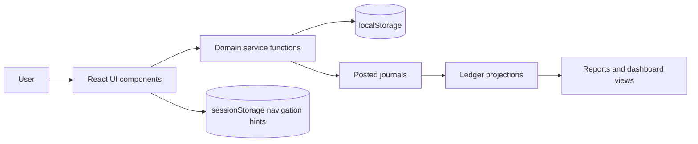
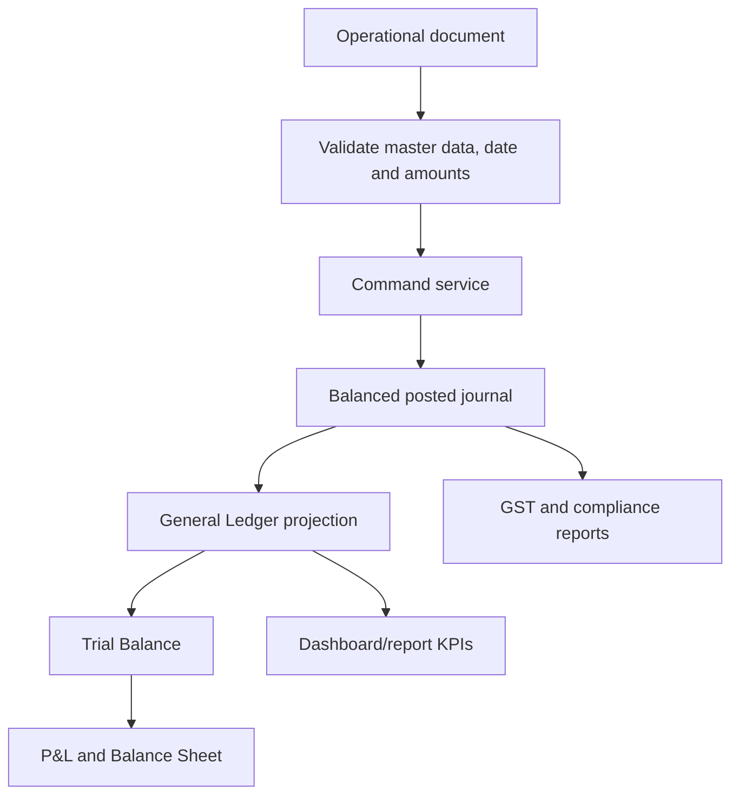

# Technical Architecture

**Last verified:** 2026-09-22  
**Primary sources:** `package.json`, `vite.config.mjs`, `Dockerfile`, `docker-compose.yml`, `src/App.jsx`, `src/main.jsx`, service modules under `src/`.

## Current runtime

- React 19.2 single-page application.
- Vite 6.4 development/build runtime.
- Tabler React icons and Recharts.
- ES modules; no TypeScript and no external state framework.
- Browser-local persistence through `localStorage` and transient navigation hints through `sessionStorage`.
- `src/crypto-uuid.js` polyfills `crypto.randomUUID` for HTTP VM hosts, where the method is absent outside a secure context.
- Sites-compatible build preparation through `scripts/prepare-sites-build.mjs` and `worker/index.js`.

In prose: `App.jsx` owns top-level navigation and renders feature components. Feature components call pure or copy-on-command domain functions. Updated aggregate state is written to browser storage. Journals are the accounting source for ledger and reporting projections. Session storage passes a selected account or document between screens.

## Application composition

- `src/main.jsx` mounts the app.
- `src/App.jsx` contains the shell, active-page state, header, navigation routing, shared toast behavior, and the desktop sidebar collapse preference (`localStorage['finance-erp-nav-collapsed']`, published as the `navCollapsed` class on `.app` and on `document.body` and rendered by `src/navigation.css` inside `@media(min-width:701px)`).
- `src/Navigation.jsx` defines the sidebar information architecture.
- Feature components own their interaction state and use domain services where available.
- CSS is split by feature plus shared `styles.css`, `typography.css`, `ui-system.css`, and navigation/header styles.

## Domain boundaries

| Boundary | Main source |
|---|---|
| Accounting state and invoice posting | `invoice-engine.js` |
| GST line calculation | `invoice-tax.js` |
| Chart of Accounts commands | `account-master.js`, `account-settings.js`, `account-store.js` |
| Sales-order persistence/conversion | `sales-order-service.js` |
| Credit-note rules | `credit-note-service.js` |
| Receipt commands/reconciliation | `receipt-engine.js` |
| Day Book projections | `daybook-service.js`, `daybook-export.js` |
| Print templates | `document-templates.js`, `DocumentPreview.jsx` |
| Period locking | `period-locking.js`, `PeriodClosing.jsx` — partial |
| Organisation and branch scope | `organisation-scope.js` (single implementation, re-exported by `period-locking.js`); interactive control `OrganisationBranchScope.jsx`; available working context `organisation-context.js` |

## Accounting data flow

In prose: a document command validates input and account mappings, calculates integer-paise totals, and creates an idempotent balanced journal. Ledger and financial reports aggregate journal lines. The production target adds period validation before any command that saves, posts, reverses, allocates, imports, or adjusts dated financial activity.

## Production target

Use a modular monolith initially: React frontend, authenticated API, relational database, transaction-scoped command handlers, an immutable journal subsystem, audit outbox, and read-optimized reporting views. Preserve current domain command names conceptually, but do not expose browser state shapes directly as public APIs.

Recommended API pattern:

- Commands: `POST /companies/{companyId}/invoices/{id}/post`, `/credit-notes/{id}/issue`, `/receipts/{id}/post`, `/periods/{id}/lock`.
- Queries: `GET /general-ledger`, `/trial-balance`, `/day-book`, `/periods` with company, branch, financial-year, date, and status filters.
- Concurrency: entity revision/ETag required for edits and lifecycle transitions.
- Idempotency: command-level idempotency key for posting, payment, allocation, reversal, and imports.

## Hosting

`npm run build` builds the Vite client and prepares Sites artifacts. Preserve `.openai/hosting.json`, `worker/index.js`, `scripts/prepare-sites-build.mjs`, and `tests/sites-worker.test.mjs`. The current output is a static prototype; production hosting requires API configuration, secrets management, observability, and deployment migrations.

A VM can run the same static client through Docker Compose. `Dockerfile` is a two-stage image: Node 22 Alpine runs `npm ci` and `npm run build`, then nginx 1.27 Alpine serves `dist/client` on container port 80. `docker-compose.yml` publishes host port 4002 by default (`WAYVIDA_PORT` overrides it) and restarts unless stopped. `docker/nginx.conf` uses `try_files` for the SPA shell, 404s missing `/assets/` files so hashed JS is never replaced by HTML, and returns 404 for `/api/` so missing write/API requests are not rewritten into `index.html`. Vite `server` and `preview` set `allowedHosts: true` so a VM hostname is not blocked. This container is not a production accounting backend and does not persist company data; browser `localStorage` remains the prototype store. Keep this path beside Sites, never instead of it.

