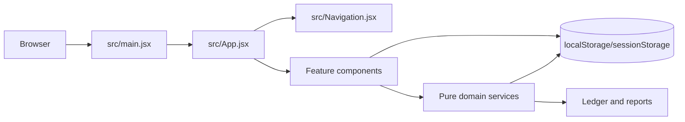
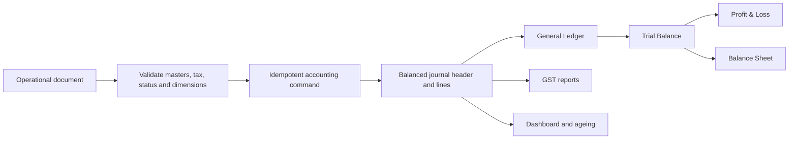
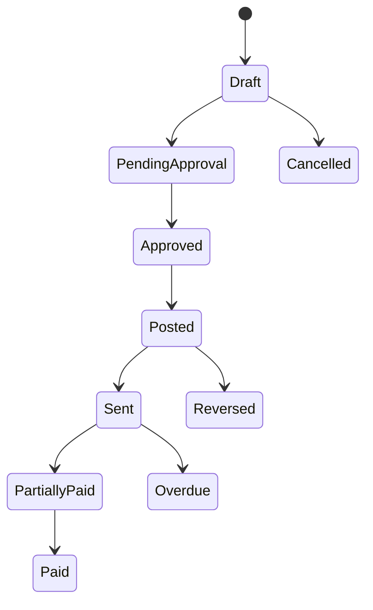
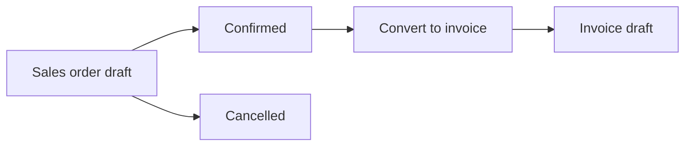
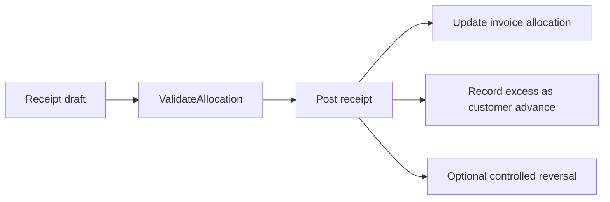
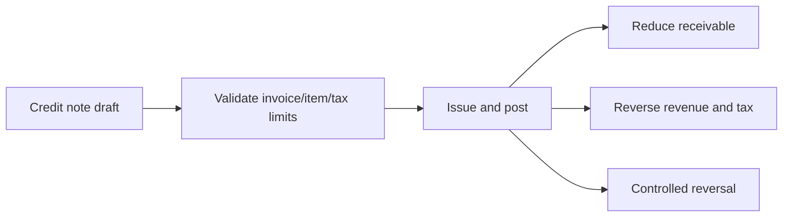
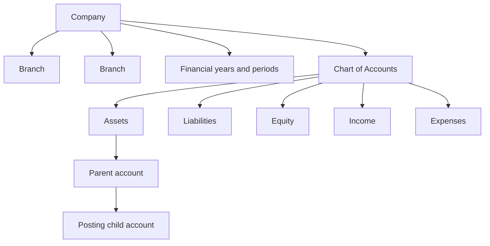
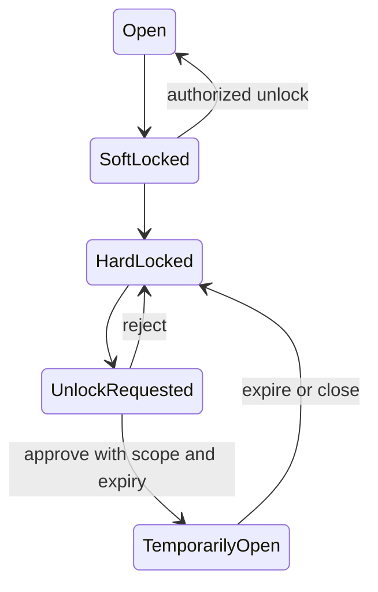

# Wayvida Books — Engineering and Product Handbook

**Last verified:** 2026-09-15  
**Source references:** `src/`, `tests/`, `package.json`, `vite.config.mjs`, `AGENTS.md`, and the root accounting specifications.

This standalone handbook gives an engineer or AI coding assistant enough context to locate the application, run it, understand its accounting rules, and make a safe change without earlier conversation history. Source code and tests override this handbook if they disagree.

## Terminology layer checkpoint

Wayvida Books has one accounting engine with two display vocabularies. The header account menu switches it (**Business owner** as Admin, **Head of Accountant** as Staff); no `View As:` control remains in the header action row. `src/terminology.jsx` owns the mapping and provider; `src/main.jsx` mounts it; navigation and Chart of Accounts consume it. Business Owner terminology includes Money Categories, Adjustments, Account History, Financial Lock, What You Own, What You Owe, Owner Investment, Money Earned, and Money Spent. Accountant terminology retains the standard accounting labels. This layer must never change route identifiers, persisted accounting types, journal logic, ledger/report calculations, or permissions. Preference is browser-local under `wayvida-terminology-view`, with `wayvida-coa-view` retained for compatibility; it is not server-side per-user persistence.

Chart of Accounts Account Details now displays the actual saved organisation and branch scope. New accounts persist every organisation selected in the working context, retaining the first `organizationId` only as a compatibility field. An organisation-wide account displays `All branches (X)` and a native expandable list grouped by organisation. A branch-specific account displays the saved applicable branches grouped by organisation. Legacy accounts carrying the placeholder `default` organisation use the active multi-organisation header context for display only; this does not mutate the account or change posting eligibility. The list grid’s third column is Account Group only. It renders the resolved account group: saved non-type groups win, while type-equal legacy/seed groups resolve through account nature into operational groups. Account Type and raw account nature are not displayed in this cell, and the resolved group uses normal table-cell weight rather than bold. Sources: `src/AccountWorkspace.jsx`, `src/HeaderOrgSelectors.jsx`, `src/account-master.js`, `tests/account-ui.test.mjs`.

The Reports area includes a centralized Audit Log prototype. A persistence-boundary observer records future create, update, status-change, remove, and configuration events across tracked ERP browser stores, while retaining each module's specialized audit arrays. The searchable register includes local date/time, module, record, actor, company/branch context, changed fields, and CSV export. It stores the newest 5,000 events in `wayvida-global-audit-v1`; it does not backfill older activity and browser storage is not tamper-proof. Sources: `src/audit-log.js`, `src/AuditLog.jsx`, `tests/audit-log.test.mjs`.

The final cross-module visual compatibility layer is `src/ui-quality-polish.css`. It standardizes interaction states, form sizing, table density, status presentation, responsive toolbar/form behavior, modal constraints, empty states, reduced motion, and dashboard portal offsets without changing page structure or application behavior. Source contracts are in `tests/ui-quality.test.mjs`.

## Vendor Master checkpoint

Vendor Master is an implemented browser prototype under Purchases. Users can search, filter, create, edit, deactivate, and inspect vendor profiles. Create and edit use a dedicated in-workspace page, preserving the dashboard shell and using a standard Back to Vendors action, contained form card, and sticky save controls instead of a modal overlay. The guided form covers identity, contacts, addresses, GST/TDS, payment and bank details, migration opening balance, document names and notes. Accountant/Admin accounting controls are progressively disclosed. Every vendor links to the shared Accounts Payable control account as a sub-ledger; no separate Chart of Accounts account is created. Purchase Bill posting and vendor-payment integration are implemented in the browser prototype; real file storage, authenticated permissions, and a transactional production backend remain planned. Sources: `src/Vendors.jsx`, `src/vendor-store.js`, `src/vendors.css`.

## Purchase workflow checkpoint

Purchases contains Vendor Master, Purchase Orders, Goods Receipts, Purchase Bills, Debit Notes, Vendor Payments, and Purchase Reports. The operational sequence is Open PO → record one or more quantity-controlled Goods Receipts → create one or more bills from received/unbilled quantities. PO and Goods Receipt remain non-posting. Bill posting validates the period and creates a balanced purchase/Input GST/Accounts Payable journal. Debit Notes support item- and account-based adjustments with a Draft → Pending Approval → Approved → Posted → Adjusted workflow: only Post creates the balanced AP/purchase/input-tax reversal, while Adjusted records bill allocation without a second journal. Cancel is for unposted records; Reverse preserves history through an equal/opposite journal. The header Quick Create menu is searchable, opens with Ctrl+K, prioritizes the current module, and filters its action registry for simulated Admin, Accountant and Sales Executive roles. It routes into existing controlled workflows and never posts automatically. Sources: `src/Purchases.jsx`, `src/DebitNotes.jsx`, `src/purchase-service.js`, `src/QuickCreateMenu.jsx`, `src/quick-create.js`.

Debit Note creation can start directly without an eligible bill. Vendor, date, reason and positive lines are required; a posted Purchase Bill is optional and, when selected, supplies the vendor and enforces bill balance constraints. Apply Credit on a Sales Credit Note opens the allocation workspace with a safe same-customer invoice amount prefilled, while retaining user confirmation and all service-level controls. Targeted verification for this checkpoint passed 27 tests. Sources: `src/DebitNotes.jsx`, `src/CreditNotes.jsx`, `src/purchase-service.js`, `src/credit-note-service.js`.

Normal Sales Return and Price Adjustment credits derive their GST component rates from the original invoice line. User-interface or legacy values cannot increase CGST, SGST, IGST or Cess beyond the source treatment; tax-rate editing remains available only for the dedicated Tax Adjustment workflow.

Invoice Details uses a centered document layout with no fixed amount sidebar. Overview derives five sections from the existing invoice, journal, payment, receipt, credit-note and attachment records: invoice information, amount summary, accounting summary, payment summary and related documents. Detailed entries remain in Accounting and audit events have a dedicated Activity tab. Sales Credit Notes use centrally configured Sales Adjustment, GST Adjustment and Accounts Receivable mappings; incomplete mapping blocks posting atomically and provides a direct Account Mapping action. Sources: `src/InvoiceWorkspace.jsx`, `src/invoice-detail.css`, `src/CreditNotes.jsx`, `src/credit-note-service.js`.

For legacy browser data, posting additively repairs reserved system masters for Purchase (5000), Accounts Payable (2000), Bank (1010), Accounts Receivable (1100), Sales (4000), Service Income (4100), GST Payable (2100), and Rounding Adjustment (5900). User-selected custom account codes remain subject to normal validation.

Checkpoint verification on 2026-09-07: **86 tests passed, 0 failed**; knowledge validation and the Vite production build passed, and the responsive Goods Receipts workspace was inspected in the live preview.

## Create Journal Entry redesign checkpoint

The manual journal create page in `src/JournalEntriesPro.jsx` is now a compact task-oriented workflow. Above the lines it shows only Date, Journal type, optional Reference, and the context Organisation and Branch; the generated journal number is hidden while creating and displayed only when editing an existing record. The line grid contains Account, Debit, Credit, Description and the row action — organisation and branch are no longer chosen per line, though `emptyLine()` still stamps `organization`, `branch` and `costCentre` from the working context so the posting engine's branch validation is unchanged.

the grid footer right-aligns Total Debit and Total Credit under the Journal lines section and reports a Balanced/Difference status.

Two presentation-only modules were added. `src/journal-templates.js` holds four built-in templates (Monthly Rent, Salary Entry, Depreciation, Bank Transfer), user template storage, account recents/favourites and the pre-posting checklist. `src/JournalAccountPicker.jsx` is a searchable account combobox showing name, code and type with keyboard navigation, recents and favourites. They use `wayvida-journal-templates-v1` and `wayvida-journal-account-prefs-v1`, never the journal or ledger stores. Templates resolve an account by preferred code, then by name, and otherwise leave it blank so the accountant must choose rather than post to a guessed account. Recurrence is recorded on the template only; nothing posts automatically. Styling lives in the redesign section appended to `src/journal-form.css`. Sources: `src/JournalEntriesPro.jsx`, `src/journal-templates.js`, `src/JournalAccountPicker.jsx`, `tests/journal-templates.test.mjs`, `tests/journal-create-ui.test.mjs`.


Follow-up refinement (2026-09-12): the two read-only Organisation and Branch boxes became a single **Posting To** card with an in-place `Change` selector that reuses the working-context keys and events and re-stamps the inherited organisation and branch on every line, so the header stays the single source of truth. The five posting-condition badges were replaced by one balance status line (`Journal is balanced` or `Difference: <amount>`) while `postingChecks()` and `validate()` still gate posting. Additional details keep the mandatory reason and attachments and now also show read-only approval comments from the audit trail; a separate persisted Notes field was intentionally not added because it would extend the stored journal record, which the project invariant forbids.

Layout refinement (2026-09-12, third pass): Date, Journal type, Reference number and Reason now share one metadata row, with Reason a plain single-line input bound to `narration` and the generated-number hint removed. Organisation and branch are editable per line between the Account and Debit columns, storing the same names `emptyLine()` stamped and `postToLedger()` reads, while the Posting To card remains the default for new lines. Additional details hold one Attach files button instead of an attachment showcase, and the page shows exactly four posting conditions: debit equals credit, date is valid, period is open and accounts are active.
Posting-context and lock-state refinement (2026-09-12, fourth pass): the Posting To card is gone. Organisation and branch are edited on each line, so the card, its Change popover, the `applyPostingContext` handler, the `postingRef`, the `draftCompany`/`draftBranch` state and the `.je-posting-*` rules were removed, and the `je-lock-alert` banner was replaced by an inline lock hint inside the date field with a small unlock action (`je-date-locked`, `je-inline-action`). No accounting logic, storage key or record field changed.
Indicator and attachment refinement (2026-09-12, fifth pass): the date/period/account check chips are gone, so `Debit equals credit` (or `Difference: <amount>`) is the only posting indicator on the page; the four conditions remain inside `postingChecks()` and the status tooltip explains only the blocking check. The lock hint in the date field now renders only for a genuinely locked period - open dates show `Accounting period: <name>` with no error. The single Attach files button and its chips sit in the tools row beside `Add Journal Line`, and Additional details holds approval comments only, appearing only when the journal has them.
Totals and attachment alignment refinement (2026-09-14, sixth pass): the balance status now renders inside the same right-aligned block as Total Debit and Total Credit, directly beneath those amounts, so the posting condition reads as part of the figures it describes instead of as a detached row. The Attach files button and its PDF, images, Word or Excel files hint moved to the left edge of the tools row so they line up with the first column of the lines grid above, with the button leading the hint, and Add Journal Line now matches Use Template as a solid-border control of the same height, radius and label weight. No calculation, validation, storage key, record field or posting rule changed.

Footer single-row refinement (2026-09-14, seventh pass): the tools row and the balance block merged into one footer row under the grid. Attach files, its file-type hint and the chips keep the left edge of the lines grid, Remove empty lines follows them, and Total Debit / Total Credit with the balance status close the row on the right, which frees roughly 54px for the scrolling lines grid. `je-lines-tools` no longer exists; the row class is `je-lines-footer`.

Posting-gate and footer cleanup refinement (2026-09-14, eighth pass): Post journal on the Create Journal Entry page no longer waits for an approved status. The gate is now the posted values alone - balanced totals inside an open accounting period - because the old approval clause is what left the button disabled on a correctly balanced draft. The balance status (`Debit equals credit` / `Difference: <amount>`) stacks on its own line beneath the Total Debit and Total Credit amounts in the same right-aligned footer block. The Cancel button, the `Approve this journal before posting.` hint and the three-dot More actions disclosure (Submit for approval, Duplicate Journal, Reverse Journal) are gone from this page; the `.je-post-hint` and `.je-more-actions` rules were deleted with them. Approval is now entered from the journal detail screen, where a Draft, non-automatic journal offers `Submit for approval` before the existing Approve and Post actions. Duplicate and Reverse entry remain on register rows and on the detail screen. No calculation, validation amount check, storage key, record field or ledger contract changed.

Journal line column refinement (2026-09-14, ninth pass): the Organisation and Branch columns of the Journal lines grid now appear only while the working context makes that choice ambiguous. One accessible organisation hides the Organisation column, and a single branch under it hides Branch too, so the grid renders five columns and posts implicitly to that organisation and branch; one organisation with several branches keeps only the Branch dropdown; several organisations keep both, and the Branch dropdown then lists only the branches of the selected organisation. A line's branch is reset whenever its organisation changes or no longer exists in the working context, and the implicit choice is reported once in the Journal lines subtitle instead of adding a second selector. No calculation, validation rule, storage key, record field or ledger contract changed.

## Journal Entries checkpoint

Journal Entries is a manual-journal workspace only. System-generated accounting entries stay available through the General Ledger, account ledger, and reports, not this register. The header states that daily business transactions are recorded automatically and positions manual journals for corrections, adjustments, and account transfers. The Business Owner view presents internal journal types as plain-language entry purposes; the Accountant view presents General, Adjustment, Transfer, Opening Balance, and Correction journal types. Reversal is never selected on the creation form: it is created only from a posted journal through **Reverse entry**. The controlled lifecycle, balanced debit/credit checks, supporting documents, ledger links, and audit trail remain unchanged. Source: `src/JournalEntriesPro.jsx`.

## 1. Status language

| Label | Meaning |
|---|---|
| Implemented | Present in source and exercised by code or tests. |
| Prototype only | Interactive browser implementation without production persistence or controls. |
| Partially implemented | Code exists but routing, integration, styling, validation, or tests remain incomplete. |
| Planned | Intended production design, not current behavior. |

The application as a whole is **Prototype only**. Period Closing is an **Implemented prototype** with browser-local controls; authoritative server enforcement remains planned. A secure multi-user backend, authoritative database, statutory integrations, and production operations are **Planned**.

## 2. Product intent

Wayvida Books is an Indian accounting ERP prototype for owners, finance teams, accountants, sales users, approvers, and auditors. A non-accountant should create operational documents while master-data mappings and the accounting engine generate balanced entries automatically. The company is the root entity; branches are accounting dimensions beneath it.

Core principles:

- Operational documents—not manual journals—drive normal accounting.
- Every successful posting creates a balanced, traceable journal.
- Posted history is immutable and corrected by reversal or adjustment.
- Customer, item, tax, company, and branch masters supply accounting dependencies.
- Sales orders do not post accounting. They may create an invoice draft.
- Reports are derived from posted journal lines rather than independently edited totals.
- The UI hides debit/credit mechanics from ordinary operational users.

## 3. Runtime and code map

The frontend uses React 19, Vite 6, JavaScript ES modules, Tabler icons, and Recharts. The boot chain is `index.html` → `src/main.jsx` → `src/App.jsx`. `src/Navigation.jsx` defines the sidebar; `src/styles.css` and feature CSS files define presentation. Navigation is selected inside the application rather than through React Router.



In prose: the browser mounts the root React application. `App.jsx` selects a feature screen and supplies shared navigation/notification behavior. Feature components call domain modules such as `invoice-engine.js`, `receipt.js`, and `credit-note.js`, then persist prototype state in browser storage. Ledger and report screens read the same accounting state.

Run from the repository root:

```text
npm install
npm run dev
npm run build
npm run preview
node --test tests/*.test.mjs
docker compose up --build -d
```

Install from the npm `package-lock.json`. Do not restore `tmp/` scratch scripts, browser profiles, page-screenshot archives, `design-qa.md`, `vite.sandbox.config.mjs`, or a second pnpm lockfile; those are not part of the product. `npm run dev` and `npm run preview` listen on port 4001 with `strictPort` (`vite.config.mjs`). `npm run build` runs Vite and `scripts/prepare-sites-build.mjs`. Preserve `.openai/hosting.json`, `worker/index.js`, `scripts/prepare-sites-build.mjs`, and `tests/sites-worker.test.mjs` when changing hosting behavior. On a VM, `docker compose up --build -d` (or `npm run docker:up`) serves the built client from nginx on port 4001 (`WAYVIDA_PORT` overrides it). That container is static prototype hosting only and does not replace Sites or add a production database.

## 4. Module inventory

| Module | Main source | Status | Key behavior |
|---|---|---|---|
| Dashboard | `src/App.jsx` | Prototype only | Financial KPI and chart presentation. |
| Chart of Accounts | `src/AccountWorkspace.jsx` | Prototype only | Hierarchical account master, toolbar type/status filters, advanced filter popover, form, details opened as a right-side popup, actions, and the shared horizontal three-dot row menu. |
| Journal Entries | `src/JournalEntriesPro.jsx` | Prototype only | Generated journal review plus simulated manual workflow. Register row actions use the canonical horizontal three-dot menu shared with Period Closing. |
| General Ledger | `src/GeneralLedgerPro.jsx` | Prototype only | Posted-journal projection with movements and a seven-column register. Description is disclosed on Date/Voucher hover and in View details alongside dimensions, reconciliation, journal/source traceability, and document output. Seeded rows appear only when no posted journal state exists. |
| Transaction Register | `src/TransactionRegister.jsx` | Implemented prototype | Central read-only projection of sales, purchases, receipts, payments, adjustments, expenses and journals. Business lifecycle status and accounting status are separate; filters and a details drawer expose source, journal and ledger traceability. |
| Trial Balance | `src/App.jsx` | Prototype only | Debit/credit summary derived from journal state. |
| Day Book | `src/DayBook.jsx`, `src/daybook.js` | Prototype only | Chronological, read-only accounting journal view. |
| Period Closing | `src/PeriodClosing.jsx`, `src/period-locking.js`, `src/period-closing.css` | Implemented prototype | Lean single-purpose close-books screen whose body is the locked-periods register. The heading carries the title with a journal-style subheading beneath it and no locking policy tag, and the page actions are one right-aligned group - the Before you close attention pill (one computed tone, never dismissible, no close action of its own) then one More actions menu (Current accounting period, Period closing settings) beside one Create Lock / Close button; the filtered register is the only lock list, because the lock history drawer and its menu entry were removed, and the Requests half is table-only: every row carries one View button and one 3-dot menu (Approve, Cancel, View Details, Delete), a Status column (`Requested` while pending, then `Approved`, `Cancelled` or `Rejected`) beside a combined Organisation & Branch column, no reject option and every filtered request on one page, and the action cell never restates the approver. The Before you close attention pill opens a read-only popover listing the failing checks and ends with Review all, which opens the pre-close review drawer. The register toggle is the left-hand element of the panel header - the panel no longer prints a Locked periods / Every lock for the organisation sentence - and switches between Locked Periods and Requests. What the lock list may show follows the locking mode: automatic locking lists only locks whose period has already ended, manual locking lists only the locks created here, and locking off hides nothing. The toolbar filters by search, Period, Status and a Filters disclosure for financial year, organisation, branch, Closed By and Closed Type. Closing runs five professional checks before an OPEN to CLOSED transition with recorded closer, date and audit event; unlock approval reopens a period as Reopened. The unlock `Requests` half is one seven-column, pageless table (Period, a combined Organisation & Branch cell, Reason, Requested, Requested By, Status and Actions) whose Status cell carries the page `pc-badge` and whose Actions cell holds one read-only `View` button and a 3-dot menu (`Approve`, `Cancel`, `View Details`, `Delete`). Browser roles are simulations; backend command enforcement is planned. |
| Items | `src/Items.jsx` | Prototype only | Goods/services, units, image, pricing, account mappings, and default GST/Cess with inclusive/exclusive price treatment; no vendor field. |
| Customers | `src/Customers.jsx` | Prototype only | Identity, tax/contact data, terms and receivable mapping. |
| Sales Orders | `src/SalesOrders.jsx`, `src/sales-order-service.js` | Prototype only | Quotes commercial intent; conversion creates invoice draft; no journal. The register uses semantic status badges and consistent Edit, Preview, and overflow actions. |
| Invoices | `src/InvoiceWorkspace.jsx`, `src/invoice-engine.js` | Prototype only | GST calculation and automatic posting. |
| Credit Notes | `src/CreditNotes.jsx`, `src/credit-note.js` | Prototype only | Controlled invoice reduction and accounting reversal. |
| Receipts | `src/Receipts.jsx`, `src/receipts.css`, `src/receipt.js` | Prototype only | Payment receipt, allocation, advances, reversal simulation, and vertical row actions without nested scrolling. The screen defaults to the signed-in prototype Admin role; posting remains restricted to Approved receipts and Finance Manager/Admin permission. |
| Document previews | `src/DocumentPreview.jsx`, `src/document-preview.css`, `src/document-preview-fix.css`, `src/document-templates.js` | Prototype only | Isolated embedded preview, compact print/share/customize/close toolbar, customer document and on-demand template drawer. |
| Company Setup | `src/CompanySetup.jsx` | Prototype only | Progressive onboarding and browser bootstrap records. |
| Budget Management | professional budgeting with lifecycle, scopes, types, allocations, revisions, reports and settings | Prototype only | Planning and analysis layer only; reads posted journals, never posts or changes Chart of Accounts. Budgets is one flat destination inside the Accounting section, between Journal Entries and Period Closing, and the sidebar leaf is the only budget navigation (no page-level tab row); the separate Budget Reports and Budget Settings pages are deleted, so the register, the create wizard and the plan detail tabs are the whole module. Its Budgets register lists Budget Name, Financial Year, Budget Period and Actions, with the search box, the financial year select and one Filters disclosure in a toolbar row above the grid, and every row offering View Details beside a right-aligned 3-dot Edit / Duplicate / Delete menu. The page shows no status card row, so its heading leads straight into that register card. Create Budget is a three-step page opened by a full-bleed arrow-led page header that spans the same width as the working-context organisation bar above it, over a numbered progress stepper whose `Step n of 3` chip sits in the stepper card, whose connectors report their own progress (blue behind a finished step, half-filled behind the current one, neutral grey ahead) and which never truncates a step name: details as one three-column field grid whose first row carries the budget name beside the shared multi-select organisation and branch scope control and whose second row carries the financial year and budget period over a budget duration derived from the two (editable dates only for a `Custom` period, which is also the only period that can be rejected), no description field, a template switch (no budget-type field), a `scopeSummary` chip in its head as the step's only statement of the plan width, and a static right-aligned footer that groups `Cancel` / `Back` immediately left of its one primary action, one checkbox table of every active posting account in the Chart of Accounts under its accounting type - Assets, Liabilities, Equity, Income or Expenses - with each type row a spanning `th` holding a folding `button.budgetGroupCell` that names the group to assistive tech and carries its count, and each row printing the account code beneath its name in a `label` bound to that row's checkbox, reached past a search box, an account-type filter, Select all and Clear all, then the allocation grid, whose accounts sit under Profit & Loss (Income, Expenses) and Balance Sheet (Assets, Liabilities, Equity) bands with one sticky account column and foldable type rows and whose shortcut row adds a Growth % input, an Import Budget CSV button and Clear All, and which closes with a Budget totals section in the same period columns plus a row total - Total Revenue, Total Expenses, Net Profit / Loss, Profit Margin, Total Assets, Total Liabilities, Total Equity and Total Liabilities & Equity, every line computed by the shared storage-free `src/budget-statements.js` layer from the allocation cells and none of it stored - followed by a Budget balance check that reads Total Assets against Total Liabilities + Equity and prints the Balance Difference with one sentence, reported and never posted - and the page saves with Create Budget; the approval lifecycle runs from the budget detail screen. The details step uses one three-column field grid (the budget name takes the first column beside the organisation and branch scope row, and the financial year, the budget period and the read-only duration take one each on the second row) and takes its organisation and branch scope from the accessible universe `getScopeOrganisations()` rather than the narrowed working context, opening seeded on the header's current context and re-reading the universe when it changes, so the multi-select always has something to choose and can never render an empty scope row. | Its budget detail screen is a statement view over the same plan, built on the storage-free `src/budget-statements.js` layer: the tab row is one flat single-row `BUDGET_DETAIL_TABS` list - Overview, Profit & Loss, Balance Sheet, Cash Flow, Budget vs Actual, Accounts, Activity History and Revisions - and the default `Overview` tab carries the KPI cards, the budget health bars and the alert list. `budgetStatementRows` groups the planned accounts under their chart of accounts group inside each accounting type and closes every group, every type and the statement with its own total row, the balance sheet ending on a `kind:'check'` Balance Difference row that is reported and never stored or posted; Budget vs Actual and the Accounts tab read `computeVarianceRows` (Variance as actual less planned) with a separate Achievement % column and a favourable/unfavourable/neutral tone from `varianceDirection(type,variance)` that inverts for expenses; Activity History and Revisions list the logged events and the stored versions; The detail page head is the Create Budget arrow-led back head reused at full width, sitting beneath the organisation and branch bar (`budgetHeadBack` with the `Budget Details` title), the budget name sits beside its lifecycle status badge above the metadata line, and the right side carries one primary status action beside a More actions menu holding Edit, Duplicate, Export, Archive and Delete. The register kebab offers `View budget` first. |

See [MODULES.md](MODULES.md) for screen-level behavior and dependencies.

## 5. Accounting architecture



In prose: posting validates the document and mapped masters, calculates taxes, creates one balanced journal, and stores it atomically with document status. Ledger, Trial Balance, financial statements, tax reports, ageing, and dashboard metrics must read posted accounting facts. The current prototype approximates this in browser memory/storage; a production system must enforce it transactionally on the server.

Accounting invariants:

1. Store accounting money as integer paise; format rupees only at UI boundaries.
2. Journal debit total must equal credit total.
3. Posting is idempotent and must not duplicate a journal.
4. Mapped accounts must exist, be active, and permit the requested posting.
5. Required branch/cost-centre dimensions must be present.
6. Posted entries cannot be destructively edited or deleted.
7. A reversal is a new equal-and-opposite journal with links to the original.
8. Sales orders never post accounting.
9. Reports use posted journals as their source of truth.

Typical taxable invoice:

| Account | Debit | Credit |
|---|---:|---:|
| Accounts Receivable | ₹118,000 | — |
| Service Revenue | — | ₹100,000 |
| Output GST Payable | — | ₹18,000 |

Typical receipt allocated to that invoice:

| Account | Debit | Credit |
|---|---:|---:|
| Bank | ₹118,000 | — |
| Accounts Receivable | — | ₹118,000 |

For an intra-state Indian supply, GST normally splits into CGST and SGST; an inter-state supply normally uses IGST. Cess applies only when configured. Rates and account mappings should come from masters/configuration, not from account names. See [ACCOUNTING-DOMAIN.md](ACCOUNTING-DOMAIN.md) for lifecycle and exception rules.

## 6. Document lifecycles



This is the intended invoice lifecycle. Exact current UI status transitions may differ; verify the relevant source before changing behavior.



Sales-order creation and status changes remain non-accounting. Accounting begins only when the resulting invoice posts.





## 7. Company, branch and account hierarchy



In prose: all future customers, suppliers, items, accounts, documents, journals, ledgers, and reports belong to a company. A branch belongs to that company and is carried as an accounting dimension. The Chart of Accounts uses the five fundamental types and prevents circular hierarchy. Accounts with posted history are deactivated rather than deleted.

Organisation and branch scope is one shared rule with one implementation, `src/organisation-scope.js` (pure data: no React, no storage). `getScopeVisibility({organisations,organisationIds|companyIds,branchIds,label})` (alias `scopeVisibility`) decides whether an Organisation selector (`orgCount > 1`) and a Branch selector (`orgCount > 1 || anySelectedOrgHasMultipleBranches`) are rendered, resolves each row's branch, and builds the read-only `Locking for: Organisation · Branch|All branches` context line; `getBranchesForOrganisation(reference,organisations)` is the only branch lookup, so a branch can never be offered outside the organisation that owns it. `organisationBranches`, `selectedOrganisations`, `normaliseScope` (auto-fill a single branch, clear a foreign one), `validateScope` / `assertValidScope` (`OK`, `NO_SCOPE`, `UNKNOWN_ORGANISATION`, `BRANCH_NOT_IN_ORGANISATION`, `BRANCH_REQUIRED`) and `scopeLabel` complete it; `NO_BRANCH` is the em dash for an organisation with no branches. `src/period-locking.js` re-exports these helpers instead of owning a second copy, and the same module drives Chart of Accounts (create, edit, listing, details - the grid gains Organisation/Branch columns only when the flags say so), Create Journal Entry -> Journal Lines, Period Locking settings and Create Lock. The interactive control is `src/OrganisationBranchScope.jsx`, rendering the pure `scopePickerState(...)` state so the Journal Lines, Create Lock and request unlock surfaces cannot drift; the available organisation list comes from `src/organisation-context.js` (`getAccessibleOrganizations()`), which Create Journal Entry and Period Closing both import. That module owns two lists behind one `scopedOrganisations(...)` derivation: `getAccessibleOrganizations()` is the narrowed working context (storage keys `wayvida-context-companies` / `wayvida-context-branches`), and `getScopeOrganisations()` is the universe a deliberate scope is chosen from (storage keys `wayvida-accessible-organizations` / `wayvida-accessible-branches`, falling back to the whole demo list so it is never empty) - the same list the header Change / Customize drawer reads. Create Budget plans over `getScopeOrganisations()` so a narrowed working context cannot leave its control empty; Journal Lines and Period Closing stay on the working context. The Create Lock / Close drawer offers real Organisation and Branch selection over that list (the Branch column appears only when the context has more than one branch, and it defaults to `All branches` so a whole-organisation lock is never silently narrowed); the request unlock drawer states the locked scope instead, because `requestPeriodUnlock` derives a request's scope from the locked period and faking a selectable branch there would print a scope the approval cannot honour. The one deliberate exception: in the Create Account drawer the Organisation multi-select stays visible even for a single organisation, because it is the customisation control itself; only the Branch picker auto-resolves.

## 8. Persistence and proposed production boundary

Banking uses `wayvida-banking-v1` for bank masters, imported statement rows, matches, saved reconciliations, automation configuration, permissions and audit events. Banking Settings contains priority matching, non-posting categorization suggestions, saved CSV column mapping, reconciliation confidence/tolerance controls, a scalable permission list, and a future bank-integration placeholder. Each bank master references one Assets posting account; book balance comes only from posted journals. Matching links without reposting, while categorization creates accounting only through the existing confirmed statement workflow. Native Excel parsing, partial/split matching, live bank feeds and server-enforced permissions remain planned. Sources: `src/Banking.jsx`, `src/BankReconciliation.jsx`, `src/BankingSettings.jsx`, `src/banking-service.js`, `src/banking-settings.css`.

The self-explanatory ERP layer uses `src/page-knowledge.js` as the normalized PageKnowledge and status registry. Entries record module, purpose, actual workflow/statuses, accounting impact, actions, related settings, blockers and related pages. `src/ContextualHelp.jsx` renders lightweight page guidance, a collision-isolated right drawer, workflow stepper, status explanation, accounting-impact card and disabled-action reason tooltip. The standalone Help Center searches the same registry through `src/help-content.js`; Bank Reconciliation is the first page-level integration. This is guidance only and never bypasses service validation.

Current state is stored in browser `localStorage` and a small amount of `sessionStorage`. Important keys include `wayvida-accounting-v1`, `wayvida-accounts-v2`, `wayvida-customers`, `finance-erp-items`, `wayvida-sales-orders`, company/branch selections, navigation theme, document-template preferences, and `wayvida-period-control-v1`. Inspect owners in [project-manifest.json](project-manifest.json); never assume these structures are stable database schemas.

Production should replace direct browser writes with authenticated APIs and transactional tables for companies, branches, users/roles, periods, accounts, parties, items, tax codes, documents/lines, allocations, journal headers/lines, reversals, approval events, audit events, numbering sequences, and template preferences. Use immutable identifiers; scope every row by company and relevant branch; add optimistic concurrency or version checks; and commit document status plus journal atomically.

## 9. Period locking



In prose: an open period permits normal posting. A soft lock may allow a controlled finance exception. A hard lock blocks posting until a separate authorized approval opens a narrowly scoped, time-limited exception. Every request, decision, post, re-lock, and reversal must be audited. The current files only model local UI state and do not yet guard invoice, receipt, credit-note, or journal commands.

An unlock request records the whole locked period or a date range that must sit completely inside it, and an approved date-range window releases only the dates it names, so other dates in the same period stay blocked and overlapping locks remain independently enforceable. A pending request can be cancelled by its requester or an approver, and a decided or expired request cannot. Expiry re-locks automatically, is attributed to the explicit `System` actor and writes both `Unlock expired` and `Period reclosed` while preserving the request history. Policy changes are audited, apply from the next unclosed period and never rewrite an existing lock. Enforcement fails closed when the lock state cannot be resolved, and every locking audit record carries actor, timestamp, action, organisation, branch, before/after values, reason and the related lock or request id.

The Period Closing screen is a lean, single-purpose page whose body is the locked-periods register. The heading carries the `Period Closing` title with a one-line journal-style subheading beneath it ("Lock accounting periods and control when postings stop.") and no read-only locking policy tag, and the page actions are one right-aligned `More actions` menu holding Current accounting period and Period closing settings, beside one separate `Create Lock / Close` button. `Before you close` is a compact attention pill (`details.pc-attention-pop` > `summary.pc-attention-pill`) in the heading action group instead of a menu entry: an amber warning icon plus the count as text (`3 checks`, never a badge), one computed tone (neutral grey for one or two soft checks, 5% amber for three or more, red when a check blocks the close), no trailing chevron and never the primary blue. Clicking it opens a read-only popover headed `Before you close` with `<n> checks need attention · <m> entries affected`, listing only the failing checks with their links and ending in `Review all`, which opens the pre-close review drawer; the pill is never dismissible, zero checks hides it, `All checks passed` is printed inside the popover only, and no close action lives in the popover because there is exactly one place to act and one place to look. The page subtitle, the composite period/status/scope line, the locked-periods status line, the inline missing-periods row and the `Activity History` block are gone, and there is no tab row. The current accounting period opens from the first `More actions` entry as a 520px right-side popup (`pc-current-drawer`) instead of a card on the page: the real `CurrentPeriodPanel` renders as its body - the period, the date range, the organisation and branch scope, a `Status` badge and lock-aware inline actions, `Lock this period`, `Request Unlock`, `Admin override`, an `Unlocked until ...` note and `View details` - with no secondary link row, and the retired `Transactions`, `Audit log` and `Close with review` links stay gone. The card is flattened for the drawer (no icon, full-width copy, the duplicate eyebrow hidden, the period line wrapping instead of truncating), and an unconfigured scope shows the `No current period` empty state rather than crashing. The register toggle is the left-hand element of the panel header - the panel prints no `Locked periods` / `Every lock for ...` heading sentence, and that heading block survives only in the lock history drawer - and switches between `Locked Periods` and `Requests` (the requests half only while unlock approval is on). `lockRegisterRows` decides what the lock list may show: automatic locking keeps only locks whose period has already ended, manual locking keeps only periods whose lock was created here (an audit entry with `Lock period created` or `Period closed`), and locking off hides nothing, while the history drawer still lists every lock. Its toolbar is one compact row (`div.pc-register-bar`): the `Locked Periods` / `Requests` toggle on the left, and on the right a search box, one `Filters` disclosure (`pc-filters-more`). `Period` (listing only the periods the register can actually show) and `Status` now sit inside the `Filters` panel ahead of Financial Year, Organisation, Branch, Closed By and Closed Type, so the visible row consumes as little space as possible and the `advanced` badge counts every filter that is set. The row is a `div` rather than a `<header>` because the legacy global app-bar element rules would restyle the filter labels; for the same reason every drawer and modal close button carries an explicit `display:inline-flex!important`, since `@media(max-width:1050px){header>button:not(.primary):not(.hamb){display:none}}` was hiding them below 1050px. It lists Period, Organisation, Branch, Status, Closed Date, Closed By and Actions; its kebab menu offers `View Requests`, `View Audit Log`, `View Details`, `Request Unlock` and `Close Period`, and the History entry opens a wide drawer listing every lock across organisations and financial years. Missing periods are no longer offered anywhere on the page. `Create Lock / Close` is mode aware: the manual drawer collects a period, a date and an optional reason and locks every module, with a blank reason replaced by the system note `Manual lock created for all modules`, while the automatic drawer renders the saved schedule inputs (Frequency, Effective from, Lock after period end, Lock at, Notify before locking), resolves the next unlocked period through `autoTarget()` and previews it as `Next lock`. Period Locking Settings opens as a right-side popup that leads with one sentence and carries exactly one headingless card holding two toggle switches and the closing schedule: `Enable automatic locking` moves the stored mode only between `Automatic` and `Manual`, and `Require approval to unlock` sits below a `pls-rule` divider in the same card. Each switch row is a real toggle control (`label.pls-switch` with a visually hidden `input[type=checkbox][role=switch]` and an `<i>` track). `lockingMode: 'Off'` cannot be reached from this popup - Settings -> Accounting -> Period control maps `Off` <-> `Manual` on the same value - so a stored `Off` shows the switch disabled at 55% opacity with a note pointing at Accounting settings. The former `Period locking` card, the separate `Unlock approval` card and the collapsed `More policy settings` block are gone: the approval role select and every other unlock control (default and maximum unlock duration, unlock scope, automatic re-lock, daily auto-approval), the frequency boundary fine detail, default scope, allowed roles, exemptions and enforcement coverage keep their engine defaults and are no longer rendered. The popup is tuned for its 620px drawer with 16px/18px card padding, a hover state and toggle track on the switches, one shared 22px gutter (16px below 760px), a sticky heading and footer that carry separation shadows, and a close button restored with `display:inline-flex!important`. The `Before you close` review drawer leads with an entries-affected count and a wrapped row of Sales, Purchases, Expenses, Banking and Journal Entries chips. Closing runs five professional checks before the books close — invoices posted, bills approved, no draft journals, bank reconciliation completed, and tax adjustments completed. Unposted invoices, unapproved bills and draft journals block the close; reconciliation and tax adjustments must be acknowledged as warnings. A successful close records the closing user, the timestamp, the checklist snapshot and a `Period closed` audit event, then blocks dated posting through the existing validator. The unlock `Requests` half of the register is one table of Period, Reason, Requested, Requested By and Actions: the Actions cell holds one read-only `View` button and one 3-dot menu offering `Approve`, `Cancel`, `View Details` and `Delete`, and every filtered request renders in one pass under the same approver rules.

The interface only ever shows four accountant-facing statuses: `Open`, `Closing`, `Closed` and `Reopened`. The richer engine vocabulary (`Closing Review`, `Pending Approval`, `Soft Locked`, `Hard Locked`, `Reclosed`, `Temporary Unlock`, `Pending Unlock Approval`) is translated by `closingStatus()` and must not leak into the interface. The lock type follows the same rule: `Hard Lock` / `Soft Lock` stays engine-internal and is no longer printed by the period details drawer. Unlock requests are raised under one role and decided under another; the engine refuses self-approval, and an approved request reopens the period with an expiry that is automatically reclosed. Period policy (automatic closing, closing frequency, unlock approval, allowed roles) is stored once in `wayvida-period-settings-v1` and is edited from both Period Closing → Settings and Settings → Accounting → Period control. The `Period locking` switch is the one product-wide control: the Settings card maps `Off` ↔ `Manual` on the same stored `lockingMode` while `Automatic period closing` maps `Automatic` ↔ `Manual`, so switching automatic locking off is manual locking, and its Closing frequency and Close after days fields edit the schedule that the scheduler and the closing popup actually read.

## 10. UI system

- Brand: Wayvida Books and supplied logo assets.
- Typeface: Instrument Sans; visible text must never be smaller than 12px.
- Use shared search, select, status, button, table, drawer, modal, and page-header patterns.
- Open detail, help, matching, ledger, operational, and preview-customization drawers from the right, including the Chart of Accounts account details, which opens from the same layer geometry as Create Account instead of a second column beside the grid. Keep nested drawer headers and asides isolated from global shell positioning; centered confirmations remain modal dialogs.
- Use a single clear page title and description; avoid duplicate headings.
- Primary actions are right-aligned and visible; destructive actions require confirmation.
- Icon-only buttons require accessible names and hover/focus tooltips where meaning is not obvious.
- Tables align numeric columns right, preserve headers, and use responsive overflow without overlap. Chart of Accounts keeps its filter row and table head visible while the account list scrolls: the filter toolbar is sticky at the top of the shell scroll port, and the grid wrapper, already a scroll port because the table has a minimum width, is bounded so it becomes the grid's own scroller and the column header row and the account-group row stick inside it.
- Forms use explicit labels, inline validation, logical sections, progressive disclosure, and a standard footer with one primary save action. A form is not required to carry a Cancel button when the header back control already leaves the form without saving, as on the Create Journal Entry page; keep the footer to the save action plus the single primary action there.
- Detail screens use a consistent back arrow, title/status header, summary card, and transactions content.
- Row actions use one horizontal three-dot menu. The Period Closing kebab (`details.pc-kebab` > `summary` holding `IconDots`, plus `.pc-kebab-menu`) is the canonical control, and the Journal Entries register (`.je-row-actions`) and the Chart of Accounts table (`.am-table .am-more`) reproduce it: a 32px square trigger with a `1px solid #d9e1ec` border and a 7px radius, an open state of `border-color:#3478f6;color:#245fd9`, and a right-aligned menu anchored at `top:calc(100% + 6px)` with `min-width:196px`, `padding:6px`, a `1px solid #e1e6ed` border, a 9px radius and `box-shadow:0 12px 30px #1018281f`, whose rows are `min-height:36px` with `gap:9px`, `padding:0 10px`, a 6px radius, `#344054` labels and a `#f4f7ff` / `#245fd9` hover. Menus close when an action runs and on an outside pointer or `Escape`, and the destructive `am-danger` label keeps its red styling.
- Print preview stays inside the ERP shell. Opening Preview shows the default customer document first; Print, Share, and Customize are visible; customization opens only on demand in a right drawer. Printed output excludes application chrome and includes the logo.

See [UI-DESIGN-SYSTEM.md](UI-DESIGN-SYSTEM.md) for tokens and acceptance criteria.

Period Closing drawers are portalled into `document.body`, so each one is wrapped in `<div className="pc pc-portal-scope">` (`.pc.pc-portal-scope{display:contents}`) and declares its own right-side geometry: a block scrim at `z-index:1390`, the drawer at `z-index:1400` with `position:fixed`, `right:0` and `width:min(<n>px,96vw)`, a fixed header and footer, and `pc-drawer-body` as the only scroll container. Widths are 1080px for the wide lock history register, 620px for settings, 560px for lock, override, audit, details and the pre-close review, and 520px for unlock requests. The `More actions` dropdown is anchored inside `.pc-more` within the heading action column and the heading grid collapses to one column below 1000px. Without that wrapper the legacy shell rule `aside{position:fixed;inset:0 auto 0 0;width:206px}` pins a portalled drawer to the 206px navigation rail and the popup renders on top of the sidebar. Card headers and the page heading also reset the legacy fixed top-bar `header` styling, the heading follows the Journal Entries heading grid, and each nesting level owns exactly one gutter so a bordered card is never nested inside another bordered card. The rule for any new drawer in this module: portal it inside the `.pc` scope wrapper and give it explicit geometry rather than relying on inherited shell rules.
The Period Locking Settings drawer is the deliberate exception to the wrapper rule: it keeps the canonical `.pc-history-drawer` shell class but not the `.pc` scope wrapper, so the page base-control rules (`.pc button`, `.pc input`, `.pc select`) cannot reach the panel. `src/period-lock-settings.css` therefore neutralises the legacy global top-bar `header` rule for its own headings with `.pls header{position:static;inset:auto;width:auto;height:auto;min-height:0;max-width:none;z-index:auto;margin:0}`. Without that reset every `.pls-card>header` inherited `position:fixed;height:58px` and the `.pls-card>header` titles stacked on top of each other at the top of the viewport.

## 11. Security and controls

Current role selectors, approval controls, and local status gates are simulations. They do not prove identity or authorization. Browser data is user-editable and unsuitable for authoritative financial records.

Production requirements include server-side authentication and tenant scoping, least-privilege RBAC, maker-checker separation, transactional posting, idempotency keys, tamper-evident audit logs, encrypted transport/storage, secure attachments, sequence control, backups, retention, observability, reconciliation, period enforcement, and regulatory review. Sensitive credentials and customer data must never be added to documentation fixtures.

## 12. Testing and safe change workflow

Automated Node tests cover account master/settings/templates/UI contracts, invoice engine, sales orders, credit notes and their eligibility/allocation/Customer Statement UI, receipts and Banking-statement matching, Day Book, Period Closing, document templates/preview UI, and Sites behavior.

The last recorded run on 2026-09-05 passed 59 of 60 tests. `tests/account-ui.test.mjs` still expects the removed `Money In` simple Chart of Accounts view and therefore fails against the current accounting-only interface. The Vite production build and Sites packaging both passed. Vite reported an approximately 915 kB minified main JavaScript chunk, so production code splitting remains a performance task.

Before modifying a feature:

1. Read `AGENTS.md`, this handbook, the relevant modular document, source, and tests.
2. Classify the requested behavior as current implementation or planned architecture.
3. Preserve accounting invariants and existing storage contracts unless migration is explicitly in scope.
4. Reuse the design system and navigation conventions.
5. Add or update focused tests.
6. Run the full test suite and production build.
7. Inspect the changed UI at desktop and narrow widths; check keyboard access and console errors.
8. Update this knowledge base and `project-manifest.json` if modules, routes, keys, contracts, or statuses changed.

At every completed-feature checkpoint, run `npm run docs:check`. Completion requires the relevant modular document and manifest to match implementation, essential cross-project changes to appear in this handbook, actual validation to be recorded in `TESTING-AND-QA.md`, and `Last verified` metadata to be refreshed. The validator checks structure, JSON, metadata, and links; semantic accuracy remains the implementer's responsibility.

Passing unit/source tests does not establish multi-user consistency, statutory compliance, security, or production accessibility. Record what was actually verified.

## 13. Production roadmap

Priority order:

1. Establish authenticated company-scoped backend APIs and a transactional relational database.
2. Formalize master-data mappings, numbering, money/tax precision, idempotency, and journal immutability.
3. Integrate Period Closing into every posting command and add approval/audit tests.
4. Complete purchase, bank, expense, asset, tax, budget, and financial-statement modules.
5. Add server-enforced RBAC, maker-checker workflows, audit export, reconciliation, attachments, and observability.
6. Add schema migrations, contract/integration/E2E/accessibility/performance/security tests.
7. Validate GST/TDS behavior with qualified Indian tax professionals before production use.

## 14. AI working contract

An AI taking over this repository must:

- Begin with [README.md](README.md), [AI-HANDOFF-PROMPT.md](AI-HANDOFF-PROMPT.md), and [project-manifest.json](project-manifest.json).
- Treat source and tests as current truth and specifications as intended behavior.
- Never claim a planned or browser-only behavior is production-ready.
- Preserve user changes and avoid destructive Git/filesystem actions.
- Keep normal operational workflows free of manual accounting inputs when masters can supply them.
- Ensure debits equal credits, posting is idempotent, and posted history is reversed rather than edited.
- Verify changes with tests, build, and proportional UI review.
- Update documentation when implementation status or interfaces change.

The modular knowledge base contains the maintainable detail: [Project Overview](PROJECT-OVERVIEW.md), [Technical Architecture](TECHNICAL-ARCHITECTURE.md), [Accounting Domain](ACCOUNTING-DOMAIN.md), [Modules](MODULES.md), [Data Model](DATA-MODEL.md), [Developer Guide](DEVELOPER-GUIDE.md), [Testing and QA](TESTING-AND-QA.md), [Security and Controls](SECURITY-AND-CONTROLS.md), [Known Gaps and Roadmap](KNOWN-GAPS-AND-ROADMAP.md), [UI Design System](UI-DESIGN-SYSTEM.md), and [Glossary](GLOSSARY.md).
Invoice details retain the complete operational and accounting dataset while using a professional document hierarchy: Back to Invoices breadcrumb, document identity and status, prioritized actions, invoice/payment/amount/outstanding summary, accessible Overview/Items/Payments/Accounting tabs, a two-column information and amount overview, and responsive stacking. Payment, journal, ledger and audit actions remain functional; the redesign changes presentation only. Sources: `src/InvoiceWorkspace.jsx`, `src/invoice-workspace.css`.
