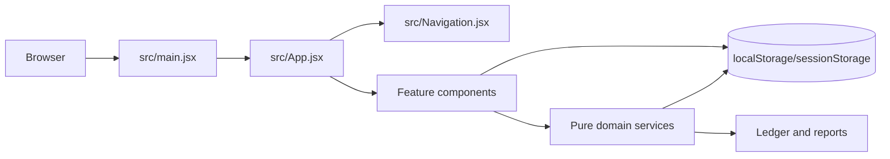
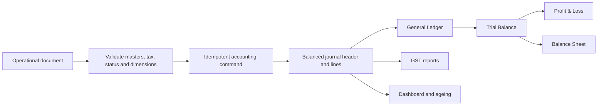
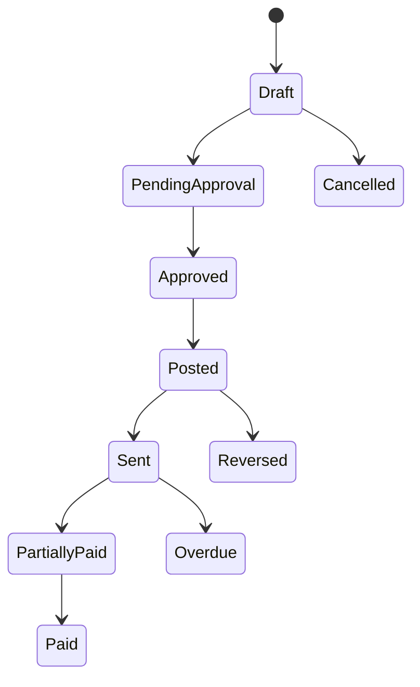
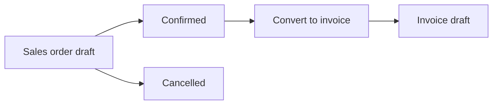
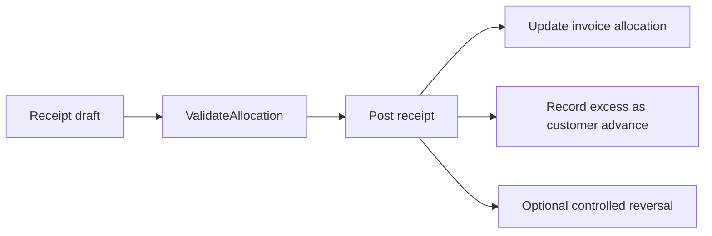
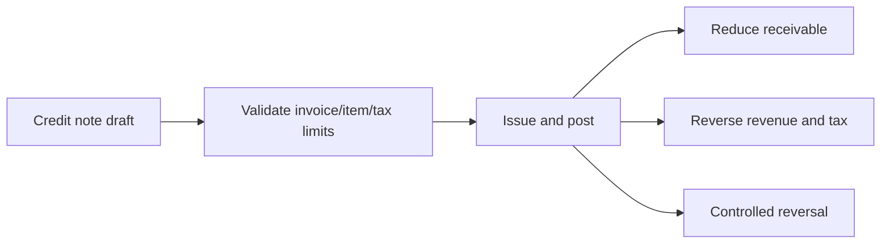
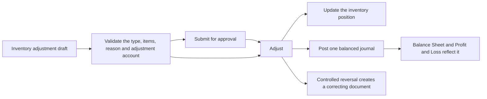
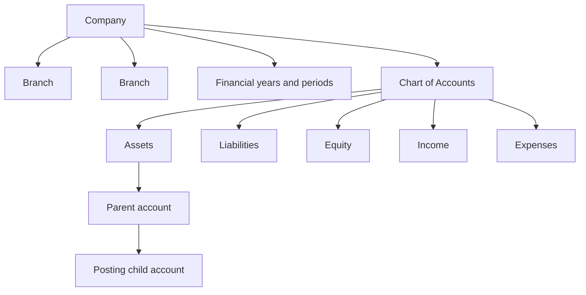
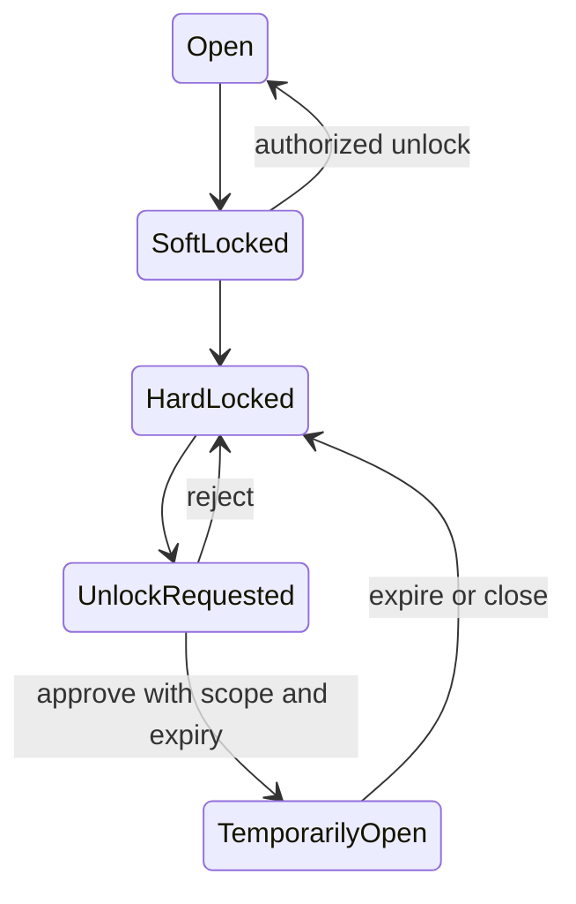

**Superseded 2026-09-25:** the create page is now one stacked column with no summary rail. The section named **Sales document create page: one stacked column**, added at the end of this handbook, replaces the rail described here.

## Credit Note: two credit methods, an inventory decision, and a posting scope (2026-09-26)

The Credit Note create page now states **how** a credit is measured. **Credit method** is `Item Based Credit` or `Amount Based Credit`. Item-based is the original flow: the chosen invoice loads its lines as stacked cards and only the credit quantity is editable. Amount-based is new and is what a pricing correction or a discount adjustment actually is - a value, not a quantity. It replaces the item cards with one **Adjustment** card holding the adjustment amount (the taxable value), the tax treatment and the adjustment account, and it can never be combined with inventory movement.

**Tax on an amount-based note is never typed in.** Against an invoice the engine reverses the invoice's own blended component rate (`billedTaxRates`), which is exact for a single-rate invoice; on a standalone note the operator picks a Tax treatment and the rate splits into CGST + SGST inside the company state and becomes IGST outside it (`chosenTaxRates`). The caps are checked in total per tax component instead of line by line, so a value-only credit still cannot take more tax out of an invoice than the invoice charged.

Two more decisions came with it. **Inventory impact** is now an explicit field on an item-based note - `Return Stock To Inventory` or `Financial Adjustment Only` - and it is what decides whether the linked Sales Return document posts; returning goods is a choice the operator makes and reads on the document, not something inferred from the reason. And the note records the **Organisation and Branch** it posts to, read from the working context and shown on the details card, so a multi-organisation accountant can see the posting scope on the transaction itself.

Smaller changes from the same brief: the head carries the document's status badge; the customer strip states Net receivable and Available credit together; and the Original invoice details card leads with a compact seven-fact summary (number, date, total, already credited, available credit, GST treatment, place of supply) while keeping the link that opens the full snapshot in the right-side popup. The **credit summary** is the only statement of the figures on the form and it closes on a **Total tax** line. Two sections this brief first added - the **Tax summary** card and the collapsed **Accounting Impact Preview** - were removed again on the same day's later instruction, so the create page runs Customer, Credit note details, Original invoice summary, Credit items or Adjustment, Credit summary, Additional details. Nothing was lost by it: the summary still states total tax, and the posting preview lives on the detail page's Accounting tab, while the engine still refuses to post an incomplete account mapping. `Without Invoice` is now `Standalone Credit Note` everywhere it is written, with the old label still read through `noteType`.

**Last verified:** 2026-09-26

## Credit Note invoice facts: a right-side popup, not an inline panel (2026-09-26)

The Credit Note create page's **Original invoice details** card no longer unfolds a fact grid under the invoice picker. The card shows one link, `Invoice INV-00001 →`, and clicking it opens the invoice snapshot in a right-side popup drawer - `createPortal` onto `window.document.body`, overlay `div.cnInvoiceLayer` (`position:fixed;inset:0`, right-aligned), panel `div.cnInvoiceDrawer` (`role="dialog"`, `aria-modal="true"`, `width:min(430px,94vw)`, `100%` below 560px) with a pinned head, one scrolling body and the same thirteen read-only facts. The backdrop, a close button and `Escape` all dismiss it, and changing the invoice or leaving the form closes it too, because the open state is the invoice id itself. Nothing in the popup is editable or recomputed - it is the same read-only snapshot, shown without spending a card's worth of vertical space.

Two notes for whoever continues this. The drawer is a `div`, never an `aside`: `src/styles.css` still carries the prototype's `@media(max-width:700px){aside{transform:translateX(-100%);transition:.2s;width:250px}}` for the app sidebar, and it slid the first `aside`-based drawer completely off the left edge at 420px while every other measurement still looked correct. And the popup is portalled on purpose, so no card's `overflow` can clip it.

**Last verified:** 2026-09-26

## Sales document create page: a working column and a summary rail (2026-09-25)

Creating a sales order and creating a sales invoice are now the same screen with different words, and both are laid out as **one working column with the summary beside it**. `src/SalesDocumentFields.jsx` returns `div.soDocGrid` - a `minmax(0,1fr) minmax(268px,320px)` grid - holding `div.soDocMain` (Customer, then the document details, then the lines, at a 14px rhythm) and `div.soDocRail`. The Billing summary moved out of the lines card and became the rail card, and it now answers "what is this worth, and where does it post from" in one block: the totals, an `INR ₹` currency chip, and an Accounting context list naming the Organisation, Branch, Place of supply and Document number the document will be raised with, closed by a sentence stating when the document reaches the ledger. A sales order posts nothing at all; an invoice reaches the ledger only when it is approved and posted from the register. At a 1440px viewport the grid measured `790.8px 320px` and the rail held at `top:70px` through a scroll, so the running total is never scrolled away from the lines it summarises; below 1050px the rail drops under the working column.

The item grid was simplified to the columns a salesperson reads: **Item, Quantity, Rate ₹, Discount, Tax, Amount** and the remove action. The unit left its own column and sits inside the quantity cell - read-only on an order, where it comes from the Item master, and still an input on an invoice, where nothing is copied from - because the unit is a property of the count rather than a separate fact. Two real defects were fixed in the same grid: the application-wide `td{padding:16px 20px !important}` block in `src/ui-system.css` was quietly padding every line cell 40px and truncating the tax and amount columns, so this grid now restates its own density over that block, and the remove action moved into a fixed 46px column because the 32px button was being clipped by a percentage column narrower than its own padding.

`+ Add item` is now one control with a menu: an existing item, an **ad hoc item** for a line with no Item master record (its name is typed on the line and it must state its price type, which the existing engine rule already required), or **Create a new item**, which hands the operator to the Item master and brings them back to the draft. Additional details reads as four labelled blocks - Shipment, Notes & terms, History and Documents - and the per-line tax now states one rate, `GST 18%`, with the CGST/SGST/IGST breakdown kept inside its menu where each rate is entered. No accounting rule, posting path, allocation, price or total calculation changed: this pass is layout, density and labelling on top of the same `calculate()` engine. Sources: `src/SalesDocumentFields.jsx`, `src/InvoiceLineControls.jsx`, `src/SalesOrders.jsx`, `src/InvoiceWorkspace.jsx`, `src/Items.jsx`, `src/quick-create.js`, `src/sales-orders.css`.


## Journal status vocabulary and approval checkpoint (2026-09-25)

The journal module now speaks the same status words as the rest of the application: **Draft, Pending Approval, Approved, Rejected, Reversed and Cancelled**, stored by `TRANSACTION_STATUSES`. This was a real inconsistency rather than a preference - budgets, credit notes, invoices and inventory adjustments already stored Pending Approval and Approved, and Period Lock's pending-approval count asked for `status==='Pending Approval'` on journal rows, so the journal register's earlier Pending and Published spelling left that count at zero. `normaliseStatus()` still maps the retired spellings on read (Pending to Pending Approval, Published and Posted to Approved) and no stored record is rewritten.

**Only an Approved journal is a posted accounting transaction.** `postsToLedger(status)` is the one rule and `POSTING_STATUS` is Approved, so Draft, Pending Approval, Rejected, Reversed and Cancelled stay outside the General Ledger, the Trial Balance, Profit and Loss, the Balance Sheet and every account balance. A submitted journal can now be **Cancelled** - it needs a reason, posts nothing, stores who cancelled it and when, and stays in the register for the audit trail, while a draft is still deleted outright. Reversal now requires an actual posting, so an entry that never reached the ledger cannot be reversed.

The approval step is labelled **Approve** and is re-validated in the lifecycle rather than trusted from the row menu: the acting role must hold the duty, the status must still offer the step, and a record that already holds a `ledgerJournalId` is never posted twice; the advanced editor's save path applies the same role check. A pending journal's detail opens on the fields the approver decides on - Status, Transaction Type, Transaction Name, Date, Pay From, Category, Amount, Organisation and Branch - above the Reject and Approve actions. The audit trail keeps the submission, approval, rejection and posting stamps, reading `publishedBy`/`publishedAt` and still accepting the older `approvedBy`/`approvedAt`. Sources: `src/simple-journal-transaction.js`, `src/JournalEntriesPro.jsx`, `src/PeriodClosing.jsx`.

**Last verified:** 2026-09-25

## Journal detail as one section (2026-09-25)

The journal detail is one section instead of four tabs. The record and its attachments fill the left 70% — the **Journal details** field list, the **View Accounting Impact** accordion (closed by default, holding the debit and credit table) and the **Supporting Documents** block — while the **Audit Trail** keeps the right 30% and stays sticky beside a long record; the columns stack at 1050px and below. The audit column must be a `div`, never an `aside`: the application shell styles every `aside` as the fixed navigation drawer, which pulls it out of the grid and pins it over the record. A Draft journal offers **Submit for approval** and a Pending Approval journal offers **Publish journal**, both as the primary action, while the stored status it reaches remains Approved.

**Last verified:** 2026-09-25

## Journal detail field grid (2026-09-25)

The Journal details card lists its fields four to a line, each label carrying an icon, and folds to three at 1280px, two at 1050px and one at 700px. Supporting Documents is part of that same card (a top-ruled sub-block with its own sub-heading) rather than a separate card, so one card holds the fields, the attachments and the accounting-impact accordion, while the audit log keeps the right-hand column. A Pending Approval journal shows **Publish journal** to a role that may post it, and to any other role it explains who can instead of hiding the action without a word.

**Last verified:** 2026-09-25

## Journal detail and creation form order (2026-09-25)

The Journal details card lists its fields four to a line with an icon on every label, folding to three at 1280px, two at 1050px and one at 700px, and it holds the Supporting Documents block and the accounting-impact accordion as well. The creation form asks for the scope first — Organisation, Branch, Transaction Type, Transaction Name, Date, the dynamic accounting fields, Amount, then Additional details — so the operator confirms where the entry belongs before describing it. Nothing about the components, storage or posting rules changed with that reorder.

**Last verified:** 2026-09-25

## Journal detail timeline (2026-09-25)

The Journal details field list no longer repeats the status - the chip beside the journal number states it, and only the CSV export keeps a status row. The audit log is a timeline: one icon mark per event on a connecting rail, the actor in bold followed by what they did, the rejection or cancellation reason underneath, and how long ago it happened (just now, 19m ago, Yesterday, 3d ago), newest first. It is built by `journalTimeline()` and `relativeTime()` in the domain module, from the audit array when there is one and otherwise from the record own stamps, so a projected or imported row tells the same story in the same shape.

**Last verified:** 2026-09-25

# Wayvida Books — Engineering and Product Handbook

## Journal approval gate, Journal details and header checkpoint (2026-09-25)

**Only an approved journal touches the accounts.** The rule is now carried by one exported helper rather than by button visibility: `src/simple-journal-transaction.js` exports `POSTING_STATUS` and `postsToLedger(status)`, which is false for Draft, Pending, Rejected and Reversed and true only for Published — the stored name of the approved status. Draft and Pending records are operational only: they never reach the General Ledger, the Trial Balance, Profit and Loss, the Balance Sheet, an account balance or a customer or vendor balance, and nothing posts on Rejected or Reversed either. The approval itself is re-validated inside the single `action()` in `src/JournalEntriesPro.jsx`, which is the one place a lifecycle step happens: the acting role must hold the duty in `JOURNAL_ACTION_DUTY` (`journalAllowed(role,duty)`), the record's status must still offer that step through `JOURNAL_ACTIONS`, a record that already holds a `ledgerJournalId` can never be posted a second time, and the engine's idempotent `journal-transaction:<id>` token remains the second guard. Hiding the Publish or Reject control for a role is therefore a convenience, never the protection. The operator-facing label for that step is now **Approve**: the action key `Publish`, the status `Published` and the `journal-transaction:<id>` token are unchanged, `ACTION_LABELS` maps the key to the label, so a Pending journal offers Approve and Reject on its detail page and in the register row menu, the create page keeps its approver shortcut as **Approve now**, and the success notice reads "Transaction approved and posted to the ledger."

The lifecycle vocabulary is unchanged — **Draft -> Pending -> Published**, **Pending -> Rejected -> Draft by resubmitting**, **Published -> Reversed** — and `normaliseStatus` still translates the earlier wording, so a request phrased as draft / pending approval / approved / rejected / cancelled maps onto Draft / Pending / Published / Rejected and the existing reversal and delete workflows rather than introducing a second vocabulary. Approval writes `publishedBy`, `publishedAt`, `postedBy` and `postedAt` beside the existing submission and rejection stamps; the detail Audit Trail now prints who submitted, approved, rejected and posted, and when, and still reads the older `approvedBy`/`approvedAt` spelling for records already stored. Editing stays restricted to Draft and Rejected (`canEditStatus`), so an approved entry can only be corrected by its reversal — approval is never a silent mutation of history.

The Record Transaction page states its contract on the page: one full-width **Journal details** section head opens the field card, every required input is visible directly under it, and the money and category fields carry visible helper text ("Select the account the money was paid from", "Choose an expense category") instead of hiding that sentence inside the closed select. The application header no longer renders a global search — `navToggle`, `hamb` and `headerActions` are its only children now, the six search-specific CSS rules were removed with it, and the right-aligned action cluster stays flush because `.headerActions` owns `margin-left:auto`. The double-encoded text that made the header, the dashboard and the journal editor print `₹`, `—`, `·`, `↑` and `👋` was repaired in `src/App.jsx` and `src/JournalEntriesPro.jsx` to ₹, —, ·, ↑ and 👋, with a stray byte-order mark removed from the first line of `src/App.jsx`. Sources: `src/simple-journal-transaction.js`, `src/JournalEntriesPro.jsx`, `src/SimpleTransactionForm.jsx`, `src/record-transaction.css`, `src/App.jsx`, `src/styles.css`.

**Last verified:** 2026-09-25

## Bank ledger startup repair checkpoint (2026-09-25)

`src/invoice-engine.js` owns `RESERVED_POSTING_ACCOUNTS`, the one table that names the system posting ledgers, and its `account()` guard is the only place a posting ledger is accepted or repaired. A journal line carries an account code and nothing else, so the repair now runs whether or not the caller names the expected type. Before this checkpoint only typed callers could repair: `ensureDefaultBankAccount()` in `src/purchase-service.js` and `ensure()` in `src/operations-store.js` each healed the bank ledger privately, while `journal()` validated the same ledger through an untyped path and refused it. A stored ledger set that had lost `1010 · Bank` therefore threw `Configure an active posting ledger account for 1010.` inside `bootstrapDemoData()` in `src/demo-data.js`, because the demo's sample transactions hardcode the bank ledger; that throw happens before `wayvida-demo-data-version` is written, so the browser reported **Wayvida Books could not start.** on that load and on every load after it, with the stored data intact but unreachable.

This checkpoint adds `1010 · Bank` (Assets, Debit, Cash and Bank) to `RESERVED_POSTING_ACCOUNTS` and lets the repair apply to an untyped journal line, so a missing ledger is provisioned and a deactivated one is reactivated with the type, nature and group the reserved definition owns, while the name and purpose an operator already gave the ledger are kept. `account()` also reports the account's own type when the caller named none, so a genuinely unusable custom account reads `Configure an active posting Expenses account for 5300.` instead of the vaguer `posting ledger`. The purchase service and the operations store keep their own healers, and no storage key, posting rule, report balance or custom-mapping validation changed. Sources: `src/invoice-engine.js`, `src/demo-data.js`, `tests/invoice-engine.test.mjs`, `tests/demo-data.test.mjs`.

## Credit Note create flow checkpoint (2026-09-26)

The Credit Note module keeps its engine, its `wayvida-*` keys, its validations and its accounting, and now states its flow in six sections: **Credit note details** (number generated and read-only, date, type, customer, reason, reason detail, reference), **Original invoice details** (the invoice picker plus a read-only fact list - invoice number, customer, invoice date, invoice total, already credited, remaining available credit, invoice outstanding, tax treatment, customer GST treatment, GSTIN, billing and shipping addresses and place of supply), **Credit items**, **Tax summary**, **Accounting preview**, and a collapsed **Additional details** (customer note, internal note, attachments). The customer is chosen before the invoice and the invoice list offers only that customer's posted invoices, which is the dependency the old order hid. The items table loads from the invoice - Item, Description, Original quantity, Previously credited, Available quantity, Credit quantity, Unit, Rate, Discount, Tax, Amount, remove - the credit quantity is capped at the available quantity, and the per-row invoice-item picker is gone because the rows ARE the invoice items; only `Add invoice item` survives, for a row the operator removed. Tax has no control on the page: the Tax summary prints the rate inherited from the invoice line and the credit per component. The service gained `creditPostingPlan(s,note,totals)`, the one ordered account plan (reason-driven revenue or adjustment account, one GST reversal per component, round off, then the customer receivable credit) that `issue` posts through, so the Accounting Preview and the journal cannot drift; `creditNoteStatus` now answers `Approved` for an approved but unposted note rather than falling through to `Issued`, and `Approved` joined `CREDIT_NOTE_STATUSES` and the pill tones. The register states Date, Credit note number, Customer, Credit note type, Original invoice, Reason, Amount, Applied amount, Remaining credit, Status, Created By and Actions, with twelve declared widths totalling 100 percent. The stored lifecycle is unchanged - Draft, Pending Approval, Approved, Issued, Cancelled, with the applied and refunded words derived - so the accounting word "Posted" is the module's existing **Issued** state and no second status vocabulary was created. Nothing in the page posts, taxes or moves stock on its own: the journal is written by `issue`, and a goods return still belongs to the Sales Return document. The page wears the Create Sales Order / Create Sales Invoice design language: the shell was already the shared `soCreatePage` create page with its full-bleed head and pinned action bar, and the inner markup now follows it - `ivCard soFormSection` cards with `soSectionHead` headings, `ivFields soFieldRow` field rows, and a **Customer \*** card that leads the page with the shared search box and the `soCustomerProfile` strip carrying the type chip, the billing address and the right-aligned **Net receivable**. `CustomerSearch` and `customerInitials` are exported from `src/SalesDocumentFields.jsx` for that reuse, so the sales customer block has one implementation. Sources: `src/CreditNotes.jsx`, `src/credit-note-service.js`, `src/credit-notes.css`, `src/invoice-workspace.css`, `src/SalesDocumentFields.jsx`, `tests/credit-note-ui.test.mjs`, `tests/credit-note.test.mjs`.

**Last verified:** 2026-09-26

## Printed sheet geometry checkpoint (2026-09-26)

A customer-facing preview is mounted INSIDE a register page - `section.itemsPage.salesOrdersPage` for a sales order, `section.invoiceWorkspace` for an invoice - so the host page's table rules reach the printed document unless the sheet restates its own geometry. Two host rules did: `src/items.css` declares `.itemsPage table{width:100%;border-collapse:collapse;min-width:800px;text-align:left}`, and `src/ui-system.css` pads every `th`/`td` with `16px 20px !important`, adds a 24px first-child left inset and a 24px last-child right inset, and holds `th` on one line with `white-space:nowrap!important`. The eight-column items table therefore measured exactly 800px inside a paper whose content box was 620px, so a sales order printed its header rule, Tax column and Amount column past the right page edge onto the grey canvas, and the 16px/20px/24px cell padding squeezed `HSN / SAC` and `Qty / Unit` onto two lines. `src/document-preview-fix.css` - the stylesheet whose stated purpose is isolating previews from legacy shell selectors - now restates the sheet's table geometry under `!important`: `.dpPaper table{min-width:0}`, `.dpPaper th{padding:10px 6px;white-space:normal}`, `.dpPaper td{padding:12px 6px}`, the 6px first-child left inset, the 6px last-child right inset, and the items table's own 12px/14px 6px cells. The eight positional `.dpItemsTable` widths in `src/document-preview.css` were rebalanced from `4/24/10/10/12/12/12/16` to `4/21/13/12/12/12/10/16` percent - still exactly 100 - because a 210mm sheet has no room for two-word headers at the old widths. Nothing about a document's figures, totals, stored data, templates, storage keys or posting paths changed; this checkpoint is layout and isolation only, and it is why a preview must never be laid out with the host page's table tokens. Sources: `src/document-preview-fix.css`, `src/document-preview.css`, `tests/document-preview-ui.test.mjs`, `tests/sales-order-ui.test.mjs`.

**Last verified:** 2026-09-26

## Accounts Payable startup repair checkpoint (2026-09-26)

`2000 · Accounts Payable` is now in `RESERVED_POSTING_ACCOUNTS`, so the engine's one posting-ledger guard provisions or repairs it exactly like `1010 · Bank`, `1100 · Accounts Receivable`, `2100 · GST Payable`, `4000 · Sales`, `4100 · Service Income` and `5900 · Rounding Adjustment`. The gap it closes was a documentation-to-code mismatch rather than a new idea: `src/purchase-service.js` had repaired `2000` privately in `ensureDefaultPayableAccount()` since the purchase bills were built, and the reserved-ledger prose already listed Accounts Payable among the repaired masters, but only that private healer covered it. `createBankingDemo()` in `src/banking-service.js` seeds its demo vendor payment through `2000` from `journal()`, which names no expected type and therefore had no repair available, so a stored payable that an operator had deactivated or turned into a heading threw `Configure an active posting Liabilities account for 2000.` inside `bootstrapDemoData()`. That throw lands before `wayvida-demo-data-version` is written, so the browser reported **Wayvida Books could not start.** on that load and on every load after it, with the stored data intact but unreachable - the same failure mode the bank-ledger checkpoint above describes, one ledger along. The repair changes no posting rule, report balance, screen or storage key: it only restores the type, nature, group, active posting state and control-account role the reserved definition owns, and keeps whatever name and purpose an operator gave the ledger. Sources: `src/invoice-engine.js`, `src/banking-service.js`, `src/demo-data.js`, `tests/demo-data.test.mjs`.

**Last verified:** 2026-09-26

**Last verified:** 2026-09-25

## Journal Entry transaction lifecycle checkpoint (2026-09-24)

The Journal Entries create action opens `src/SimpleTransactionForm.jsx` as **Record Transaction**, and the page asks business questions only: Transaction type (Expense, Income, Transfer, Customer Payment, Vendor Payment), Transaction name, Date, the type's own money fields, Amount, Organisation and Branch, then a collapsed Additional details section (Description, Reference number, attachments). A type reveals only its own fields - Pay From + Category, Deposit To + Category, From Account + To Account, Customer + optional Invoice + Deposit To, Vendor + optional Bill + Pay From - and a settlement shows the invoice or bill number, date, total and open balance before it is saved. No Debit, Credit or journal-line vocabulary appears in the normal journey; the generated double entry is disclosed only inside the collapsed **View accounting entry** block.

The lifecycle is **Draft -> Pending -> Published**, **Pending -> Rejected**, **Rejected -> Draft by resubmitting** and **Published -> Reversed**. Only Draft and Rejected are editable; a Published transaction is corrected by its reversal. `src/JournalEntriesPro.jsx` keeps one `action()` for every step, rejection requires a reason, and the register row menu offers exactly the actions the status allows (Draft: Edit, Preview, Duplicate, Submit for Approval, Delete; Pending: Preview, Duplicate, Publish, Reject; Published: Preview, Duplicate, Reverse; Rejected: Edit, Preview, Duplicate, Resubmit, Delete; Reversed: Preview, Duplicate). The acting role follows the View as switch through `reviewRole`, exactly as Inventory Adjustments simulates approval duty, and `journalAllowed()` owns the duty table, so Publish, Reject and Reverse are removed from the menu for a role that may not approve rather than merely disabled.

Publishing posts through the existing `journal()` engine with the `Journal Transaction` source and one idempotent `journal-transaction:<id>` token per record, so an edit or a retry can never double-post; a payment against an invoice or bill is settled by that document's own engine instead, because the engine owns the receivable/payable posting and the balance update. The register is nine columns with no Debit or Credit column - Journal ID & Date, Transaction details, Account, Transaction Type, Amount, Status, Organisation, Branch, Actions - where the amount is the user-facing transaction amount. Search covers Journal ID, transaction name and reference, and the filter panel covers status, transaction type, account, organisation, branch and date. `src/journal-register-display.js` projects those cells for both simple and advanced rows without mutating stored records and normalises the earlier vocabulary (`Pending Approval` and `Approved` to Pending, `Posted` to Published) on read. Preview keeps its accounting view: `src/JournalPreview.jsx` leads with a Transaction summary block and moves the double entry under an Accounting detail heading.The register's third column reads **Transaction details** and stacks the transaction name over its reference ("No reference" when none was recorded). On the Record Transaction page the entry mode is one **Simple / Advanced** toggle in the header The register shows **ten transactions to a view** behind the shared `.pagination-footer` pager ("Showing 1-7 of 7" with a `10 per page` note and Previous / Page n of m / Next), and its first and last cells carry the register 24px inset so the list keeps a left and right gutter inside its card; the export still writes every filtered row, not just the visible page. - the same control renders in the advanced editor with Advanced active - the **Wayvida will record** card was removed at the user's request: the fields now run four to a line in one full-width card and the page ends in a footer holding the one-line summary, a View accounting entry tooltip and the Cancel, Save draft, Submit for approval and Publish now actions, which pin to the window while the page scrolls, and Description, Reference number and the attachment control share one row of Additional details, and the Transaction type dropdown arrives with Expense already selected and no empty option, so its fields are populated immediately.


`src/demo-data.js` (DEMO_VERSION 2) seeds the register with JE-2026-000121 to JE-2026-000127 plus a REV- reversal, covering all five statuses and all five transaction types, and settles one customer invoice and one vendor bill through their engines. The same bootstrap now seeds its own working context and passes `periodOptions` to the purchase engine, because a fresh install had no accounting period to post against and the seeded registers arrived empty.

**Last verified:** 2026-09-24

## Sidebar Other section, editable account code and the drawer close - 2026-09-24

`src/Navigation.jsx` now declares Budgets and Period Lock in a section of their own - `{label:'Other',icon:IconFolders,children:[leaf('Budgets'),leaf('Period Lock')]}` - placed directly after the Accounting section, which keeps only `leaf('Chart of Accounts')` and `leaf('Journal','Journal Entries')`. The page names are unchanged, so the `App.jsx` routing list, the Budget workspace remount key and the portal that renders Period Lock are untouched; `tests/budget-navigation-ui.test.mjs` and `tests/navigation-structure.test.mjs` now assert the new grouping (both had been failing on the older `leaf('Journal Entries')` shape and are green again).

The Create Account drawer (`src/EnterpriseAccountForm.jsx`) lets the operator type the account code: the read-only `span.am-code-badge` ("Auto-generated") is replaced by an `input` bound to `form.code`, using `nextCode(db.accounts,type)` as its placeholder and the hint `Optional. Leave blank to use <code>.`. It stays disabled only while `locked` - a system account, or one a posted transaction already references - and then reads `A posted account keeps its code.` `src/account-master.js` already owned every rule: a typed code is kept, a blank one still generates the next code, a duplicate is refused with "Account code already exists. Choose a unique code." and a malformed one with "Use a code of up to 24 letters, numbers, hyphens or underscores.", so no storage, posting or validation behaviour changed.

The drawer's close control is the register's standard 38px square: `display:inline-flex;align-items:center;justify-content:center;padding:0`, a 9px radius on a `#d8e0ec` border, a 20px `IconX` pinned with `flex:0 0 auto`, and hover and `focus-visible` states. It is restated through a `.am` ancestor because the generic `.am button` rule (12px padding, 7px radius, 7px gap) is more specific than a bare class and was squeezing the glyph to 12x20; the account-details drawer shares the class, so it moved with it.

**Last verified:** 2026-09-24

## Journal Entry linked-payment checkpoint — 2026-09-23

Entry Details now includes a required transaction name, customer/vendor choice for money received/paid, and optional linkage to a posted outstanding invoice/bill for that party and selected organisation/branch. The form shows document date, total, paid and balance. `src/journal-entry-reference.js` holds eligibility checks. Save routes linked receipts through the existing invoice payment command and linked supplier payments through the existing purchase payment service, without writing a second manual journal. No-invoice money paid uses the balanced journal path with an eligible asset/expense `Paid for` account. The manual Advanced Mode remains. Payment Receipts owns advances. Browser-local storage and role selection remain simulation only.

## Charts of Accounts register - 2026-09-23

The accountant-facing account register title is **Charts of Accounts**, while the business-owner terminology remains **Money Categories**. Organisation and Branch are always separate columns and derive only from the global switcher selection. A single value is printed directly; multi-selection uses a compact count with the exact selected organisation-to-branch mapping in its hover title. Row editing is available only from the first item of the canonical three-dot menu.

## Compact theme action and rail submenu access - 2026-09-22

The footer theme customization is one 34px icon action with an accessible next-action label and title; it aligns right when expanded and centers in the compact rail. When a grouped navigation icon is clicked in the 72px rail, `Navigation` calls `onExpandNavigation`, persists expanded mode, and opens the requested group. Do not restore a full-width two-choice theme row or leave compact group clicks without visible submenu access.

## Current sidebar geometry and branch codes - 2026-09-22

The desktop sidebar is 250px expanded and 72px compact. Its footer places the Light/Dark two-icon control directly above the always-light organisation/branch card. The 26px edge arrow uses `z-index:500`, a visible border and shadow so it cannot disappear beneath navigation chrome. Branch display codes are `WY-KOC01`, `WY-TVM01`, `WY-BLR01`, `VS-TVM01` and `VS-TSR01`; internal ids remain unchanged for storage compatibility.

## Sidebar utilities are reduced to brand icons - 2026-09-22

The current theme control is a compact two-choice pill. `div.navThemeToggle` is a 70x32px full-radius track beside Wayvida Books with accessible Light and Dark radio buttons. Both sun and moon remain visible; the selected icon sits on a blue circular thumb. It narrows to 64px in the mobile drawer and hides in the 72px compact rail.

Follow-up contrast fix: the light organisation card inside dark navigation has an explicit high-specificity hover/open rule (`#E3ECFA`, `#182230` heading, `#667085` secondary text), preventing the general dark-sidebar button hover from turning the card dark and making its text unreadable. Its tooltip remains white on `#17253C` with a stronger dark-sidebar border and shadow. In light navigation, the moon theme action now uses a visible `#344B6A` glyph on `#EEF3FB`, changing to `#175CD3` on `#DCEAFF` with a blue border on hover.

Help Center is removed from the sidebar, while the header Help action remains available. The old bottom Light/Dark segment is replaced by one `button.navThemeToggle` positioned beside the Wayvida Books text (`top:15px;left:218px`, 30px square). It shows the sun action while navigation is dark and the moon action while navigation is light, with accessible action text.

The desktop collapse control is now a 24px translucent edge circle with a small CSS `‹` / `›` arrow instead of the heavier sidebar-layout glyph. The organisation/branch card and its portalled dropdown are always light, regardless of sidebar theme. The dropdown no longer renders `div.wcMenuIdentity`, removing the duplicated selected organisation, branch count and badge shown in the reference screenshot; it begins with the Organisation heading and checkbox rows.

## Desktop navigation collapses to an icon rail - 2026-09-22

The saved `finance-erp-nav-collapsed` state now produces a 72px desktop rail instead of translating the sidebar fully off-screen. The brand keeps its logo, top-level destination icons remain usable, nested lists and labels fold away, and Help, theme icons and the working-context logo remain at the foot. Destination buttons expose their names through `aria-label` and native hover `title` tooltips. The mobile drawer below 701px is unchanged.

The navigation toggle remains the one button in `src/App.jsx`, but `src/navigation.css` positions it as a 28px circular edge control with a white surface, border and soft shadow, at `left:256px` when expanded and `left:58px` when compact. Main/header and portalled workspace offsets become 72px in compact mode; fixed create-page actions and guide backdrops follow the same rail.

## The switcher dropdown directly supports multi-selection - 2026-09-22

The Company and Branch switcher no longer divides selection between a single-choice quick menu and a separate `Change / Customize` drawer. `src/WorkingContextSwitcher.jsx` uses the one portalled dropdown for both organisation and branch multi-selection: rows are checkbox controls, changes remain draft until Apply, Cancel discards them, removing an organisation prunes its branches, and Apply requires at least one organisation and one branch. The same five persistence keys and two change events are still written through `applyWorkingContext` with `SWITCH_MODES.multi`.

Hovering or keyboard-focusing the closed trigger shows one combined tooltip with `Organisations:` and `Branches:` lines containing every current selection. The dropdown chevron grew from 18px to 20px while retaining its chip, rotation and theme colors. The old drawer, its search controls, and the `Change / Customize` action are deleted.

When more than one organisation is selected, the trigger and dropdown identity use one `IconBuildingCommunity` glyph instead of generated initials or one company's logo. It is a white 19px/17px glyph on a solid `#245FD9` brand tile (`#3974D9` in dark mode), keeping the multi-company state compact and visually distinct.

## The switcher card and its panel are finished - 2026-09-22

On the user instruction "need to improve the organisation and branch switcher card style", the card and its panel were detailed rather than restructured: no key, event, selector list or behaviour changed.

The card (`div.workingContext`) is now `display:flex;flex-direction:column;margin:0 0 12px;padding:7px;border-radius:14px` with `box-shadow:0 1px 2px #1018280f,inset 0 1px 0 #fff` - a raised surface with a top highlight instead of a flat tint - and the `margin:0 0 12px` keeps a gap above the bottom edge of the window. A section label inside the card was added and then removed on the same day, on the user instruction "no need of showing Organisation & branch, just need card style change give bottom padding", so the card shows the switcher row alone. The trigger chevron is an always-visible dropdown affordance: an 18px glyph with 4px padding inside a full-radius chip (`#E3ECFA`/`#245FD9` light, `#2B3D5C`/`#CFE0FF` dark) that deepens to `#CFE0F9`/`#1C4FB8` (dark `#3A527C`/white) on hover or while the panel is open and rotates 180 degrees when it is. It is stated once: a legacy `.wcIdentity[data-theme=dark] .wcTrigger>svg{color:#9fb0c6}` rule outranked the new dark fill and was deleted.

The panel gained the same finish. `div.wcMenuIdentity` is a header strip (`#F4F7FB` light, `#1F2C40` dark, 10px radius) whose right edge carries a `span.wcMenuBadge` with the working context - the branch code, or `n branches` when several are selected. Rows are separated by an inset hairline (`.wcMenuGroup .wcMenuRow:not(:last-child)`, `#F1F4F9` light / `#2A3A54` dark) rather than a border, so the row radius survives. The branch list is drawn as a tree: `.wcMenuGroup.branches` carries `margin-left:6px;padding-left:4px;border-left:2px solid #EEF1F6` (`#2A3A54` dark), which keeps the organisation level and the branch level distinguishable inside one flat panel; the component tags the two groups `wcMenuGroup organisations` and `wcMenuGroup branches`.

Verified live on the painted page in the in-app browser at a temporary 1440x900 viewport, reset afterwards, with the app left on the dark theme: the card measured 241x68 at x=14 with `border-radius:14px`, both shadow layers and exactly 12px of clear space beneath it, the chevron measured 18x18 with a 999px radius, and the open panel measured 266px wide with the identity strip on `rgb(31, 44, 64)` carrying the `KOC01` badge, an inset row separator on `rgb(42, 58, 84)`, and a 1.6px left rule on the branch group. `tests/org-switcher-ui.test.mjs` pins every one of those; the full sweep is **702 tests / 691 passing / the same 11 pre-existing failures**, and the build and documentation validator pass.

On the follow-up "drop down for Organisation & branch switcher is not visible", the panel was hardened rather than restructured: `.wcMenu` moved to `z-index:300` with a two-layer shadow (`0 24px 56px` and `0 2px 6px`) and a `#DBE3EE` border (`#3A4C68` in dark) so it reads clearly against a white sidebar as well as the dark one, and `placeMenu()` now floors its height at 240px and opens on whichever side has more room, recording that in `data-side`. Verified on the painted page in three conditions - 1440x900 dark (266x390 at y=430, z-index 300, on screen), 1440x900 light (same box, border `rgb(219, 227, 238)`, on screen) and a deliberately short 900x420 window (340px tall at y=0, scrollable, still fully on screen).

## The sidebar footer becomes one refined block, with a Light / Dark segment - 2026-09-22

On the user instruction to improve the Company and Branch switcher section's UI and style, to make the dark and light control a "responsive type" like the supplied reference (a segmented Light / Dark control above an identity row), and to adjust its left, right, top and bottom padding, the sidebar foot was restyled.

What is there now, top to bottom, all sharing the sidebar's 14px side gutter so the edges line up: the `Help Center` leaf; the theme segment; and the Company and Branch switcher card. `div.navThemeFooter` is a column with a 10px gap and `12px 0 14px` padding, and `div.workingContext` carries `padding:6px`, a 12px radius, its tinted surface (`#EEF3FB` on `#DBE6F5` light, `#22304A` on `#31425B` dark) and a `0 1px 2px #1018280a` shadow.

The switch became the reference's segment: `div.navThemeSegment` is a 4px-padded 10px-radius track (`#EEF1F5` light, `#1E2C41` dark) split `1fr 1fr`, `role="radiogroup"` with `aria-label="Navigation theme"`, holding two `button.navThemeOption` rows of 34px - a 16px `IconSun` or `IconMoon` beside `Light` or `Dark`, `role="radio"`, `aria-checked` - where the active one wears the thumb (`#fff` with `0 1px 2px #10182814` in light, `#31415C` with white text in dark) and the inactive one is transparent with muted text (`#667085` light, `#A8B8CE` dark). The old `.navThemeSwitch` / `.navThemeTrack` rules and their reduced-motion rule were deleted with it.

One defect was introduced and caught in this pass: `setTheme` first forwarded its argument straight into `setDark`, so the state became the string `'light'` and `data-theme` stayed dark while `aria-checked` read `"light"`. `setTheme` now normalises (`const isDark=next==='dark'`) before setting state and writing the storage key, and `tests/sidebar-shell.test.mjs` asserts both option markup and the dark active fill.

Verified live on the painted page in the in-app browser at a temporary 1440x900 viewport, reset afterwards, with the nav theme left on dark: in light mode `data-theme="light"`, the track `rgb(238, 241, 245)`, the Light option active on `rgb(255, 255, 255)` with `rgb(24, 34, 48)` text and Dark muted at `rgb(102, 112, 133)`, the card `rgb(238, 243, 251)` on a `rgb(219, 230, 245)` line; in dark mode `data-theme="dark"`, the track `rgb(30, 44, 65)`, Dark active on `rgb(49, 65, 92)` with white text and Light muted at `rgb(168, 184, 206)`, the card `rgb(34, 48, 74)` on a `rgb(49, 66, 91)` line. The footer measured 118px tall and the segment 241x42 at x=14, the card 241x66 at x=14 - the same left edge, which was the padding request. The full sweep is **701 tests / 690 passing / the same 11 pre-existing failures**.

## One search width in every register toolbar - 2026-09-22

On the user instruction "Search used in all module - table/datagrid/list, near filter button increase the width of that search bar only at 300px", the search control that sits beside the Filters button is now exactly 300px in every module.

It is one block at the end of `src/register-head.css` - the last stylesheet the app loads, which is what lets it win - inside `@media(min-width:761px)` so the narrow-screen full-width search stays as it was. The block repeats each module's own selector with the width bound (`.registerHead .ivTools>label`, `.registerHead .itemsTools>label`, `.je-page .registerHead .je-tools>label`, `.budgetV3Head.registerHead .budgetFilterSearch`, `.pc-register-tabs>.pc-filters>.pc-filter-search`, `.iaHeading.registerHead>.iaRegisterBar .iaSearch`, `.am-coa-page>.am-filter-toolbar .am-search`, `.gl-filter-toolbar .gl-search`, `.pc .pc-filters>.pc-filter-search`, `.auditTools>label`, `.trTools>label`, `.tabletools>label`, `.bankTools>label`, `.bankTools .bankSearch`, `.purchaseTools>label`, `.opsTools>label`, `.coaTools>label`, `.coaSimpleTools>label`, `.day-filter-row .day-search`, `.swSearch`, `.budgetSelectionTools .budgetFilterSearch`) because several module sheets state their own flex, some of them `!important`; a handful carry `!important` on the width for the same reason. Searches that filter a picker, a form or a drawer were left alone - they are not toolbar searches.

Verified live on the painted page in the in-app browser at a temporary 1440x900 viewport, reset afterwards: the Payment Receipts register search measured **300px at x=800** with the Filters button at x=1110, a 10px gap between them; the Chart of Accounts search measured 300px at x=805; the Day Book search measured 300px at x=860. The full sweep one file per process is **701 tests / 690 passing / the same 11 pre-existing failures**, and no module's pinned width assertion broke - those pin the module sheets, which were not edited.

## The switcher moves to the foot of the sidebar, and the company is Wayvida Learning - 2026-09-22

On the user instruction "Viskool and Wayvida (Change organisation name Wayvida to Wayvida Learning). (Organization & Branch Switcher) is place just below the Dark navigation in menu navigation side bar, Also give a light blue/grey color shade as background in light mode and dark mode for better visibility", three things changed.

**Placement.** `src/Navigation.jsx` renders `<WorkingContextSwitcher theme={dark?'dark':'light'}/>` as the LAST child of `nav.erpNavigation`, after `div.navThemeFooter` (Help Center and the Dark navigation switch), so the working context is the bottom row of the sidebar - measured at top 830 / bottom 894 in a 900px window, below the footer at 733-828.

**Surface.** The switcher reads as one card: `div.workingContext` carries `margin:2px 0 6px;padding:5px;border-radius:12px` with `#EEF3FB` on a `#DBE6F5` line in light mode and `#22304A` on a `#31425B` line in dark, and the trigger's hover and open states are re-stated as `.workingContext .wcTrigger:hover` / `[aria-expanded=true]` (`#E3ECFA` / `#DAE7FB` light, `#2B3D5C` / `#31486E` dark) so the tint survives. Measured live: light `rgb(238, 243, 251)`, dark `rgb(34, 48, 74)`.

**The panel flips.** With the trigger at the bottom of the window there is no room below it, so `placeMenu()` in `src/WorkingContextSwitcher.jsx` measures the space and, when less than 360px remains, anchors the panel with `bottom: window.innerHeight - box.top + 8` plus a `max-height` instead of `top`. Verified live: the panel opened with `bottom: 72px; max-height: 828px`, top 439, bottom 828 - fully on screen and above the trigger. The hover summary tooltip opens upward for the same reason.

**The name.** The company displays as `Wayvida Learning`: `src/demo-organisations.js` (id `abc` unchanged, because the id is a key), `PERIOD_ORGANISATIONS` and the period scope default in `src/period-locking.js`, the Settings company defaults in `src/settings-store.js`, and the header label, welcome subtitle, seeded company table and company form defaults in `src/App.jsx`. `tests/journal-line-columns.test.mjs` and `tests/period-scope-visibility.test.mjs` compared against the exact old name and were repointed, and `tests/org-switcher-ui.test.mjs` now pins the footer-relative placement instead of the first-child placement.

Validation: the full sweep one file per process is **701 tests / 690 passing / the same 11 pre-existing failures**, the production build passes and the documentation validator passes.

## One spacing scale for every section, and organisation marks that hold their box - 2026-09-22

On the user instruction to use the spacing and padding of the supplied design sheet ("SPACING DEFINED") in every section, and to fix the organisation logos that were not aligned in the switcher, the shell now carries that sheet's scale as tokens and the organisation marks are fixed-size tiles.

`src/ui-system.css` holds the tokens: `--wvb-space-1` 4px through `--wvb-space-11` 60px on the sheet's 4 / 6 / 8 / 10 / 12 / 16 / 20 / 24 / 30 / 32 / 60 scale, the ink ramp `--wvb-ink-1400` `#0C0C0D` down to `--wvb-ink-600` `#A3AEB8`, `--wvb-surface-100` `#F4F7F9`, `--wvb-surface-200` `#E9ECEF`, `--wvb-line-400` `#DFE3E6`, the brand blues `#1279FF` / `#EAF3FF` / `#CDE2FD`, and the radii 8 / 10 / 12. `--ui-bg` is now `#F4F7F9`, `--ui-border` `#DFE3E6` and `--ui-radius` 12px, so every card, page background and border picks the sheet up through tokens the app already used. The final compatibility layer in `src/ui-quality-polish.css` applies the rhythm to the dashboard and the shared cards - `.exactDash` pads 20/24/32, `.metricGrid`, `.exactGrid`, `.stats` and `.grid` gap at 16 and sit 24 apart, `.metric` and `.stat` pad at 20, `.exactHead` is 48px with a 20px gutter and the inner rows pad 12/20 - inside a `min-width:721px` block so the narrow-screen values stay untouched.

The logo fault was real and worth remembering: `span.wcMark` is a flex item inside the trigger button, and the sidebar's legacy `.erpNavigation button>span{flex:1;min-width:0}` outranks a bare `.wcMark` rule, so the tile stretched to 95x32 and its 95px image was then clipped by the sidebar's own `overflow:hidden`. The fix is three rules in `src/working-context.css`: `.wcTrigger>.wcMark{flex:0 0 var(--wc-mark-w,32px)}`, `.wcMenuGroup>.wcMenuRow>.wcMenuMark{flex:0 0 var(--wc-mark-w,28px)}`, and `.wcMark,.wcMenuMark{position:relative;overflow:hidden}` with the image absolutely filling the tile (`inset:0`, `object-fit:cover`, `border-radius:inherit`, `transform:scale(var(--wc-logo-scale,1))`). Each company carries its own optical `logoScale` (Wayvida 1.35, because its glyph sits inside a wide white canvas) and a wordmark logo carries `logoWide`, which widens the chip through `--wc-mark-w` (48px in the panel, 56px in the trigger) instead of squeezing a wordmark into a square. The drawer row's subtitle is now ellipsised rather than spilling out of the panel.

Verified live on the painted page in the in-app browser at a temporary 1440x900 viewport, reset afterwards: the trigger tile measured exactly 32x32 with `flex:0 0 32px` and its image 43x43 clipped inside; the panel rows measured 28x28 for Wayvida with `flex:0 0 28px` and 48x28 for the Viskool wordmark chip with `flex:0 0 48px`; the dashboard reported a 16px `metricGrid` gap, 20px `.metric` padding, `20px 24px 32px` `.exactDash` padding and `rgb(244, 247, 249)` for both the dashboard and the page background. The full sweep is **701 tests / 690 passing / the same 11 pre-existing failures**, the production build passes and the documentation validator passes.

## The two companies are Wayvida and Viskool, with their logos - 2026-09-22

On the user instruction "Consider the companies/organisations and Branches in this wayvida books are: Wayvida - Trivandrum, Kochi and Bengaluru; Viskool - Trivandrum and Thrissur; use wayvida logo and i am attaching viskool logo here", the demo dataset now carries exactly two companies, each with its own logo, and the switcher renders those logos. This replaces the naming in the section below.

`src/demo-organisations.js` is the single list every reader shares (the switcher, `src/organisation-context.js`, the Chart of Accounts, the Balance Sheet, the enterprise account form, Period Lock and the Period Locking Settings panel):

- Wayvida - id `abc`, code `ABC01`, logo `/wayvida-logo.png`, branches Kochi (`abc-kochi`, `KOC01`), Trivandrum (`abc-trivandrum`, `TVM03`) and Bengaluru (`abc-bengaluru`, `BLR02`). Kochi is listed first on purpose: `src/organisation-context.js` falls back to the first branch of the first organisation, and every module's `wayvida-demo-branch` fallback is the Kochi branch, so one default holds across the shell on a browser with empty storage.
- Viskool - id `northstar`, code `NSR02`, logo `/viskool-logo.png`, branches Trivandrum (`northstar-chennai`, `TVM01`) and Thrissur (`northstar-coimbatore`, `TSR02`).

The rule to keep: **ids are keys, names and labels are display.** `id`, the organisation `code` and the branch ids are what the working-context storage pair, the period-control records and the journal posting context resolve through, so the rename moved `name`, `logo`, branch `name` and branch `code` only. That is why Viskool's Trivandrum branch keeps the id `northstar-chennai`. The four old companies and their six extra branches (Malabar, Bluewave, Calicut, Kannur, Mumbai, Pune) are gone from the list, and `PERIOD_ORGANISATIONS` / `PERIOD_BRANCHES` in `src/period-locking.js`, the period auto-create list, `seededCompanies` / `seededBranches` in `src/App.jsx`, the Settings company defaults in `src/settings-store.js` and the two id-to-code maps (`src/invoice-engine.js`, `src/JournalEntriesPro.jsx`) were renamed or trimmed to match. `src/invoice-engine.js` and `src/JournalEntriesPro.jsx` now map only `{abc:'ABC01',northstar:'NSR02'}`.

The switcher shows the logos: the trigger carries the current company's 32px rounded-square logo (`span.wcMark` with an ``, falling back to initials), and the panel opens with an identity row before the ORGANISATION and BRANCH sections. An organisation row shows its 28px logo, the name over its type, and one right-hand slot - the 20px `IconCircleCheckFilled` on the current company, or the `span.wcMenuBadge` branch count on the others - which is the reference layout where the active row trades the badge for the tick. The Viskool logo is a maroon square, so the mark uses `object-fit:cover`; the Wayvida mark is a blue glyph on white, so it reads as an app icon.

Verified live on the painted page in the in-app browser at a temporary 1440x900 viewport, reset afterwards, with the working context put back to Wayvida / Kochi Branch: the sidebar trigger read `Wayvida | Kochi Branch` with `/wayvida-logo.png` at x=14 / y=66 / w=241, `main` sat at y=59 / x=270 / w=1170, the panel identity row read `Wayvida / Kochi Branch` with the same logo, the organisation rows were `Wayvida` (logo, ticked) and `Viskool` (logo, `2 branches` badge), the branch rows were `Kochi Branch KOC01` (ticked), `Trivandrum Branch TVM03` and `Bengaluru Branch BLR02`, and the footer row stayed `Change / Customize`. Switching to Viskool landed on `Viskool | Trivandrum Branch`, and Settings > Company then listed only `Wayvida` and `Viskool`.

## Company and branch switcher - 2026-09-22

The Company and Branch switcher lives in the sidebar directly under the Wayvida Books brand, on the user instruction to make it look and work like the supplied workspace-switcher reference and then to move it there. It replaced both the static read-out in the 46px bar below the application header and, with it, that bar.

`src/Navigation.jsx` renders `WorkingContextSwitcher` as the first child of `nav.erpNavigation`, above the destination list, and passes the nav theme down. The component renders `button.wcTrigger` - a 32px initials mark, the organisation name, the branch (or `n branches`) and a 16px `IconChevronDown` that rotates while the panel is open - and, while open, `div.wcMenu`: an ORGANISATION section and a BRANCH section of `button.wcMenuRow` rows with a 28px tone mark, the name over a secondary line and a 20px `IconCircleCheckFilled` check on the active row, then `i.wcMenuDivider` and a `button.wcMenuAction` row that opens the Change / Customize drawer. The panel and the drawer are portalled to `document.body`, because `.app>aside{height:100dvh;overflow:hidden}` would clip them: the panel is `position:fixed`, placed from the trigger measured box plus 8px, clamped to the viewport, 248 to 320px wide with `max-height:calc(100dvh - 88px)` and its own `data-theme`, so it stays readable over the dark sidebar. Row marks use only blue, violet, cyan and amber: green, red and grey already mean status in the Chart of Accounts, and `src/demo-organisations.js` now holds the organisation list that the switcher, the scope readers and the tests all read.

`src/org-switcher.js` is the non-React half that keeps the two entry points honest. `applyWorkingContext` writes `wayvida-context-companies`, `wayvida-context-branches`, `wayvida-context-mode`, `wayvida-demo-company` and `wayvida-demo-branch` and dispatches `wayvida-organization-change` and `wayvida-working-context-change`, so the quick switch ('Single organisation') and the drawer ('Multi Selection') cannot drift; `switchedBranchIds` keeps the branch the user is already on when it belongs to the chosen organisation, otherwise it takes that organisation's first branch; `initialsOf` and `toneOf` build the marks. Every reader - Create Journal Entry and Period Lock through `getAccessibleOrganizations`, Create Budget through `getScopeOrganisations` - reads the same keys as before, so the context contract is unchanged.

Verified live on the painted page in the in-app browser: at 1440x900 the sidebar was 270px wide, the trigger sat at x=14 / y=66 with a 241px width directly under the 58px brand row, the first destination began below it at y=131, `main` started at y=59 with no bar gap, and the panel opened at x=14 / y=126 in dark theme, 281px wide, six rows, checked on ABC Technologies Pvt Ltd and Kochi Branch. The organisation name is ellipsised inside the 241px trigger and its full text is available from the hover summary, which is constrained to 236px so the sidebar cannot clip it; no panel row was clipped. Switching to Northstar Retail LLP landed on Chennai Branch and survived a reload, the footer row opened the drawer with the same context selected, the Settings Center portal measured `top:59` / `left:270` / `width:1170`, and the working context was switched back to ABC Technologies / Kochi afterwards. At the in-app browser own 503px viewport the sidebar is the drawer, the switcher travels inside it at 251px, and opening the hamburger still shows it.

## Navigation sidebar toggle - 2026-09-22

The dashboard shell now has a desktop collapse control, added on the user instruction "add navigation / sidebar toggle". Until this pass the only ways to hide the sidebar were the close button inside the sidebar brand and the header hamburger, and `src/styles.css` hides both above 700px (`aside{transform:translateX(-100%)}` and `.hamb{display:none}` live inside its `@media(max-width:700px)` block), so a desktop user had no control at all.

`src/App.jsx` owns the state: `const[nav,setNav]=useState(()=>{try{return localStorage.getItem('finance-erp-nav-collapsed')==='1'}catch{return false}})` seeds it, `toggleNav` flips it and writes `'1'` / `'0'` back to the same key, and one `useEffect` mirrors it onto `document.body` as the `navCollapsed` class. The root renders `className={'app'+(nav?' navCollapsed':'')}`, the sidebar is `<aside id="appNav" ...>`, and the header's first child is `button.navToggle` with `aria-label={nav?'Expand navigation':'Collapse navigation'}`, `aria-expanded={!nav}` and `aria-controls="appNav"`. The mobile `menu` state and its `.open` class are untouched, so the two behaviours do not interfere.

`src/navigation.css` holds all of the geometry in one `@media(min-width:701px)` block: `.app.navCollapsed:has(>aside .erpNavigation){padding-left:0}`, `.app.navCollapsed>header{left:0}`, `.app.navCollapsed>aside{transform:translateX(-100%);visibility:hidden;transition:transform .22s ease,visibility 0s linear .22s}`, and the button reveal `.app>header>button.navToggle:not(.primary):not(.hamb){display:grid}`. Three details are load-bearing. The `visibility:hidden` removes the slid-out sidebar from the tab order. The media-query scope keeps the mobile drawer working, because an unscoped `.app.navCollapsed>aside` would outrank `aside.open{transform:none}`. The `:not()` pair survives `header>button:not(.primary):not(.hamb){display:none}`, the compact-header rule in `src/styles.css` that hides every secondary header button below 1050px.

The sidebar's 270px column is not declared in one place. `src/navigation.css` owns `.app` and `.app>header`, and the same offset appears on `.pc` (`src/period-closing-focus.css`), `.transactionPortal` (`src/transaction-register.css`), `.settingsPortal` / `.helpPortal` / `.auditPortal` (`src/settings-portal.css`, `src/help-center.css`, `src/audit-log.css` and the `:where()` geometry block), `.itemCreatePage .itemDialogFooter` (`src/items.css`) and `.guideBackdrop` (`src/contextual-help.css`). Every one of those is portalled to `document.body`, so none of them can read the React state; the collapse is published on `body` as well and each consumer is reclaimed by `body.navCollapsed ...` rules, with `!important` only where the drawer sheet already declares its inset that way. Keep those rules together with the toggle when you touch it.

Verified live in the in-app browser at a temporary 1440x900 viewport: expanded gave header `left:270px`, `.app` `padding-left:270px`, and main at x=270 / w=1170; collapsed gave `left:0`, `padding-left:0` and main at x=0 / w=1440, sidebar `matrix(1,0,0,1,-270,0)` with `visibility:hidden`. Both states survived a reload. At 503px with the collapsed state stored, the toggle was `display:none`, the sidebar stayed off-canvas and the hamburger still opened the drawer.

## Create Customer simplification checkpoint - 2026-09-18

## Customer register filters and Sales invoices search - 2026-09-19

## New sales invoice create page unified with Create Sales Order - 2026-09-19

## Create-page padding, action bar and narrow table fix - 2026-09-19

## Place of supply is derived, carried and overridable - 2026-09-19

## Create-page cards: dead space removed, customer facts condensed - 2026-09-19

## Billing and shipping side by side, and the total pinned to the action bar - 2026-09-19

## Address card loses its heading and takes the fact read-out - 2026-09-19

## Billing and shipping folded into the customer card, one pencil for both - 2026-09-19

## Place of supply beside Due date, equal cards, and the customer detour - 2026-09-19

## Customer card 60%, document details 40% - 2026-09-19

## Edit-customer round trip, section captions and the customer empty state - 2026-09-19

## Pinned action bar, the Billing summary rule and the address dialog gutter - 2026-09-19

## Credit note: type, reasons, refunds and derived status - 2026-09-19

The credit note is a financial adjustment against a customer, so the refactor stayed inside the existing service and extended it: a note now names its type (Against Invoice, the default, or Without Invoice), carries one of eight structured reasons (the labels the earlier prototype wrote are canonicalised on read, so a stored note still resolves), and can be refunded. **A tax-only correction must keep a mapping role of its own** - otherwise a tax adjustment silently reduces revenue - so the reason picks the account role rather than the form choosing a revenue account. Refunds post through the same `journal()` helper as every other ledger entry, are idempotent by token, and only ever refund credit that is still available: money already applied to an invoice is settled there. `available()` nets refunds off, and `customerCreditSummary()` reports the refunded total so the receivable is not understated after cash goes back.

**The stored status is the lifecycle; what happened to the money is derived.** `creditNoteStatus()` reads the applications and refunds and prints Draft, Pending Approval, Issued, Partially Applied, Fully Applied, Partially Refunded, Refunded or Cancelled, so the register and the detail page cannot disagree and no second status field has to be kept in step. The one tax engine still does all the tax work in both flows, the place of supply is inherited and locked against an invoice and chosen explicitly without one, and the credit note never moves stock - the Sales Return document owns that, and it is not built yet.

Validation: `credit-note` 10/10 with five new cases and the new `credit-note-ui` 9/9; full sweep 672 tests with 661 passing and the same 11 pre-existing failures; the production build passed.

## One place decides what "this week" means - 2026-09-21

The five busiest registers - Sales Orders, Invoices, Credit Notes, Payment Receipts and Journal Entries - now filter by day, week, month and year from the same control, and the ranges come from one module rather than five. `src/date-range-filter.js` exports `DATE_RANGE_PRESETS`, `resolveDateRange(key, today)` and `matchDateRange(from, to, today)`; each panel renders one `label>select aria-label="Filter by date range"` immediately before its own date fields.

Three decisions are the ones to keep. **Each range is the whole calendar period, not the part of it that has already happened** - a filter labelled This month has to include a document dated later in the same month, or the reader will file a September invoice on the 30th and find it missing from "This month". Weeks run Monday to Sunday, which is the working week the rest of the app assumes. And **the two dates stay the only filter state**: choosing a range simply writes the page's existing `from` and `to`, which is why none of the five registers needed a single change to its filtering, its count badge or its Clear filters row. A filter that owned its own range state would have had to be threaded through all three.

The control is also written so it cannot lie about what it is showing. Its value comes from `matchDateRange(from, to)` rather than from state, so it names a period only while the two dates are exactly that period, and the moment a reader edits either date by hand it falls back to a `Custom range` entry. That keeps the named ranges as shortcuts into the same two fields rather than as a second, competing filter.

Payment Receipts had no date filtering at all, so it gained real ones rather than only a control: `from` and `to` joined `RECEIPT_FILTER_DEFAULTS`, the register filters on them, and the panel gained explicit From and To inputs beside the range. That exposed a small trap worth remembering - the receipts badge tested its values with `!value.startsWith('All ')`, which is true for an empty string, so the two new empty dates immediately read as two active filters until the test required a truthy value first. When a defaults object gains an empty-string field, check every count that walks its values.

Validation: a new `tests/date-range-filter.test.mjs` resolves each range against a fixed date, checks the week is seven days starting Monday, checks the matcher only names a period the dates are exactly, and checks all five pages; the ranges were driven end to end on Invoices and Payment Receipts; the full sweep is 724 tests / 713 passing / the same 11 pre-existing failures, with the production build and documentation validator passing.


## The register count belongs in the page heading - 2026-09-21

Every register page states how big the register is, inside its own title: `Sales invoices (4)`, `Customers (2)`, `Payment Receipts (1)`. The count is one span, `.registerHead .registerHeadText .registerHeadCount`, styled at the title tokens (24px/700 `#172033`) so it reads as part of the title rather than as a badge, and the headings on Customers, Sales orders, Sales invoices, Credit Notes and Payment Receipts joined Journal Entries, Items, Budgets and Period Lock in using it.

Two decisions are worth keeping. **Count the register, not the rows on screen** - the heading says how much data the page holds and should not flicker while the reader types in the search box, which is why Journal Entries hands its full `list` to the heading and its `filtered` rows to the table. And **use plain numbers**: every count in the app is unpadded, so padding one register to `(05)` would make that page disagree with the rest.

Validation: a new `tests/register-heading-count.test.mjs` asserts the five headings, that none counts the filtered rows and that the span is styled once at the title tokens; three merged-row test pins that carried the old heading text were repinned; the full sweep is 720 tests / 709 passing / the same 11 pre-existing failures, and the production build and documentation validator passed.

## One scroll behaviour for every table page: sticky headings and a header that steps aside - 2026-09-21

The whole application now answers the same question the same way: how does a reader see more rows without losing the column headings or the page actions? Two pieces, both in `src/register-head.js` and `src/register-head.css`, installed once from `src/main.jsx`. No page carries its own scroll logic.

The first piece is the column heading. The module finds the page grid - the first table in the scroll port with a `thead` that is not inside a form, a dialog, a disclosure, a detail sheet or a document preview - marks it `data-sticky-head`, and publishes the page heading row height as `--register-head-h`. The stylesheet pins `[data-sticky-head] thead th` at `top:var(--register-head-h,0px)` and the module republishes that variable as `0px` while the row has slid away, so the column heading takes the row place instead of jumping. Two properties matter and were copied from the Chart of Accounts grid, which has pinned its own headings since it was built: the `inset 0 -1px 0` shadow that stands in for the collapsed border a sticky cell loses, and the `z-index:6` that keeps the heading above the rows but below the heading row and the row menus. **Never declare a fill here** - every shell already paints its `th` opaquely, and a sticky cell that is not opaque shows the rows sliding under it.

The second piece is where this got interesting. A `position:sticky` element treats its nearest scrolling ancestor as its containing block, so a heading inside `.ivScroll` or `.itemsTableWrap` - both `overflow:auto` - pins to a box that never moves and never appears to pin at all. The module therefore finds that box and releases it to `overflow:visible`, **but only while the table actually fits it horizontally**, re-deciding on resize. The sales orders register is the proof: its table declares `min-width:920px`, so at 1440 the wrapper is released and the heading pins at 76px, while at 900 and 760 the release is withdrawn, the wrapper keeps its 346px and 480px of sideways scrolling, and the layout is untouched. The lesson generalises: when a sticky element will not stick, look for the scroll container between it and the scroll port before doubting the sticky rule, and never release a wrapper unconditionally - a wide register would lose its horizontal scrolling on a phone.

The details that make it feel deliberate rather than twitchy: the threshold is 48px **and** the row own height, because hiding a row that is still partly on screen at its natural position reads as a jump; the slide is a `transform` on a 220ms ease, which neither reflows the table nor changes its width; and a `focusin` handler clears the hidden state so a page action reached by tabbing is never left off screen. The cost is one passive capture-phase scroll listener that toggles a single class, one `MutationObserver` coalesced to a frame so a route change or a filtered table is picked up, and no markup writing and no timers anywhere in the scroll path.

Measured live at 1440x800 across fourteen pages: the ten merged registers pin their headings at their own row height (76-80px), the four purchase and payment registers that are not yet merged pin at 0px because they have no heading row to clear, and the Chart of Accounts still computes its own 65px, so its bespoke implementation is untouched. The hand-over was checked on the invoices register - heading pinned at 76px with the row visible, at 0px with the row hidden, and back again on one upward scroll - with the table x, width and row height identical in all three states.

Validation: a new `tests/sticky-table-head.test.mjs` pins the threshold, the scope and exclusion selectors, the marking and the published offset, the pinned-heading rule and its print fallback, the conditional wrapper release, the passive listener, the frame-coalesced observer and the focus return; the full sweep is 717 tests / 706 passing / the same 11 pre-existing failures, and the production build and documentation validator passed.

## A column width cannot hold free text, and a row action needs a matching trigger - 2026-09-21

Two lessons from the Payment Receipts register.

The user reported that the payment mode was not completely visible. Measured, the mode line needed 109px inside a 95px content box, and the same table was silently cutting the Reference too (123px in 115px). The cause is the register default: `.receiptTable th,.receiptTable td{overflow:hidden;text-overflow:ellipsis}` over a table-level `white-space:nowrap`. **A percentage width cannot hold free text** - a reference is typed by hand, a receipt can settle several invoices, and the mode line concatenates the mode with the account name - so the fix is two parts: widen what can be widened, and let the three free-text columns wrap with `white-space:normal;overflow-wrap:anywhere` so nothing is ever cut off. Override only those two properties: `overflow-wrap` breaks an unbreakable token rather than letting it spill over the neighbouring cell, and leaving `text-overflow:ellipsis` in place keeps a truncation signal as the last resort. Measure `scrollWidth` against `clientWidth` per cell rather than trusting the widths you declared.

The second: adding the visible `View details` action meant restating the trigger beside it. The page's own kebab was a rounded chip with 8px of padding, which next to a 36px row button read as two unrelated controls, so the trigger was restated to the same 36px square, border and radius the button wears - the same normalisation the invoices and sales orders registers did. One trap comes with this page: its row menu opens **in normal table flow** rather than as a portal, so the menu must stay `display:inline-block` inside the cell. Make it a flex item and its open 218px panel is shrunk to the column width, which is exactly what the page's earlier pass chose against.

Validation: receipt suites 23/23, full sweep 713 tests / 702 passing / the same 11 pre-existing failures, production build passed, and the register measured live at 1440x800 with no clipped cell, no clipped small line, no wrapper scrollbar and the row button opening `Receipt details`.


## A column that revealed seven widths were never applied - 2026-09-21

Adding an **Invoice** column to the Payment Receipts register turned up a defect that had been sitting under the page since its own widths were written. The table wears `class="ivInvoiceTable receiptTable"`, and the invoice sheet declares the first seven columns from `.invoiceWorkspace .ivInvoiceTable th:nth-child(n)`, which is one class more specific than the receipts sheet's bare `.receiptTable th:nth-child(n)`. So all seven of the receipts widths had been losing silently, and the page was laid out on the invoice proportions while its own comment said it declared its own. **A stylesheet rule that matches but loses on specificity leaves no trace** - the fix is to repeat the section class and the element, and the lesson is to measure the rendered header widths against the declared percentages rather than trusting the sheet.

The eighth column is what made it visible, and the failure mode is worth remembering: with **no** declared width an eighth column collapses to zero and its header and controls disappear, but with a declared width it takes its share and the browser scales every other column down to fit. That reads as a proportions bug rather than a missing rule, which is why it was easy to miss. After the fix the eight declared widths (15/12/13/12/11/14/11/12) total exactly 100% and the rendered columns match them to the pixel.

The column itself moved a fact rather than adding one. The invoice a receipt settles had been folded into the first cell as a stacked `small` by an earlier pass; it is now its own column, second, headed `Invoice`, printing every invoice the receipt settles or `Unallocated` when it settles none - the word the module already uses for a receipt with no allocation. The row map became a block body so the allocations are read once.

Validation: `tests/receipt-ui.test.mjs` 8/8 with a test rendering a legacy payment, an unallocated advance and a receipt split across two invoices, the full sweep 712 tests / 701 passing / the same 11 pre-existing failures, production build and documentation validator passed, and the eight columns measured live at 1440x800 against their declared percentages with no horizontal overflow from 700px to 1440px.


## Payment Receipts: the rename is display copy, the merge is structure - 2026-09-21

The Customer Receipts register became **Payment Receipts** and joined the shared one register row, and the pass is worth remembering for where the rename stops. A rename in a working prototype is not a find-and-replace: the register title and the detail back label changed, but the route/page name `Payments Received`, the sidebar leaf `Receipts` and the stored journal source label `Customer Receipt` - which the General Ledger maps back to this page - did not, because they are navigation keys and stored data rather than titles. Changing any of them would have broken navigation or mislabelled historical ledger rows. Decide which strings are copy and which are contracts before renaming anything.

The layout half was the same structural move as the invoices and credit notes pages: the page header came from a `header(title, description, actions)` helper and the register toolbar sat **inside** the register card, so the toolbar had to leave the card - `div.ivHeading.receiptNoPrint.registerHead` now holds the title block, the toolbar and the actions, and the card opens after that row. Two details are specific to this page: the `header` helper must stay, because the New receipt form and the Bank receipt matching screen render through it, and the `receiptNoPrint` class must stay on the merged row, because it is the print stylesheet's `display:none` hook rather than a layout class.

The Status select moved off the toolbar into the advanced filter panel, and moving it meant finishing the job: the badge (`activeReceiptFilters`) had to count it and the panel Clear filters row had to reset it, or the badge would count a field the reset leaves behind. The split button holds the two secondary actions the heading already carried (`Bank matching` and `Settings`) rather than a new Import or Export, which is the same judgement the sibling sales documents settled on.

Validation: receipt suites 22/22, full sweep 711 tests / 700 passing / the same 11 pre-existing failures, production build and documentation validator passed, and the register measured live at 1440x800 beside Journal Entries (head and card both x=302 / w=1091, head y=127 h=76, card y=203, seam 0, title 24px/700, description 12px, funnel 17x17, search 10px from Filters, table at 324,1046, no horizontal overflow, head hidden on scroll down).


## Credit Notes register merged into the shared register row - 2026-09-21

The Credit Notes register is the tenth page on the shared one register row, and it needed the same structural move the invoices page did: the page heading came from a `top(title, sub, actions)` helper and the register toolbar from a `filterBar` const that **sat inside the register card**. Styling the heading would not have merged anything - the toolbar had to leave the card, so `div.ivHeading.registerHead` now holds the title block, `{filterBar}` and the actions, and `div.ivCard.ivRegisterCard` opens after that row. Two things stay where they were and are worth keeping: the `top` helper, because the GST transaction register and the Customer statement render through it, and the card's own `div.ivActions` pagination row with the `ivEmpty` block under the table - only the heading row moved, so pinning the pagination to the card is part of the test.

The other lesson is about restraint. The request asked for a split button carrying import, export and more actions. The page already had one real secondary action (`Account mapping`), and the two sibling sales documents had just had Export removed on request, so the caret holds `Account mapping` alone rather than re-adding Export here; an Import would be a new document-import contract for a document that posts accounting, not a button. Reach for the secondary action the page already carries before adding one, and check what the neighbouring pages of the same family just settled on.

Validation: `tests/credit-note-ui.test.mjs` 10/10 with one test added, the credit note suites 20/20 together, the full sweep 710 tests / 699 passing / the same 11 pre-existing failures, production build and documentation validator passed, and the register measured live at 1440x800 beside Journal Entries and Chart of Accounts (head and card both x=302 / w=1091, head y=127 h=76, card y=203, seam 0, title 24px/700, description 12px, funnel 17x17, search 10px from Filters, table at 324,1046, no horizontal overflow from 540px to 1440px, and the head hidden on scroll down and restored on scroll up).


## Filter icons render the same, and a row action is moved rather than deleted - 2026-09-21

Two lessons from one request, and both are about looking past the markup.

The first: the user reported that the filter icon on Sales Orders and Sales Invoices differed from the one on Customers and Chart of Accounts. The markup said otherwise - every register mounts `IconFilter` at `size={17}`. Measured in the running app, the funnel rendered 17x17 on Customers, Journal Entries, Chart of Accounts, Vendors, Items and Inventory Adjustments, but 8.5x17 on the invoices register and 5.3x17 on the sales orders register. **A glyph that is narrower than it is tall has been shrunk, not swapped.** Flex shrinking was reaching the svg inside the disclosure: the Filters label is `white-space:nowrap` so the text could not absorb the squeeze, and the icon - a plain flex item with `flex-shrink:1` and no CSS width - took all of it. The button only shrank because `.soFiltersMore` was the one filter disclosure in the app without `flex:none`, while `.customerFilters`, `.iaFilters` and `.budgetFiltersMore` all carry it. The fix is in two places: `flex:none` on the disclosure for the root cause, and a shared guard in `src/register-head.css` (`.registerHead details:has(>summary[aria-label="Open filters"]){flex:0 0 auto}` with the glyph at `flex:0 0 auto;width:17px;height:17px`) so the next register cannot reintroduce it. When a repeated control looks different on one page, measure its rendered geometry before touching the icon.

The second: the request was to remove the per-row `Edit` and `Preview` buttons from the Sales orders register and keep one `View details` that opens the invoice. The visible part was easy - one row button, the Actions column from 17% to 13%, the dead `.soPreviewButton` rule deleted - but the row menu had never carried editing, so deleting the button would have deleted the only way to edit an order. **A row action is moved into the row menu, never dropped.** `SalesOrderActions` now takes `onEdit` and leads with `Edit order` on the exact condition the removed button was disabled by (`!!order.invoice || Completed || Cancelled`). The new `View details` navigates to the Invoices module through the `wayvida-open-invoice` sessionStorage handoff the Credit Notes and Day Book screens already use, resolving the invoice the way `convertSalesOrder` does, and is disabled with a stated reason for an order that has no invoice yet rather than navigating nowhere. Before removing a control, check where else its action lives.

Validation: `tests/sales-order-ui.test.mjs` and `tests/invoice-detail-ui.test.mjs` 68/68, full sweep 709 tests / 698 passing / the same 11 pre-existing failures, production build and documentation validator passed, and the funnel, the one-entry invoice split menu, the SO-00002 to INV-0004 redirect and the disabled-with-reason state were all verified live.


## Sales invoices register merged into the shared register row - 2026-09-21

The Sales invoices register is now one card with one header row, like every other migrated register, and the way it was done is the part worth carrying forward. The page already had a heading block and a toolbar block; merging them was not a styling change but a **structure** change, because the toolbar lived inside the register card - `div.ivHeading` above `div.ivCard.ivRegisterCard`, with `div.ivTools` inside the card. Moving the heading alone left the toolbar nested in the card and the row refused to merge. The card element has to open *after* the merged row, so `div.ivHeading.registerHead` now holds the title block, the toolbar and the actions, and the card holds only `div.ivScroll` and the table below it.

Three smaller moves came with it, and each is a rule to reuse. A filter that belongs to the register belongs in the filter panel, so the Status select moved inside `details.soFiltersMore`, took its `INVOICE_STATUSES` options and its `aria-label` with it, and the panel Clear filters row grew `setFilter("")` beside `clearInvoiceFilters()` while the badge grew `+(filter?1:0)` - a badge that counts a field the Clear row does not reset is a lie the operator finds the next time they open the panel. An add action with real secondary actions becomes the shared split button, so `Create invoice` keeps the primary half and the chevron half holds `Account mapping`, `Use demo example` and `Export`; the menu closes itself through the same `menuRun` helper the journal register uses. And Export was only added because a read-only export of the rows already on screen genuinely exists - it writes the filtered `visibleInvoices` through the Day Book `csvReport` / `downloadReport` helpers. No Import was invented: a write path around the create form validation is a new feature wearing a menu label, and the same instruction forbade it.

Two shell facts were found by measuring. The invoice and vendor shells take their page title from a 23px `.invoiceWorkspace h2`, so the merged row restates the Journal Entries 24px/700 `#172033` title and 12px `#667085` description at `.registerHead.ivHeading .registerHeadText h2` specificity, exactly as the items shell already did. And the merged row can be pinned at a height it cannot hold: `src/sales-orders.css` at 680px and `src/customers.css` at 760px both turn their filter panel static and full width, so an open panel inside the sticky row made the row taller than the viewport - the Vendors head measured 602px at 540x800. The row now gives up its pin only while such a panel is open, through `:has(.soFiltersMore[open])` / `:has(.customerFilters[open])` under `max-width:760px`, and takes the pin back when the panel closes. A `:has()` guard on the open state is the general lesson: it fixes the case that actually breaks without changing the layout for every reader at that width.

Validation: full sweep 708 tests / 697 passing / the same 11 pre-existing failures, `tests/invoice-detail-ui.test.mjs` 21/21, production build and documentation validator passed, and the register measured live at 1440x800 beside the Journal Entries page (head and card both x=302 / w=1091, seam 0, no horizontal overflow, search 10px from Filters, split menu reading Account mapping / Use demo example / Export, Status filter 4 rows to 2 and back, Export toast confirmed, head hidden on scroll down and restored on scroll up).

## Sales invoices register row menu - 2026-09-19

## Sales invoices register: seven columns, no sideways scroll, and filters - 2026-09-19

The register was rebuilt to the shape the user asked for: Invoice with its date, Customer, Order ID, Invoice amount, Payment status, Organisation and branch, then View and the row menu. Two things are worth carrying forward. The first is that **a table that must not scroll sideways is a fixed-layout table with declared column widths and cells that ellipsis** - the old eight-column grid inherited the sheet's `white-space:nowrap` and simply overflowed its card, which is what the user experienced as a scrolling table; `table-layout:fixed` on seven percentage widths, `min-width:0` and `overflow:hidden;text-overflow:ellipsis` per cell is the fix, and the card has to release its own `overflow` as well or the Filters panel is clipped at its edge.

The second is that folding the outstanding balance into the Invoice amount cell is what makes a partially paid row readable without another column - and it produced the pass's one real defect: renaming the row's local to `outstandingAmount` left the `money()` call reading the module's `due()` date helper, so the line printed `₹NaN`. **Rename both halves of a value, and measure the column after the copy changes**: "₹590.00 outstanding" needed 16% of the table, not the 13% first given to it.

The toolbar keeps its search box and status select and gains the register Filters disclosure the sales order register already uses - one summary with an icon and a count badge, a three-column panel, and a Clear filters row. Every field is a key in one `INVOICE_FILTER_DEFAULTS` object, so the badge, the clear action and the fields cannot drift apart, and the two amount fields convert rupees into the paise the engine stores before they compare. Nine filters, one derived list, no second bookkeeping array.

One follow-up on the same day: the register's 3-dot button did not look like the sales orders one even though it is the same component, because **a page-level `button` rule outranks a single-class component rule**. This page styles every bare button (`.invoiceWorkspace button`: 9px 13px padding, 6px radius, `#dce3ee` border, 36px min-height), so the kebab measured 34x36 with the page's padding and border instead of the sales order register's 36x36 / `#d0d5dd` / 7px. The row controls are now restated together at `button.soMoreButton` specificity - View on the sales order row-button values and the trigger at 36x36 with the same border and radius - because restating only the trigger would have left the View button beside it looking like a different control. When a shared component renders differently on one page, check the cascade before touching the component.

Validation: `invoice-detail-ui` 20/20 with four new cases and `invoice-row-actions` 5/5; the full sweep is 658 tests with 647 passing and the same 11 pre-existing failures; the build, `prepare-sites-build` and the documentation validator passed; the register was measured at 1440, 1280 and 1024px with zero horizontal overflow at every width and every filter exercised in the browser.

The invoices register now has the row menu the other registers have: one 3-dot button per row with Approve and post, Record payment, Make Recurring, Create Credit Note, Duplicate and Cancel Invoice. It is the sales order register's pattern reused (`src/InvoiceRowActions.jsx`, portalled, sharing `sales-order-actions.css`) rather than a second menu design, and **the entries stay visible and disabled with the sentence that says what has to happen first** - a hidden action teaches nobody why it is missing.

Four entries are the app's own commands wired to a new button, and that is the point: Approve and post is the same `post` command the detail screen runs, Record payment is the same receipt handoff, Duplicate is the same duplicate, and Cancel Invoice opens the same dialog, so the cancellation rule that blocks an invoice with receipts still holds wherever it is started from. The other two needed real work. Create Credit Note had no way to name its invoice, so the handoff gained `wayvida-credit-invoice` - and `selectInvoice` had to become a functional state update, because it now runs in the same effect as `start()` and reading the closure `form` would have dropped everything the form had just been seeded with. **A setter queued behind another setter in the same effect must read the previous state, not the render's closure.**

Make Recurring had nothing behind it, which is worth stating plainly: the prototype stores a schedule (`recurring:{frequency,nextDate,endDate,setAt}` on the invoice, validated by a `recurring` engine action, audited like every other write, refused on a draft or a cancelled invoice, cleared with `off:true`) and **does not generate or post the future invoices**. The dialog says so where the operator sets it, and the register marks the row `Recurring · <frequency>`. Recording the intent honestly beats a generator that pretends to be a scheduler.

Validation: `invoice-engine` 12/12 with the new recurring case and the new `invoice-row-actions` suite 5/5; the full sweep is 655 tests with 644 passing and the same 11 pre-existing failures; the build, `prepare-sites-build` and the documentation validator passed; every entry was walked in the browser on real invoices, including a real cancellation that posted its reversal.

A pinned bar is a trade, and this page has now made it twice - which is worth recording rather than hiding. The action bar began `position:sticky;bottom:0`; it floated a grey band across the Items card and covered the Billing summary while the form was at the top, so it was moved into the flow as an in-flow footer. That fixed the overlap and created the next complaint: on a long document the three decisions scrolled out of reach, and because the running totals only render once the document can be calculated, the bar's single remaining child sat at the **left** of a `space-between` row. **A bar pinned to the viewport must keep its actions on the right whether or not the block beside them exists** - `.soBarActions{margin-left:auto}` is that rule, and it is the actual fix; the position was only half of the report. The bar is sticky again on the user's instruction, opaque, layered under the row menus and the address dialog, and the form's own end sits above it, so nothing is hidden at the end of a scroll while the three decisions stay on screen throughout.

Two smaller corrections of the same kind - a leftover of markup that changed. The `1px solid #eef1f6` top border on `.soBillingSummary` (and the `padding-top:16px` that stood in for it) drew the "unwanted line" above the Billing summary and is gone. And the address dialog's fields are a `div.soAddressFields` grid, but the sheet still styled `.soAddressDialog>label`, the direct-label shape the dialog no longer renders: the dead rule was replaced by `.soAddressDialog>.soAddressFields{padding:16px 18px 0}`, the same gutter the heading, the note and the footer keep. Measured before and after: the fields touched the dialog edge at 461 against 460, and now start at 479.

Validation: `sales-order-ui` and `invoice-detail-ui` are 62/62 with two new cases (the Billing summary without a rule, the dialog gutter) and the action-bar pins rewritten; the full sweep is 649 tests with 638 passing and the same 11 pre-existing failures; the build, `prepare-sites-build` and the documentation validator passed; both pages were driven in the browser at 1440x900, scrolling with real wheel events because these pages scroll on `documentElement` rather than on `.app>main`.

The detour from a sales document to the customer master is a two-key handshake: the document stashes its draft in sessionStorage, sets `wayvida-edit-customer` and `wayvida-return-to`, and `Customers` sends the operator back on save. It failed for a reason worth keeping. The seeds and every record written before the GST rework name no `gstTreatment`, so `normaliseCustomer` handed them the registered default - `Registered Business – Regular` - which then required a GSTIN and a PAN the record had never held. The save was refused, so the return line never ran, and the operator was left staring at a customer form they had already filled in. **A default the stored data cannot satisfy is not a default; it is a trap.** The legacy default now follows the record's own tax identity: a GSTIN present keeps the registered default, none opens `Unregistered Business`, an individual stays `Consumer`, and a brand-new customer still opens on the registered default. The requirement itself is unchanged - declare a registered treatment and a valid GSTIN is still mandatory.

The invoice page had a second, quieter break. Its draft initializer read the `customers` const declared *below* it, so a temporal-dead-zone ReferenceError landed in the same `try/catch` that guards the JSON parse and was swallowed: the draft key was consumed and the operator landed on the register. Two lessons, both general. Never read a binding declared later in the same component body, and never wrap a broad `try/catch` around code that can fail for a reason other than the one it is guarding - that parse guard hid a programming error completely.

Two clarifications of the same idea, on the user instruction. Each create-page card is named by its heading alone: the captions `Search and pick the customer this <document> is billed to.` and `The organisation and branch this <document> belongs to, with its number and dates.` were removed, because the picker and the eight fields already say what they do. And the customer card no longer prints eight placeholders before a customer is chosen - a card full of `Not recorded`, `Not registered` and `Not provided` reads as a customer whose tax identity is missing rather than as an empty slot. It shows the shared animated empty state instead (the new `customer` variant of `src/EmptyState.jsx`, so it inherits the draw-in, the slow breathe and the reduced-motion escape), and the filled read-out appears the moment a customer is chosen. The card pencil is gated the same way, because choosing a customer overwrites both addresses from the master and would discard an address typed before one was picked.

Validation: `sales-order-ui`, `invoice-detail-ui`, `customer-create-form-ui`, `empty-state-ui` and `status-pill-ui` are 104/104 with three new cases (the empty state and the two draft restores); the full sweep is 647 tests with 636 passing and the same 11 pre-existing failures; the production build, `prepare-sites-build` and the documentation validator passed; both create pages were driven end to end in the browser, including both round trips.

The create-page row swapped its split: the Customer card now takes 60% and the Order / Invoice details card 40%, on the user instruction. Measured at 1440x950 the pair is 656px and 437px, both still 435px tall, so the equal-height contract survived.

One consequence was worth the measuring: at a 1180px viewport the 40% column came to 333px, which left each of its two field tracks at 137px and truncated every organisation select and every placeholder. The stack breakpoint was still 1080px, where one column was already the rule. **A narrower column moves the width at which a layout stops working, so the fold has to move with it** - the breakpoint is now 1240px, so the cards stack and the grid returns to four across wherever the 40% column could not hold a field. At 1180px the result is two 847px cards with 189px field tracks and nothing truncated.

The number field's placeholder also went from `Automatic if left blank` to `Automatic`: a 22-character placeholder cannot fit a narrow field even where the card itself is usable, and a placeholder that truncates reads as a bug in the field rather than as a length problem.

Validation: `tests/sales-order-ui.test.mjs` and `tests/invoice-detail-ui.test.mjs` are 57/57, with the split test renamed and four assertions repinned from the old 1080px fold to the 1240px one plus two placeholder assertions; the full sweep is 644 tests with 633 passing and the same 11 pre-existing failures; the production build, prepare-sites-build and the documentation validator all passed. Verified in the browser on both create pages at 1440 and 1180.

Four changes on both sales create pages, on the user instruction.

- **Place of supply is a field of the document-details grid, right of the Due date**, with its source line as a `small` under the control. The grid is now two complete rows of four, so the odd-field spanning rule became unreachable and was deleted with the panel rules it replaced. Put a field where it is read in the order the operator fills the document, not where it was first added.
- **The two cards are one height again - 418px each, against 531 and 393 before.** `align-items:stretch` used to cost 214px of hollow space in the shorter card, which is why it had been released to `align-items:start`. Moving the place-of-supply panel out of the customer card and adding a row to the grid closed that gap, so the stretch now costs a line at most. When a shared height looks wrong, measure the difference before choosing a layout rule; the fix may be rebalancing the content rather than releasing the constraint.
- **The address editor is the customer form's address block, narrowed to six fields** - Address 1 and Address 2 across the row, then City beside State, PIN beside Country - on the same control tokens the customer form uses. One writer composes the stored string from the six parts through the shared `composeAddress` and re-derives the place of supply from the result, so the structured address and the string the engine reads can never drift. Seeding reads the structured object, the composed string, or the legacy free-text line in that order, and falls back to the customer's registered state when no billing state was ever captured.
- **A document can send the operator to the customer master and take them back.** The pencil menu's `Edit customer details` stashes the draft under `wayvida-draft-order` / `wayvida-draft-invoice`, sets `wayvida-edit-customer` and `wayvida-return-to`, and navigates; Customers opens that record through the sessionStorage handoff the balance sheet already uses and, on save, navigates back. The returning page rebuilds the customer snapshot through the same read that choosing a customer performs, so the document shows what was just edited while the lines, dates and reference survive. Any page that can be re-entered this way must read its lookup lists on mount, not only when its form opens - otherwise a restored draft renders an empty picker beside a filled card.
- Two of my own defects were caught by rendering rather than by the suite: a stray closing tag left by excising the place-of-supply panel broke the JSX outright, and the dialog slice had silently swallowed the editor's note and its Cancel / Done footer, leaving a modal closable only by its backdrop. Screenshot the control you just rewrote.
- Validation: `tests/sales-order-ui.test.mjs` and `tests/invoice-detail-ui.test.mjs` are 57/57, with eleven assertions rewritten and the stale `.soPlaceOfSupply` / `.soFactAddress` pins deleted with the rules they described; the full sweep is 644 tests with 633 passing and the same 11 pre-existing failures; the production build, prepare-sites-build and the documentation validator all passed. Verified in the browser on both pages, including the whole detour: to the customer form, a change saved there, and back with the draft intact and the edited values on the card.
- Known and left alone: a customer whose address the customer form composed stores `country` on the second line, so the legacy reader surfaces it as Address 2. That is `parseAddress` preserving a composed string verbatim - the documented behaviour - and changing it would be a wider migration.

The Billing and Shipping addresses left their own card and became two more facts in the customer strip, in the same read-out as the tax identity beside them, and the two per-address pencils collapsed into one at the card's top right.

- Each address is `div.soFactItem.soFactWide` inside the existing `dl.soFactList` - a 12px/500 `#6b7789` label over a 13px/600 `#172033` value, the same tokens every other fact uses - spanning the strip because an address is longer than a state name. The card now reads GST treatment, GSTIN, PAN, contact person, phone, credit limit, billing address, shipping address in one style.
- The billing fact always renders; the shipping fact renders only when the two differ, and while they match the note and the split action sit inside the billing value. That keeps the strip honest without ever showing the same address twice.
- The one control is a `details.soFactEdit` in the card head with an icon-only summary offering `Edit billing address` and `Edit shipping address`. When equivalent actions exist in the same card, prefer one visible control that names them over one control per row: the card head is read once, the rows are read down the left. An icon-only control still has to say what it edits, so the summary carries `aria-label` and `title`, and the entries name the address each one changes.
- A menu added by a component mounted on two pages owns its own dismissal. `SalesDocumentFields.jsx` registers one `closeFactEditMenus` and calls it from an outside pointer, from Escape, and from the entries themselves, so the menu is never left open behind the editor it just opened. Neither page knows about the menu, so neither can be asked to close it.
- Delete the styles a restructure makes dead in the same change. The separate address card, its grid and its four block rules were removed with the markup rather than left in the sheet, and a grep now confirms none of them remain.
- Validation: `tests/sales-order-ui.test.mjs` and `tests/invoice-detail-ui.test.mjs` are 57/57, with eleven assertions rewritten across the two files because they pinned the card, the per-address pencil and the old head; the full sweep is 644 tests with 633 passing and the same 11 pre-existing failures; the production build, prepare-sites-build and the documentation validator all passed. Verified in the browser at 1440x950 on both pages, including the menu's outside-click and Escape dismissal and the editor opening with the menu closed.

The `Billing & shipping` heading and the sentence under it are gone from the address card on both sales create pages, and the two addresses now read exactly like the customer facts beside them.

- Each column is `div.soAddressBlock` with a 12px `#6b7789` label over a 13px/600 `#172033` value - the same tokens `.soFactItem dt` / `dd` use in the customer strip, so the page carries one read-out style instead of two. The tinted box with its border, radius and padding is gone with the heading; the addresses are separated by the grid gap alone, and the only rule left is the hairline the place of supply draws above itself at the card's foot.
- The heading was removed because it restated the two labels. If a card's own column labels already name its contents, prefer deleting the heading to writing a shorter one - the sentence underneath was explaining an edit the pencil already implies.
- The edit on each column is now one icon-only pencil at its top right, the same control in both: 32px square, transparent, `#667085` resting, `#eef4ff` / `#2463d4` on hover, a 2px `#245fd9` focus ring. An icon-only control must still say what it edits, so each carries `aria-label` and `title` naming its address. Keep the two identical - a labelled button in one column and an icon in the other reads as two different actions.
- Validation: `tests/sales-order-ui.test.mjs` and `tests/invoice-detail-ui.test.mjs` are 57/57, four assertions rewritten (they pinned the removed heading, the labelled Edit and the tinted box) and one guard added so the heading cannot come back; the full sweep is 644 tests with 633 passing and the same 11 pre-existing failures; the production build, prepare-sites-build and the documentation validator all passed. Verified in the browser at 1440x950 on both pages.

Both sales create pages were reorganised on the Zoho Books New Sales Order layout the user supplied. Four things changed, all presentation.

- **The addresses are their own full-width card, side by side.** They used to stack as two tall rows inside the narrow customer column, which is what made that card the tallest thing on the page. They now sit in `div.soAddressGrid` as two equal columns of `div.soAddressBlock`, each header pairing its label with one labelled Edit, and each address ordinary readable text (`p.soAddressText`) on the shared card border and radius rather than a boxed field. Measured: two 526px columns instead of two 437px rows. A matching shipping address still collapses to one block spanning the row with its note and split action, and the pair folds to one column below 820px. This is the reference's signature idea and it is what finally gave the addresses room.
- **The place of supply moved with them,** to close the address card directly under the two addresses it is derived from - which is also the order the original place-of-supply spec asks for (Customer, Billing, Shipping, Place of supply). Nothing about the field changed; only the card it lives in. It also removed the 99px panel that had been inflating the customer card.
- **The customer card now carries the context the reference surfaces:** six facts in three columns over two rows - GST treatment, GSTIN, PAN, then contact person, phone and credit limit. The first three were already there; the second three are read from the same customer record, and the credit limit reuses the value the over-limit notice already computes. Keep them label-over-value in three columns: that is what lets three facts share a row without colliding, and scoping the strip to the side-by-side layout alone makes the stacked row wrap "Not recorded" one character per line.
- **The action bar states the running total.** `barTotals` is computed from `calculate(form, config)` - the same engine call the Billing summary uses, so the two can never disagree - and the bar prints Total amount and Total quantity on the left with the actions on the right. The invoice page uses the `preview` it already computes. The block is null until the document can be calculated, so the bar falls back to buttons alone rather than showing a misleading zero. This is the reference's most useful idea: the figure the operator is about to commit stays in view while the lines are entered.
- Two traps cost time and are worth recording. The bar's own `justify-content:flex-end` outranked the new `justify-content:space-between` on source order, bunching the totals against the buttons; the override had to go to three classes (`.soCreatePage .ivFooter.soActionBar`). And the markup surgery that lifted the addresses out of the customer card left a stray `div>` text node and a truncated `</p></`, both rendering as visible text in the card - which no assertion caught, only a full-resolution screenshot of the card did.
- Validation actually executed: `tests/sales-order-ui.test.mjs` 42/42 (two new cases) and `tests/invoice-detail-ui.test.mjs` 15/15, with eight assertions rewritten because they pinned the address markup and the place-of-supply card this change replaced; the full sweep is 644 tests with 633 passing and the same 11 pre-existing failures; the production build, prepare-sites-build and the documentation validator all passed. Verified in the browser at 1440x950 on both pages. A structural defect in the order test file was repaired at the same time - three tests added earlier that day had been nested inside another test and were running as its subtests.

The Customer and Order / Invoice details cards on both sales create pages were laid out with a stretched row, which left the shorter card hollow. Measured at 1440x950: both cards were 588px tall, but the details card held only 304px of content - **214px of empty white space below its last field**. Two smaller wastes sat beside it: seven fields in a two-column grid left the last row half empty, and the Customer card's three tax facts used three sparse label-left / value-right lines on a 30px label row.

- **(Superseded later on 2026-09-19: the row is a 60/40 split with `align-items:stretch` restored once the place-of-supply move and the extra grid row closed the gap - see the 60/40 entry above.)** **Cards size to their content.** `.soOrderTop` is now `align-items:start` with a `42fr / 58fr` split and an explicit `.soOrderTop>.ivCard{align-self:start}`. The details card went from 588px to 393px and the Customer card from 588px to 540px, with no interior dead space on either. The old `align-items:stretch` was deliberate - it made both cards one height - but a shared height filled whichever was shorter with nothing, which is the "unwanted white space" the user reported. Sizing to content is the honest version of the same intent.
- **(Superseded: the grid now holds eight fields in two complete rows of four, so the odd-field spanning rule is deleted.)** **The odd field spans.** Seven fields in a two-column grid leave the last row half empty, so `.soOrderTop .soFieldRow4>label:last-child:nth-child(odd){grid-column:1/-1}` lets the card close on a full-width Due date rather than a hole beside nothing. Scope it to `@media(min-width:1081px)`: below 1080px the same seven fields are on four columns, where the seventh is already in the flow and must not be forced across.
- **Three facts, one strip.** The tax facts are now a 12px muted label over a 13px value in each of three columns, with the billing and shipping addresses on their own full-width rows beneath a hairline. The facts block went 308px to 259px. Apply this at every width, not only side by side: below 1080px the card is full width and the previous five-track row squeezed each short fact to about 110px, which wrapped "Not recorded" one character per line - the same defect class already fixed at 560px, and it reappeared the moment the strip was scoped away from the stacked layout.
- Validation: `tests/sales-order-ui.test.mjs` and `tests/invoice-detail-ui.test.mjs` are 55/55 with four assertions rewritten (they pinned the old split, the stretched height and the one-fact-per-line list); the full sweep is 642 tests with 631 passing and the same 11 pre-existing failures; the production build, `prepare-sites-build` and the documentation validator all passed. Verified in the browser at 1440x950, 1000x950 and 420x900 on both create pages.

Place of Supply is no longer something an operator types on every document. It is derived from the addresses the app already holds, carried from the sales order into the invoice it generates, and editable only when someone means to edit it.

- **The stored field did not change.** It is still `place`, the name string every existing reader uses - `calculate()` compares it with the company state, the templates and print previews print it, and every stored order and invoice already carries it. Two additive optional fields join it: `placeSource` (`customer_address`, `shipping_address`, `manual`) and `placeCode`, the GST state code. Nothing was renamed and no stored value was migrated, which is what keeps every existing order, invoice and report working.
- **The derivation order is the GST rule, not a preference.** A distinct shipping address wins, because goods are treated as supplied where they are delivered; otherwise the customer's registered place of supply applies; otherwise the state named in the billing text is read back out. A shipping address that only copies billing is reported as `customer_address` - calling the ordinary case "based on shipping" would be a lie the UI tells about its own data. `findStateInAddress` only accepts a state the app already knows and prefers the longest match, so a city or a country never becomes a place of supply by accident and a future state name containing another cannot shadow it. When nothing yields a state the field stays unselected; it never guesses.
- **A manual override is the operator's until they say otherwise.** `applyPlace(next, force)` recalculates only a derived value. Editing the shipping address after an override changes nothing, and a stored document that carries a place but no source predates the field and is treated as manual too - so opening an old order or invoice cannot silently move its tax treatment. The helper line states the situation (`Based on shipping address`, `Manually selected`) and, only when there is something to go back to, offers `Reset to shipping state` / `Reset to customer state` as a quiet link. That reset is the one path allowed to overwrite a manual value.
- **It sits with the addresses, not in the details grid.** `div.soPlaceOfSupply` is the last block of the Customer card: a 12px muted label over a 40px select on the shared `#d7e0eb` / 7px control tokens at the customer picker's 520px reading width, with `p.soPlaceHint` (12px, `role="status"`) underneath. No new section was created for it, and the document-details grid keeps its four-column shape with the remaining seven fields.
- **The invoice never asks twice.** `convertSalesOrder` already carried `place`; it now carries `placeSource` and `placeCode` with it. Direct invoice creation uses the same shared component and the same `chooseCustomer`, so it derives identically. Posting still refuses without a place of supply (`calculate` throws `Company state and place of supply are required.`), and the engine's `Only draft invoices can be edited.` guard plus the draft-only Edit action keep a posted invoice a controlled accounting field - the existing workflow, not a new one.
- **No GST logic was added to the UI.** The tax engine reads the final place of supply exactly as it always did. That was confirmed the hard way: a test fixture pairing `place: 'Karnataka'` with CGST/SGST lines was refused with `Inter-state supplies require IGST, without CGST or SGST.`, which is the engine following the field rather than the form second-guessing it.
- Validation actually executed: `tests/customer-tax.test.mjs` 19/19 (four new cases), `tests/sales-order-ui.test.mjs` 40/40 (two new, three rewritten), `tests/sales-order.test.mjs` 5/5; the full sweep is 642 tests with 631 passing and the same 11 pre-existing failures; the production build, `prepare-sites-build` and the documentation validator all passed. Browser verification at 1440x950 walked the whole flow: auto-fill from the customer, re-derivation when the shipping address changed (with the line tax flipping to IGST), a manual override surviving a later address edit, the reset link, the order-to-invoice carry (`INV-0004` stating `Place of supply: Tamil Nadu`), and a direct invoice deriving `Karnataka`. See `docs/TESTING-AND-QA.md`.

A rendered review of the two create pages found three defects. All three were invisible in the CSS and only showed up by measuring the running page.

- **A margin shorthand killed the shell gutter.** `.soCreatePage .salesOrderForm{margin:12px 0 0}` and `.ivCreatePage .ivCreateForm{margin:12px 0 0}` set all four margins, not just the top one. That tied on specificity with the shared `.soCreatePage>:not(.soCreateHead){margin-left/right:clamp(16px,2.2vw,24px)}` gutter - both are two-class rules, `0,2,0` - and won on source order, so neither create page ever had its side padding. The invoice page measured `form: x 270, right 1425, margin-left 0px, margin-right 0px` at a 1440px viewport: flush against the sidebar, flush against the right edge. Worse, the action bar deliberately bleeds `-24px` on each side so it can reach the page edges, so it landed at `x 246, right 1449` and gave the whole document 24px of horizontal overflow. **Rule: a page rule that only wants to change one margin must never use the `margin` shorthand** - write `margin-top` / `margin-bottom` and let the shared gutter rule own the sides.
- **The sticky action bar hid the totals.** `.soCreatePage .soActionBar` was `position:sticky;bottom:0`. Pinned to the viewport bottom it painted a grey band across the Items card and covered the **Billing summary** whenever the form was at the top of the page - which is exactly where a user checks the total before saving. It is now `position:static`: an in-flow footer at the end of the form, with the upward shadow removed and the container's bottom padding cut from `88px` (which existed only to clear a pinned bar) to `28px`. Nothing can be covered at any width now. The trade-off is deliberate: the primary action is one short scroll away instead of always on screen, which is the right call when the alternative is hiding the figure the user is about to confirm. (Superseded later on 2026-09-19: the bar is pinned again, with `.soBarActions{margin-left:auto}` keeping the actions on the right whether or not the totals render - see the entry above.)
- **The line table was unusable on a phone.** The shared `.soCreatePage table.ivLineTable{table-layout:fixed;width:100%;min-width:0}` is what stops the eight-column table scrolling sideways at desktop widths, but at 420px it squeezed every control to about 35px and the item search became unreadable. A `@media(max-width:700px)` block now sets `min-width:760px` so the table falls back to its own horizontal scroll at phone width only. Measured at 420px: table 760px inside a 347px wrapper, item search 128px, page still has no horizontal overflow.
- Measurements after the fix, at 1440x950 and 420x900: form `x 294, right 1401` on the invoice page (24px gutters), action bar `x 270, right 1425` (flush to the content edges), `documentElement.scrollWidth === clientWidth` on both pages, and `overlap: false` for the Billing summary against the bar.
- Validation actually executed: `tests/sales-order-ui.test.mjs` and `tests/invoice-detail-ui.test.mjs` are 53/53 together; the assertion that pinned `position:sticky` was replaced rather than deleted and two new guards assert the form rules never set a `margin` shorthand; the full sweep is 636 tests with 625 passing and the same 11 pre-existing failures; the production build, `prepare-sites-build` and the documentation validator all passed. See `docs/TESTING-AND-QA.md`.
- Still open, deliberately: the same sticky-footer overlap exists on the other create pages that use the `.itemDialogFooter` / journal sticky-card pattern (Create Item, Create Journal Entry). It was outside this request; the same treatment applies if wanted.

The New sales invoice page is now the Create Sales Order page. This was the second half of a long-running duplication: `src/SalesDocumentFields.jsx` was already shared by both documents, but it branched its entire layout on `kind`, so the invoice still rendered an older flat card while the order had the full shell. That branch is deleted.

- One layout serves both. `div.soOrderTop` opens with the Customer card at 40% beside the document-details card at 60%. The Customer card is the shared searchable `SearchSelect` picker over the customer's read-only facts - GST treatment, GSTIN, PAN, then the billing and shipping addresses, each with its own labelled Edit that opens `div.soAddressLayer`. The details card is one `soFieldRow4` four-column grid of eight fields - organisation, branch, document number, document date, reference, place of supply, payment terms, due date - which renders as two complete rows of four. Below them come the item card and the Billing summary, whose `soSummaryHead` now renders on both documents instead of only the order.
- Wording is switched, the layout is not: `docWord` / `docTitle` produce `Order details` / `Invoice details` and `Sales order number` / `Invoice number`, and the address editor's note reads `This changes the address on this {docWord} only.` Only genuinely document-specific controls differ. The invoice keeps an **editable unit input** because its engine refuses a line with no unit; the order reads the unit from the Item master, because a free-typed order line has nothing to copy one from. The invoice keeps its `Item tax and price treatment are filled from the Item master.` note, and it keeps the `Save draft` verb - it drafts, it never posts from the create page. The order keeps its credit-limit notice and its shipment fields.
- The invoice adopts the shell by carrying its class, never by copying its rules. `src/InvoiceWorkspace.jsx` sets `const createOpen=!!form` and renders the container as `invoiceWorkspace soCreatePage ivCreatePage`, so the head bar, the `clamp(16px,2.2vw,24px)` gutter, the fact list, the address editor, the Additional details disclosure and the sticky action bar all apply by construction. `src/invoice-workspace.css` declares only what is the invoice page's own: `.app main>.invoiceWorkspace.ivCreatePage` gives up the workspace's `max-width:1600px` box so the head reaches the top, `body:has(.ivCreatePage)` releases the shell padding and the scrollbar gutter the way the order page does, `.ivCreatePage` takes the `#f6f8fb` ground, and `.ivCreatePage .ivCreateForm` drops the form's own border, radius and shadow.
- A new invoice now opens seeded with the working-context organisation and branch through `getCurrentOrganizationContext()` in `create()`, exactly as the order seeds them, so the two pages open the same way. A stored value still always wins, so re-saving never moves the scope.
- Removed with the markup it styled: the inline `button.ivLink` back link and its `div.ivHeading` block on the create page (`ivHeading` itself stays, because the register and the other invoice screens still use it), and the dead `.soCreatePage .soPlaceField` rules the invoice's old three-column grid needed.
- A pre-existing narrow-screen bug was found only by rendering and is now fixed on **both** pages. The `.soOrderTop`-scoped rules inside the `@media(max-width:1080px)` block outrank the two-class `@media(max-width:560px)` fold, because media queries add no specificity, so at 420px the read-only values wrapped one character per line and the four-column field row never folded. A new `@media(max-width:560px)` block restates the fold at the same class depth for the fact list, the fact rows and `soFieldRow4`. This is the general trap: a three-class rule inside one media query beats a two-class rule inside another, whatever the source order.
- Validation actually executed: `tests/sales-order-ui.test.mjs` 38/38 and `tests/invoice-detail-ui.test.mjs` 15/15, two new cases and seven rewritten assertions that had pinned the order-only markup; the full sweep is 636 tests with 625 passing and the same 11 pre-existing failures recorded for 2026-09-18; the production build passed, `prepare-sites-build` prepared the Sites output and the documentation validator passed. Verified in the browser at 1440x950 and 420x900, including saving a draft (INV-0003) that stamped the chosen organisation and branch and posted nothing. See `docs/TESTING-AND-QA.md`.
- Deliberately not included: document attachments. The order's Additional details card carries a drag-and-drop upload, but the invoice has no attachment reader anywhere (preview, share or print), so adding the drop zone alone would store files nothing can show. That is a separate feature, not a styling gap.

The Customers register toolbar lost its record count and gained the filters the page had been missing. `span` reading `{visible.length} customers` is gone, and the shared `.itemsTools>span` rule in `src/items.css` went with the last register that printed a count inside that toolbar - the Items register reads `Items (n)` in its page heading instead.

- One `details.customerFilters` disclosure now sits beside the search box and the always-visible status select. Its summary reads `Filters` and carries a count badge only while a panel filter has left its default, and its panel holds five `label.customerFilterField` selects over one `Clear filters` action: **Type** (`CUSTOMER_TYPES`), **State / place of supply** (the distinct stored `state` values the records actually carry, sorted), **GST treatment** (`GST_TREATMENTS` values), **Payment terms** (`PAYMENT_TERMS`) and **Balance** (`All balances` / `With outstanding` / `No outstanding`).
- `CUSTOMER_FILTER_DEFAULTS` holds the five defaults and every one starts with `All `, so `activeFilterCount` is derived from the values themselves (`Object.values(filters).filter(value=>!value.startsWith('All ')).length`) rather than a second bookkeeping list. `Clear filters` resets the panel and the status select to `All statuses` together.
- Balance is the one filter that cannot read the raw row: it is evaluated on the `credit` summary the register already computes through `customerCreditSummary`, so it is applied after that `.map()` and can only ever read the computed figure. Type, state, treatment and terms are read from the stored record and never recomputed.
- The panel is styled in `src/customers.css` on the Period Lock register geometry - a 38px control row on a `#d9e1ec` hairline with a 7px radius, a `#e1e6ed` panel with a 10px radius and the shared `0 14px 30px #0f172a1f` shadow, two columns and a `grid-column:1/-1` action row - anchored `right:0;top:calc(100% + 6px)` to its own trigger. Its fields carry a three-class reset (`.customersPage .itemsTools .customerFilterField`) because the shared `.itemsTools label` rule paints the bordered search pill at a fixed 340px width and would otherwise box every field.
- A defect found only by rendering, not by reading the CSS: at a 415px viewport the absolutely positioned panel ran off the left of the screen, because `right:0` anchors to a trigger that itself sits near the left edge of a narrow toolbar. Below 760px the toolbar now wraps, the disclosure takes a full-width row and the panel becomes a static, single-column block.
- Dismissal added no second listener: the page's single `pointerdown` / `Escape` effect now closes `.customerKebab[open]` and `.customerFilters[open]` together through `closeCustomerMenus` and the new `closeCustomerFilters`. No stored field, storage key, validation rule or accounting path changed - the filters read `type`, `state`, `gstTreatment`, `paymentTerms`, `status` and the derived credit summary, and nothing new is persisted.
- The Sales invoices register search box had no search icon and read as a bare text input beside the status select. It is now one `label.ivToolSearch` field holding `IconSearch` at 17px beside the input, styled in `src/invoice-workspace.css` on the same 38px `#dce3ee` control tokens as the Period Lock register search and the line-item item search, with the wrapper - not the input - owning the border, the radius and the `0 0 0 3px #eaf1ff` `:focus-within` ring, so a focused search draws exactly one outline. The register query, the status filter, the columns and the stored invoice are unchanged.
- Validation actually executed: `node --test tests/customer-register-ui.test.mjs tests/invoice-detail-ui.test.mjs` is 23/23, the full sweep is 634 tests with 623 passing and the same 11 pre-existing failures recorded for 2026-09-18, the production build passed with 6,966 modules transformed, `node scripts/prepare-sites-build.mjs` prepared the Sites output and `node scripts/validate-knowledge-docs.mjs` passed. Browser verification at `http://localhost:4001/` confirmed the filtering, the badge, the clear action, the invoice search icon and the focus ring. See `docs/TESTING-AND-QA.md`.


Customer Creation is now the simplified, conditional, GST-ready form, and it was the first Sales screen reorganised around progressive disclosure rather than a flat field list. The page keeps the Create Item shell exactly - `form.itemCreatePage`, one `div.itemDialogHead`, one `div.itemDialogBody` card, the fixed `footer.itemDialogFooter`, no `<header>` element - and only the body changed materially.

- Order and hierarchy: three visible blocks only - Customer details (type, name, code, email, phone), GST & Tax Details (treatment, GSTIN / UIN with Get Taxpayer Details, legal and trade name once verified, place of supply, PAN, tax preference and the conditional exemption reason), Billing address (Address 1, Address 2, City, State, PIN code and Country with India by default, plus the Shipping address same as billing switch) - then one collapsed More details block holding Payment & accounting (Currency defaulting to INR, Payment terms, Credit limit, receivable account and Status), Opening balance & website, the optional Contact persons repeater and Documents. Three fields sit per row, folding to two below 1100px and one below 700px, and the Customer type choice carries a gap so it never touches the name row.
- Removed by request and deliberately not coming back: the Display name, Tags, Custom fields and Notes inputs, and the duplicated Contact persons heading and its empty-state sentence. Their stored values still round-trip through `save`. Because a required field can hide inside the disclosure, the disclosure opens itself when a save fails on one, rather than blocking with an invisible error.
- Customer type drives the form. Business asks for a company name; Individual asks for a customer name, defaults to the Consumer GST treatment and hides every business-only tax field. The customer code stays required and unique but is prefilled from `nextCustomerCode(rows)`, so the operator never re-keys it.
- `src/customer-tax.js` is the new pure domain module behind the form: GST treatment metadata, the GSTIN structure and mod-36 check-digit decoder, the address composer and parser, the payment-term / credit-days bridge, and the contact-person helpers. Keeping it pure is what lets the conditional rules be unit-tested without a browser.
- Compatibility was the main constraint. Invoices and sales orders read `customer.billing`, `customer.shipping` and `customer.state` as plain strings, so the form now stores both the structured address objects and the composed strings, and `parseAddress` preserves a legacy address verbatim instead of guessing it apart. `contact` is derived from the primary contact person but is still written. Every previously stored key keeps its name and meaning.
- The GST fields are dynamic, not a fixed block. Each treatment declares whether it carries a GSTIN or UIN, whether PAN is required, whether the customer is a business, whether the Indian place of supply applies, whether a country is required instead, and a one-line note explaining its tax behaviour. Regular and Composition show GSTIN, place of supply and PAN; Unregistered Business and Consumer hide GSTIN and the PAN requirement; Overseas hides GSTIN and the state picker and requires the billing country, which becomes the stored place of supply; SEZ and UIN Holder require the GSTIN or UIN. Taxability offers Taxable, Tax Exempt, Zero Rated and Non-GST / Out of Scope, and only Tax Exempt reveals and requires an exemption reason.
- Get Taxpayer Details is server-side. The browser posts the GSTIN to the app's own `/api/gst/lookup` route on the Sites worker, which holds the GST/GSP credentials as environment secrets and calls the provider. A successful lookup fills the legal name, trade name, GST status, registration/taxpayer type, place of supply, PAN and principal business address - all still editable - and records a lookup timestamp and returned status on the customer for reference. A failed, unconfigured or unavailable lookup shows one clear sentence, fills the state and PAN that the GSTIN itself carries, and never blocks customer creation. No credential ever reaches the browser.
- Two CSS traps in this app are worth knowing before adding anything to a page that already has its own stylesheet. A shared toolbar rule reaches everything nested inside it - the register search box is `.itemsTools label`, so a filter panel dropped into that toolbar inherits a border, a radius and centred text until it resets them. And a page-level element rule outranks a single-class component rule: `.invoiceWorkspace button` painted a modal backdrop solid white until the backdrop pinned its fill. Neither is visible by reading the CSS; both were caught by rendering the page in headless Chrome.
- The Create Sales Order page follows the other create pages: a full-bleed white head with one square back arrow and the page title, sitting flush under the application header. There is no explanatory subtitle while creating - the head carries the title alone and shows a hint only when editing an existing order. The order items table is a fixed layout with percentage columns, so it can never scroll sideways however much content it holds, and its widgets are sized to their columns rather than to the 230px item search and 215px tax selector the shared sheet sets. The address card carries a labelled Edit button rather than a bare pencil icon. On the Sales Order create page a component rule must be prefixed with .soCreatePage, because src/invoice-workspace.css loads after the page stylesheet and styles bare elements inside the workspace - its h2 rule quietly rendered the page title at 23px instead of the 16px the other create pages use. When the order's billing and shipping addresses match, the page shows one combined address card with a note rather than the same block twice, and offers a link to split them. The create page scrolls in the document, which needs `html`, `body` and `#root` all released from the fixed-height shell - releasing only the body leaves the page unable to scroll at all. In the order items grid the tax rate selector and the inclusive/exclusive treatment share one line, halving the height of every order line. The create page sits on exactly the same shell padding as the Create Item and Create Customer pages - the head bar runs edge to edge under the Organisation / Branch bar, the form starts 12px below it and every block sits on a 24px gutter - which took releasing the shell scrollbar gutter, dropping the form from `width:100%` to `width:auto`, and adding the 12px top margin. The form header is two complete rows of four - the order number, date, customer and reference on the first, then the place of supply across two columns beside the payment terms and due date - so no row ends in an empty column. Choosing a customer replaces the two bare address inputs with two wide address cards for billing and shipping - each with a pencil that opens a popup editor - plus one full-width tax strip carrying the customer's GST treatment, GSTIN and PAN. The address is shown as one flowing block rather than one part per line, which keeps the cards short. The pencil edits the order's own copy of the address and says so; the customer master is never rewritten from an order.
- The Sales Orders register is eight columns - Order (number over date), Customer, Branch & Organisation, Amount, Status, Payment status, Created by and Actions - and its status and payment status both use the shared pill. Payment status is derived from the order's invoice through the shared engine, and an order that has not been invoiced says "Not invoiced" rather than being called unpaid. One Filters disclosure holds payment status, customer, organisation, branch, creator, order-date and expected-shipment ranges. Since an order previously stored no scope or creator, save now stamps the organisation, branch and acting role from the working context; historical orders show "Not recorded" until they are saved again, because the register never invents metadata.
- The Create / Edit Sales Order page is laid out as one section per job, top to bottom: Customer (the picker, the organisation and branch, then the customer's tax identity and both addresses), Order details (number, date, reference, payment terms, due date), Order items, Billing summary, then a collapsed Additional details. The customer's GST treatment, GSTIN, PAN and addresses are read-only values copied from the customer record, shown as a labelled fact list rather than as boxes that look like empty fields, with a caption saying where they come from and a small Edit action on the billing address as its only control - the shipping address appears as its own row only when it differs from billing, and a matching one is stated in a single line. The billing summary below the order lines carries its heading directly above the figures. The customer sits on the left of the page and the order on the right, a 40/60 row whose two cards are the same height, so the summary is read where the customer is chosen; the customer's facts run one per line down that narrower column and the two cards become one column on a small screen. The customer is chosen with a searchable combobox rather than a plain dropdown. Place of supply is editable, so it sits with the other order fields rather than inside that read-only row, and the order fields - organisation, branch, number, date, reference, place of supply, payment terms, due date - are one four-column grid that renders as two complete rows of four instead of one crowded row. The Cancel / Save draft / Save & confirm bar stays pinned to the bottom of the screen while the form scrolls, and documents are attached through a drag-and-drop tile with a file list instead of a bare file chooser. The invoice page is unchanged.
- The order items line now takes what it can from the Item master instead of asking twice. The Unit is read-only text from the chosen item, not an input, because the unit is owned by the item record (the invoice page still shows the input it always had, since its engine refuses a line with no unit and a free-typed line has nothing to copy one from); printing it keeps the row aligned and removes a place for the two to disagree. The discount number and its `%` / `₹` selector share one cell and both have to fit: the number yields and the selector keeps a fixed, readable width, where before the selector was pushed out of the cell and could not be seen at all. Removing a line is a destructive action and reads as one - a small red square with the bin icon centred. An order also states the organisation and the branch it is raised in, required rather than inferred, and every line is checked against the Item master before the order can be saved: an item that belongs to another organisation, or a stocked good that has no branch there, is named on its own line and blocks the save, while a service, an untracked item or an item that records no scope is accepted. The check compares reference sets rather than single values, because the item form stores the organisation id in one path and the organisation code in another and the branch as either an id or a name. The unit, the discount selector, the red remove action and the required organisation and branch are all on the Create / Edit Sales Order page only; the invoice page keeps its plain inputs. Measured across 1600, 1440, 1280, 1100 and 980px, the order items table now has zero horizontal overflow at every one of them - it previously scrolled on anything narrower than about 1440px, because a shared `min-width:980px` rule from a later-loaded stylesheet was tying the page rule on specificity and winning the tie.
- Inventory Adjustments offers the same predictable row menu everywhere: View, Edit, Duplicate, Export, Delete and the status action. Edit and Delete appear on every row but are disabled with the reason where the engine refuses them - only a draft is editable, and a record that already posted its journal is never deleted, because that would remove a posted entry from the ledger; a reversal is the correction there. The detail screen has a Preview button that opens the printable adjustment document, built on the same internal-document preview shell the journal preview uses.
- The Inventory Adjustments register follows the same condensing pattern as Customers: six columns where the first four each carry two facts (Reference over Date, Type over Entry mode, Organisation over Branch, item count over amount) and Status keeps its own. Facts that left the register - reason, adjustment account, creator - are on the detail screen, and the entry mode the register now shows was added to that screen too.
- Status is one shared pill everywhere, `src/StatusPill.jsx` over `src/status-pill.css`: a rounded tint, a 7px dot and a 12px label, with tones for green, grey, amber, blue, violet and red. It is the shape Chart of Accounts and Journal Entries already used, now applied to the Customers register and detail, the Period Lock register, Inventory Adjustments and a new Status column in the Items register, so no register carries its own badge style any more. Each page keeps its own status words and colours; only the presentation is shared.
- Contact people stay optional and repeatable, and each contact card marks its primary with a `Set as Primary Contact` toggle button that becomes `Primary Contact` with a check when active, rather than a checkbox that read like a stray form field inside the card.
- Accounting meaning is stated in business language rather than accounting jargon: the receivable account says transactions with this customer will be posted to it, and the opening balance says it establishes what the customer owes, is recorded against that receivable account, and does not create a journal entry until posted or confirmed. Nothing on the page implies the opposite direction. No Customer Portal field or setting was added, and the Website URL field was removed.
- Validation stays on the shared `errors` object and `small.itemError` style and now also covers email, phone, website, 6-digit PIN, PAN, GSTIN / UIN, non-negative credit limit and opening balance, whole credit days and the conditional exemption reason.

## Items multi-organisation master and detail checkpoint - 2026-09-17

Items can now belong to several organisations and branches through the shared multi-select organisation/branch control. New fields `organizationIds` and `branchIds` are backward-compatible additions; `organizationId` and `warehouseId` remain the primary compatibility fields for existing sales, purchases, opening stock and SKU generation. Branch choices come only from their selected organisations. Item-name and SKU duplication is rejected when any selected organisation overlaps an existing item's scope.

The register identifies an item with its name, SKU and HSN/SAC and leads with View Details. Its adjacent three-dot menu contains Edit Item, Enable/Disable Item, Duplicate Item and Delete. Item Details uses a full-width back header immediately below Working Context. A separate identity card keeps the item name and `Goods/Service · unit · HSN/SAC` summary together while status, Edit Item and More actions remain right-aligned. Basic Data, Transactions and History are accessible through one tab row with transaction/history counts, so only the information needed for the current task is visible. Basic Data shows all collected master data, organisation/branch availability, commercial and tax defaults, account mappings and inventory/opening-stock values; the other tabs show linked transactions and audit history. Item create/update, enable/disable and duplication append local audit entries; old records remain readable and begin history on their next audited action. Delete is confirmed and removes only the item master record. No automatic journal is created by assignment, status toggling, duplication or deletion; the existing new-item opening-stock rule remains the only Item-master posting path.

## Resume architecture checkpoint - 2026-09-17

Wayvida Books is a single React 19 / Vite 6 browser prototype. `index.html` boots `src/main.jsx`; `src/App.jsx` owns the dashboard shell and state-driven page selection; `src/Navigation.jsx` owns the sidebar; feature components render register/create/detail workflows; pure `*-engine.js`, `*-service.js`, `*-store.js` and domain-named modules own validation, calculations, lifecycle commands and persistence boundaries. Browser `localStorage` / `sessionStorage` provide prototype persistence only. There is no authenticated API, database, transactional concurrency or production authorization.

The current branch is `main` with committed baseline `9052841 Rework the Item Details header: merge the tab row into the item panel`, pushed to `origin/main`. The field-first Inventory Adjustment create-page change, the Items multi-scope master and the merged Item Details header panel are committed in that baseline, so the working tree is clean apart from the gitignored local scratch artifact `.codex-item.patch`. The latest verified commands are the Items-focused suites at 24/24, the Inventory Adjustment suite at 25/25, the documentation validator and a read-only live-source inspection at port 4001. The production Vite build (6,959 modules; existing large-chunk advisory only) predates the header merge and has not been re-run since, and no painted browser pass has been possible in the current environment.

For continuation, source and tests override prose. Read `AGENTS.md` and the transfer guide first; locate the active screen in `App.jsx` / `Navigation.jsx`; trace its component into its pure service/engine and persistence boundary; inspect related tests; then change the smallest coherent surface. Never put accounting rules only in JSX, never persist an unbalanced journal, never mutate posted history destructively, and never treat browser role controls as security.

## Inventory Adjustment create-page header checkpoint - 2026-09-17

New / Edit Inventory Adjustment opens with a full-width white document header beneath Working Context. Its body is deliberately field-first: the Step labels, Adjustment details heading, Items heading and both explanatory paragraphs are removed. The fields read Mode of adjustment (Quantity Adjustment / Value Adjustment), Reference Number, Date, Adjustment location, Account, Reason and Description. The item table reads Item Details, Location, Quantity Available, New Quantity on hand and Quantity Adjusted; its editable cell moves to the correct semantic column when Entry mode changes. The accounting preview, guarded no-item recovery and sticky actions remain. This is label, order and presentation work only; the stored `notes` value backs Description and no persistence, lifecycle, inventory or posting contract changed. Sources: `src/InventoryAdjustments.jsx`, `src/inventory-adjustments.css`, `tests/inventory-adjustments.test.mjs`.

## Shared table empty states checkpoint - 2026-09-16

Every table or list that can render no records now shows one shared empty state instead of a bare sentence: a small neutral illustration, a short title, a concise description and, only where the user can create the missing record, one primary action, centred inside the table's own content area. The single implementation is `src/EmptyState.jsx` with `src/empty-state.css` and the variants `budget`, `lock`, `request`, `journal`, `adjustment` and `default`. It is wired into the Budgets register, both Period Lock registers and the mobile lock card list, the Journal Entries accountant register and the Inventory Adjustments register, with the copy `No budgets found`, `No locks created yet`, `No unlock requests yet`, `No journals found` and `No adjustments found`. This is presentation only: no lifecycle, storage or posting behaviour changed, and an empty register still posts nothing.

**Source references:** `src/`, `tests/`, `package.json`, `vite.config.mjs`, `AGENTS.md`, and the root accounting specifications.

This standalone handbook gives an engineer or AI coding assistant enough context to locate the application, run it, understand its accounting rules, and make a safe change without earlier conversation history. Source code and tests override this handbook if they disagree.

## Terminology layer checkpoint

Wayvida Books has one accounting engine with two display vocabularies. The header account menu switches it (**Business owner** as Admin, **Head of Accountant** as Staff); no `View As:` control remains in the header action row. `src/terminology.jsx` owns the mapping and provider; `src/main.jsx` mounts it; navigation and Chart of Accounts consume it. Business Owner terminology includes Money Categories, Adjustments, Account History, Financial Lock, What You Own, What You Owe, Owner Investment, Money Earned, and Money Spent. Accountant terminology retains the standard accounting labels. This layer must never change route identifiers, persisted accounting types, journal logic, ledger/report calculations, or permissions. Preference is browser-local under `wayvida-terminology-view`, with `wayvida-coa-view` retained for compatibility; it is not server-side per-user persistence.

Chart of Accounts Account Details now displays the actual saved organisation and branch scope. New accounts persist every organisation selected in the working context, retaining the first `organizationId` only as a compatibility field. An organisation-wide account displays `All branches (X)` and a native expandable list grouped by organisation. A branch-specific account displays the saved applicable branches grouped by organisation. Legacy accounts carrying the placeholder `default` organisation use the active multi-organisation header context for display only; this does not mutate the account or change posting eligibility. The list grid’s third column is Account Group only. It renders the resolved account group: saved non-type groups win, while type-equal legacy/seed groups resolve through account nature into operational groups. Account Type and raw account nature are not displayed in this cell, and the resolved group uses normal table-cell weight rather than bold. Sources: `src/AccountWorkspace.jsx`, `src/HeaderOrgSelectors.jsx`, `src/account-master.js`, `tests/account-ui.test.mjs`.

The Reports area includes a centralized Audit Log prototype. A persistence-boundary observer records future create, update, status-change, remove, and configuration events across tracked ERP browser stores, while retaining each module's specialized audit arrays. The searchable register includes local date/time, module, record, actor, company/branch context, changed fields, and CSV export. It stores the newest 5,000 events in `wayvida-global-audit-v1`; it does not backfill older activity and browser storage is not tamper-proof. Sources: `src/audit-log.js`, `src/AuditLog.jsx`, `tests/audit-log.test.mjs`.

The final cross-module visual compatibility layer is `src/ui-quality-polish.css`. It standardizes interaction states, form sizing, table density, status presentation, responsive toolbar/form behavior, modal constraints, empty states, reduced motion, and dashboard portal offsets without changing page structure or application behavior. Source contracts are in `tests/ui-quality.test.mjs`.

## Vendor Master checkpoint

Vendor Master is an implemented browser prototype under Purchases and renders as an ordinary in-flow page inside `main`, not as a fixed portal overlay. Users can search, filter, create, edit, deactivate, and inspect vendor profiles. The register is the shared `ivHeading` + `ivCard.ivRegisterCard` + `ivInvoiceTable` table with seven columns (Vendor name over code, Type over terms and preferred mode, GSTIN over treatment, Phone over email, Net payable, Status on the shared `StatusPill`, and Actions with one View button beside one portalled 3-dot menu), a `ivToolSearch` box and one `Filters` disclosure over status, type, GST treatment and state. Vendor Details is the shared document shell - `ivDetailHead` with an arrow-led `Back to Vendors` button, `ivDetailBody > ivDetailSheet`, an identity row with the shared pill, a six-cell `ivDetailStats` row and the shared `itemDetailTabs ivDetailTabs` row over Overview / Transactions / Documents / Audit Trail - and the live vendor ledger renders inside the Transactions tab, so the former separate vendor-ledger page is gone. Create and edit moved onto the shared create page on 2026-09-21: `section.itemsPage.vendorsPage` holding `form.itemCreatePage` with one `itemDialogHead` back arrow, one `itemDialogBody` card and the shared `itemDialogFooter`, on the `src/items.css` control tokens - the same page Create Item, Create Customer and Create Journal Entry use, and no longer the `soCreateHead` / `ivCreateForm` / `ivFooter` document shell. Its three visible blocks are Vendor details (the vendor-type radio group over the merged former Basic and Contact information fields), Billing address (the billing grid plus a `Shipping address same as billing` switch that hides the shipping grid while it is on and reveals it when switched off) and Tax & payment information (the merged former Tax information and Payment information cards, the GST registered and TDS applicable switches first, then the GSTIN, treatment, PAN and TDS fields, then a `Payment & bank details` sub-heading before the terms, credit limit and bank fields). The accounting mapping, the migration opening balance, the attachment names and the notes sit behind one More details disclosure that a failed save opens. The form covers identity, contacts, addresses, GST/TDS, payment and bank details, migration opening balance, document names and notes. Accountant/Admin accounting controls are progressively disclosed. Every vendor links to the shared Accounts Payable control account as a sub-ledger; no separate Chart of Accounts account is created. Purchase Bill posting and vendor-payment integration are implemented in the browser prototype; real file storage, authenticated permissions, and a transactional production backend remain planned. Sources: `src/Vendors.jsx`, `src/vendor-store.js`, `src/vendors.css`.

## Purchase workflow checkpoint

Purchases contains Vendor Master, Purchase Orders, Goods Receipts, Purchase Bills, Debit Notes, Vendor Payments, and Purchase Reports. The operational sequence is Open PO → record one or more quantity-controlled Goods Receipts → create one or more bills from received/unbilled quantities. PO and Goods Receipt remain non-posting. Bill posting validates the period and creates a balanced purchase/Input GST/Accounts Payable journal. Debit Notes support item- and account-based adjustments with a Draft → Pending Approval → Approved → Posted → Adjusted workflow: only Post creates the balanced AP/purchase/input-tax reversal, while Adjusted records bill allocation without a second journal. Cancel is for unposted records; Reverse preserves history through an equal/opposite journal. The header Quick Create menu is searchable, opens with Ctrl+K, prioritizes the current module, and filters its action registry for simulated Admin, Accountant and Sales Executive roles. It routes into existing controlled workflows and never posts automatically. Sources: `src/Purchases.jsx`, `src/DebitNotes.jsx`, `src/purchase-service.js`, `src/QuickCreateMenu.jsx`, `src/quick-create.js`.

Debit Note creation can start directly without an eligible bill. Vendor, date, reason and positive lines are required; a posted Purchase Bill is optional and, when selected, supplies the vendor and enforces bill balance constraints. Apply Credit on a Sales Credit Note opens the allocation workspace with a safe same-customer invoice amount prefilled, while retaining user confirmation and all service-level controls. Targeted verification for this checkpoint passed 27 tests. Sources: `src/DebitNotes.jsx`, `src/CreditNotes.jsx`, `src/purchase-service.js`, `src/credit-note-service.js`.

Normal Sales Return and Price Adjustment credits derive their GST component rates from the original invoice line. User-interface or legacy values cannot increase CGST, SGST, IGST or Cess beyond the source treatment; tax-rate editing remains available only for the dedicated Tax Adjustment workflow.

Invoice Details uses a centered document layout with no fixed amount sidebar. Overview derives five sections from the existing invoice, journal, payment, receipt, credit-note and attachment records: invoice information, amount summary, accounting summary, payment summary and related documents. Detailed entries remain in Accounting and audit events have a dedicated Activity tab. Sales Credit Notes use centrally configured Sales Adjustment, GST Adjustment and Accounts Receivable mappings; incomplete mapping blocks posting atomically and provides a direct Account Mapping action. Sources: `src/InvoiceWorkspace.jsx`, `src/invoice-detail.css`, `src/CreditNotes.jsx`, `src/credit-note-service.js`.

For legacy browser data, posting additively repairs reserved system masters for Purchase (5000), Accounts Payable (2000), Bank (1010), Accounts Receivable (1100), Sales (4000), Service Income (4100), GST Payable (2100), and Rounding Adjustment (5900). User-selected custom account codes remain subject to normal validation. The reserved set lives in `src/invoice-engine.js` as `RESERVED_POSTING_ACCOUNTS`, and since 2026-09-25 its repair also runs for a journal line that names no expected type, so the bank ledger 1010 can no longer abort the demo bootstrap and leave every later load reporting that Wayvida Books could not start. The same table owns `2000 · Accounts Payable` since 2026-09-26, because the banking demo posts its vendor payment through `2000` and `journal()` names no expected type there either.

Checkpoint verification on 2026-09-19: the whole Purchases module was moved out of the `createPortal` overlay shells and onto the shared Sales/Accounting shells - `invoiceWorkspace purchaseWorkspace` on every page, the canonical register card and seven-column table, the shared full-bleed create page and the shared document-detail shell with tabs. `src/goods-receipts.css`, `src/purchase-safety.css` and `src/purchase-workflow.css` were deleted with the markup they styled, and the `vendorPortal` / `purchasePortal` selectors left `src/ui-quality-polish.css`. The purchase, vendor and ui-quality suites are **32/32**, the full sweep is **679 tests / 668 passed / the same 11 pre-existing failures**, the production build passed, and all seven registers plus every create and detail page were verified in headless Chrome at 1440x950 with no page errors and no horizontal overflow.

## Create Journal Entry redesign checkpoint

The manual journal create page in `src/JournalEntriesPro.jsx` is now a compact task-oriented workflow. Above the lines it shows only Date, Journal type, optional Reference, and the context Organisation and Branch; the generated journal number is hidden while creating and displayed only when editing an existing record. The line grid contains Account, Debit, Credit, Description and the row action — organisation and branch are no longer chosen per line, though `emptyLine()` still stamps `organization`, `branch` and `costCentre` from the working context so the posting engine's branch validation is unchanged.

the grid footer right-aligns Total Debit and Total Credit under the Journal lines section and reports a Balanced/Difference status.

Two presentation-only modules were added. `src/journal-templates.js` holds four built-in templates (Monthly Rent, Salary Entry, Depreciation, Bank Transfer), user template storage, account recents/favourites and the pre-posting checklist. `src/JournalAccountPicker.jsx` is a searchable account combobox showing name, code and type with keyboard navigation, recents and favourites. They use `wayvida-journal-templates-v1` and `wayvida-journal-account-prefs-v1`, never the journal or ledger stores. Templates resolve an account by preferred code, then by name, and otherwise leave it blank so the accountant must choose rather than post to a guessed account. Recurrence is recorded on the template only; nothing posts automatically. Styling lives in the redesign section appended to `src/journal-form.css`. Sources: `src/JournalEntriesPro.jsx`, `src/journal-templates.js`, `src/JournalAccountPicker.jsx`, `tests/journal-templates.test.mjs`, `tests/journal-create-ui.test.mjs`.


Follow-up refinement (2026-09-12): the two read-only Organisation and Branch boxes became a single **Posting To** card with an in-place `Change` selector that reuses the working-context keys and events and re-stamps the inherited organisation and branch on every line, so the header stays the single source of truth. The five posting-condition badges were replaced by one balance status line (`Journal is balanced` or `Difference: <amount>`) while `postingChecks()` and `validate()` still gate posting. Additional details keep the mandatory reason and attachments and now also show read-only approval comments from the audit trail; a separate persisted Notes field was intentionally not added because it would extend the stored journal record, which the project invariant forbids.

Layout refinement (2026-09-12, third pass): Date, Journal type, Reference number and Reason now share one metadata row, with Reason a plain single-line input bound to `narration` and the generated-number hint removed. Organisation and branch are editable per line between the Account and Debit columns, storing the same names `emptyLine()` stamped and `postToLedger()` reads, while the Posting To card remains the default for new lines. Additional details hold one Attach files button instead of an attachment showcase, and the page shows exactly four posting conditions: debit equals credit, date is valid, period is open and accounts are active.
Posting-context and lock-state refinement (2026-09-12, fourth pass): the Posting To card is gone. Organisation and branch are edited on each line, so the card, its Change popover, the `applyPostingContext` handler, the `postingRef`, the `draftCompany`/`draftBranch` state and the `.je-posting-*` rules were removed, and the `je-lock-alert` banner was replaced by an inline lock hint inside the date field with a small unlock action (`je-date-locked`, `je-inline-action`). No accounting logic, storage key or record field changed.
Indicator and attachment refinement (2026-09-12, fifth pass): the date/period/account check chips are gone, so `Debit equals credit` (or `Difference: <amount>`) is the only posting indicator on the page; the four conditions remain inside `postingChecks()` and the status tooltip explains only the blocking check. The lock hint in the date field now renders only for a genuinely locked period - open dates show `Accounting period: <name>` with no error. The single Attach files button and its chips sit in the tools row beside `Add Journal Line`, and Additional details holds approval comments only, appearing only when the journal has them.
Totals and attachment alignment refinement (2026-09-14, sixth pass): the balance status now renders inside the same right-aligned block as Total Debit and Total Credit, directly beneath those amounts, so the posting condition reads as part of the figures it describes instead of as a detached row. The Attach files button and its PDF, images, Word or Excel files hint moved to the left edge of the tools row so they line up with the first column of the lines grid above, with the button leading the hint, and Add Journal Line now matches Use Template as a solid-border control of the same height, radius and label weight. No calculation, validation, storage key, record field or posting rule changed.

Footer single-row refinement (2026-09-14, seventh pass): the tools row and the balance block merged into one footer row under the grid. Attach files, its file-type hint and the chips keep the left edge of the lines grid, Remove empty lines follows them, and Total Debit / Total Credit with the balance status close the row on the right, which frees roughly 54px for the scrolling lines grid. `je-lines-tools` no longer exists; the row class is `je-lines-footer`.

Posting-gate and footer cleanup refinement (2026-09-14, eighth pass): Post journal on the Create Journal Entry page no longer waits for an approved status. The gate is now the posted values alone - balanced totals inside an open accounting period - because the old approval clause is what left the button disabled on a correctly balanced draft. The balance status (`Debit equals credit` / `Difference: <amount>`) stacks on its own line beneath the Total Debit and Total Credit amounts in the same right-aligned footer block. The Cancel button, the `Approve this journal before posting.` hint and the three-dot More actions disclosure (Submit for approval, Duplicate Journal, Reverse Journal) are gone from this page; the `.je-post-hint` and `.je-more-actions` rules were deleted with them. Approval is now entered from the journal detail screen, where a Draft, non-automatic journal offers `Submit for approval` before the existing Approve and Post actions. Duplicate and Reverse entry remain on register rows and on the detail screen. No calculation, validation amount check, storage key, record field or ledger contract changed.

Journal line column refinement (2026-09-14, ninth pass): the Organisation and Branch columns of the Journal lines grid now appear only while the working context makes that choice ambiguous. One accessible organisation hides the Organisation column, and a single branch under it hides Branch too, so the grid renders five columns and posts implicitly to that organisation and branch; one organisation with several branches keeps only the Branch dropdown; several organisations keep both, and the Branch dropdown then lists only the branches of the selected organisation. A line's branch is reset whenever its organisation changes or no longer exists in the working context, and the implicit choice is reported once in the Journal lines subtitle instead of adding a second selector. No calculation, validation rule, storage key, record field or ledger contract changed.

## Journal Entries checkpoint

Journal Entries is a manual-journal workspace only. System-generated accounting entries stay available through the General Ledger, account ledger, and reports, not this register. The header reads "Manage manual entries. Daily transactions are recorded automatically." and positions manual journals for corrections, adjustments, and account transfers. The Business Owner view presents internal journal types as plain-language entry purposes; the Accountant view presents General, Adjustment, Transfer, Opening Balance, and Correction journal types. Reversal is never selected on the creation form: it is created only from a posted journal through **Reverse entry**. The controlled lifecycle, balanced debit/credit checks, supporting documents, ledger links, and audit trail remain unchanged. Source: `src/JournalEntriesPro.jsx`.

## 1. Status language

| Label | Meaning |
|---|---|
| Implemented | Present in source and exercised by code or tests. |
| Prototype only | Interactive browser implementation without production persistence or controls. |
| Partially implemented | Code exists but routing, integration, styling, validation, or tests remain incomplete. |
| Planned | Intended production design, not current behavior. |

The application as a whole is **Prototype only**. Period Lock is an **Implemented prototype** with browser-local controls; authoritative server enforcement remains planned. A secure multi-user backend, authoritative database, statutory integrations, and production operations are **Planned**.

## 2. Product intent

Wayvida Books is an Indian accounting ERP prototype for owners, finance teams, accountants, sales users, approvers, and auditors. A non-accountant should create operational documents while master-data mappings and the accounting engine generate balanced entries automatically. The company is the root entity; branches are accounting dimensions beneath it.

Core principles:

- Operational documents—not manual journals—drive normal accounting.
- Every successful posting creates a balanced, traceable journal.
- Posted history is immutable and corrected by reversal or adjustment.
- Customer, item, tax, company, and branch masters supply accounting dependencies.
- Sales orders do not post accounting. They may create an invoice draft.
- Reports are derived from posted journal lines rather than independently edited totals.
- The UI hides debit/credit mechanics from ordinary operational users.

## 3. Runtime and code map

The frontend uses React 19, Vite 6, JavaScript ES modules, Tabler icons, and Recharts. The boot chain is `index.html` → `src/main.jsx` → `src/App.jsx`. `src/Navigation.jsx` defines the sidebar; `src/styles.css` and feature CSS files define presentation. Navigation is selected inside the application rather than through React Router.



In prose: the browser mounts the root React application. `App.jsx` selects a feature screen and supplies shared navigation/notification behavior. Feature components call domain modules such as `invoice-engine.js`, `receipt.js`, and `credit-note.js`, then persist prototype state in browser storage. Ledger and report screens read the same accounting state.

Run from the repository root:

```text
npm install
npm run dev
npm run build
npm run preview
node --test tests/*.test.mjs
docker compose up --build -d
```

Install from the npm `package-lock.json`. Do not restore `tmp/` scratch scripts, browser profiles, page-screenshot archives, `design-qa.md`, `vite.sandbox.config.mjs`, or a second pnpm lockfile; those are not part of the product. `npm run dev` and `npm run preview` listen on port 4001 with `strictPort` and `allowedHosts: true` (`vite.config.mjs`). `npm run build` runs Vite and `scripts/prepare-sites-build.mjs`. Preserve `.openai/hosting.json`, `worker/index.js`, `scripts/prepare-sites-build.mjs`, and `tests/sites-worker.test.mjs` when changing hosting behavior. On a VM, `docker compose up --build -d` (or `npm run docker:up`) serves the built client from nginx on port 4002 (`WAYVIDA_PORT` overrides it). nginx 404s missing `/assets/` files instead of rewriting them to the HTML shell. That container is static prototype hosting only and does not replace Sites or add a production database. Where npm or the Vite build cannot run (no system Node, or a sandbox that denies child-process spawn so esbuild cannot start), `npm run preview:static` or `preview.cmd` runs `scripts/preview-server.mjs`: a spawn-free static dev server on port 4001 that transforms JSX in-process with the vendored Babel and rewrites Vite's pre-bundled CommonJS React deps into browser-legal default imports. It is a local preview aid only and never replaces the production build.

## 4. Module inventory

| Module | Main source | Status | Key behavior |
|---|---|---|---|
| Dashboard | `src/App.jsx` | Prototype only | Financial KPI and chart presentation. |
| Chart of Accounts | `src/AccountWorkspace.jsx` | Prototype only | Hierarchical account master, toolbar type/status filters, advanced filter popover, form, details opened as a right-side popup, actions, and the shared horizontal three-dot row menu. |
| Journal Entries | `src/JournalEntriesPro.jsx` | Prototype only | Generated journal review plus simulated manual workflow. Register row actions use the canonical horizontal three-dot menu shared with Period Lock. |
| General Ledger | `src/GeneralLedgerPro.jsx` | Prototype only | Posted-journal projection with movements and a seven-column register. Description is disclosed on Date/Voucher hover and in View details alongside dimensions, reconciliation, journal/source traceability, and document output. Seeded rows appear only when no posted journal state exists. |
| Transaction Register | `src/TransactionRegister.jsx` | Implemented prototype | Central read-only projection of sales, purchases, receipts, payments, adjustments, expenses and journals. Business lifecycle status and accounting status are separate; filters and a details drawer expose source, journal and ledger traceability. |
| Trial Balance | `src/App.jsx` | Prototype only | Debit/credit summary derived from journal state. |
| Day Book | `src/DayBook.jsx`, `src/daybook.js` | Prototype only | Chronological, read-only accounting journal view. |
| Period Lock | `src/PeriodClosing.jsx`, `src/period-locking.js`, `src/period-closing.css` | Implemented prototype | Lean single-purpose close-books screen whose body is the locked-periods register. The heading carries the title with a journal-style subheading beneath it and no locking policy tag, and the page actions are one right-aligned group - the Before you close attention pill (one computed tone, never dismissible, no close action of its own) then one More actions menu (Current accounting period, Period closing settings) beside one Create Lock / Close button; the filtered register is the only lock list, because the lock history drawer and its menu entry were removed, and the Requests half is table-only: every row carries one View button and one 3-dot menu (Approve, Cancel, View Details, Delete), a Status column (`Requested` while pending, then `Approved`, `Cancelled` or `Rejected`) beside a combined Organisation & Branch column, no reject option and every filtered request on one page, and the action cell never restates the approver. The Before you close attention pill opens a read-only popover listing the failing checks and ends with Review all, which opens the pre-close review drawer. The register toggle is the left-hand element of the panel header - the panel no longer prints a Locked periods / Every lock for the organisation sentence - and switches between Locked Periods and Requests. What the lock list may show follows the locking mode: automatic locking lists only locks whose period has already ended, manual locking lists only the locks created here, and locking off hides nothing. The toolbar filters by search, Period, Status and a Filters disclosure for financial year, organisation, branch, Closed By and Closed Type. Closing runs five professional checks before an OPEN to CLOSED transition with recorded closer, date and audit event; unlock approval reopens a period as Reopened. The unlock `Requests` half is one seven-column, pageless table (Period, a combined Organisation & Branch cell, Reason, Requested, Requested By, Status and Actions) whose Status cell carries the page `pc-badge` and whose Actions cell holds one read-only `View` button and a 3-dot menu (`Approve`, `Cancel`, `View Details`, `Delete`). Browser roles are simulations; backend command enforcement is planned. |
| Items | `src/Items.jsx`, `src/item-master.js`, `src/items.css` | Prototype only | Goods/services use a Goods-default radio group and one stored `hsnSac` field with a dynamic HSN/SAC label. Description is not collected, though its stored property remains for legacy compatibility. Sell, Purchase and Track inventory remain value-preserving switches. Inventory Asset Account and Cost of Goods Sold Account share the Track inventory row in that order. Advanced settings contains the single Opening stock disclosure, Tax settings and a minimal validated image attachment row. Blank items are Non-taxable by default while configured rates remain available for an explicit Taxable opt-in; saved items keep their treatment. Create/Edit Item uses one scoped document-level vertical scroll surface and keeps a fixed responsive action bar. Storage, validation and accounting posting contracts are unchanged. |
| Inventory Adjustments | `src/InventoryAdjustments.jsx`, `src/inventory-adjustments.js`, `src/inventory-adjustments.css` | Prototype only | The second Inventory destination, declared directly below Items. The register opens on a plain `div.iaHeading` title row and is the shared `.opsTable` shell whose `div.iaRegisterBar` holds the search box plus one `details.iaFilters` Filters disclosure carrying every dropdown (adjustment type, status, organisation, branch/location and the date range), with the design-system `IconFilter` icon on the button and no record count in the bar, ten-row pagination, a row click straight to the detail and the canonical three-dot row menu gated by status; the headings are plain labels with no sort control and the acting role follows the header account menu's View as switch rather than a page-level selector (View, Edit, Duplicate, Export, Cancel while the document is still correctable, and Reverse instead of Edit once it is Adjusted). One create page raises either a `Quantity Adjustment` or a `Value Adjustment` with an `ADJ-00001` reference, the shared organisation/branch control, the shared account combobox defaulted from `settings.accountMappings.stockAdjustment`, a required reason, an exclusive `Adjust By` / `Set New Value` entry pair, a compact inventory-impact summary, a collapsed preview of the generated entry and the `Save as Draft` / `Submit for Approval` / `Save & Adjust` workflow. Draft and Cancelled documents change nothing; only an Adjusted document moves the inventory position and posts one balanced journal, and an adjusted record is corrected by a reversal rather than edited. The stock position is derived at view time from each item's opening stock plus its posted adjustment lines - there is no stock ledger, costing layer or stock report yet. |

The Items form defaults its Sell, Purchase and Track inventory switches to off for a new item. Its taxable block uses one responsive four-column row for Intra-State Tax Rate, Inter-State Tax Rate, Cess rate and price tax inclusion, and the new-item Opening stock fields are nested inside Advanced settings.
| Customers | `src/Customers.jsx` | Implemented prototype | Identity, tax/contact data, terms and receivable mapping, on the shared register + document-detail pattern: one Customer Details column carrying the customer name over the customer id, a View Customer button beside a canonical three-dot menu (Edit Customer, Activate/Deactivate Customer, Duplicate Customer, Delete Customer), and a Customer Details page with Basic Data, the customer sub-ledger from the shared statement service under Transactions, the audit trail under History, and Create and Edit Customer as a full-bleed page rather than a modal popup. A customer referenced by any document is deactivated rather than deleted. |
| Sales Orders | `src/SalesOrders.jsx`, `src/sales-order-service.js` | Prototype only | Order tests share one money vocabulary: payment terms come from the customer table, the customer's receivable ledger and the order's organisation and branch travel to the invoice, and a legacy order carrying TDS/TCS is refused at conversion rather than posted without it. Create / Edit is one section per job (Customer, Order details, Order items, Billing summary, Additional details) with the customer's tax details and addresses as read-only facts, a pinned action bar and a drag-and-drop document upload. Quotes commercial intent; conversion creates invoice draft; no journal. Each order names the organisation and branch it is raised in, every line is checked against the Item master scope (`itemScopeError` / `orderScopeError`) and the line unit is read-only text from the item. The register uses semantic status badges and consistent Edit, Preview, and overflow actions. |
| Invoices | `src/InvoiceWorkspace.jsx`, `src/invoice-engine.js` | Prototype only | GST calculation and automatic posting. |
| Credit Notes | `src/CreditNotes.jsx`, `src/credit-note.js` | Prototype only | Controlled invoice reduction and accounting reversal. |
| Receipts | `src/Receipts.jsx`, `src/receipts.css`, `src/receipt.js` | Prototype only | Payment receipt, allocation, advances, reversal simulation, and vertical row actions without nested scrolling. The screen defaults to the signed-in prototype Admin role; posting remains restricted to Approved receipts and Finance Manager/Admin permission. Its detail page opens on the shared document shell: the arrow-led full-bleed head, `ivDetailSheet` with the identity row and the shared `StatusPill`, the six-figure `ivDetailStats` row, and the shared `itemDetailTabs ivDetailTabs` row carrying the accounting toggle. |
| Document previews | `src/DocumentPreview.jsx`, `src/document-preview.css`, `src/document-preview-fix.css`, `src/document-templates.js` | Prototype only | Isolated embedded preview, compact print/share/customize/close toolbar, customer document and on-demand template drawer. |
| Company Setup | `src/CompanySetup.jsx` | Prototype only | Progressive onboarding and browser bootstrap records. |
| Budget Management | professional budgeting with lifecycle, scopes, types, allocations, revisions, reports and settings | Prototype only | Planning and analysis layer only; reads posted journals, never posts or changes Chart of Accounts. Budgets is one flat destination inside the Accounting section, between Journal Entries and Period Lock, and the sidebar leaf is the only budget navigation (no page-level tab row); the separate Budget Reports and Budget Settings pages are deleted, so the register, the create wizard and the plan detail tabs are the whole module. Its Budgets register lists Budget Name, Financial Year, Budget Period and Actions, with the search box, the financial year select and one Filters disclosure in a toolbar row above the grid, and every row offering View Details beside a right-aligned 3-dot Edit / Duplicate / Delete menu. The page shows no status card row, so its heading leads straight into that register card. Create Budget is a three-step page opened by a full-bleed arrow-led page header that spans the same width as the working-context organisation bar above it, over a numbered progress stepper whose `Step n of 3` chip sits in the stepper card, whose connectors report their own progress (blue behind a finished step, half-filled behind the current one, neutral grey ahead) and which never truncates a step name: details as one three-column field grid whose first row carries the budget name beside the shared multi-select organisation and branch scope control and whose second row carries the financial year and budget period over a budget duration derived from the two (editable dates only for a `Custom` period, which is also the only period that can be rejected), no description field, a template switch (no budget-type field), a `scopeSummary` chip in its head as the step's only statement of the plan width, and a static right-aligned footer that groups `Cancel` / `Back` immediately left of its one primary action, one checkbox table of every active posting account in the Chart of Accounts under its accounting type - Assets, Liabilities, Equity, Income or Expenses - with each type row a spanning `th` holding a folding `button.budgetGroupCell` that names the group to assistive tech and carries its count, and each row printing the account code beneath its name in a `label` bound to that row's checkbox, reached past a search box, an account-type filter, Select all and Clear all, then the allocation grid, whose accounts sit under Profit & Loss (Income, Expenses) and Balance Sheet (Assets, Liabilities, Equity) bands with one sticky account column and foldable type rows and whose shortcut row adds a Growth % input, an Import Budget CSV button and Clear All, and which closes with a Budget totals section in the same period columns plus a row total - Total Revenue, Total Expenses, Net Profit / Loss, Profit Margin, Total Assets, Total Liabilities, Total Equity and Total Liabilities & Equity, every line computed by the shared storage-free `src/budget-statements.js` layer from the allocation cells and none of it stored - followed by a Budget balance check that reads Total Assets against Total Liabilities + Equity and prints the Balance Difference with one sentence, reported and never posted - and the page saves with Create Budget; the approval lifecycle runs from the budget detail screen. The details step uses one three-column field grid (the budget name takes the first column beside the organisation and branch scope row, and the financial year, the budget period and the read-only duration take one each on the second row) and takes its organisation and branch scope from the accessible universe `getScopeOrganisations()` rather than the narrowed working context, opening seeded on the header's current context and re-reading the universe when it changes, so the multi-select always has something to choose and can never render an empty scope row. | Its budget detail screen is a statement view over the same plan, built on the storage-free `src/budget-statements.js` layer: the tab row is one flat single-row `BUDGET_DETAIL_TABS` list - Overview, Profit & Loss, Balance Sheet, Cash Flow, Budget vs Actual, Accounts, Activity History and Revisions - and the default `Overview` tab carries the KPI cards, the budget health bars and the alert list. `budgetStatementRows` groups the planned accounts under their chart of accounts group inside each accounting type and closes every group, every type and the statement with its own total row, the balance sheet ending on a `kind:'check'` Balance Difference row that is reported and never stored or posted; Budget vs Actual and the Accounts tab read `computeVarianceRows` (Variance as actual less planned) with a separate Achievement % column and a favourable/unfavourable/neutral tone from `varianceDirection(type,variance)` that inverts for expenses; Activity History and Revisions list the logged events and the stored versions; The detail page head is the Create Budget arrow-led back head reused at full width, sitting beneath the organisation and branch bar (`budgetHeadBack` with the `Budget Details` title), the budget name sits beside its lifecycle status badge above the metadata line, and the right side carries one primary status action beside a More actions menu holding Edit, Duplicate, Export, Archive and Delete. The register kebab offers `View budget` first. |

See [MODULES.md](MODULES.md) for screen-level behavior and dependencies.

## 5. Accounting architecture



In prose: posting validates the document and mapped masters, calculates taxes, creates one balanced journal, and stores it atomically with document status. Ledger, Trial Balance, financial statements, tax reports, ageing, and dashboard metrics must read posted accounting facts. The current prototype approximates this in browser memory/storage; a production system must enforce it transactionally on the server.

Accounting invariants:

1. Store accounting money as integer paise; format rupees only at UI boundaries.
2. Journal debit total must equal credit total.
3. Posting is idempotent and must not duplicate a journal.
4. Mapped accounts must exist, be active, and permit the requested posting.
5. Required branch/cost-centre dimensions must be present.
6. Posted entries cannot be destructively edited or deleted.
7. A reversal is a new equal-and-opposite journal with links to the original.
8. Sales orders never post accounting.
9. Reports use posted journals as their source of truth.

Typical taxable invoice:

| Account | Debit | Credit |
|---|---:|---:|
| Accounts Receivable | ₹118,000 | — |
| Service Revenue | — | ₹100,000 |
| Output GST Payable | — | ₹18,000 |

Typical receipt allocated to that invoice:

| Account | Debit | Credit |
|---|---:|---:|
| Bank | ₹118,000 | — |
| Accounts Receivable | — | ₹118,000 |

Typical quantity or value decrease (a stock write-off). The adjustment account is always the Chart of Accounts account the document selected, never a hard-coded name:

| Account | Debit | Credit |
|---|---:|---:|
| Inventory Loss / Adjustment Expense (the selected adjustment account) | ₹5,000 | — |
| Inventory Asset (the line's inventory account, otherwise `accountMappings.inventoryAsset`) | — | ₹5,000 |

An increase is the same entry the other way round, because the direction of the movement decides the sides: a decrease debits the adjustment account and credits Inventory Asset, and an increase debits Inventory Asset and credits the adjustment account, so the adjustment account absorbs the remainder of the item movements and the entry balances by construction. A document whose movements net to zero posts no journal at all, and an inventory adjustment never touches a bank or cash account and never creates a direct cash movement.

For an intra-state Indian supply, GST normally splits into CGST and SGST; an inter-state supply normally uses IGST. Cess applies only when configured. Rates and account mappings should come from masters/configuration, not from account names. See [ACCOUNTING-DOMAIN.md](ACCOUNTING-DOMAIN.md) for lifecycle and exception rules.

## 6. Document lifecycles



This is the intended invoice lifecycle. Exact current UI status transitions may differ; verify the relevant source before changing behavior.



Sales-order creation and status changes remain non-accounting. Accounting begins only when the resulting invoice posts.







With `settings.approvals.inventoryAdjustments` switched on, Draft reaches Pending Approval before it can be Adjusted; with the approval setting switched off, an authorised role posts a draft straight to Adjusted. Draft and Cancelled documents move no stock and post no journal, and an inventory adjustment is deliberately absent from the Cash Flow statement because it never creates a direct cash movement.

## 7. Company, branch and account hierarchy



In prose: all future customers, suppliers, items, accounts, documents, journals, ledgers, and reports belong to a company. A branch belongs to that company and is carried as an accounting dimension. The Chart of Accounts uses the five fundamental types and prevents circular hierarchy. Accounts with posted history are deactivated rather than deleted.

Organisation and branch scope is one shared rule with one implementation, `src/organisation-scope.js` (pure data: no React, no storage). `getScopeVisibility({organisations,organisationIds|companyIds,branchIds,label})` (alias `scopeVisibility`) decides whether an Organisation selector (`orgCount > 1`) and a Branch selector (`orgCount > 1 || anySelectedOrgHasMultipleBranches`) are rendered, resolves each row's branch, and builds the read-only `Locking for: Organisation · Branch|All branches` context line; `getBranchesForOrganisation(reference,organisations)` is the only branch lookup, so a branch can never be offered outside the organisation that owns it. `organisationBranches`, `selectedOrganisations`, `normaliseScope` (auto-fill a single branch, clear a foreign one), `validateScope` / `assertValidScope` (`OK`, `NO_SCOPE`, `UNKNOWN_ORGANISATION`, `BRANCH_NOT_IN_ORGANISATION`, `BRANCH_REQUIRED`) and `scopeLabel` complete it; `NO_BRANCH` is the em dash for an organisation with no branches. `src/period-locking.js` re-exports these helpers instead of owning a second copy, and the same module drives Chart of Accounts (create, edit, listing, details - the grid gains Organisation/Branch columns only when the flags say so), Create Journal Entry -> Journal Lines, Period Locking settings and Create Lock. The interactive control is `src/OrganisationBranchScope.jsx`, rendering the pure `scopePickerState(...)` state so the Journal Lines, Create Lock and request unlock surfaces cannot drift; the available organisation list comes from `src/organisation-context.js` (`getAccessibleOrganizations()`), which Create Journal Entry and Period Lock both import. That module owns two lists behind one `scopedOrganisations(...)` derivation: `getAccessibleOrganizations()` is the narrowed working context (storage keys `wayvida-context-companies` / `wayvida-context-branches`), and `getScopeOrganisations()` is the universe a deliberate scope is chosen from (storage keys `wayvida-accessible-organizations` / `wayvida-accessible-branches`, falling back to the whole demo list so it is never empty) - the same list the header Change / Customize drawer reads. Create Budget plans over `getScopeOrganisations()` so a narrowed working context cannot leave its control empty; Journal Lines and Period Lock stay on the working context. The Create Lock / Close drawer offers real Organisation and Branch selection over that list (the Branch column appears only when the context has more than one branch, and it defaults to `All branches` so a whole-organisation lock is never silently narrowed); the request unlock drawer states the locked scope instead, because `requestPeriodUnlock` derives a request's scope from the locked period and faking a selectable branch there would print a scope the approval cannot honour. The one deliberate exception: in the Create Account drawer the Organisation multi-select stays visible even for a single organisation, because it is the customisation control itself; only the Branch picker auto-resolves.

## 8. Persistence and proposed production boundary

Banking uses `wayvida-banking-v1` for bank masters, imported statement rows, matches, saved reconciliations, automation configuration, permissions and audit events. Banking Settings contains priority matching, non-posting categorization suggestions, saved CSV column mapping, reconciliation confidence/tolerance controls, a scalable permission list, and a future bank-integration placeholder. Each bank master references one Assets posting account; book balance comes only from posted journals. Matching links without reposting, while categorization creates accounting only through the existing confirmed statement workflow. Native Excel parsing, partial/split matching, live bank feeds and server-enforced permissions remain planned. Sources: `src/Banking.jsx`, `src/BankReconciliation.jsx`, `src/BankingSettings.jsx`, `src/banking-service.js`, `src/banking-settings.css`.

The self-explanatory ERP layer uses `src/page-knowledge.js` as the normalized PageKnowledge and status registry. Entries record module, purpose, actual workflow/statuses, accounting impact, actions, related settings, blockers and related pages. `src/ContextualHelp.jsx` renders lightweight page guidance, a collision-isolated right drawer, workflow stepper, status explanation, accounting-impact card and disabled-action reason tooltip. The standalone Help Center searches the same registry through `src/help-content.js`; Bank Reconciliation is the first page-level integration. This is guidance only and never bypasses service validation.

Current state is stored in browser `localStorage` and a small amount of `sessionStorage`. New entity ids still call `crypto.randomUUID()`, and `src/crypto-uuid.js` installs that method when a plain HTTP VM host does not provide it. Important keys include `wayvida-accounting-v1`, `wayvida-accounts-v2`, `wayvida-customers`, `finance-erp-items`, `wayvida-sales-orders`, company/branch selections, navigation theme, document-template preferences, and `wayvida-period-control-v1`. Inspect owners in [project-manifest.json](project-manifest.json); never assume these structures are stable database schemas.

Inventory adjustments are kept inside the same `wayvida-accounting-v1` aggregate as the journals they post, as `state.inventoryAdjustments[]` with matching `state.audit[]` events written through the same `readAccounts`/`writeAccounts` pair every other accounting screen uses, so an adjustment can never land in a different store from the entry it posts. The item master `finance-erp-items` stays read-only: the `Current quantity` a line starts from is derived at view time from each item's opening stock plus its posted adjustment lines, keyed on the item and the location, and the module introduces no stock ledger and no costing layer.

Production should replace direct browser writes with authenticated APIs and transactional tables for companies, branches, users/roles, periods, accounts, parties, items, tax codes, documents/lines, allocations, journal headers/lines, reversals, approval events, audit events, numbering sequences, and template preferences. Use immutable identifiers; scope every row by company and relevant branch; add optimistic concurrency or version checks; and commit document status plus journal atomically.

## 9. Period locking



In prose: an open period permits normal posting. A soft lock may allow a controlled finance exception. A hard lock blocks posting until a separate authorized approval opens a narrowly scoped, time-limited exception. Every request, decision, post, re-lock, and reversal must be audited. The current files only model local UI state and do not yet guard invoice, receipt, credit-note, or journal commands.

An unlock request records the whole locked period or a date range that must sit completely inside it, and an approved date-range window releases only the dates it names, so other dates in the same period stay blocked and overlapping locks remain independently enforceable. A pending request can be cancelled by its requester or an approver, and a decided or expired request cannot. Expiry re-locks automatically, is attributed to the explicit `System` actor and writes both `Unlock expired` and `Period reclosed` while preserving the request history. Policy changes are audited, apply from the next unclosed period and never rewrite an existing lock. Enforcement fails closed when the lock state cannot be resolved, and every locking audit record carries actor, timestamp, action, organisation, branch, before/after values, reason and the related lock or request id.

The Period Lock screen is a lean, single-purpose page whose body is the locked-periods register. The heading carries the `Period Lock` title with a one-line journal-style subheading beneath it ("Lock accounting periods and control when postings stop.") and no read-only locking policy tag, and the page actions are one right-aligned `More actions` menu holding Current accounting period and Period closing settings, beside one separate `Create Lock / Close` button. `Before you close` is a compact attention pill (`details.pc-attention-pop` > `summary.pc-attention-pill`) in the heading action group instead of a menu entry: an amber warning icon plus the count as text (`3 checks`, never a badge), one computed tone (neutral grey for one or two soft checks, 5% amber for three or more, red when a check blocks the close), no trailing chevron and never the primary blue. Clicking it opens a read-only popover headed `Before you close` with `<n> checks need attention · <m> entries affected`, listing only the failing checks with their links and ending in `Review all`, which opens the pre-close review drawer; the pill is never dismissible, zero checks hides it, `All checks passed` is printed inside the popover only, and no close action lives in the popover because there is exactly one place to act and one place to look. The page subtitle, the composite period/status/scope line, the locked-periods status line, the inline missing-periods row and the `Activity History` block are gone, and there is no tab row. The current accounting period opens from the first `More actions` entry as a 520px right-side popup (`pc-current-drawer`) instead of a card on the page: the real `CurrentPeriodPanel` renders as its body - the period, the date range, the organisation and branch scope, a `Status` badge and lock-aware inline actions, `Lock this period`, `Request Unlock`, `Admin override`, an `Unlocked until ...` note and `View details` - with no secondary link row, and the retired `Transactions`, `Audit log` and `Close with review` links stay gone. The card is flattened for the drawer (no icon, full-width copy, the duplicate eyebrow hidden, the period line wrapping instead of truncating), and an unconfigured scope shows the `No current period` empty state rather than crashing. The register toggle is the left-hand element of the panel header - the panel prints no `Locked periods` / `Every lock for ...` heading sentence, and that heading block survives only in the lock history drawer - and switches between `Locked Periods` and `Requests` (the requests half only while unlock approval is on). `lockRegisterRows` decides what the lock list may show: automatic locking keeps only locks whose period has already ended, manual locking keeps only periods whose lock was created here (an audit entry with `Lock period created` or `Period closed`), and locking off hides nothing, while the history drawer still lists every lock. Its toolbar is one compact row (`div.pc-register-bar`): the `Locked Periods` / `Requests` toggle on the left, and on the right a search box, one `Filters` disclosure (`pc-filters-more`). `Period` (listing only the periods the register can actually show) and `Status` now sit inside the `Filters` panel ahead of Financial Year, Organisation, Branch, Closed By and Closed Type, so the visible row consumes as little space as possible and the `advanced` badge counts every filter that is set. The row is a `div` rather than a `<header>` because the legacy global app-bar element rules would restyle the filter labels; for the same reason every drawer and modal close button carries an explicit `display:inline-flex!important`, since `@media(max-width:1050px){header>button:not(.primary):not(.hamb){display:none}}` was hiding them below 1050px. It lists Period, Organisation, Branch, Status, Closed Date, Closed By and Actions; its kebab menu offers `View Requests`, `View Audit Log`, `View Details`, `Request Unlock` and `Close Period`, and the History entry opens a wide drawer listing every lock across organisations and financial years. Missing periods are no longer offered anywhere on the page. `Create Lock / Close` is mode aware: the manual drawer collects a period, a date and an optional reason and locks every module, with a blank reason replaced by the system note `Manual lock created for all modules`, while the automatic drawer renders the saved schedule inputs (Frequency, Effective from, Lock after period end, Lock at, Notify before locking), resolves the next unlocked period through `autoTarget()` and previews it as `Next lock`. Period Locking Settings opens as a right-side popup that leads with one sentence and carries exactly one headingless card holding two toggle switches and the closing schedule: `Enable automatic locking` moves the stored mode only between `Automatic` and `Manual`, and `Require approval to unlock` sits below a `pls-rule` divider in the same card. Each switch row is a real toggle control (`label.pls-switch` with a visually hidden `input[type=checkbox][role=switch]` and an `<i>` track). `lockingMode: 'Off'` cannot be reached from this popup - Settings -> Accounting -> Period control maps `Off` <-> `Manual` on the same value - so a stored `Off` shows the switch disabled at 55% opacity with a note pointing at Accounting settings. The former `Period locking` card, the separate `Unlock approval` card and the collapsed `More policy settings` block are gone: the approval role select and every other unlock control (default and maximum unlock duration, unlock scope, automatic re-lock, daily auto-approval), the frequency boundary fine detail, default scope, allowed roles, exemptions and enforcement coverage keep their engine defaults and are no longer rendered. The popup is tuned for its 620px drawer with 16px/18px card padding, a hover state and toggle track on the switches, one shared 22px gutter (16px below 760px), a sticky heading and footer that carry separation shadows, and a close button restored with `display:inline-flex!important`. The `Before you close` review drawer leads with an entries-affected count and a wrapped row of Sales, Purchases, Expenses, Banking and Journal Entries chips. Closing runs five professional checks before the books close — invoices posted, bills approved, no draft journals, bank reconciliation completed, and tax adjustments completed. Unposted invoices, unapproved bills and draft journals block the close; reconciliation and tax adjustments must be acknowledged as warnings. A successful close records the closing user, the timestamp, the checklist snapshot and a `Period closed` audit event, then blocks dated posting through the existing validator. The unlock `Requests` half of the register is one table of Period, Reason, Requested, Requested By and Actions: the Actions cell holds one read-only `View` button and one 3-dot menu offering `Approve`, `Cancel`, `View Details` and `Delete`, and every filtered request renders in one pass under the same approver rules.

The interface only ever shows four accountant-facing statuses: `Open`, `Closing`, `Closed` and `Reopened`. The richer engine vocabulary (`Closing Review`, `Pending Approval`, `Soft Locked`, `Hard Locked`, `Reclosed`, `Temporary Unlock`, `Pending Unlock Approval`) is translated by `closingStatus()` and must not leak into the interface. The lock type follows the same rule: `Hard Lock` / `Soft Lock` stays engine-internal and is no longer printed by the period details drawer. Unlock requests are raised under one role and decided under another; the engine refuses self-approval, and an approved request reopens the period with an expiry that is automatically reclosed. Period policy (automatic closing, closing frequency, unlock approval, allowed roles) is stored once in `wayvida-period-settings-v1` and is edited from both Period Lock → Settings and Settings → Accounting → Period control. The `Period locking` switch is the one product-wide control: the Settings card maps `Off` ↔ `Manual` on the same stored `lockingMode` while `Automatic period closing` maps `Automatic` ↔ `Manual`, so switching automatic locking off is manual locking, and its Closing frequency and Close after days fields edit the schedule that the scheduler and the closing popup actually read.

## 10. UI system

- Brand: Wayvida Books and supplied logo assets.
- Typeface: Instrument Sans; visible text must never be smaller than 12px.
- Use shared search, select, status, button, table, drawer, modal, and page-header patterns.
- Open detail, help, matching, ledger, operational, and preview-customization drawers from the right, including the Chart of Accounts account details, which opens from the same layer geometry as Create Account instead of a second column beside the grid. Keep nested drawer headers and asides isolated from global shell positioning; centered confirmations remain modal dialogs.
- Use a single clear page title and description; avoid duplicate headings.
- Primary actions are right-aligned and visible; destructive actions require confirmation.
- Icon-only buttons require accessible names and hover/focus tooltips where meaning is not obvious.
- Tables align numeric columns right, preserve headers, and use responsive overflow without overlap. Chart of Accounts keeps its filter row and table head visible while the account list scrolls: the filter toolbar is sticky at the top of the shell scroll port, and the grid wrapper, already a scroll port because the table has a minimum width, is bounded so it becomes the grid's own scroller and the column header row sticks inside it. Since 2026-09-21 the whole page scrolls as one page: that wrapper is no longer a scroll port, so the account list grows to its full height and the shell is the only scroller; the toolbar hides while scrolling down and returns on the first upward scroll, with the column header offset by the measured bar height. The row keeps the title and a deliberately narrow search on the left and the controls on the right; Add Account is a split button whose chevron half opens one dropdown holding Import and Export; and the account list is one flat table whose Account Type column carries one mark per type from `TYPE_MARKS` in `src/AccountWorkspace.jsx` (assets indigo, liabilities rose, equity blue, income cyan, expenses amber), leaving green and grey to the Status column. A grouped section row now survives only in the budget grids - the Budget Account Selection and Budget Allocation grids share the 48px row, the chevron chip, the count pill beside the name and the brand tint with a 3px left accent - because the Chart of Accounts grid is itself flat and the register tables are unchanged. Since 2026-09-21 every grid page is migrating to that same register header row: one sticky line carrying the title and subtitle, the page toolbar with its card chrome stripped, the search directly beside the Filters disclosure, and the page actions. Every filter the register owns, including the Status select that used to sit on the toolbar, lives in the Filters panel, whose summary carries one count badge built from the same conditions `Clear filters` resets; the row pins to `.app>main`, hides while the reader scrolls down and returns on the first upward scroll or at the top (`src/register-head.css` over `src/register-head.js`, installed once from `src/main.jsx` and scoped to the `registerHead` marker class, so a page keeps its old header until it is migrated); and the add action is a split button whose 38px chevron half opens one dropdown of related actions. The Period Lock register, renamed from Period Closing, is the one that had to be moved onto that container by hand: it is a fixed panel pinned over the shell's main with its own scroll port, so it takes the shell padding tokens directly (22px clamp(16px,2.2vw,32px) 40px, max-width 1680px, scrollbar-gutter:stable) and the shared scroll listener accepts .pc as a scroller. Its page header element is gone - the page passes its title, note and action group into the register component, which renders the one merged row - and its action group ends in the shared split button with Current period, Period lock settings and Export in the menu. A migrated register must also sit on the same content container as the pages beside it: the Budgets page carried its own 14px 18px 28px padding, which inset its card 18px on each side and started it 14px lower than Journal Entries and Chart of Accounts, and removing that padding for the register screen alone (never for the wizard or the detail, whose full-bleed heads are built on it) put all three at the same x, width and top with a 0 seam. Budgets is migrated too, and as a bespoke page it shows what to expect: its own stylesheet forces the heading static, paddingless and transparent from a three-class, one-element selector with !important, so the shared rules repeat that whole prefix and add registerHead to win; its title and description are sized off the Journal Entries head; its financial year select is a panel filter rather than a row control, which is what leaves the search beside Filters; and its Create Budget split button carries Import and Export, the Import passing the parsed plan through to the wizard. Vendors and Journal Entries are migrated. Items, Inventory Adjustments, Customers, Sales Orders, Invoices, Credit Notes, Payments Received, Purchase Orders, Goods Receipts, Purchase Bills, Debit Notes, Payments Made, Purchase Reports, Budgets and Period Lock are still on their old headers, and Budgets, Period Lock and Inventory Adjustments have bespoke headings, so their merged row must restate the heading grid with an extra column at a higher specificity and restate an opaque fill - a bespoke heading is usually a transparent card, and a translucent bar cannot cover the content it sticks over. The add button is a split button whose caret opens one dropdown of related actions, labelled for what they do - Import and Export on the Journal Entries register - and the panel carries an 8px padding, a 212px minimum width and 40px rows rather than the cramped 36px row with 10px of padding it started with. Import on that register reads a CSV through src/journal-import.js, a pure module that groups the rows sharing a Voucher into one plan, resolves every account against the live chart and returns each plan with its own problem sentence, so the dialog can state what will import before anything is saved; the ready plans are written as Draft journals through the same store the create page uses, so an import can never post to the ledger. The heading bar is also the top of the register card rather than a band above it, which is what the Chart of Accounts page reads as: the bar carries the card border and the top radius with a hairline beneath it and the card after it gives up its top border and takes the bottom radius, so the title row and the column header row are one card with no gap and no seam. Each shell keeps its own gutter inside the bar - 16px on the journal bar, the 22px of the register card on the `iv` / `items` bar - and the bar takes no shadow of its own, because a sticky bar paints above the card below it and its shadow would draw a seam across the edge the two share.
- Forms use explicit labels, inline validation, logical sections, progressive disclosure, and a standard footer with one primary save action. A form is not required to carry a Cancel button when the header back control already leaves the form without saving, as on the Create Journal Entry page; keep the footer to the save action plus the single primary action there.
- Detail screens use a consistent back arrow, title/status header, summary card, and transactions content.
- Row actions use one horizontal three-dot menu. The Period Lock kebab (`details.pc-kebab` > `summary` holding `IconDots`, plus `.pc-kebab-menu`) is the canonical control, and the Journal Entries register (`.je-row-actions`) and the Chart of Accounts table (`.am-table .am-more`) reproduce it: a 32px square trigger with a `1px solid #d9e1ec` border and a 7px radius, an open state of `border-color:#3478f6;color:#245fd9`, and a right-aligned menu anchored at `top:calc(100% + 6px)` with `min-width:196px`, `padding:6px`, a `1px solid #e1e6ed` border, a 9px radius and `box-shadow:0 12px 30px #1018281f`, whose rows are `min-height:36px` with `gap:9px`, `padding:0 10px`, a 6px radius, `#344054` labels and a `#f4f7ff` / `#245fd9` hover. Menus close when an action runs and on an outside pointer or `Escape`, and the destructive `am-danger` label keeps its red styling.
- Print preview stays inside the ERP shell. Opening Preview shows the default customer document first; Print, Share, and Customize are visible; customization opens only on demand in a right drawer. Printed output excludes application chrome and includes the logo.
- Empty tables and lists use the shared `src/EmptyState.jsx` component rather than a bare sentence: a 96px neutral illustration (82px below 640px), a 15px title, a 13px description and an optional primary action, centred inside the table content area as a spanning `tr.emptyStateRow > td.emptyStateCell` row. Keep one illustration style across modules, and never add an emoji or a large colourful graphic. The illustration animates itself in - a staggered per-shape draw-in of about a second followed by a slow 7s `emptyBreathe` - with the finished drawing as the base state when no animation runs and a `prefers-reduced-motion` guard that removes all motion; the six keyframes and the shape hooks live only in `src/empty-state.css`.
- Create Item / Edit Item uses one document-level vertical scroll surface: scoped rules make `html`, `body` and `#root` auto-height/scrollable and release the shell `.app` and `main` height/overflow locks. This keeps wheel, trackpad, touch and scrollbar input on one owner. Its full-bleed head still clears the shell padding, and its fixed responsive action bar is protected by 88px of page-bottom clearance.
- Never use a bare `<header>` element for an in-page section or card heading: `src/styles.css` styles `header` as the fixed 58px application bar (`position:fixed;z-index:10;top:0;left:206px;right:0;height:58px`), so an unreset `<header>` is lifted out of flow over the app header, floats above the working context, renders 64px wider than the 270px sidebar, and leaves its own section with no heading. The Create Item / Edit Item form therefore carries no heading element at all - the shared component is `function Section({children}){return <section className="itemSection">{children}</section>}`, the five sections are separated by their hairline alone, and `src/items.css` cannot outrank the element rule anyway because `src/main.jsx` imports `./App.jsx` ahead of `./styles.css`, so `src/items.css` (pulled in by `Items.jsx`) is injected first and loses the tie at equal specificity. Its page bar is the journal-parity `div.itemDialogHead`: `display:grid;grid-template-columns:42px minmax(0,1fr);align-items:center;gap:14px;min-height:56px;border:1px solid var(--ui-border);border-left:0;border-right:0;border-radius:0;box-shadow:none`. The same file keeps that bar flush under the Organisation / Branch bar by clearing the shell box `src/ui-system.css` puts on `main` (`.app main{padding:22px clamp(16px,2.2vw,32px) 40px;max-width:1680px}`) with `.app main:has(>.itemsPage:has(.itemCreatePage)),body:has(.itemsPage .itemCreatePage) .app main{max-width:none!important;padding:0!important}` - declared in both shapes because the direct-child one alone was not reaching the bar - and by using `.orgContextBar`'s own `8px 24px` gutter, which both bars narrow to 12px at 760px. Period Locking Settings resets its own headings in `src/period-lock-settings.css`. `AdjustmentDialog` in `src/InventoryAdjustments.jsx` still styles its `<header>` through `.iaModal>header` with no position reset and needs the same treatment. Prefer a `div` over a bare `<header>` for any new in-page bar.

See [UI-DESIGN-SYSTEM.md](UI-DESIGN-SYSTEM.md) for tokens and acceptance criteria.

Period Lock drawers are portalled into `document.body`, so each one is wrapped in `<div className="pc pc-portal-scope">` (`.pc.pc-portal-scope{display:contents}`) and declares its own right-side geometry: a block scrim at `z-index:1390`, the drawer at `z-index:1400` with `position:fixed`, `right:0` and `width:min(<n>px,96vw)`, a fixed header and footer, and `pc-drawer-body` as the only scroll container. Widths are 1080px for the wide lock history register, 620px for settings, 560px for lock, override, audit, details and the pre-close review, and 520px for unlock requests. The `More actions` dropdown is anchored inside `.pc-more` within the heading action column and the heading grid collapses to one column below 1000px. Without that wrapper the legacy shell rule `aside{position:fixed;inset:0 auto 0 0;width:206px}` pins a portalled drawer to the 206px navigation rail and the popup renders on top of the sidebar. Card headers and the page heading also reset the legacy fixed top-bar `header` styling, the heading follows the Journal Entries heading grid, and each nesting level owns exactly one gutter so a bordered card is never nested inside another bordered card. The rule for any new drawer in this module: portal it inside the `.pc` scope wrapper and give it explicit geometry rather than relying on inherited shell rules.
The Period Locking Settings drawer is the deliberate exception to the wrapper rule: it keeps the canonical `.pc-history-drawer` shell class but not the `.pc` scope wrapper, so the page base-control rules (`.pc button`, `.pc input`, `.pc select`) cannot reach the panel. `src/period-lock-settings.css` therefore neutralises the legacy global top-bar `header` rule for its own headings with `.pls header{position:static;inset:auto;width:auto;height:auto;min-height:0;max-width:none;z-index:auto;margin:0}`. Without that reset every `.pls-card>header` inherited `position:fixed;height:58px` and the `.pls-card>header` titles stacked on top of each other at the top of the viewport.

## 11. Security and controls

Current role selectors, approval controls, and local status gates are simulations. They do not prove identity or authorization. Browser data is user-editable and unsuitable for authoritative financial records.

Production requirements include server-side authentication and tenant scoping, least-privilege RBAC, maker-checker separation, transactional posting, idempotency keys, tamper-evident audit logs, encrypted transport/storage, secure attachments, sequence control, backups, retention, observability, reconciliation, period enforcement, and regulatory review. Sensitive credentials and customer data must never be added to documentation fixtures.

## 12. Testing and safe change workflow

Automated Node tests cover account master/settings/templates/UI contracts, invoice engine, sales orders, credit notes and their eligibility/allocation/Customer Statement UI, receipts and Banking-statement matching, Day Book, Period Lock, document templates/preview UI, and Sites behavior.

The last recorded run on 2026-09-05 passed 59 of 60 tests. `tests/account-ui.test.mjs` still expects the removed `Money In` simple Chart of Accounts view and therefore fails against the current accounting-only interface. The Vite production build and Sites packaging both passed. Vite reported an approximately 915 kB minified main JavaScript chunk, so production code splitting remains a performance task.

Before modifying a feature:

1. Read `AGENTS.md`, this handbook, the relevant modular document, source, and tests.
2. Classify the requested behavior as current implementation or planned architecture.
3. Preserve accounting invariants and existing storage contracts unless migration is explicitly in scope.
4. Reuse the design system and navigation conventions.
5. Add or update focused tests.
6. Run the full test suite and production build.
7. Inspect the changed UI at desktop and narrow widths; check keyboard access and console errors.
8. Update this knowledge base and `project-manifest.json` if modules, routes, keys, contracts, or statuses changed.

At every completed-feature checkpoint, run `npm run docs:check`. Completion requires the relevant modular document and manifest to match implementation, essential cross-project changes to appear in this handbook, actual validation to be recorded in `TESTING-AND-QA.md`, and `Last verified` metadata to be refreshed. The validator checks structure, JSON, metadata, and links; semantic accuracy remains the implementer's responsibility.

Passing unit/source tests does not establish multi-user consistency, statutory compliance, security, or production accessibility. Record what was actually verified.

## 13. Production roadmap

Priority order:

1. Establish authenticated company-scoped backend APIs and a transactional relational database.
2. Formalize master-data mappings, numbering, money/tax precision, idempotency, and journal immutability.
3. Integrate Period Lock into every posting command and add approval/audit tests.
4. Complete purchase, bank, expense, asset, tax, budget, and financial-statement modules.
5. Add server-enforced RBAC, maker-checker workflows, audit export, reconciliation, attachments, and observability.
6. Add schema migrations, contract/integration/E2E/accessibility/performance/security tests.
7. Validate GST/TDS behavior with qualified Indian tax professionals before production use.

## 14. AI working contract

An AI taking over this repository must:

- Begin with [README.md](README.md), [AI-HANDOFF-PROMPT.md](AI-HANDOFF-PROMPT.md), and [project-manifest.json](project-manifest.json).
- Treat source and tests as current truth and specifications as intended behavior.
- Never claim a planned or browser-only behavior is production-ready.
- Preserve user changes and avoid destructive Git/filesystem actions.
- Keep normal operational workflows free of manual accounting inputs when masters can supply them.
- Ensure debits equal credits, posting is idempotent, and posted history is reversed rather than edited.
- Verify changes with tests, build, and proportional UI review.
- Update documentation when implementation status or interfaces change.

The modular knowledge base contains the maintainable detail: [Project Overview](PROJECT-OVERVIEW.md), [Technical Architecture](TECHNICAL-ARCHITECTURE.md), [Accounting Domain](ACCOUNTING-DOMAIN.md), [Modules](MODULES.md), [Data Model](DATA-MODEL.md), [Developer Guide](DEVELOPER-GUIDE.md), [Testing and QA](TESTING-AND-QA.md), [Security and Controls](SECURITY-AND-CONTROLS.md), [Known Gaps and Roadmap](KNOWN-GAPS-AND-ROADMAP.md), [UI Design System](UI-DESIGN-SYSTEM.md), and [Glossary](GLOSSARY.md).
Invoice details retain the complete operational and accounting dataset while using a professional document hierarchy: Back to Invoices breadcrumb, document identity and status, prioritized actions, invoice/payment/amount/outstanding summary, accessible Overview/Items/Payments/Accounting tabs, a two-column information and amount overview, and responsive stacking. Payment, journal, ledger and audit actions remain functional; the redesign changes presentation only. Sources: `src/InvoiceWorkspace.jsx`, `src/invoice-workspace.css`.

## Journal Entries transaction-first checkpoint — 2026-09-23

`src/JournalEntriesPro.jsx` now defaults to **Record Transaction**, a compact business flow over Receive Money, Make Payment, Transfer Money, Record Expense, Record Income and Adjustment. `src/simple-journal-transaction.js` resolves selected active Chart of Accounts records into two balanced journal lines; account names are never hardcoded. The generated lines are disclosed under **Accounting Details**; the existing `JournalForm` remains available through **Advanced Journal Entry** for accountants and complex journals.

The form and register read `getAccessibleOrganizations()` only. They refresh from the existing working-context events, filter records to the exact selected organisation/branch pairs, and use compact all/count labels with the complete selected mapping in a native hover title. The register now leads with Date, Transaction, Category, Paid From / Received Into, Amount, Organisation, Branch, Status and actions; its lifecycle, ledger posting, numbering, audit fields, filters, import/export, row menu and period controls remain unchanged. Validation: focused journal tests, documentation validation and production build ran on 2026-09-23.

The normal Create Journal Entry form now uses **Journal Details** and **Entry Details** section headings and even page/card padding. It omits the duplicate global scope summary; if the global switcher has multiple valid scopes, the user still chooses exactly one organisation and one of its selected branches before creating the journal. Changing the global switcher clears that form choice. Sources: `src/SimpleTransactionForm.jsx`, `src/journal-form.css`.

## Sales document create page: one stacked column (2026-09-25)

The user asked for the sales order and invoice create screens to read one block after another with **no left/right split**, and for the scope and the header to come first: **Organisation, Branch, Order Date, Payment Terms, Reference No**, then **Customer**, then the **items** and the **additional detail**. `src/SalesDocumentFields.jsx` now returns four cards in exactly that order - the document details, the customer, the lines and the Billing summary - each the full width of the page, all stacked at the shared 14px rhythm, and the summary rail that had held the right column earlier the same day is removed along with its rules (`soDocGrid`, `soDocMain`, `soDocRail`, `soRailContext`, `soRailNote`) and the older 60/40 `soOrderTop` row. The accounting-context strip went with the rail, because organisation, branch, place of supply and the document number are all fields on screen now - two of them in the first card - so repeating them as facts was only clutter.

The details card leads the page and its first row is five fields on one line (`.soFieldRow5`, measured live at five equal 204.2px tracks on a 1440px viewport), folding to three columns at 1240px, two at 820px and one at 560px. Place of supply and the document number stay inside the collapsed **Advanced accounting** disclosure, which opens itself while the place is unanswered. **The due date is now stated, not asked for**: the payment terms are fixed day offsets from the document date, so the date is fully determined by the two fields beside it and a second control could only disagree with them - a small `Due 25 Oct 2026` line sits under Payment terms, and the stored `dueDate` is still written by the same two handlers, so nothing about saving or validation changed.

The customer card is full width, so the summary a salesperson reads first takes three columns with the customer name spanning the strip, and the fuller read-out behind **View customer details** is three columns of short facts with each address on a row of its own. The Billing summary closes the page as its own card, with the totals holding the right of the block at a readable measure and a quiet line underneath stating when the document reaches the ledger. Validation: the sales UI suites passed 72/72, the full sweep gave 775 tests / 727 passed / the same 48 pre-existing failures, the build passed at 6,982 modules, and both create pages were measured live at 1440px. Sources: `src/SalesDocumentFields.jsx`, `src/sales-orders.css`, `src/SalesOrders.jsx`, `src/InvoiceWorkspace.jsx`.

## Sales create page: searchable customer, icons and the tax block (2026-09-25)

The sales order and invoice create pages were refined in four ways the user asked for. **The customer is typed into directly.** A plain search box replaces the dropdown-style picker: the field filters the customer list as you type and the matches appear under it, with the customer form still using the shared `SearchSelect` for its own fields. Choosing a customer then reads in a profile card - an initials avatar, the name, the billing address printed as an address rather than one flattened line, and the phone and tax number beside it - while the rest of the master data stays behind View customer details.

**Every field now carries its mark.** The create pages use the same control as the journal create page: the label over a bordered box with the icon inside it, so the document ID, the date, the reference number, the payment terms, the organisation, the branch, the customer and the place of supply are each recognisable at a glance. The header row runs the document ID, the date, the reference number and the payment terms, with Organisation and Branch on the row beneath, which is the order the user specified.

**The document ID states the number it will take.** It stays editable, and its placeholder names the next number - `SO-00003` on the order page - rather than the word "Automatic". The numbering itself lives in one place per document: `nextSalesOrderNumber()` and `nextInvoiceNumber()` are the same functions the save paths call, so the number shown and the number assigned can never be two implementations. It is deliberately a placeholder: a number written into the form when it opens could be taken by another operator before the save.

**Place of supply moved, and the shipment fields went.** Place of supply now lives in the Additional details block, which opens itself while the place is unanswered - it has to, because nothing totals until it is set - and the shipment, delivery and salesperson fields were removed from the create page. The Sales Orders register still carries an Expected shipment date filter that nothing can now set; that leftover is recorded rather than quietly deleted. The Billing summary states its currency as an `INR` chip directly above the Subtotal row, at the user request, and its heading carries a live line count.

## Sales create page: icon-only customer actions and the 50/35 footer (2026-09-25)

The user asked for four refinements on the create pages and all four are in `src/SalesDocumentFields.jsx` and `src/sales-orders.css`. The billing address no longer prints at the customer-name weight: `.soCustomerAddress` is `#475467` at 12.5px and weight 400, and the `Billing Address:` label inside it is the only bold part, so the line reads as a caption under the 14px/650 `soCustomerName`. The words "View customer details" became a 34x34 eye button - `aria-label` and `title` carry the name, so nothing is lost to a screen reader - standing beside the 34x34 pencil that edits the address and the customer record, which freed 182px of the card for the strip. `div.soCustomerRef` became a two-column grid so those two buttons sit on the strip row at the card trailing edge instead of on a line of their own, and that closed the reported gap: the customer card measured 220px before and 178px after at 1440px. The footer keeps the proportion the user asked for - `div.soSummaryGrid` is `minmax(0,50fr) minmax(0,35fr)`, so the customer note, terms and documents panels take 50 parts and the billing summary 35, measured 631/442 of a 1093px grid. Validation: 776 tests / 728 passed / the same 48 pre-existing failures, a clean production build, a live pass at 1440px on both create pages, and a 1024/900/700/480px overflow probe with no horizontal scroll at any width.

## Sales create page: create-customer detour, card facts and a one-row footer heading (2026-09-25)

Four refinements the user asked for, all in the shared create page. The Terms group no longer carries a heading that repeats its own field label, so the group reads as the single labelled field it contains. The Billing summary heading and the INR chip now share one row, which removed the extra line and the gap the user reported above the totals. A 40x40 Create customer button sits beside the customer search box: it stashes the draft, opens a blank Customer form through a one-shot session marker, and brings the operator back to the same draft when the customer is saved - verified live from a draft order, which returned with its customer intact. And the customer strip now reads the customer type as a pill beside the name and the net receivable as a right-aligned stat, with the invoice page wired to the same credit summary the order page uses so both report a live figure instead of a default zero; below 620px the stat gives way so the name is never ellipsised. Validation: 777 tests / 729 passed / the same 48 pre-existing failures, a clean build, a live pass at 1440px on both create pages, and a 1280/1024/900/700/480px probe with no horizontal scroll and no overlap between the stat and the card actions.

## Sales create page: one item box per line, and one customer-type rule (2026-09-25)

Two refinements on the shared create page. The item cell on every line is now a single box: it lists the Item master matches and, in the same dropdown, offers the typed text as `Use "<text>" as an ad hoc item`, with the arrow keys and Enter walking both. A line therefore never changes kind to be named - the separate "ad hoc item name" field is gone, and choosing the ad-hoc row resets the line the same way the Add item menu does, so nothing inherited from a master record can survive onto a line that no longer has one. Verified live: typing `Offic` listed both the master item and the ad-hoc offer, and the resulting ad-hoc line kept one input that still searched the master while editing its own name. Separately, the customer type shown beside the customer name is now resolved by one exported rule shared with the customer master, which treats anything that is not an Individual as a Business; that fixed a real disagreement, because a stored customer predating the field showed no type on the create page while the master showed Business. Validation: 779 tests / 731 passed / the same 48 pre-existing failures, a clean build, and a live pass at 1440px plus a 1024/900px dropdown probe with no spill or horizontal overflow.
## HSN/SAC, the Number and Currency Format setting, and a two-entry Add item menu (2026-09-25)

Three refinements. The HSN/SAC code the Item master holds now travels with the line: `itemDefaults()` copies the code and the item type, the create page states it under the item box as `HSN 4820` or `SAC 9983`, and the printed sheet carries its own `HSN / SAC` column - one component serves the order preview, the invoice and every printout, so all three gained it at once. That made the print table eight columns wide, and because its widths are positional all seven had to be restated. The Number and Currency Format became a real organisation setting: a settings button in the create header opens a dialog offering the Indian and United States number systems, a country list, six decimal-digit choices, two round-off switches and a custom currency symbol, with a live preview; saving it changes the figures on the page behind the dialog, in the registers and on every printout, and it survives a reload. One new module, `src/number-format.js`, is the single formatter every money helper in the app now delegates to, which is what makes that true rather than partial. And the `Add item` menu was reduced to two entries - `Add item row` and `Create new item` - because the item box already offers the typed text as an ad hoc item, so a line never has to be declared a different kind to be named. Two defects were fixed on the way, both previously hidden: the Items register carried its own hardcoded currency literal and so ignored the setting entirely, and the item detail crashed on open because a hook sat below an early return. Validation: 787 tests / 739 passed / the same 48 pre-existing failures, a clean build with the CSS syntax warning gone, and a live pass at 1440px that changed the format, watched the create page and two registers follow it, confirmed it survived a reload, and restored the default.
## Invoice register lifecycle, separate organisation and branch, and row-action eyes (2026-09-25)

Four refinements. The invoices register now states a lifecycle in three words - Draft, Pending, Published - through one small display module, so a reader no longer has to decode `Sent` or `Partially Paid` in a list; Cancelled stays its own word, because a cancelled invoice never posted and calling it Published would be wrong. Organisation and Branch became columns of their own rather than one merged cell, which took the register to nine columns and meant restating every positional width; the widths were then tuned against the rendered table because the first attempts cut off the invoice number and the customer name. Both registers now end their rows in a 36x36 eye: on invoices it views, and on sales orders it opens that order's own preview - so every order is reachable whether or not it has been invoiced - while the invoice hand-off moved into the row menu, where its entry now opens an existing invoice instead of being greyed out by it. Finally the invoice detail's draft actions put `Submit for approval` on the primary fill beside an `Edit` that carries its icon, and the create page footer gained the third verb: Cancel, Save draft and Submit for approval, sharing one saver. Save draft holds the primary fill only when the acting role cannot submit, and a refused submit keeps the form bound to the saved invoice so retrying edits it rather than creating a second one. Validation: 793 tests / 745 passed / the same 48 pre-existing failures, a clean build, and a live pass at 1440px over both registers, the draft invoice detail and the create page.
## Invoices register: no Order ID column, Status ahead of the amount (2026-09-25)

Two follow-ups on the register above, the same day. The Order ID column left the grid, because the order reference belongs on the document itself - the invoice detail page states it twice, as `Order number and status` and as `Reference` - which took the register to eight columns; the Order ID filter stays in the Filters panel, since finding every invoice raised from one order is a search job, not a column. The lifecycle Status also moved ahead of the amount, so a reader meets the state of the document before its value. All eight positional widths were restated and tuned against the rendered grid. Validation: 793 tests / 745 passed / the same 48 pre-existing failures, a clean build, and a live pass at 1440px over the eight headers, the four lifecycle words, the split scope cells and the unchanged row actions.
## Sales orders register: organisation and branch apart, Created by removed (2026-09-25)

Two requests on the register. Its single `Branch & Organisation` cell - which printed the branch over the organisation - became two columns, **Organisation** and **Branch**, in that order so the sales orders and invoices registers read alike down a column; and **Created by** left the grid, which together keeps the register at eight columns. All eight positional widths were restated, and a second, entirely overridden copy of those same eight rules that the sheet had carried since an earlier pass was deleted rather than updated in parallel. Created by is still a register filter, because removing a column is not the same as removing the ability to find every order one person raised. Validation: 793 tests / 745 passed / the same 48 pre-existing failures, a clean build, and a live pass at 1440px over the eight headers, a full row and the retained filter.
## Sidebar Items destination and the item form inventory cleanup (2026-09-25)

Items is now a destination of its own in the sidebar, sitting between Accounting and Sales, and the Inventory group that used to hold it is gone. Inventory Adjustments, which had no home left, moved into the Other group - and Other itself moved from a top-level section into the Settings section, so the less-used destinations now sit under Settings while the everyday ones stay in the main run. Nothing was re-routed: only where the sidebar lists a page changed. On the Item master, the detail page now states Active or Disabled beside the item name rather than across the card in the action row, and the form lost the inventory half of itself at the user request: the Track inventory switch and the two accounts it alone required, the Opening stock fields, and the extra Advanced settings accordion are all gone, along with the repeated "Organisations and branches" line above the scope picker, which already labels itself. Tax settings and the item image were not lost with the accordion - they now sit visible in the form instead of behind a disclosure - and the stored inventory fields remain in the data model, so an item that was already tracking stock keeps its accounts and the save-path guard is left in place. Validation: 793 tests / 745 passed / the same 48 pre-existing failures, a clean build, and a live pass at 1440px over the new sidebar, the create form and the item detail.

## Balance Sheet shares the Day Book report shell (2026-09-26)

The Balance Sheet is still a date-based, read-only statement over posted journals, but now uses the Day Book visual grammar: a single white report surface with its title, description, search, Filters disclosure and Export PDF in one head row; total asset, liability, equity and difference cards; statement columns; and a sticky validation footer. The date, organisation, branch and financial-year controls live inside the disclosure. Account search only narrows rows on screen and cannot alter the report totals. Do not move current earnings or balance validation out of `src/balance-sheet.js`; the style lives in `src/balance-sheet.css`.

**Last verified:** 2026-09-26
